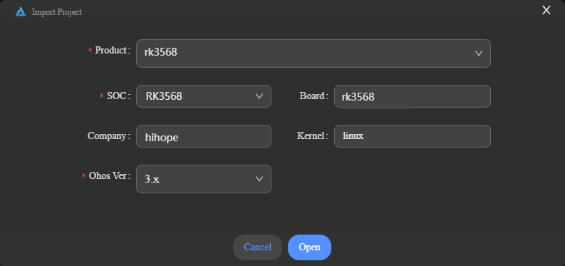

# 烧录

烧录是指将编译后的程序文件下载到芯片开发板上的动作，为后续的程序调试提供基础。DevEco Device Tool提供一键烧录功能，操作简单，能快捷、高效的完成程序烧录，提升烧录的效率。

RK3568的镜像烧录通过Winodow环境进行烧录。

## 导入源码

在编译完成后，[保证Windows系统可以远程访问Ubuntu环境](../quick-start/quickstart-standard-env-setup.md#安装deveco-device-tool)的情况下，您还需要通过以下步骤将编译好的源码导入Windows下，方可进行烧录。

1. 打开DevEco Device Tool，进入Home页，点击**Import Project**打开工程。

   

2. 选择OpenHarmony源码根目录路径（需要访问Ubuntu下的源码目录），然后再选择**Import OpenHarmony Source**选项，点击**Import**进行导入。

   >  **说明：**
   > 工程存储路径不能包含中文字符、空格。

   

3. 在Import Project界面，选择**Product**后，会自动填充对应的SOC、Board、Company和Kernel信息，然后**Ohos Ver**选择对应的OpenHarmony源码版本。

   

4. 点击**Open**打开工程或源码。

## 烧录

完成源码导入后，通过以下步骤进行烧录：

1. 请连接好电脑和待烧录开发板，连接USB接口，具体可参考[RK3568开发板介绍](quickstart-standard-board-introduction-rk3568.md)。

2. 在DevEco Device Tool中，选择REMOTE DEVELOPMENT &gt; Local PC，查看远程计算机（Ubuntu开发环境）与本地计算机（Windows开发环境）的连接状态。

   - 如果Local PC右边连接按钮为，则远程计算机与本地计算机为已连接状态，不需要执行其他操作。
   - 如果Local PC右边连接按钮为，则点击绿色按钮进行连接。连接时DevEco Device Tool会重启服务，因此请不要在下载源码或源码编译过程中进行连接，否则会中断任务。

   

3. 在菜单栏中点击**Project Settings**按钮，进入RK3568工程配置界面。

   

4. 在“Tool Chain”页签，设置Uploader烧录器工具，可以通过Tool Chain页签中的Install按钮在线安装。

   

5. 在“hh_scdy200”页签，设置烧录选项，包括upload_partitions和upload_protocol。

   - upload_partitions_profile：选择待烧录程序的配置文件，该配置文件会指定烧录文件名称、起始烧录地址、地址长度等信息；同时请勾选**Enable to use upload_partitions_profile for upload**选项。

     >  **说明：**
     >
     > 如需修改烧录profile文件，在设置烧录分区起始地址和分区长度时，应根据实际待烧录文件的大小进行设置，要求设置的烧录分区大小，要大于待烧录文件的大小；同时，各烧录文件的分区地址设置不能出现重叠。
     >
     > 首次烧录，请勾选**Enable to use upload_partitions_profile for upload**选项，会自动生成upload_partitions文件。再次烧录时，可根据实际情况选择生成upload_partitions文件进行自定义烧录，也可以再勾选**Enable to use upload_partitions_profile for upload**选项，使用upload_partitions_profile重新生成upload_partitions文件用于烧录。

   - upload_protocol：选择烧录协议，固定选择“upgrade”。

   

6. 所有的配置都修改完成后，在工程配置页签的顶部，点击**Save**进行保存。

7. 在“PROJECT TASKS”中，点击hh_scdy200下的**Upload**按钮启动烧录。

   

8. 当屏幕提示“Operation paused，Please press Enter key to continue”，请按回车键继续。

   >  **说明：**
   >
   > 如果开发板未处于烧录模式，屏幕会提示“The boad is not in Loader mode.Please Hold on the VOL+key...”，此时，请长按音量+键，3秒后点击RESET键，然后再过3秒放开音量+键，使开发板进入烧录模式。

   等待开发板烧录完成，当屏幕提示如下信息时，表示烧录成功。

   
