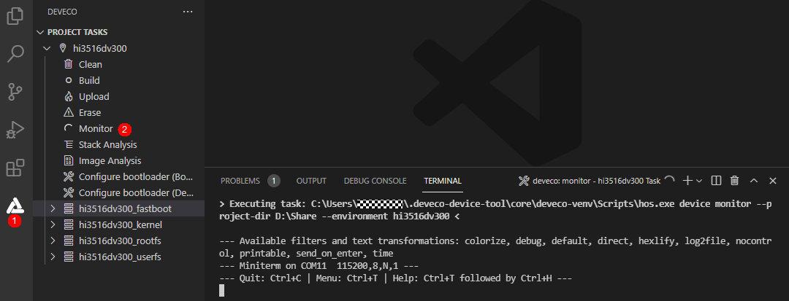

# 镜像运行<a name="ZH-CN_TOPIC_0000001142160948"></a>

- [镜像运行](#section153991115191314)
- [下一步](#section5600113114323)

## 镜像运行<a name="section153991115191314"></a>

烧录完成后通过以下步骤运行系统：

> **说明：** 
>初次烧写标准系统，需要完成以下配置，后续烧写或者启动，可以跳过以下操作。

1.  在DevEco Device Tool中，点击Monitor，打开串口工具。

    

2.  重启开发板，在倒计时结束前，按任意键进入系统。

    

3.  通过以下两条命令设置启动参数。

    ```
    setenv bootargs 'mem=640M console=ttyAMA0,115200 mmz=anonymous,0,0xA8000000,384M clk_ignore_unused androidboot.selinux=permissive rootdelay=10 hardware=Hi3516DV300 init=/init root=/dev/ram0 rw blkdevparts=mmcblk0:1M(boot),15M(kernel),20M(updater),2M(misc),3307M(system),256M(vendor),-(userdata)'
    ```

    ```
    setenv bootcmd 'mmc read 0x0 0x82000000 0x800 0x4800; bootm 0x82000000'
    ```

    

4.  保存参数设置。

    ```
    save
    ```

    

5.  重启开发板，完成系统启动。

    ```
    reset
    ```

    


## 下一步<a name="section5600113114323"></a>
恭喜！您已经完成了OpenHarmony标准系统的快速入门，接下来可[开发一个小示例](../guide/device-clock-guide.md)，进一步熟悉OpenHarmony的开发。
