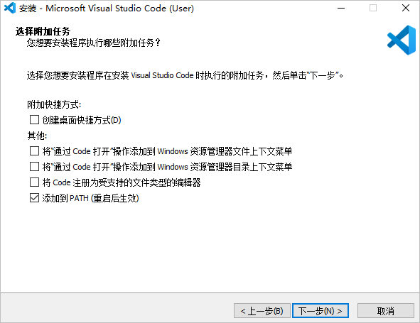

# Windows开发环境准备

-   [安装DevEco Device Tool](#zh-cn_topic_0000001058091994_section10761564496)

系统要求：

-   Windows 10 64位系统。
-   系统的用户名不能含有中文字符。

## 安装DevEco Device Tool

DevEco Device Tool以插件方式运行，基于Visual Studio Code进行扩展，同时DevEco Device Tool运行依赖Python，Node.js和hpm工具。

DevEco Device Tool支持一体化安装，即DevEco Device Tool安装向导会检测系统是否安装Visual Studio Code、Python、Node.js、hpm的适配版本，当安装向导未检测到这些软件时，会给出相应的提示，根据提示勾选要自动安装的软件，安装向导会自动下载相应的软件进行安装。

安装DevEco Device Tool，**主机的用户名不能包含中文字符**，否则在运行DevEco Device Tool时，DevEco Home界面会一直处于Loading状态，导致不能正常使用

1.  获取软件，请使用华为开发者帐号登录[https://device.harmonyos.com/cn/ide\#download\_beta](https://device.harmonyos.com/cn/ide#download_beta)，下载DevEco Device Tool V3.0 Beta1及以上版本。如未注册华为开发者账号，请先[注册](https://developer.huawei.com/consumer/cn/doc/start/registration-and-verification-0000001053628148)。
2.  解压DevEco Device Tool压缩包，双击安装包程序，点击Next进行安装。
3.  设置DevEco Device Tool的安装路径，点击Next。
4.  根据安装向导提示，勾选要自动安装的软件，点击Next。

    

    > **说明：** 
    >当安装向导检测到系统中已安装可兼容的Python版本，会提示用户可选择已安装的可兼容的Python版本，也可选择下载推荐的Python版本。

5.  在以下界面点击Next，进行软件下载和安装。

    

6.  在弹出的Python安装向导中，勾选“**Add Python 3.8 to PATH**”，然后点击**Install Now**开始安装，等待安装完成后，点击**Close**。

    > **说明：** 
    >当DevEco Device Tool安装向导检测系统已安装可兼容的Python版本，且用户选择了已安装的可兼容的Python版本，则Python安装向导不会弹出，用户不需要执行此步骤。
    >如果安装DevEco Device Tool 2.1 Release版本，Python版本只能为3.8.x版本，不能安装最新的Python3.9.x版本。如果安装DevEco Device Tool V3.0 Beta1及以上版本，Python版本只能为3.8.x或3.9.x版本。

    

7.  在弹出的Visual Studio Code安装向导中，根据向导提示安装Visual Studio Code，安装过程中，请勾选“添加到PATH（重启后生效）”。

    > **说明：** 
    >当DevEco Device Tool安装向导检测系统已安装正确的Visual Studio Code版本，则Visual Studio Code安装向导不会弹出，用户不需要执行此步骤。

    

8.  在弹出的Node.js安装向导中，全部按照默认设置点击**Next**，直至**Finish**。安装过程中，Node.js会自动在系统的path环境变量中配置node.exe的目录路径。

    > **说明：** 
    >当DevEco Device Tool安装向导检测系统已安装正确的Node.js版本，则Node.js安装向导不会弹出，用户不需要执行此步骤。

9.  等待DevEco Device Tool安装向导自动安装hpm和DevEco Device Tool插件，直至安装完成，点击**Finish**，关闭DevEco Device Tool安装向导。

    > **说明：** 
    >当DevEco Device Tool安装向导检测系统已安装正确的hpm版本，则不会进行hpm软件的下载和安装。

10. 启动Visual Studio Code，会自动安装DevEco Device Tool依赖的C/C++、CodeLLDB插件。等待安装完成后，点击Visual Studio Code左侧的按钮，检查INSTALLED中，是否已成功安装C/C++、CodeLLDB和DevEco Device Tool。

    > **说明：** 
    >如果C/C++和CodeLLDB插件安装不成功，则DevEco Device Tool不能正常运行，解决方法，详细请参考：[离线安装C/C++和CodeLLDB插件](https://device.harmonyos.com/cn/docs/ide/user-guides/offline_plugin_install-0000001074376846)。

    

