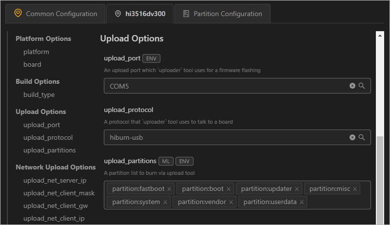
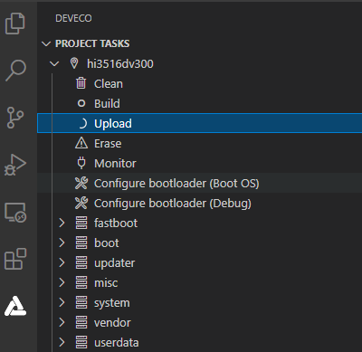

# 开发步骤<a name="ZH-CN_TOPIC_0000001135402541"></a>

-   [环境搭建](#section1246439101710)
-   [编译](#section375234715135)
-   [烧录](#section111671738101213)
    -   [前提条件](#section1458192114718)
    -   [使用USB烧录](#section18423113662120)

-   [示例开发](#section5600113114323)

## 环境搭建<a name="section1246439101710"></a>

请参考[搭建标准系统环境](概述-8.md)完成OpenHarmony的系统环境搭建。

> **说明：** 
>如果使用三方开发板开发，针对开发板的具体环境要求，以三方开发板的官方指导为准。

## 编译<a name="section375234715135"></a>

使用Docker环境的开发者可参照Docker使用指导进行编译。采用安装包方式的开发者在Linux环境进行如下操作。

1.  进入源码根目录，执行如下命令进行版本编译。

    ```
    ./build.sh --product-name Hi3516DV300
    ```

    \{product\_name\}为当前版本支持的平台。

2.  检查编译结果。编译完成后，log中显示如下：

    ```
     build system image successful.
    =====build Hi3516DV300 successful.
    ```

    编译所生成的文件都归档在out/ohos-arm-release/目录下，结果镜像输出在 out/ohos-arm-release/packages/phone/images/ 目录下。

    > **说明：** 
    >其他模块化编译操作，可参见[编译构建指导](../subsystems/标准系统编译构建指导.md)。


## 烧录<a name="section111671738101213"></a>

标准系统烧录，在V2.2 Beta1及以上版本支持。

Hi3516系列开发板中，只有Hi3516DV300支持烧录标准系统，其烧录方式包括USB烧录、网口烧录和串口烧录三种方式，其中：

-   **Windows系统：支持USB烧录、网口烧录和串口烧录**
-   **Linux系统：支持串口烧录和网口烧录。如果采用的是Linux+Windows双系统，也支持USB烧录。**

同一种烧录方式（如网口烧录），在Windows和Linux环境下的烧录操作完全一致，区别仅在于DevEco Device Tool环境搭建不同。

> **说明：** 
>当前Hi3516DV300开发板支持通过USB、网口、串口三种方式烧录OpenHarmony标准系统。本文以USB方式为例讲解烧录操作，其他两种烧录方式请参照[Hi3516DV300烧录指导](https://device.harmonyos.com/cn/docs/ide/user-guides/hi3516_upload-0000001052148681)。

### 前提条件<a name="section1458192114718"></a>

在DevEco Device Tool中[打开一个工程](https://device.harmonyos.com/cn/docs/ide/user-guides/open_project-0000001071680043)，该工程文件夹选择待烧录文件所在文件夹即可。其中开发板类型固定选择Hi3516DV300，Framework选择“Hb”。

### 使用USB烧录<a name="section18423113662120"></a>

Hi3516DV300开发板使用USB烧录方式，支持Windows系统。如果采用的是Linux+Windows双系统，Linux系统也支持USB烧录。

1.  请连接好电脑和待烧录开发板，以Hi3516DV300为例，需要同时连接串口和USB口，具体可参考[Hi3516开发板介绍](https://device.harmonyos.com/cn/docs/start/introduce/oem_camera_start_3516-0000001052670587)。
2.  打开电脑的设备管理器，查看并记录对应的串口号。

    > **说明：** 
    >如果对应的串口异常，请根据[Hi3516/Hi3518系列开发板串口驱动安装指导](https://device.harmonyos.com/cn/docs/ide/user-guides/hi3516_hi3518-drivers-0000001050743695)安装USB转串口的驱动程序。

    

3.  打开DevEco Device Tool，在Projects中，点击**Settings**打开工程配置界面。

    

4.  在**Partition Configuration**页签中，按照下表内容填写烧录文件信息，包括：

    <a name="zh-cn_topic_0000001056443961_table165522468109"></a>
    <table><thead align="left"><tr id="zh-cn_topic_0000001056443961_row955394615107"><th class="cellrowborder" valign="top" width="12.5%" id="mcps1.1.9.1.1"><p id="zh-cn_topic_0000001056443961_p179582053201013"><a name="zh-cn_topic_0000001056443961_p179582053201013"></a><a name="zh-cn_topic_0000001056443961_p179582053201013"></a>Name</p>
    </th>
    <th class="cellrowborder" valign="top" width="12.5%" id="mcps1.1.9.1.2"><p id="zh-cn_topic_0000001056443961_p11958125331010"><a name="zh-cn_topic_0000001056443961_p11958125331010"></a><a name="zh-cn_topic_0000001056443961_p11958125331010"></a>Binary</p>
    </th>
    <th class="cellrowborder" valign="top" width="12.5%" id="mcps1.1.9.1.3"><p id="zh-cn_topic_0000001056443961_p13958115331012"><a name="zh-cn_topic_0000001056443961_p13958115331012"></a><a name="zh-cn_topic_0000001056443961_p13958115331012"></a>Memory</p>
    </th>
    <th class="cellrowborder" valign="top" width="12.5%" id="mcps1.1.9.1.4"><p id="zh-cn_topic_0000001056443961_p1395845361014"><a name="zh-cn_topic_0000001056443961_p1395845361014"></a><a name="zh-cn_topic_0000001056443961_p1395845361014"></a>System</p>
    </th>
    <th class="cellrowborder" valign="top" width="12.5%" id="mcps1.1.9.1.5"><p id="zh-cn_topic_0000001056443961_p595855381010"><a name="zh-cn_topic_0000001056443961_p595855381010"></a><a name="zh-cn_topic_0000001056443961_p595855381010"></a>Address</p>
    </th>
    <th class="cellrowborder" valign="top" width="12.5%" id="mcps1.1.9.1.6"><p id="zh-cn_topic_0000001056443961_p59584533106"><a name="zh-cn_topic_0000001056443961_p59584533106"></a><a name="zh-cn_topic_0000001056443961_p59584533106"></a>Length</p>
    </th>
    <th class="cellrowborder" valign="top" width="12.5%" id="mcps1.1.9.1.7"><p id="zh-cn_topic_0000001056443961_p11553246171019"><a name="zh-cn_topic_0000001056443961_p11553246171019"></a><a name="zh-cn_topic_0000001056443961_p11553246171019"></a>Board</p>
    </th>
    <th class="cellrowborder" valign="top" width="12.5%" id="mcps1.1.9.1.8"><p id="zh-cn_topic_0000001056443961_p195531146161018"><a name="zh-cn_topic_0000001056443961_p195531146161018"></a><a name="zh-cn_topic_0000001056443961_p195531146161018"></a>Type</p>
    </th>
    </tr>
    </thead>
    <tbody><tr id="zh-cn_topic_0000001056443961_row3553154691019"><td class="cellrowborder" valign="top" width="12.5%" headers="mcps1.1.9.1.1 "><p id="zh-cn_topic_0000001056443961_p17958115371017"><a name="zh-cn_topic_0000001056443961_p17958115371017"></a><a name="zh-cn_topic_0000001056443961_p17958115371017"></a>fastboot</p>
    </td>
    <td class="cellrowborder" valign="top" width="12.5%" headers="mcps1.1.9.1.2 "><p id="zh-cn_topic_0000001056443961_p89586532106"><a name="zh-cn_topic_0000001056443961_p89586532106"></a><a name="zh-cn_topic_0000001056443961_p89586532106"></a>选择“u-boot-hi3516dv300_emmc.bin”</p>
    </td>
    <td class="cellrowborder" valign="top" width="12.5%" headers="mcps1.1.9.1.3 "><p id="zh-cn_topic_0000001056443961_p8958115314102"><a name="zh-cn_topic_0000001056443961_p8958115314102"></a><a name="zh-cn_topic_0000001056443961_p8958115314102"></a>emmc</p>
    </td>
    <td class="cellrowborder" valign="top" width="12.5%" headers="mcps1.1.9.1.4 "><p id="zh-cn_topic_0000001056443961_p79581153171020"><a name="zh-cn_topic_0000001056443961_p79581153171020"></a><a name="zh-cn_topic_0000001056443961_p79581153171020"></a>none</p>
    </td>
    <td class="cellrowborder" valign="top" width="12.5%" headers="mcps1.1.9.1.5 "><p id="zh-cn_topic_0000001056443961_p6958195341010"><a name="zh-cn_topic_0000001056443961_p6958195341010"></a><a name="zh-cn_topic_0000001056443961_p6958195341010"></a>0x000000</p>
    </td>
    <td class="cellrowborder" valign="top" width="12.5%" headers="mcps1.1.9.1.6 "><p id="zh-cn_topic_0000001056443961_p795875318101"><a name="zh-cn_topic_0000001056443961_p795875318101"></a><a name="zh-cn_topic_0000001056443961_p795875318101"></a>0x100000</p>
    </td>
    <td class="cellrowborder" rowspan="7" valign="top" width="12.5%" headers="mcps1.1.9.1.7 "><p id="zh-cn_topic_0000001056443961_p13951154061115"><a name="zh-cn_topic_0000001056443961_p13951154061115"></a><a name="zh-cn_topic_0000001056443961_p13951154061115"></a>固定选择“hi3516dv300”</p>
    </td>
    <td class="cellrowborder" valign="top" width="12.5%" headers="mcps1.1.9.1.8 "><p id="zh-cn_topic_0000001056443961_p135531468109"><a name="zh-cn_topic_0000001056443961_p135531468109"></a><a name="zh-cn_topic_0000001056443961_p135531468109"></a>NA</p>
    </td>
    </tr>
    <tr id="zh-cn_topic_0000001056443961_row1255314611102"><td class="cellrowborder" valign="top" headers="mcps1.1.9.1.1 "><p id="zh-cn_topic_0000001056443961_p995885319102"><a name="zh-cn_topic_0000001056443961_p995885319102"></a><a name="zh-cn_topic_0000001056443961_p995885319102"></a>boot</p>
    </td>
    <td class="cellrowborder" valign="top" headers="mcps1.1.9.1.2 "><p id="zh-cn_topic_0000001056443961_p88121709145"><a name="zh-cn_topic_0000001056443961_p88121709145"></a><a name="zh-cn_topic_0000001056443961_p88121709145"></a>选择“uImage”</p>
    </td>
    <td class="cellrowborder" valign="top" headers="mcps1.1.9.1.3 "><p id="zh-cn_topic_0000001056443961_p109581753101014"><a name="zh-cn_topic_0000001056443961_p109581753101014"></a><a name="zh-cn_topic_0000001056443961_p109581753101014"></a>emmc</p>
    </td>
    <td class="cellrowborder" valign="top" headers="mcps1.1.9.1.4 "><p id="zh-cn_topic_0000001056443961_p10958175313102"><a name="zh-cn_topic_0000001056443961_p10958175313102"></a><a name="zh-cn_topic_0000001056443961_p10958175313102"></a>none</p>
    </td>
    <td class="cellrowborder" valign="top" headers="mcps1.1.9.1.5 "><p id="zh-cn_topic_0000001056443961_p1959185316100"><a name="zh-cn_topic_0000001056443961_p1959185316100"></a><a name="zh-cn_topic_0000001056443961_p1959185316100"></a>0x100000</p>
    </td>
    <td class="cellrowborder" valign="top" headers="mcps1.1.9.1.6 "><p id="zh-cn_topic_0000001056443961_p10959135314102"><a name="zh-cn_topic_0000001056443961_p10959135314102"></a><a name="zh-cn_topic_0000001056443961_p10959135314102"></a>0xf00000</p>
    </td>
    <td class="cellrowborder" valign="top" headers="mcps1.1.9.1.7 "><p id="zh-cn_topic_0000001056443961_p0554546111013"><a name="zh-cn_topic_0000001056443961_p0554546111013"></a><a name="zh-cn_topic_0000001056443961_p0554546111013"></a>NA</p>
    </td>
    </tr>
    <tr id="zh-cn_topic_0000001056443961_row19554104611015"><td class="cellrowborder" valign="top" headers="mcps1.1.9.1.1 "><p id="zh-cn_topic_0000001056443961_p139598532103"><a name="zh-cn_topic_0000001056443961_p139598532103"></a><a name="zh-cn_topic_0000001056443961_p139598532103"></a>updater</p>
    </td>
    <td class="cellrowborder" valign="top" headers="mcps1.1.9.1.2 "><p id="zh-cn_topic_0000001056443961_p1781314013140"><a name="zh-cn_topic_0000001056443961_p1781314013140"></a><a name="zh-cn_topic_0000001056443961_p1781314013140"></a>选择“updater.img”</p>
    </td>
    <td class="cellrowborder" valign="top" headers="mcps1.1.9.1.3 "><p id="zh-cn_topic_0000001056443961_p395995311105"><a name="zh-cn_topic_0000001056443961_p395995311105"></a><a name="zh-cn_topic_0000001056443961_p395995311105"></a>emmc</p>
    </td>
    <td class="cellrowborder" valign="top" headers="mcps1.1.9.1.4 "><p id="zh-cn_topic_0000001056443961_p129591153181015"><a name="zh-cn_topic_0000001056443961_p129591153181015"></a><a name="zh-cn_topic_0000001056443961_p129591153181015"></a>ext3/4</p>
    </td>
    <td class="cellrowborder" valign="top" headers="mcps1.1.9.1.5 "><p id="zh-cn_topic_0000001056443961_p169591532101"><a name="zh-cn_topic_0000001056443961_p169591532101"></a><a name="zh-cn_topic_0000001056443961_p169591532101"></a>0x1000000</p>
    </td>
    <td class="cellrowborder" valign="top" headers="mcps1.1.9.1.6 "><p id="zh-cn_topic_0000001056443961_p7959953151017"><a name="zh-cn_topic_0000001056443961_p7959953151017"></a><a name="zh-cn_topic_0000001056443961_p7959953151017"></a>0x1400000</p>
    </td>
    <td class="cellrowborder" valign="top" headers="mcps1.1.9.1.7 "><p id="zh-cn_topic_0000001056443961_p45547467107"><a name="zh-cn_topic_0000001056443961_p45547467107"></a><a name="zh-cn_topic_0000001056443961_p45547467107"></a>NA</p>
    </td>
    </tr>
    <tr id="zh-cn_topic_0000001056443961_row65541460107"><td class="cellrowborder" valign="top" headers="mcps1.1.9.1.1 "><p id="zh-cn_topic_0000001056443961_p6959125319108"><a name="zh-cn_topic_0000001056443961_p6959125319108"></a><a name="zh-cn_topic_0000001056443961_p6959125319108"></a>misc</p>
    </td>
    <td class="cellrowborder" valign="top" headers="mcps1.1.9.1.2 "><p id="zh-cn_topic_0000001056443961_p481318071415"><a name="zh-cn_topic_0000001056443961_p481318071415"></a><a name="zh-cn_topic_0000001056443961_p481318071415"></a>空白，不用选择</p>
    </td>
    <td class="cellrowborder" valign="top" headers="mcps1.1.9.1.3 "><p id="zh-cn_topic_0000001056443961_p795918532103"><a name="zh-cn_topic_0000001056443961_p795918532103"></a><a name="zh-cn_topic_0000001056443961_p795918532103"></a>emmc</p>
    </td>
    <td class="cellrowborder" valign="top" headers="mcps1.1.9.1.4 "><p id="zh-cn_topic_0000001056443961_p1695919534108"><a name="zh-cn_topic_0000001056443961_p1695919534108"></a><a name="zh-cn_topic_0000001056443961_p1695919534108"></a>none</p>
    </td>
    <td class="cellrowborder" valign="top" headers="mcps1.1.9.1.5 "><p id="zh-cn_topic_0000001056443961_p12959205317102"><a name="zh-cn_topic_0000001056443961_p12959205317102"></a><a name="zh-cn_topic_0000001056443961_p12959205317102"></a>0x2400000</p>
    </td>
    <td class="cellrowborder" valign="top" headers="mcps1.1.9.1.6 "><p id="zh-cn_topic_0000001056443961_p6959125331017"><a name="zh-cn_topic_0000001056443961_p6959125331017"></a><a name="zh-cn_topic_0000001056443961_p6959125331017"></a>0x100000</p>
    </td>
    <td class="cellrowborder" valign="top" headers="mcps1.1.9.1.7 "><p id="zh-cn_topic_0000001056443961_p65546468102"><a name="zh-cn_topic_0000001056443961_p65546468102"></a><a name="zh-cn_topic_0000001056443961_p65546468102"></a>NA</p>
    </td>
    </tr>
    <tr id="zh-cn_topic_0000001056443961_row145541746191011"><td class="cellrowborder" valign="top" headers="mcps1.1.9.1.1 "><p id="zh-cn_topic_0000001056443961_p1595945313105"><a name="zh-cn_topic_0000001056443961_p1595945313105"></a><a name="zh-cn_topic_0000001056443961_p1595945313105"></a>system</p>
    </td>
    <td class="cellrowborder" valign="top" headers="mcps1.1.9.1.2 "><p id="zh-cn_topic_0000001056443961_p2813160161420"><a name="zh-cn_topic_0000001056443961_p2813160161420"></a><a name="zh-cn_topic_0000001056443961_p2813160161420"></a>选择“system.img”</p>
    </td>
    <td class="cellrowborder" valign="top" headers="mcps1.1.9.1.3 "><p id="zh-cn_topic_0000001056443961_p395985317100"><a name="zh-cn_topic_0000001056443961_p395985317100"></a><a name="zh-cn_topic_0000001056443961_p395985317100"></a>emmc</p>
    </td>
    <td class="cellrowborder" valign="top" headers="mcps1.1.9.1.4 "><p id="zh-cn_topic_0000001056443961_p295955331017"><a name="zh-cn_topic_0000001056443961_p295955331017"></a><a name="zh-cn_topic_0000001056443961_p295955331017"></a>ext3/4</p>
    </td>
    <td class="cellrowborder" valign="top" headers="mcps1.1.9.1.5 "><p id="zh-cn_topic_0000001056443961_p129591853111013"><a name="zh-cn_topic_0000001056443961_p129591853111013"></a><a name="zh-cn_topic_0000001056443961_p129591853111013"></a>0x2500000</p>
    </td>
    <td class="cellrowborder" valign="top" headers="mcps1.1.9.1.6 "><p id="zh-cn_topic_0000001056443961_p109591753131011"><a name="zh-cn_topic_0000001056443961_p109591753131011"></a><a name="zh-cn_topic_0000001056443961_p109591753131011"></a>0xceb00000</p>
    </td>
    <td class="cellrowborder" valign="top" headers="mcps1.1.9.1.7 "><p id="zh-cn_topic_0000001056443961_p75551646171014"><a name="zh-cn_topic_0000001056443961_p75551646171014"></a><a name="zh-cn_topic_0000001056443961_p75551646171014"></a>NA</p>
    </td>
    </tr>
    <tr id="zh-cn_topic_0000001056443961_row655564620109"><td class="cellrowborder" valign="top" headers="mcps1.1.9.1.1 "><p id="zh-cn_topic_0000001056443961_p12960155351019"><a name="zh-cn_topic_0000001056443961_p12960155351019"></a><a name="zh-cn_topic_0000001056443961_p12960155351019"></a>vendor</p>
    </td>
    <td class="cellrowborder" valign="top" headers="mcps1.1.9.1.2 "><p id="zh-cn_topic_0000001056443961_p1881360181418"><a name="zh-cn_topic_0000001056443961_p1881360181418"></a><a name="zh-cn_topic_0000001056443961_p1881360181418"></a>选择“vendor.img”</p>
    </td>
    <td class="cellrowborder" valign="top" headers="mcps1.1.9.1.3 "><p id="zh-cn_topic_0000001056443961_p796013532101"><a name="zh-cn_topic_0000001056443961_p796013532101"></a><a name="zh-cn_topic_0000001056443961_p796013532101"></a>emmc</p>
    </td>
    <td class="cellrowborder" valign="top" headers="mcps1.1.9.1.4 "><p id="zh-cn_topic_0000001056443961_p119607538107"><a name="zh-cn_topic_0000001056443961_p119607538107"></a><a name="zh-cn_topic_0000001056443961_p119607538107"></a>ext3/4</p>
    </td>
    <td class="cellrowborder" valign="top" headers="mcps1.1.9.1.5 "><p id="zh-cn_topic_0000001056443961_p11960165321019"><a name="zh-cn_topic_0000001056443961_p11960165321019"></a><a name="zh-cn_topic_0000001056443961_p11960165321019"></a>0xd1000000</p>
    </td>
    <td class="cellrowborder" valign="top" headers="mcps1.1.9.1.6 "><p id="zh-cn_topic_0000001056443961_p16960653141017"><a name="zh-cn_topic_0000001056443961_p16960653141017"></a><a name="zh-cn_topic_0000001056443961_p16960653141017"></a>0x10000000</p>
    </td>
    <td class="cellrowborder" valign="top" headers="mcps1.1.9.1.7 "><p id="zh-cn_topic_0000001056443961_p955584631011"><a name="zh-cn_topic_0000001056443961_p955584631011"></a><a name="zh-cn_topic_0000001056443961_p955584631011"></a>NA</p>
    </td>
    </tr>
    <tr id="zh-cn_topic_0000001056443961_row6555646161014"><td class="cellrowborder" valign="top" headers="mcps1.1.9.1.1 "><p id="zh-cn_topic_0000001056443961_p196065341017"><a name="zh-cn_topic_0000001056443961_p196065341017"></a><a name="zh-cn_topic_0000001056443961_p196065341017"></a>userdata</p>
    </td>
    <td class="cellrowborder" valign="top" headers="mcps1.1.9.1.2 "><p id="zh-cn_topic_0000001056443961_p16813140141420"><a name="zh-cn_topic_0000001056443961_p16813140141420"></a><a name="zh-cn_topic_0000001056443961_p16813140141420"></a>选择“userdata.img”</p>
    </td>
    <td class="cellrowborder" valign="top" headers="mcps1.1.9.1.3 "><p id="zh-cn_topic_0000001056443961_p896065318103"><a name="zh-cn_topic_0000001056443961_p896065318103"></a><a name="zh-cn_topic_0000001056443961_p896065318103"></a>emmc</p>
    </td>
    <td class="cellrowborder" valign="top" headers="mcps1.1.9.1.4 "><p id="zh-cn_topic_0000001056443961_p12960155361018"><a name="zh-cn_topic_0000001056443961_p12960155361018"></a><a name="zh-cn_topic_0000001056443961_p12960155361018"></a>ext3/4</p>
    </td>
    <td class="cellrowborder" valign="top" headers="mcps1.1.9.1.5 "><p id="zh-cn_topic_0000001056443961_p1596013531108"><a name="zh-cn_topic_0000001056443961_p1596013531108"></a><a name="zh-cn_topic_0000001056443961_p1596013531108"></a>0xe1000000</p>
    </td>
    <td class="cellrowborder" valign="top" headers="mcps1.1.9.1.6 "><p id="zh-cn_topic_0000001056443961_p89601753161016"><a name="zh-cn_topic_0000001056443961_p89601753161016"></a><a name="zh-cn_topic_0000001056443961_p89601753161016"></a>0x5b800000</p>
    </td>
    <td class="cellrowborder" valign="top" headers="mcps1.1.9.1.7 "><p id="zh-cn_topic_0000001056443961_p8556194619109"><a name="zh-cn_topic_0000001056443961_p8556194619109"></a><a name="zh-cn_topic_0000001056443961_p8556194619109"></a>NA</p>
    </td>
    </tr>
    </tbody>
    </table>

    

5.  在“hi3516dv300”页签，设置烧录选项，包括upload\_port、upload\_partitions和upload\_protocol。

    -   upload\_port：选择步骤2中查询的串口号。
    -   upload\_protocol：选择烧录协议，固定选择“hiburn-usb”。
    -   upload\_partitions：选择待烧录的文件，包括fastboot、boot、updater、misc、system、vendor和userdata。

    

6.  所有的配置都修改完成后，在工程配置页签的顶部，点击**Save**进行保存。
7.  打开工程文件，点击图标，打开DevEco Device Tool界面，在“PROJECT TASKS”中，点击fastboot下的**Erase**按钮，擦除U-Boot。

    

8.  执行**Erase**擦除操作后，显示如下提示信息时，请重启开发板（下电再上电）。

    

9.  重新上电后，显示如下信息时，表示擦除U-Boot成功。

    

10. 擦除完成后，点击hi3516dv300下的**Upload**按钮，启动烧录。

    > **说明：** 
    >如果您是第一次在工作台烧录Hi3516/Hi3518系列开发板，可能烧录失败，提示“not find the Devices”，请根据[Hi3516/Hi3518系列开发板USB驱动安装](https://device.harmonyos.com/cn/docs/ide/user-guides/usb_driver-0000001058690393)进行处理后再重新烧录。

    

11. 启动烧录后，界面提示如下信息时，表示烧录成功。

    


## 示例开发<a name="section5600113114323"></a>

恭喜！您已经完成了OpenHarmony标准系统的快速入门，接下来可[开发一个小示例](../guide/概述-10.md)，进一步熟悉OpenHarmony的开发。

