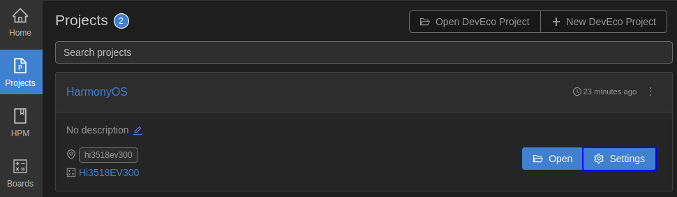
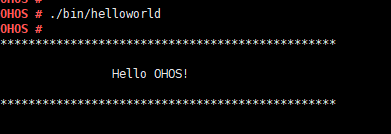

# 运行Hello OHOS<a name="ZH-CN_TOPIC_0000001105528572"></a>

-   [新建应用程序](#section1550972416485)
-   [编译](#section234175193114)
-   [烧录](#section7609155824819)
-   [镜像运行](#section17612105814480)
-   [下一步学习](#section9712145420182)

本节指导开发者在单板上运行第一个应用程序，其中包括新建应用程序、编译、烧写、运行等步骤，最终输出“Hello OHOS！”。

## 新建应用程序<a name="section1550972416485"></a>

1.  新建目录及源码

    新建**applications/sample/camera/apps/src/helloworld.c**目录及文件，代码如下所示，用户可以自定义修改打印内容（例如：修改OHOS为World）。当前应用程序可支持标准C及C++的代码开发。

    ```
    #include <stdio.h>
    
    int main(int argc, char **argv)
    {
        printf("\n************************************************\n");
        printf("\n\t\tHello OHOS!\n");
        printf("\n************************************************\n\n");
    
        return 0;
    }
    ```

2.  新建编译组织文件

    新建**applications/sample/camera/apps/BUILD.gn**文件，内容如下所示：

    ```
    import("//build/lite/config/component/lite_component.gni")
    lite_component("hello-OHOS") {
      features = [ ":helloworld" ]
    }
    executable("helloworld") {
      output_name = "helloworld"
      sources = [ "src/helloworld.c" ]
      include_dirs = []
      defines = []
      cflags_c = []
      ldflags = []
    }
    ```

3.  添加新组件

    修改文件**build/lite/components/applications.json**，添加组件hello\_world\_app的配置，如下所示为applications.json文件片段，"\#\#start\#\#"和"\#\#end\#\#"之间为新增配置（"\#\#start\#\#"和"\#\#end\#\#"仅用来标识位置，添加完配置后删除这两行）：

    ```
    {
      "components": [
        {
          "component": "camera_sample_communication",
          "description": "Communication related samples.",
          "optional": "true",
          "dirs": [
            "applications/sample/camera/communication"
          ],
          "targets": [
            "//applications/sample/camera/communication:sample"
          ],
          "rom": "",
          "ram": "",
          "output": [],
          "adapted_kernel": [ "liteos_a" ],
          "features": [],
          "deps": {
            "components": [],
            "third_party": []
          }
        },
    ##start##
        {
          "component": "hello_world_app",
          "description": "Communication related samples.",
          "optional": "true",
          "dirs": [
            "applications/sample/camera/apps"
          ],
          "targets": [
            "//applications/sample/camera/apps:hello-OHOS"
          ],
          "rom": "",
          "ram": "",
          "output": [],
          "adapted_kernel": [ "liteos_a" ],
          "features": [],
          "deps": {
            "components": [],
            "third_party": []
          }
        },
    ##end##
        {
          "component": "camera_sample_app",
          "description": "Camera related samples.",
          "optional": "true",
          "dirs": [
            "applications/sample/camera/launcher",
            "applications/sample/camera/cameraApp",
            "applications/sample/camera/setting",
            "applications/sample/camera/gallery",
            "applications/sample/camera/media"
          ],
    ```

4.  修改单板配置文件

    修改文件**vendor/hisilicon/hispark\_aries/config.json**，新增hello\_world\_app组件的条目，如下所示代码片段为applications子系统配置，"\#\#start\#\#"和"\#\#end\#\#"之间为新增条目（"\#\#start\#\#"和"\#\#end\#\#"仅用来标识位置，添加完配置后删除这两行）：

    ```
          {
            "subsystem": "applications",
            "components": [
    ##start##
              { "component": "hello_world_app", "features":[] },
    ##end##
              { "component": "camera_sample_app", "features":[] }
    
            ]
          },
    ```


## 编译<a name="section234175193114"></a>

如果Linux编译环境通过Docker方式安装，具体编译过程请参见[Docker方式获取编译环境](../get-code/获取工具.md)的编译操作。如果Linux编译环境通过软件包方式安装，进入源码根目录，执行如下命令进行编译：

```
hb set(设置编译路径)
.（选择当前路径）
选择ipcamera_hispark_aries@hisilicon并回车
hb build -f（执行编译）
```

结果文件生成在out/hispark\_aries/ipcamera\_hispark\_aries目录下。

**图 1**  设置图例<a name="fig4305770509"></a>  


> **须知：** 
>Hi3518EV300单板的U-boot文件获取路径：device/hisilicon/hispark\_aries/sdk\_liteos/uboot/out/boot/u-boot-hi3518ev300.bin

## 烧录<a name="section7609155824819"></a>

Hi3518开发板的代码烧录仅支持USB烧录方式。

1.  请连接好电脑和待烧录开发板，以Hi3518EV300为例，需要同时连接串口和USB口，具体可参考[Hi3518开发板介绍](https://device.harmonyos.com/cn/docs/start/introduce/oem_camera_start_hi3518-0000001050170473)。
2.  <a name="zh-cn_topic_0000001057313128_li46411811196"></a>打开电脑的设备管理器，查看并记录对应的串口号。

    > **说明：** 
    >如果对应的串口异常，请根据[Hi3516/Hi3518系列开发板串口驱动安装指导](https://device.harmonyos.com/cn/docs/ide/user-guides/hi3516_hi3518-drivers-0000001050743695)安装USB转串口的驱动程序。

    

3.  打开DevEco Device Tool，在Projects中，点击**Settings**打开工程配置界面。

    

4.  在“Partition Configuration”页签，设置待烧录文件信息，默认情况下，DevEco Device Tool已针对Hi3518系列开发板进行适配，无需单独修改。
5.  在“hi3518ev300”页签，设置烧录选项，包括upload\_port、upload\_partitions和upload\_protocol。

    -   upload\_port：选择步骤[2](#zh-cn_topic_0000001057313128_li46411811196)中查询的串口号。
    -   upload\_protocol：选择烧录协议，固定选择“hiburn-usb”。
    -   upload\_partitions：选择待烧录的文件，默认情况下会同时烧录fastboot、kernel、rootfs和userfs。

    

6.  所有的配置都修改完成后，在工程配置页签的顶部，点击**Save**进行保存。
7.  打开工程文件，点击图标，打开DevEco Device Tool界面，在“PROJECT TASKS”中，点击hi3518ev300\_fastboot下的**Erase**按钮，擦除U-Boot。

    

8.  执行**Erase**擦除操作后，显示如下提示信息时，请重启开发板（下电再上电）。

    

9.  重新上电后，显示如下信息时，表示擦除U-Boot成功。

    

10. 擦除完成后，点击hi3518ev300下的**Upload**按钮，启动烧录。

    

11. 启动烧录后，界面提示如下信息时，表示烧录成功。

    


## 镜像运行<a name="section17612105814480"></a>

1.  连接串口。

    > **须知：** 
    >若无法连接串口，请参考[常见问题](../quick-start/常见问题-6.md)进行排查。

    **图 2**  连接串口图<a name="fig056645018495"></a>  
    

    

    1.  单击**Monitor**打开串口。
    2.  连续输入回车直到串口显示"hisilicon"。
    3.  单板初次启动或修改启动参数，请进入[步骤2](#li9441185382314)，否则进入[步骤3](#li6442853122312)。

2.  <a name="li9441185382314"></a>（初次烧写必选）修改U-boot的bootcmd及bootargs内容：该步骤为固化操作，可保存执行结果，但U-boot重新烧入，则需要再次执行下述步骤。

    **表 1**  U-boot修改命令

    <a name="table1336762011222"></a>
    <table><thead align="left"><tr id="row193681920182219"><th class="cellrowborder" valign="top" width="50%" id="mcps1.2.3.1.1"><p id="p3368202016229"><a name="p3368202016229"></a><a name="p3368202016229"></a>执行命令</p>
    </th>
    <th class="cellrowborder" valign="top" width="50%" id="mcps1.2.3.1.2"><p id="p936812052217"><a name="p936812052217"></a><a name="p936812052217"></a>命令解释</p>
    </th>
    </tr>
    </thead>
    <tbody><tr id="row10368142032210"><td class="cellrowborder" valign="top" width="50%" headers="mcps1.2.3.1.1 "><p id="p1636882092214"><a name="p1636882092214"></a><a name="p1636882092214"></a>setenv bootcmd "sf probe 0;sf read 0x40000000 0x100000 0x600000;go 0x40000000";</p>
    </td>
    <td class="cellrowborder" valign="top" width="50%" headers="mcps1.2.3.1.2 "><p id="p17368202082213"><a name="p17368202082213"></a><a name="p17368202082213"></a>设置bootcmd内容，选择FLASH器件0，读取FLASH起始地址为0x100000，大小为0x600000字节的内容到0x40000000的内存地址，此处0x600000为6MB，与IDE中填写OHOS_Image.bin的文件大小<strong id="b1355784283916"><a name="b1355784283916"></a><a name="b1355784283916"></a>必须相同</strong>。</p>
    </td>
    </tr>
    <tr id="row136814209227"><td class="cellrowborder" valign="top" width="50%" headers="mcps1.2.3.1.1 "><p id="p234414019231"><a name="p234414019231"></a><a name="p234414019231"></a>setenv bootargs "console=ttyAMA0,115200n8 root=flash fstype=jffs2 rw rootaddr=7M rootsize=8M";</p>
    </td>
    <td class="cellrowborder" valign="top" width="50%" headers="mcps1.2.3.1.2 "><p id="p10368102010223"><a name="p10368102010223"></a><a name="p10368102010223"></a>表示设置bootargs参数为串口输出，波特率为115200，数据位8，rootfs挂载于FLASH上，文件系统类型为jffs2 rw，以支持可读写JFFS2文件系统。“rootaddr=7M rootsize=8M”处对应填入实际rootfs.img的烧写起始位置与长度，与IDE内所填大小<strong id="b1461083410403"><a name="b1461083410403"></a><a name="b1461083410403"></a>必须相同</strong>。</p>
    </td>
    </tr>
    <tr id="row2368120112219"><td class="cellrowborder" valign="top" width="50%" headers="mcps1.2.3.1.1 "><p id="p20368142072217"><a name="p20368142072217"></a><a name="p20368142072217"></a>saveenv</p>
    </td>
    <td class="cellrowborder" valign="top" width="50%" headers="mcps1.2.3.1.2 "><p id="p19368102020220"><a name="p19368102020220"></a><a name="p19368102020220"></a>表示保存当前配置。</p>
    </td>
    </tr>
    <tr id="row63689205220"><td class="cellrowborder" valign="top" width="50%" headers="mcps1.2.3.1.1 "><p id="p3368162015223"><a name="p3368162015223"></a><a name="p3368162015223"></a>reset</p>
    </td>
    <td class="cellrowborder" valign="top" width="50%" headers="mcps1.2.3.1.2 "><p id="p23681820182217"><a name="p23681820182217"></a><a name="p23681820182217"></a>表示复位单板。</p>
    </td>
    </tr>
    <tr id="row346253519253"><td class="cellrowborder" valign="top" width="50%" headers="mcps1.2.3.1.1 "><p id="p16462113512251"><a name="p16462113512251"></a><a name="p16462113512251"></a>pri</p>
    </td>
    <td class="cellrowborder" valign="top" width="50%" headers="mcps1.2.3.1.2 "><p id="p3462335152514"><a name="p3462335152514"></a><a name="p3462335152514"></a>表示查看显示参数。</p>
    </td>
    </tr>
    </tbody>
    </table>

    > **须知：** 
    >**“go 0x40000000”**为可选指令，默认配置已将该指令固化在启动参数中，单板复位后可自动启动。若想切换为手动启动，可在U-boot启动倒数阶段使用"回车"打断自动启动。

3.  <a name="li6442853122312"></a>若启动时显示**"hisilicon \#**字样，请输入**“reset”**指令，等待系统自启动进入系统，系统启动后，显示**“OHOS”**字样，输入**”./bin/helloworld”**并回车，显示成功结果如下图所示。

    **图 3**  启动成功并执行应用程序图<a name="fig265662981319"></a>  
    


## 下一步学习<a name="section9712145420182"></a>

恭喜您，已完成Hi3518的快速上手！建议您下一步进入[无屏摄像头产品开发](../guide/摄像头控制.md)的学习 。

