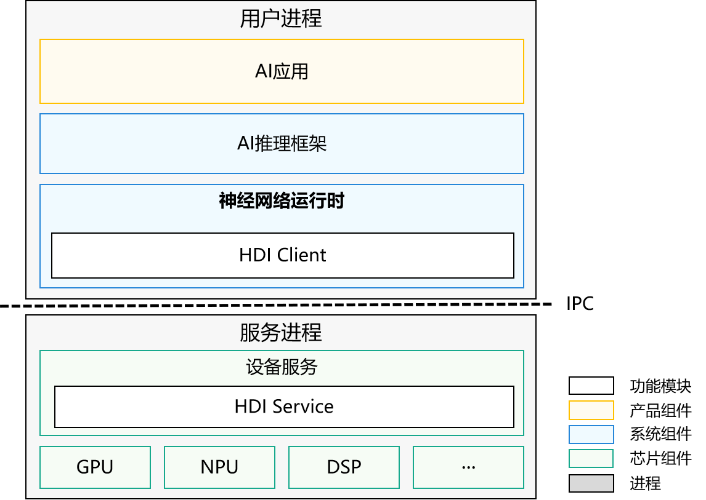
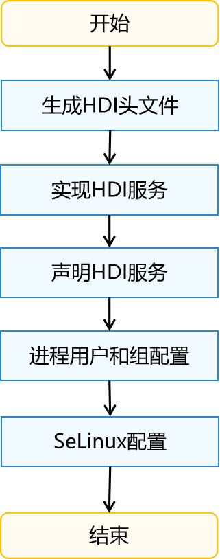

# Neural Network Runtime设备接入指导

## 概述

### 功能简介

NNRt（Neural Network Runtime，神经网络运行时）是面向AI领域的跨芯片推理计算运行时，作为中间桥梁连通上层AI推理框架和底层加速芯片，实现AI模型的跨芯片推理计算。

NNRt开放了设备接口，芯片厂商通过设备接口将专有加速芯片接入NNRt，从而实现与OpenHarmony社区生态的对接。以下内容将介绍芯片如何接入NNRt。

### 基本概念
在开发前，开发者需要先了解以下概念，以便更好地理解全文内容：

- HDI（Hardware Device Interface）：OpenHarmony硬件设备接口，定义系统中跨进程通信的接口，实现服务间的跨进程通信。
- IDL（Interface Description Language）：接口描述语言，是HDI接口的语言格式。

### 约束与限制
- 系统版本：OpenHarmony主干版本。
- 开发环境：Ubuntu 18.04及以上。
- 接入设备：具备AI计算能力的芯片。

### 运作机制
NNRt通过HDI接口实现与设备芯片的对接，由HDI接口实现跨进程通信。

**图1** NNRt架构图



整个架构主要分为三层，AI应用在应用层，AI推理框架和NNRt在系统层，设备服务在芯片层。AI应用如果要使用AI专用加速芯片进行模型推理，需要经过AI推理框架和NNRt才能调用到底层AI专用加速芯片，NNRt就是负责适配底层各种AI专用加速芯片的中间层。NNRt开放了标准统一的HDI设备接口，众多AI专用加速芯片都可以通过HDI接口接入OpenHarmony。此外NNRt也开放了标准统一的接口对接上层各种AI推理框架。

程序运行时，AI应用、AI推理框架、NNRt都运行在用户进程中，底层AI芯片设备服务运行在HDI服务进程中。NNRt根据HDI接口实现了HDI Client，服务端也需要根据HDI接口实现HDI Service，两者通过OpenHarmony标准的HDF子系统实现跨进程通信。

## 开发指导

### 场景介绍
当需要将一款AI加速芯片接入NNRt的时候，可以参考下文。下文以RK3568芯片为例，展示RK3568 CPU如何通过NNRt的V2.0版本HDI接口接入NNRt，并完成AI模型推理。V1.0版本HDI接口接入NNRt的流程与此类似。
> 依赖说明：该教程展示的RK3568 CPU接入NNRt并没有真正实现CPU的驱动，而是借用了MindSpore Lite的runtime和CPU算子，因此会依赖MindSpore Lite的动态库以及头文件。实际开发时并不需要依赖MindSpore Lite的任何库或者头文件。

### 开发流程
AI专用加速芯片接入NNRt的整体流程如下：

**图2** AI专用加速芯片接入NNRt流程



### 开发步骤
AI芯片设备HDI服务开发者具体可通过以下步骤实现AI专用加速芯片对接NNRt：
#### 生成HDI头文件
开源社区下载OpenHarmony的代码，编译drivers_interface部件，生成HDI接口的头文件。

1. [下载源码](../get-code/sourcecode-acquire.md)。

2. 进入OpenHarmony源码根目录，编译NNRt的IDL接口文件（以RK3568产品为例）：
    ```shell
    ./build.sh --product-name rk3568 –ccache --build-target drivers_interface_nnrt
    ```

    编译完成后，会在```out/rk3568/gen/drivers/interface/nnrt/v2_0```目录下生成C++类型的HDI头文件。若需要生成C类型的头文件，请在编译之前使用如下命令对```drivers/interface/nnrt/v2_0/BUILD.gn```文件中的```language```配置项进行设置。

    ```shell
    language = "c"
    ```

    生成头文件目录如下所示：
    ```text
    out/rk3568/gen/drivers/interface/nnrt
    └── v2_0
        ├── drivers_interface_nnrt__libnnrt_proxy_2.0_external_deps_temp.json
        ├── drivers_interface_nnrt__libnnrt_stub_2.0_external_deps_temp.json
        ├── innrt_device.h                        # 设备接口头文件
        ├── iprepared_model.h                     # 编译AI模型对象头文件
        ├── libnnrt_proxy_2.0__notice.d
        ├── libnnrt_stub_2.0__notice.d
        ├── model_types.cpp                       # AI模型结构定义实现文件
        ├── model_types.h                         # AI模型结构定义头文件
        ├── nnrt_device_driver.cpp                # 设备驱动实现参考样例
        ├── nnrt_device_proxy.cpp
        ├── nnrt_device_proxy.h
        ├── nnrt_device_service.cpp               # 设备服务端实现参考样例
        ├── nnrt_device_service.h                 # 设备服务端头文件
        ├── nnrt_device_stub.cpp
        ├── nnrt_device_stub.h
        ├── nnrt_types.cpp                        # 数据类型定义实现文件
        ├── nnrt_types.h                          # 数据类型定义头文件
        ├── node_attr_types.cpp                   # AI模型算子属性定义实现文件
        ├── node_attr_types.h                     # AI模型算子属性定义
        ├── prepared_model_proxy.cpp
        ├── prepared_model_proxy.h
        ├── prepared_model_service.cpp            # 编译AI模型对象服务端实现参考样例
        ├── prepared_model_service.h              # 编译AI模型对象服务端头文件
        ├── prepared_model_stub.cpp
        └── prepared_model_stub.h
    ```

#### 实现HDI服务

1. 进入OpenHarmony源码根目录，在```drivers/peripheral```目录下新建开发目录```nnrt```，用于HDI服务开发。开发目录结构如下所示：
    ```text
    drivers/peripheral/nnrt
    ├── bundle.json
    ├── v2_0
        ├── BUILD.gn                                  # 代码编译脚本文件
        └── hdi_cpu_service                           # 自定义目录
            ├── BUILD.gn                              # 代码编译脚本文件
            ├── include
            │   ├── nnrt_device_service.h             # 设备服务端头文件
            │   ├── node_functions.h                  # 非必须，由具体实现决定
            │   ├── node_registry.h                   # 非必须，由具体实现决定
            │   └── prepared_model_service.h          # 编译AI模型对象服务端头文件
            └── src
                ├── nnrt_device_driver.cpp            # 设备驱动实现文件
                ├── nnrt_device_service.cpp           # 设备服务端实现文件
                ├── nnrt_device_stub.cpp              # 非必须，由具体实现决定
                ├── node_attr_types.cpp               # 非必须，由具体实现决定
                ├── node_functions.cpp                # 非必须，由具体实现决定
                ├── node_registry.cpp                 # 非必须，由具体实现决定
                └── prepared_model_service.cpp        # 编译AI模型对象服务端实现文件
    ```

2. 实现设备驱动，无特殊需求可直接使用IDL文件编译生成的```nnrt_device_driver.cpp```文件，否则根据具体驱动开发。

3. 实现服务接口，可参考```nnrt_device_service.cpp```和```prepared_model_service.cpp```实现文件，接口定义可以参考[NNRt的HDI接口定义](https://gitee.com/openharmony/drivers_interface/tree/master/nnrt)。

4. 编译驱动和服务的实现文件为共享库。

    在```drivers/peripheral/nnrt/v2_0/hdi_cpu_service/```下新建```BUILD.gn```文件，文件内容如下所示，相关参数配置内容可参考[Build教程](https://gitee.com/openharmony/build)。

    ```shell
    import("//build/ohos.gni")
    import("//drivers/hdf_core/adapter/uhdf2/uhdf.gni")

    ohos_shared_library("libnnrt_service_2.0") {
      include_dirs = []
      sources = [
        "src/nnrt_device_service.cpp",
        "src/node_functions.cpp",
        "src/node_registry.cpp",
        "src/prepared_model_service.cpp",
        "src/shared_buffer_parser.cpp",
        "src/validation.cpp",
      ]

      external_deps = [
        "c_utils:utils",
        "drivers_interface_nnrt:libnnrt_stub_2.0",
        "hdf_core:libhdf_utils",
        "hilog_native:libhilog",
        "ipc:ipc_core",
      ]

      install_images = [ chipset_base_dir ]
      subsystem_name = "hdf"
      part_name = "drivers_peripheral_nnrt"
    }

    ohos_shared_library("libnnrt_driver") {
      include_dirs = []
      sources = [ "src/nnr_device_driver.cpp" ]
      deps = [ ":libnnrt_service_2.0" ]

      external_deps = [
        "c_utils:utils",
        "drivers_interface_nnrt:libnnrt_stub_2.0",
        "hdf_core:libhdf_host",
        "hdf_core:libhdf_ipc_adapter",
        "hdf_core:libhdf_utils",
        "hdf_core:libhdi",
        "hilog_native:libhilog",
        "ipc:ipc_core",
      ]

      install_images = [ chipset_base_dir ]
      subsystem_name = "hdf"
      part_name = "drivers_peripheral_nnrt"
    }

    group("hdf_nnrt_service") {
      deps = [
        ":libnnrt_driver",
        ":libnnrt_service_2.0",
      ]
    }
    ```

    将```group("hdf_nnrt_service")```添加到```drivers/peripheral/nnrt/v2_0/BUILD.gn```文件中，以便在更上目录层级就能引用。
    ```shell
    if (defined(ohos_lite)) {
      group("nnrt_entry") {
        deps = []
      }
    } else {
      group("nnrt_entry") {
        deps = [ "./hdi_cpu_service:hdf_nnrt_service" ]
      }
    }
    ```

    新建```drivers/peripheral/nnrt/bundle.json```用于定义新增的```drivers_peripheral_nnrt```部件。
    ```json
    {
      "name": "drivers_peripheral_nnrt",
      "description": "Neural network runtime device driver",
      "version": "4.0",
      "license": "Apache License 2.0",
      "component": {
        "name": "drivers_peripheral_nnrt",
        "subsystem": "hdf",
        "syscap": [""],
        "adapter_system_type": ["standard"],
        "rom": "1024KB",
        "ram": "2048KB",
        "deps": {
          "components": [
            "c_utils",
            "hdf_core",
            "hilog_native",
            "ipc"
          ],
          "third_part": [
            "bounds_checking_function"
          ]
        },
        "build": {
          "sub_component": [
            "//drivers/peripheral/nnrt/v2_0:nnrt_entry"
          ],
          "test": [
          ],
          "inner_kits": [
          ]
        }
      }
    }
    ```

#### 声明HDI服务

  在对应产品的uhdf hcs配置文件中声明NNRt的用户态驱动与服务。例如针对RK3568，服务需要在```vendor/hihope/rk3568/hdf_config/uhdf/device_info.hcs```文件中新增如下配置：
  ```text
  nnrt :: host {
      hostName = "nnrt_host";
      priority = 50;
      uid = "";
      gid = "";
      caps = ["DAC_OVERRIDE", "DAC_READ_SEARCH"];
      nnrt_device :: device {
          device0 :: deviceNode {
              policy = 2;
              priority = 100;
              moduleName = "libnnrt_driver.z.so";
              serviceName = "nnrt_device_service";
          }
      }
  }
  ```
> 注意：修改hcs文件需要删除out目录重新编译，才能生效。

#### 配置host进程用户ID和组ID
  对于新增的nnrt_host进程的场景，需要配置对应进程的用户ID和组ID。 进程的用户ID在文件```base/startup/init/services/etc/passwd```中配置，进程的组ID在文件```base/startup/init/services/etc/group```中配置。 
  ```text
  # 在base/startup/init/services/etc/passwd新增
  nnrt_host:x:3311:3311:::/bin/false

  # 在base/startup/init/services/etc/group新增
  nnrt_host:x:3311:
  ```

#### 配置SELinux

OpenHarmony已经开启SELinux特性，需要对新增的进程和服务配置相应的SELinux规则，用于运行host进程访问某些资源、发布HDI服务等。

1. 在```base/security/selinux/sepolicy/ohos_policy/drivers/adapter/public/hdf_service_contexts```文件中新增配置：
    ```text
    # 新增配置
    nnrt_device_service        u:object_r:hdf_nnrt_device_service:s0 
    ```
    > ```nnrt_host```为[声明HDI服务](#声明hdi服务)步骤中配置的进程名称，下同。

2. 在```base/security/selinux/sepolicy/ohos_policy/drivers/adapter/public/hdf_service.te```文件中新增配置：
    ```text
    # 新增配置
    type hdf_nnrt_device_service, hdf_service_attr; 
    ```

3. 在```base/security/selinux/sepolicy/ohos_policy/drivers/adapter/public/hdfdomain.te```文件中新增配置：
    ```text
    # 新增配置
    neverallow { domain -hdfdomain -sadomain } { hdfdomain -nnrt_host -allocator_host -hdf_public_domain }:binder call; 
    ```

4. 在```base/security/selinux/sepolicy/ohos_policy/drivers/adapter/public/type.te```文件中新增配置：
    ```text
    # 新增配置
    type nnrt_host, hdfdomain, domain;
    ```

5. 在```base/security/selinux/sepolicy/ohos_policy/drivers/adapter/vendor/hdf_devmgr.te```文件中新增配置：
    ```text
    # 新增配置
    allow hdf_devmgr nnrt_host:binder { call transfer };
    allow hdf_devmgr nnrt_host:dir { search };
    allow hdf_devmgr nnrt_host:file { open read write };
    allow hdf_devmgr nnrt_host:process { getattr };
    ```

6. 在```base/security/selinux/sepolicy/ohos_policy/drivers/adapter/vendor/init.te```文件中新增配置：
    ```text
    # 新增配置
    allow init nnrt_host:process { rlimitinh siginh transition };
    ```

7. 在```base/security/selinux/sepolicy/ohos_policy/startup/init/public/chipset_init.te```文件中作如下修改：

    找到chipset_init这一行：
    ```text
    allow chipset_init { light_host input_user_host wifi_host camera_host power_host audio_host }:process { rlimitinh siginh transition };
    ```
    在host列表中增加nnrt_host：
    ```text
    allow chipset_init { light_host input_user_host wifi_host camera_host power_host audio_host nnrt_host }:process { rlimitinh siginh transition };
    ```

8. 新建```nnrt_host.te```配置文件：
    ```shell
    # 创建nnrt文件夹
    mkdir base/security/selinux/sepolicy/ohos_policy/drivers/peripheral/nnrt

    # 创建vendor文件夹
    mkdir base/security/selinux/sepolicy/ohos_policy/drivers/peripheral/nnrt/vendor

    # 创建nnrt_host.te文件
    touch base/security/selinux/sepolicy/ohos_policy/drivers/peripheral/nnrt/vendor/nnrt_host.te
    ```

9. 将所需的权限写入```nnrt_host.te```文件中：
    ```text
    allow nnrt_host dev_hdf_kevent:chr_file { ioctl };
    allow nnrt_host hilog_param:file { read open map };
    allow nnrt_host sh:binder { transfer };
    allow nnrt_host samgr:binder { call };
    allow nnrt_host dev_ashmem_file:chr_file { open };
    allow nnrt_host dev_unix_socket:dir { search };
    allow nnrt_host hdf_device_manager:hdf_devmgr_class { get };
    allow nnrt_host hdf_nnrt_device_service:hdf_devmgr_class { add get };
    allow nnrt_host dev_console_file:chr_file { read write };
    allow nnrt_host debug_param:file { read open map };
    allow nnrt_host sa_device_service_manager:samgr_class { get };
    allow nnrt_host hdf_devmgr:binder { call transfer };
    allow nnrt_host hdf_nnrt_device_service:binder { call };
    allow nnrt_host sysfs_devices_system_cpu:file { read open getattr };
    allow sh hdf_nnrt_device_service:hdf_devmgr_class { add get };
    allow sh hdf_hci_interface_service:hdf_devmgr_class { get };
    allow sh nnrt_host:dir { getattr search };
    allow sh nnrt_host:file { open read };
    allow sh nnrt_host:process { getattr };
    allow sh nnrt_host:binder { call };
    allow sh nnrt_host:fd { use };
    ```

10. 由于SELinux是白名单访问的权限机制，需要根据实际权限需求配置。将服务启动之后，可通过以下dmesg命令查看avc告警，
avc告警会给出缺少的权限。SELinux的配置也可以参考[OpenHarmony SELinux子系统的说明](https://gitee.com/openharmony/security_selinux/blob/master/README.md)。
    ```shell
    hdc_std shell
    dmesg | grep nnrt
    ```

#### 配置部件编译入口
以RK3568产品为例：
```shell
vim //productdefine/common/inherit/chipset_common.json
```
在```"subsystems"```, ```"subsystem":"hdf"```, ```"components"```中添加：
```shell
{
  "component": "drivers_peripheral_nnrt",
  "features": []
}
```

#### 删除out目录并编译整个系统
```shell
# 删除out目录
rm -rf ./out

# 编译
./build.sh --product-name rk3568 –ccache --jobs=4
```


### 调测验证
服务开发完成后，可以使用XTS用例验证基本功能和兼容性。开发者可通过以下步骤进行验证：

1. 编译NNRt的hats用例，用例在```test/xts/hats/ai/nnrt/hdi```目录下。
    ```shell
    # 进入hats目录
    cd test/xts/hats

    # 编译hats测试用例
    ./build.sh suite=hats system_size=standard product_name=rk3568

    # 回到代码根目录
    cd -
    ```
    编译好的测试用例可执行文件```HatsHdfNnrtFunctionTest```会输出到```out/rk3568/suites/hats/testcases/```下。

2. 将测试用例push到RK3568设备的```/data/local/tmp/```目录下。
    ```shell
    # 将测试用例可执行文件推送到设备上，HatsHdfNnrtFunctionTest是测试用例可执行文件。
    hdc_std file send out/rk3568/suites/hats/testcases/HartsHdfNnrtFunctionTest /data/local/tmp/

    # 给测试用例可执行文件加上权限。
    hdc_std shell "chmod +x /data/local/tmp/HatsHdfNnrtFunctionTest"
    ```

3. 执行用例并查看结果。
    ```shell
    # 执行测试用例
    hdc_std shell "/data/local/tmp/HatsHdfNnrtFunctionTest"
    ```

    测试报告显示已通过47个用例，说明所有hats用例已执行成功，服务已通过兼容性测试。
    ```text
    ...
    [----------] Global test environment tear-down
    Gtest xml output finished
    [==========] 47 tests from 3 test suites ran. (515 ms total)
    [  PASSED  ] 47 tests.
    ```

### 开发实例
完整Demo代码可以参考[社区实现](https://gitee.com/openharmony/ai_neural_network_runtime/tree/master/example/drivers)。

1. 进入OpenHarmony源码根目录，在```drivers/peripheral```路径下创建```nnrt```目录，拷贝NNRt源码路径```foundation/ai/neural_network_runtime```下的```example/driver/nnrt/v2_0```目录到```drivers/peripheral/nnrt```路径下。
    ```shell
    cp -r example/drivers/nnrt/v2_0 drivers/peripheral/nnrt
    ```

2. 在```drivers/peripheral/nnrt```下补充```bundle.json```文件，```bundle.json```的写法参考本教程上面[开发步骤](#开发步骤)中的[实现HDI服务](#实现hdi服务)章节。

3. 由于Demo依赖MindSpore Lite CPU算子，因此需要添加MindSpore Lite依赖文件：
    - 在OpenHarmony源码根目录执行以下命令编译MindSpore Lite动态库。MindSpore源码在OpenHarmony源码根目录third_party/mindspore位置下。
      ```shell
      # 编译mindspore动态库
      ./build.sh --product-name rk3568 -ccaache --jobs 4 --build-target mindspore_lib
      ```
    - 在```drivers/peripheral/nnrt/v2_0```下创建```mindspore```目录，用于存放mindspore动态库和头文件。
      ```shell
      mkdir drivers/peripheral/nnrt/v2_0/mindspore
      ```
    - 将MindSpore源码中```mindspore-src/source/include```目录拷贝到```drivers/peripheral/nnrt/v2_0/mindspore```目录下。
      ```shell
      cp third_party/mindspore/mindspore-src/source/include drivers/peripheral/nnrt/v2_0/mindspore
      ```
    - Demo还依赖mindspore的```schema```文件：
      ```shell
      # 创建mindspore_schema目录
      mkdir drivers/peripheral/nnrt/v2_0/hdi_cpu_service/include/mindspore_schema

      # 从third_party目录拷贝mindspore schema文件
      cp third_party/mindspore/mindspore-src/source/mindspore/lite/schema/* drivers/peripheral/nnrt/v2_0/hdi_cpu_service/include/mindspore_schema/
      ```
    - 将编译好的OpenHarmony的MindSpore Lite动态库拷贝到```mindspore```目录下。
      ```shell
      # 在drivers/peripheral/nnrt/v2_0/mindspore下创建mindspore目录
      mkdir drivers/peripheral/nnrt/v2_0/mindspore/mindspore

      # 从out目录将mindspore动态库拷贝到drivers/peripheral/nnrt/v2_0/mindspore/mindspore下
      cp out/rk3568/package/phone/system/lib/libmindspore-lite.so drivers/peripheral/nnrt/v2_0/mindspore/mindspore/
      ```
4. 其他配置请参考本教程上面的[开发步骤](#开发步骤)章节。
