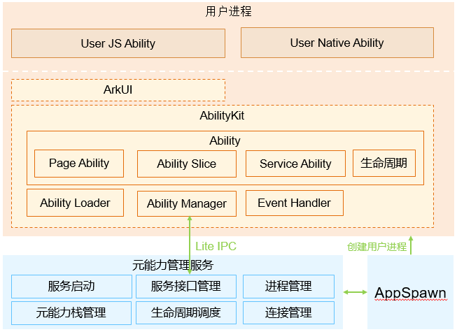
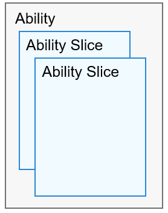

# 概述

用户程序框架是OpenHarmony为开发者提供开发OpenHarmony应用的开发框架，包含两个子系统：Ability子系统和包管理子系统。

## 基本概念

开发者在开发前需要先了解以下基本概念，方便开发者更好的理解OpenHarmony用户程序框架。

### Ability子系统

  Ability子系统是管理OpenHarmony应用运行状态的开发框架。
  
  **图1** Ability子系统框架图
 
  

  
- **Ability**：系统调度应用的最小单元，是能够完成一个独立功能的组件，一个应用可以包含一个或多个Ability。Ability分为两种类型：Page类型的Ability和Service类型的Ability。
  - **Page类型的Ability**：带有界面，为用户提供人机交互的能力。
  - **Service类型的Ability**：不带界面，为用户提供后台任务机制。

- **AbilitySlice**：单个页面及其控制逻辑的总和，是Page类型Ability特有的组件，一个Page类型的Ability可以包含多个AbilitySlice，此时，这些页面提供的业务能力应当是高度相关的。
   
    **图2** Ability与AbilitySlice的关系图
   
    

- **生命周期**：Ability被调度到启动、激活、隐藏和退出等各个状态的统称。
   
    **图3** Ability生命周期流转
    
    
  - **OnStart()**
    系统首次创建Page实例时触发该回调。对于一个Page实例，该回调在其生命周期过程中仅触发一次，Page在该逻辑后进入INACTIVE状态。开发者必须重写该方法，并在此配置默认展示的AbilitySlice。
  
  - **OnActive()**
    Page会在进入INACTIVE状态后来到前台，然后系统调用此回调。Page在此之后进入ACTIVE状态，该状态是应用与用户交互的状态。Page将保持在此状态，除非某类事件发生导致Page失去焦点，比如用户点击返回键或导航到其他Page。
  
    当此类事件发生时，会触发Page回到INACTIVE状态，系统将调用OnInactive()回调。此后，Page可能重新回到ACTIVE状态，系统将再次调用OnActive()回调。因此，开发者通常需要成对实现OnActive()和OnInactive()，并在OnActive()中获取在OnInactive()中被释放的资源。
  
  - **OnInactive()**
    当Page失去焦点时，系统将调用此回调，此后Page进入INACTIVE状态。开发者可以在此回调中实现Page失去焦点时应表现的恰当行为。
  
  - **OnBackground()**
    如果Page不再对用户可见，系统将可能根据资源状况调用此回调，此后Page进入BACKGROUND状态。开发者应该在此回调中释放Page不可见时无用的资源，或在此回调中执行较为耗时的状态保存操作。
  
  - **OnForeground()**
    处于BACKGROUND状态的Page仍然驻留在内存中，当重新回到前台时（比如用户重新导航到此Page），系统将先调用OnForeground()回调使Page回到INACTIVE状态，然后调用OnActive()回调使Page回到ACTIVE状态。开发者应当在此回调中重新申请在OnBackground()中释放的资源。轻量化设备目前不支持该接口。
  
  - **OnStop()**
    此回调表示系统正在销毁Page。销毁Page的可能原因包括：
  
    - 用户通过系统管理能力显式关闭Page，例如使用任务管理器关闭Page。
    - 用户行为触发Page的TerminateAbility()方法调用，例如使用应用的退出功能。
    - 配置变更导致系统暂时销毁Page并重建。
    - 系统出于资源管理目的，自动触发对处于BACKGROUND状态Page的销毁。

- **AbilityKit**：Ability框架提供给开发者的开发包，开发者基于该开发包可以开发出基于Ability组件的应用。基于Ability组件开发的应用有两种类型：基于JavaScript语言开发的Ability（JS Ability）和基于C/C++语言开发的Ability（Native Ability）。JS应用开发框架是开发者开发JS Ability所用到框架，是在AbilityKit基础封装的包含JS UI组件的一套方便开发者能够迅速开发Ability应用的框架。

- **AbilityLoader**：负责注册和加载开发者Ability的模块。开发者开发的Ability先要调用AbilityLoader的注册接口注册到框架中，接着Ability启动时会被实例化。

- **AbilityManager**：负责AbilityKit和Ability管理服务进行IPC的通信。

- **EventHandler**：AbilityKit提供给开发者的用于在Ability中实现线程间通信的一个模块。

- **AbilityManagerService**：元能力运行管理服务。该服务用于协调各Ability运行关系、及生命周期进行调度的系统服务。其中，服务启动模块负责Ability管理服务的启动、注册等。服务接口管理模块负责Ability管理服务对外能力的管理。进程管理模块负责Ability应用所在进程的启动和销毁、及其进程信息维护等功能。Ability栈管理模块负责维护各个Ability之间跳转的先后关系。生命周期调度模块是Ability管理服务根据系统当前的操作调度Ability进入相应的状态的模块。连接管理模块是Ability管理服务对Service类型Ability连接管理的模块。

- **AppSpawn**：负责创建Ability应用所在进程的系统服务，该服务有较高的权限，为Ability应用设置相应的权限，并预加载一些通用的模块，加速应用的启动。

### 包管理子系统

包管理子系统是OpenHarmony为开发者提供的安装包管理框架。

  **图4** 包管理子系统框架图

  

  
- **BundleKit**：是包管理服务对外提供的接口，有安装/卸载接口、包信息查询接口、包状态变化listen接口。

- **包扫描器**：用来解析本地预制或者安装的安装包，提取里面的各种信息，供管理子模块进行管理，持久化。

- **包安装子模块**：安装，卸载，升级一个包。包安装服务是一个单独进程和包管理服务通过IPC进行通信，该服务用于创建、删除安装目录和数据目录等，具有较高的权限。

- **包管理子模块**：管理安装包相关的信息，存储持久化包信息。

- **包安全管理子模块**：签名检查、权限授予、权限管理。

## 运作机制

Ability子系统的核心模块是Ability管理服务、包管理子系统的核心模块是包管理服务，这两个服务是系统级服务，借助系统服务框架SAMgr实现服务的注册与发现，并对其他进程提供Ability管理服务和包管理服务。Ability管理服务和包管理服务通过AbilityKit和BundleKit以接口的形式向外提供服务。

  **图5** Ability管理服务和包管理服务启动
  
  

Ability管理服务和包管理服务启动后，就可以安装OpenHarmony应用和启动运行OpenHarmony应用。

  **图6** 应用启动流程

  

桌面为Ability管理服务启动的第一个OpenHarmony应用。桌面启动后，用户可以在桌面上点击安装的OpenHarmony应用并启动该应用。上图6为从桌面启动一个已安装应用的交互流程。

从图中可知，Ability管理服务负责协调Ability之间的显示隐藏，包管理服务负责Ability信息的存储查询。

## 约束与限制

- 语言版本

  - C++11版本或以上

- 框架针对不同的芯片平台和底层OS能力，规格有所区别

  - Cortex-M RAM/ROM：

     - RAM：建议大于20K
     - ROM: &gt; 300K （包含JS应用开发框架，UIKit及引擎等强相关子系统）
  - Cortex-A RAM/ROM:

     - RAM：建议大于2M
     - ROM：&gt; 2M （包含JS应用开发框架，UIKit及引擎等强相关子系统）
