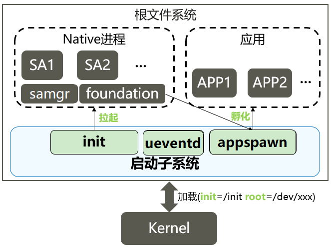
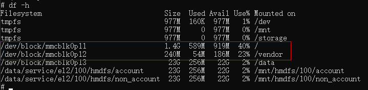

# 整机启动流程

## 启动恢复子系统上下文

下图是启动子系统上下文结构图：

  **图1** 启动子系统上下文结构图

  

系统上电加载内核后，按照以下流程完成系统各个服务和应用的启动：

1. 内核加载init进程，一般在bootloader启动内核时通过设置内核的cmdline来指定init的位置。
2. init进程启动后，会挂载tmpfs，procfs，创建基本的dev设备节点，提供最基本的根文件系统。
3. init也会启动ueventd监听内核热插拔设备事件，为这些设备创建dev设备节点。包括block设备各个分区设备都是通过此事件创建。
4. init进程挂载block设备各个分区（system，vendor）后，开始扫描各个系统服务的init启动脚本，并拉起各个SA服务。
5. samgr是各个SA的服务注册中心，每个SA启动时，都需要向samgr注册，每个SA会分配一个ID，应用可以通过该ID访问SA。
6. foundation是一个特殊的SA服务进程，提供了用户程序管理框架及基础服务。由该进程负责应用的生命周期管理。
7. 由于应用都需要加载JS的运行环境，涉及大量准备工作，因此appspawn作为应用的孵化器，在接收到foundation里的应用启动请求时，可以直接孵化出应用进程，减少应用启动时间。


启动子系统内部涉及以下组件：

- init启动引导组件：

  init启动引导组件对应的进程为init进程，是内核完成初始化后启动的第一个用户态进程。init进程启动之后，读取init.cfg配置文件，根据解析结果，执行相应命令（见[job解析接口说明](../subsystems/subsys-boot-init-jobs.md#接口说明)）并依次启动各关键系统服务进程，在启动系统服务进程的同时设置其对应权限。

- ueventd启动引导组件：

  ueventd负责监听内核设备驱动插拔的netlink事件，根据事件类型动态管理相应设备的dev节点。

- appspawn应用孵化组件：

  负责接收用户程序框架的命令孵化应用进程，设置新进程的权限，并调用应用程序框架的入口函数。

- bootstrap服务启动组件：

  提供了各服务和功能的启动入口标识。在SAMGR启动时，会调用bootstrap标识的入口函数，并启动系统服务。

## 约束与限制

  启动恢复子系统源代码目录和适配平台：

  **表1** 启动恢复子系统源代码目录和适配平台

| 名称 | 适配平台 |
| -------- | -------- |
| base/startup/appspawne | 小型系统设备（参考内存≥1MB）、 标准系统，如Hi3516DV300&nbsp、Hi3518EV300、 RK3568 |
| base/startup/bootstrap_lite | 轻量系统设备（参考内存≥128KB），如Hi3861V100 |
| base/startup/init | 小型系统设备（参考内存≥1MB）、标准系统，如Hi3516DV300、Hi3518EV300、RK3568 |

- init启动引导组件：
  - 每个系统服务启动时都需要编写各自的启动脚本文件`init.cfg`，定义各自的服务名、可执行文件路径、权限和其他信息。
  - 每个系统服务各自安装其启动脚本到`/system/etc/init`目录下，init进程统一扫码执行。

- 新芯片平台移植时，平台相关的初始化配置需要增加平台相关的初始化配置文件`/vendor/etc/init/init.{hardware}.cfg`；该文件完成平台相关的初始化设置，如安装ko驱动，设置平台相关的/proc节点信息。

  > **说明：**
  >
  > 配置文件init.cfg仅支持json格式。

- bootstrap服务启动组件：需要在链接脚本中配置zInit代码段。

## 启动引导OpenHarmony标准系统的详细流程

当前OpenHarmony标准系统默认支持以下几个镜像：

| 镜像名称     | 挂载点  | 说明                                                 |
| ------------ | ------- | ---------------------------------------------------- |
| boot.img     | NA      | 内核和ramdisk镜像，bootloader加载的第一个镜像      |
| system.img   | /system | 系统组件镜像，存放与芯片方案无关的平台业务         |
| vendor.img   | /vendor | 芯片组件镜像，存放芯片相关的硬件抽象服务           |
| updater.img  | /       | 升级组件镜像，用于完成升级；正常启动时不加载此镜像 |
| userdata.img | /data   | 可写的用户数据镜像                                 |

每个开发板都需要在存储器上划分好分区来存放上述镜像，SOC启动时都由bootloader来加载这些镜像，具体过程包括以下几个大的步骤：

- bootloader初始化ROM和RAM等硬件，加载分区表信息。
- bootloader根据分区表加载`boot.img`，从中解析并加载`ramdisk.img`到内存中。
- bootloader准备好分区表信息，ramdisk地址等信息，进入内核，内核加载ramdisk并执行init。
- init准备初始文件系统，挂载`required.fstab`（包括`system.img`和`vendor.img`的挂载）。
- 扫描`system.img`和`vendor.img`中`etc/init`目录下的启动配置脚本，执行各个启动命令。

### uboot启动引导过程

本文以常见的[uboot](https://elinux.org/U-Boot)为例介绍bootloader加载OpenHarmony各个系统镜像的关键过程。u-boot启动OpenHarmony系统时，主要通过bootargs向系统传递启动信息。

- u-boot加载解析boot.img

  - boot.img格式

    boot.img镜像的构建和加载是与平台相关的，下面以OpenHarmony目前的一些主流平台为例进行介绍：

    - Hi3516DV300

      在Hi3516DV300平台上的`boot.img`采用了FIT（flattened image tree）格式，将kernel编译生成的zImage-dtb和cpio格式的ramdisk镜像通过打包工具Mkimage根据its文件中的信息打包生成一个镜像，这个镜像就是`boot.img`。

      下面对上述`boot.img`文件生成过程中使用的文件和工具进行简要介绍：

      1. its文件

         image source file，负责描述要生成的image的信息。需要自行构造，例如Hi3516平台中的`ohos.its`文件。

      2. Mkimage打包工具

         能够解析its文件，将其中按照其中镜像的配置将对应镜像打包生成itb文件，这里也就是`boot.img`文件。

      3. ramdisk

         使用cpio打包的`ramdisk.img`镜像文件。

      4. zImage-dtb

         包含压缩的内核镜像和设备描述文件镜像。

    - rk3568

      在rk3568平台上相应的镜像文件为`boot_linux.img`，其中打包的文件与Hi3516DV300平台不尽相同，下面分别列举：

      1. Image

         kernel编译生成的镜像文件。

      2. toybrick.dtb

         类似于由dts编译而来的设备描述文件镜像。

      3. ramdisk.img

         使用cpio打包的`ramdisk.img`镜像文件。

  - u-boot加载

    支持了ramdisk的启动过程，此场景需要修改productdefine中的产品配置文件，通过"enable_ramdisk"开关开启ramdisk生成，这一部分与平台相关，不同的平台对于ramdisk的处理方式不一样。以Hi3516DV300平台为例，需要将u-boot中的原启动参数修改为`root=/dev/ram0 initrd=0x84000000,0x292e00`。


- u-boot进入

  u-boot启动进入内核时，可以通过bootargs传递关键信息给内核，这一部分内容是与平台相关的，主要信息如下：

  | 名称        | 示例                                                         | 说明                                                         |
  | ----------- | ------------------------------------------------------------ | ------------------------------------------------------------ |
  | initrd      | 0x84000000,0x292e00                                          | 参考内核文档。<br/>[ramfs-rootfs-initramfs.rst](https://gitee.com/openharmony/kernel_linux_5.10/blob/master/Documentation/filesystems/ramfs-rootfs-initramfs.rst)<br/>[initrd.rst](https://gitee.com/openharmony/kernel_linux_5.10/blob/master/Documentation/admin-guide/initrd.rst) |
  | init        | /init                                                        |                                                              |
  | blkdevparts | mmcblk0:1M(boot),15M(kernel),200M(system),200M(vendor),<br/>2M(misc),20M(updater),-(userdata) | 分区表信息，kernel会根据此信息创建物理分区                 |
  | hardware    | Hi3516DV300、rk3568等                                                  | （必要信息）硬件平台 |
  | root        | /dev/ram0（Hi3516DV00)、root=PARTUUID=614e0000-0000 rw（rk3568）                                                    | kernel加载的启动设备 |
  | rootfstype  | ext4                                                         | 根文件系统类型 |
  | default_boot_device | soc/10100000.himci.eMMC | （建议配置信息）默认启动设备，在启动第一阶段会根据这个参数创建required设备的软链接 |
  | ohos.required_mount.xxx | /dev/block/platform/soc/10100000.himci.eMMC/by-name/xxx@/usr@ext4@ro,barrier=1@wait,required |  现支持从cmdline中读取fstab信息，获取失败的情况下，会继续尝试从fstab.required文件中读取 |

- init挂载required分区

  所谓required分区，就是系统启动引导过程的必要分区，必须在二级启动开始前进行挂载。比如system、vendor等必选镜像，挂载这些镜像前，需要先创建对应的块设备文件。这些块设备文件是通过内核上报UEVENT事件来创建的。init需要知道存储器的主设备目录，需要bootloader通过default_boot_device传递。

  目前init支持两种方式获取required分区信息，一是通过保存在`/proc/cmdline`中的bootargs，init会首先尝试从cmdline读取required分区信息；二是通过读取ramdisk中的`fstab.required`文件，只有在前一种方式获取失败的情况下才会尝试通过这种方式获取。

    - 块设备的创建逻辑

      - 准备工作

        1. init从cmdline中读取required fstab，若获取失败，则尝试读`fstab.required`文件，从中获取必须挂载的块设备的PARTNAME，例如system和vendor.
        2. 创建接收内核上报uevent事件广播消息的socket，从`/proc/cmdline`里读取default_boot_device。
        3. 带着fstab信息和socket句柄遍历`/sys/devices`目录，准备开始触发内核上报uevent事件。

      - 触发事件

        1. 通过ueventd触发内核上报uevent事件
        2. 匹配uevent事件中的partitionName与required fstab中的device信息。
        3. 匹配成功后将会进一步处理，格式化设备节点路径，准备开始创建设备节点。

      - 创建节点

        1. 为了便于用户态下对设备节点的访问以及提高设备节点的可读性，会对即将创建的required块设备节点同时创建软链接，这就需要先格式化软链接的路径。
        2. 以上工作都完成后，将执行最后的创建设备节点的步骤，根据传入的uevent中的主次设备号、前置步骤中构建的设备节点路径和软链接路径等创建设备节点，并创建相应软链接。

      至此，块设备节点创建完毕。

    - 与default_boot_device匹配关系

      内核将bootargs信息写入`/proc/cmdline`，其中就包含了default_boot_device，这个值是内核当中约定好的系统启动必要的主设备目录。以`ohos.required_mount.`为前缀的内容则是系统启动必要的分区挂载信息，其内容与`fstab.required`文件内容应当是一致的。另外，分区挂载信息中的块设备节点就是`default_boot_device`目录中by-name下软链接指向的设备节点。例如，`default_boot_device`的值为`soc/10100000.himci.eMMC`，那么`ohos.required_mount.system`的值就包含了`/dev/block/platform/soc/10100000.himci.eMMC/by-name/system`这个指向system设备节点的软链接路径。

      在创建块设备节点的过程中，会有一个将设备路径与default_boot_device的值匹配的操作，匹配成功后，会在`/dev/block/by-name`目录下创建指向真实块设备节点的软链接，以此在访问设备节点的过程中实现芯片平台无关化。

    - 实例

      下面以OpenHarmony系统在Hi3516DV300平台启动过程中必要的system分区为例，详细介绍init进程启动后，从读取required fstab信息到创建required分区块设备节点再到最后完成required分区挂载的全部流程。其中会包含一些关键代码段和关键的log信息供开发者调试参考。

      > **说明：**
      >
      > 从此处开始出现的代码是按逻辑顺序展示的关键代码行，不代表其在源码当中真正的相邻关系。

      1. 获取required设备信息
          ```
          Fstab* LoadRequiredFstab(void)
          {
              Fstab *fstab = NULL;
              fstab = LoadFstabFromCommandLine();
              if (fstab == NULL) {
                  INIT_LOGI("Cannot load fstab from command line, try read from fstab.required");
                  const char *fstabFile = "/etc/fstab.required";
                  if (access(fstabFile, F_OK) != 0) {
                      fstabFile = "/system/etc/fstab.required";
                  }
                  INIT_ERROR_CHECK(access(fstabFile, F_OK) == 0, abort(), "Failed get fstab.required");
                  fstab = ReadFstabFromFile(fstabFile, false);
              }
              return fstab;
          }
          ```
          以上代码分别展示了获取fstab信息的两种方式，首先调用`LoadFstabFromCommandLine()`，从cmdline中获取fstab信息，如果获取失败，则输出log，表示继续尝试从`fstab.required`文件中获取fstab信息。

          对于system分区来说，其读到devices中的关键信息如下所示：
          ```
          /dev/block/platform/fe310000.sdhci/by-name/system
          ```

      2. 创建socket，触发内核上报uevent事件
         ```
         static int StartUeventd(char **requiredDevices, int num)
         {
             INIT_ERROR_CHECK(requiredDevices != NULL && num > 0, return -1, "Failed parameters");
             int ueventSockFd = UeventdSocketInit();
             if (ueventSockFd < 0) {
                 INIT_LOGE("Failed to create uevent socket");
                 return -1;
             }
             RetriggerUevent(ueventSockFd, requiredDevices, num);
             close(ueventSockFd);
             return 0;
         }
         ```

      3. 读取cmdline，获得default_boot_device
         ```
         char *buffer = ReadFileData("/proc/cmdline");
         int ret = GetProcCmdlineValue("default_boot_device", buffer, bootDevice, CMDLINE_VALUE_LEN_MAX);
         INIT_CHECK_ONLY_ELOG(ret == 0, "Failed get default_boot_device value from cmdline");
         ```
         这里取得的`default_boot_device`的值应该是`soc/10100000.himci.eMMC`，也就对应了system分区设备所在目录，这一值存放在了bootDevice这个全局变量当中，将在后续创建system分区设备软链接前进行匹配。

      4. 处理required设备uevent事件
         ```
         if (uevent->partitionName == NULL) {
             INIT_LOGI("Match with %s for %s", devices[i], uevent->syspath);
             deviceName = strstr(devices[i], "/dev/block");
             INIT_INFO_CHECK(deviceName != NULL, continue,
                 "device %s not match \"/dev/block\".", devices[i]);
             deviceName += sizeof("/dev/block") - 1;
             INIT_INFO_CHECK(strstr(uevent->syspath, deviceName) != NULL, continue,
                 "uevent->syspath %s not match deviceName %s", uevent->syspath, deviceName);
             HandleBlockDeviceEvent(uevent);
             break;
         } else if (strstr(devices[i], uevent->partitionName) != NULL) {
             INIT_LOGI("Handle block device partitionName %s", uevent->partitionName);
             HandleBlockDeviceEvent(uevent);
             break;
         }
         ```
         存在devices中的设备信息，就是在此处与内核上报的uevent事件进行匹配的。对于system分区设备的uevent消息，其`uevent->partitionName`值应该为`system`，与devices中存在的`/dev/block/platform/fe310000.sdhci/by-name/system`字段匹配成功，则开始处理system分区设备的uevent消息。

      5. 创建required设备节点和对应软链接

         首先应该格式化对应软链接的路径，这一部分就用到了`bootargs`中`default_boot_device`的值，与上报的required设备节点路径进行匹配，以创建平台无关的可读性更高的指向该设备节点的软链接，关键部分代码如下：
         ```
         if (STRINGEQUAL(bus, "/sys/bus/platform")) {
             INIT_LOGV("Find a platform device: %s", parent);
             parent = FindPlatformDeviceName(parent);
             if (parent != NULL) {
                 BuildDeviceSymbolLinks(links, linkNum, parent, uevent->partitionName, uevent->deviceName);
             }
             linkNum++;
             if ((parent != NULL) && STRINGEQUAL(parent, bootDevice)) {
                 BuildBootDeviceSymbolLink(links, linkNum, uevent->partitionName);
                 linkNum++;
             }
         }
         ```
         首先解释一下这段代码中出现的关键变量。

         - bus: 这是一个保存了路径信息的字符串，路径是当前处理的设备所连接的总线路径。
         - parent: 同样是一个保存了路径信息的字符串，路径是从`uevent->syspath`取出的当前处理的设备路径。
         - links：事先申请好的指向保存软链接路径内存的指针。
         - bootDevice: 存放`bootargs`中`default_boot_device`值的字符串。
         根据代码可知，只有处理到所连接总线类型为platform时的设备才会创建对应软链接，这一软链接所在的目录是：
         ```
         /dev/block/platform/soc/10100000.himci.eMMC/by-name
         ```
         而只有匹配到设备目录为bootDevice中路径的设备时，才会创建平台无关目录的软链接。

         对于system分区设备来说，其所在目录如下：
         ```
         /sys/devices/platform/soc/10100000.himci.eMMC/mmc_host/mmc0/mmc0:0001/block/mmcblk0/mmcblk0p5
         ```
         因此在处理内核上报的该设备uevent消息时，会与bootDevice中的路径`soc/10100000.himci.eMMC`相匹配，因此而创建相应的软链接，这一软链接的路径是：
         ```
         /dev/block/by-name/system
         ```

         软链接路径格式化完成后，将根据uevent中的信息进行最后的创建设备节点和软链接的动作，至此，system分区设备的设备节点创建完毕。

      6. 挂载required分区

         设备节点创建完成后，即可挂载对应分区，主要接口如下：
         ```
          int MountRequiredPartitions(const Fstab *fstab)
          {
              INIT_ERROR_CHECK(fstab != NULL, return -1, "Failed fstab is NULL");
              int rc;
              INIT_LOGI("Mount required partitions");
              rc = MountAllWithFstab(fstab, 1);
              return rc;
          }
         ```
         因此，当我们看到"Mount required partitions"打印的时候，表示required分区设备已经准备完成，即将执行挂载动作。分区挂载过程中，还有一些关键打印如下：
         ```
         BEGET_LOGE("Unsupported file system \" %s \"", item->fsType);
         ```
         表示当前文件系统类型不支持。
         ```
         BEGET_LOGE("Cannot get stat of \" %s \", err = %d", target, errno);
         ```
         表示无法获取挂载点目录信息。
         ```
         BEGET_LOGE("Failed to create dir \" %s \", err = %d", target, errno);
         ```
         表示无法创建挂载点目录。
         ```
         BEGET_LOGI("Mount %s to %s successful", item->deviceName, item->mountPoint);
         ```
         表示成功挂载设备，打印中还包含了挂载的设备名和挂载点信息。

- init执行system和vendor中的启动脚本，挂载vendor中更多的分区

挂载完必要的分区后，init扫描各个脚本文件。vendor中与芯片或开发板相关的初始化脚本入口如`/vendor/etc/init.{ohos.boot.hardware}.cfg`。vendor中扩展的挂载分区文件是`/vendor/etc/fstab.{ohos.boot.hardware}`。hardware的来源是bootloader传递给内核的bootargs。

### fstable 文件说明

- 文件内容

  ```
  # fstab file.
  #<src>      <mnt_point> <type>  <mnt_flags and options>   <fs_mgr_flags>
  /dev/block/platform/fe310000.sdhci/by-name/system    /usr       ext4     ro,barrier=1  wait,required
  /dev/block/platform/fe310000.sdhci/by-name/vendor    /vendor        ext4     ro,barrier=1  wait,required
  /dev/block/platform/fe310000.sdhci/by-name/sys-prod     /sys_prod        ext4     ro,barrier=1  wait
  /dev/block/platform/fe310000.sdhci/by-name/chip-prod     /chip_prod        ext4     ro,barrier=1  wait
  /dev/block/platform/fe310000.sdhci/by-name/userdata      /data       f2fs     discard,noatime,nosuid,nodev,fscrypt=2:aes-256-cts:aes-256-xts,usrquota  wait,check,fileencryption=software,quota
  ```

- 字段说明

  | 字段                  | 说明                                                         |
  | --------------------- | ------------------------------------------------------------ |
  | src                   | 挂在分区的地址或文件系统的设备的路径                         |
  | mnt_point             | 在根文件系统中的挂载点                                       |
  | type                  | 文件系统的类型(常见有ext2、vfat、NTFS等)                     |
  | mnt_flags and options | 挂载的参数,详细的如下说明                                    |
  | fs_mgr_flags          | 文化系统管理的标识<br />可用值有：{"check","wait,"required","nofail","hvb"} |

- mnt_flags and options 参数说明

  ```
  auto 在启动时或键入mount -a命令时自动挂载
  noauto 开机不自动挂载，不再使用mount　－a命令（例如系统启动时）加载该文件系统
  exec 允许执行此分区的二进制文件
  noexec 不允许执行此文件系统上的二进制文件
  ro 以只读模式挂载文件系统
  rw 以读写模式挂载文件系统
  user 允许任意用户挂载此文件系统，若无显示定义，隐含启用noexec nosuid nodev参数
  users 允许所有users组中的用户挂载文件系统
  nouser 只能被root挂载
  owner 允许设备所有者挂载
  sync 实时同步内存和磁盘中的数据，不对该设备的写操作进行缓冲处理，这可以防止在非正常关机时情况下破坏文件系统，但是却降低了计算机速度
  async 磁盘和内存不同步，系统每隔一段时间就会把内存数据写入磁盘中
  dev 解析文件系统上的块特殊设备
  nodev 不解析文件系统上的块特殊设备
  suid/nosuid 表示允许/不允许分区有suid属性
  quota　　　强制在该文件系统上进行磁盘定额限制
  usrquota 表示启动用户的磁盘配额模式。磁盘配额会针对用户限定他们使用的磁盘额度
  grpquota 表示启动组的磁盘配额模式
  nodiratime 不更新文件系统上的目录inode访问记录
  relatime 实时更新inode access记录
  defaults 使用文件系统的默认挂载参数，ext4的默认参数为rw,suid,dev,exec,auto,nouser,async
  ```
### 无ramdisk的启动加载流程

有些开发板没有采用ramdisk启动引导，直接通过内核挂载`system.img`。此场景需要修改productdefine中的产品配置文件，通过"enable_ramdisk"开关关闭ramdisk生成，init也不会从ramdisk里二次启动到system。

此场景的主要启动过程与上述流程类似，只是有ramdisk时，init会把`system.img`挂载到`/usr`目录，然后chroot到`/usr`下；而没有ramdisk时，没有chroot过程，但是都会读取`init.cfg`文件从而执行脚本。

对于无ramdisk的启动加载，即system as root. 在bootloader阶段将根文件系统所在的块设备通过bootargs传给内核，如`root=/dev/mmcblk0p5，rootfstype=ext4`。内核在初始化根文件系统时，解析bootargs中root，完成根文件系统的挂载。


### A/B分区启动

OpenHarmony现支持A/B双分区启动（主备系统分区），即在设备的存储介质上同时存放两套系统分区A和B，启动时根据当前的活动分区标记（我们称之为active partition slot）来决定加载哪一套系统分区。目前支持A/B启动的分区有system分区和chipset分区。

- bootslots

  bootslots是指当前支持的启动分区个数，当前bootslots的值被设置为2，表示支持A/B双系统分区启动，如果该值为1，则表示不支持A/B分区启动，仅可从默认系统分区启动。

  init启动的第一阶段将会读取bootslots值，根据该值判断当前系统是否支持A/B分区，若不支持，则按照默认fstab挂载系统分区；若支持，则继续判断本次启动需要挂载哪一套系统分区。init获取bootslots的主要接口如下：
  ```
  int GetBootSlots(void)
  {
      int bootSlots = GetSlotInfoFromParameter("bootslots");
      BEGET_CHECK_RETURN_VALUE(bootSlots <= 0, bootSlots);
      BEGET_LOGI("No valid slot value found from parameter, try to get it from cmdline");
      return GetSlotInfoFromCmdLine("bootslots");
  }
  ```
  在系统正常启动后，用户可以在控制台通过系统参数`ohos.boot.bootslots`来获取`bootslots`的值，以查看当前系统是否支持A/B分区启动。获取该系统参数的具体命令如下：
  ```
  param get ohos.boot.bootslots
  ```

- currentslot

  currentslot是指当前启动的系统分区，比如A分区或B分区。currentslot的值使用数字表示，比如数字1表示当前启动A分区，数字2表示当前启动B分区。

  init在启动的第一阶段通过bootslots判断系统是否支持A/B分区，若不支持，将不再获取`currentslot`值，直接启动默认系统分区；若支持，将会继续获取`currentslot`值，根据该值判断当前启动的系统分区为A分区或B分区。init获取`currentslot`的主要接口如下：
  ```
  int GetCurrentSlot(void)
  {
      // get current slot from parameter
      int currentSlot = GetSlotInfoFromParameter("currentslot");
      BEGET_CHECK_RETURN_VALUE(currentSlot <= 0, currentSlot);
      BEGET_LOGI("No valid slot value found from parameter, try to get it from cmdline");

      // get current slot from cmdline
      currentSlot = GetSlotInfoFromCmdLine("currentslot");
      BEGET_CHECK_RETURN_VALUE(currentSlot <= 0, currentSlot);
      BEGET_LOGI("No valid slot value found from cmdline, try to get it from misc");

      // get current slot from misc
      return GetSlotInfoFromMisc(MISC_PARTITION_ACTIVE_SLOT_OFFSET, MISC_PARTITION_ACTIVE_SLOT_SIZE);
  }
  ```

- A/B分区启动流程

  1. 获取当前启动的A/B分区信息，即`currentslot`信息。
  2. 以原始fstab为基础构造新的分区挂载配置，为支持A/B启动的分区（目前支持的分区有system分区和chipset分区）添加对应的"_a"或"_b"后缀。
  3. 按照构造后的分区挂载配置挂载带有相应后缀的分区并切换到启动的第二阶段，启动第二阶段将在具体的A分区或B分区中进行，涉及A/B分区启动部分至此结束。

  调整分区挂载配置的主要接口如下：
  ```
  static void AdjustPartitionNameByPartitionSlot(FstabItem *item)
  {
      BEGET_CHECK_ONLY_RETURN(strstr(item->deviceName, "/system") != NULL ||
          strstr(item->deviceName, "/chipset") != NULL);
      char buffer[MAX_BUFFER_LEN] = {0};
      int slot = GetCurrentSlot();
      BEGET_ERROR_CHECK(slot > 0 && slot <= MAX_SLOT, slot = 1, "slot value %d is invalid, set default value", slot);
      BEGET_INFO_CHECK(slot > 1, return, "default partition doesn't need to add suffix");
      BEGET_ERROR_CHECK(sprintf_s(buffer, sizeof(buffer), "%s_%c", item->deviceName, 'a' + slot - 1) > 0,
          return, "Failed to format partition name suffix, use default partition name");
      free(item->deviceName);
      item->deviceName = strdup(buffer);
      BEGET_LOGI("partition name with slot suffix: %s", item->deviceName);
  }
  ```

- A/B分区挂载与启动实例

  下面以rk3568平台为例，演示系统从默认分区启动到支持A/B分区启动的过程。

  1. 烧写原始镜像并查看各分区设备信息

      

      使用原始镜像构造A/B分区镜像，测试A/B分区启动功能
      - 复制system、vendor镜像并添加_b后缀。
      - 在分区表（`parameter.txt`）中添加system_b、vendor_b分区。

  2. 烧写A/B分区镜像

     - 在rk3568烧写工具中导入配置，选择带有system_b和vendor_b分区的`parameter.txt`。
     - 按照新的分区表配置选择镜像（注意新增的system_b和vendor_b镜像），选择完成后烧写。

  3. 启动完成后

      1. 执行`cat /proc/cmdline`，能够找到`bootslot=2`，说明当前系统支持A/B分区启动。

          
      2. 执行`param get ohos.boot.bootslot`，得到的结果是2，说明bootslot信息被成功写到了parameter中。

      3. 执行`ls -l /dev/block/by-name`，能够找到system_b、vendor_b，说明新增的B分区设备节点创建成功。

          

      4. 执行`df -h`查看当前系统挂载分区。

          

          可以看到根文件系统（一个“/”表示）挂载的是mmcblk0p6，从上一张图中可以找到对应mmcblk0p6的是system；也可以看到`/vendor`中挂载的是mmcblk0p7，从上一张图中可以找到对应mmcblk0p7的是vendor。也就是说，现在挂载的是默认分区（就是原来的没有后缀的system和vendor分区，可以理解为默认分区就是A分区）。

          接下来，我们将尝试B分区启动。

          1. 执行`partitionslot setactive 2`，将活动分区slot设置为2，也就是B分区的slot。

             

          2. 执行`partitionslot getslot`，查看刚刚设置的slot值是否设置成功。

             

             `current slot: 2`表示活动分区slot被成功设置为2。

          3. 重启设备后，执行`df -h`，查看当前系统挂载分区。
          
             发现当前根文件系统挂载的是mmcblk0p11，/vendor挂载的是mmcblk0p12。

             

          4. 再次执行`ls -l /dev/block/by-name`。

             

          找到mmcblk0p11对应的是system_b，mmcblk0p12对应的是vendor_b，也就是说，本次启动系统已经成功从B分区挂载启动。
