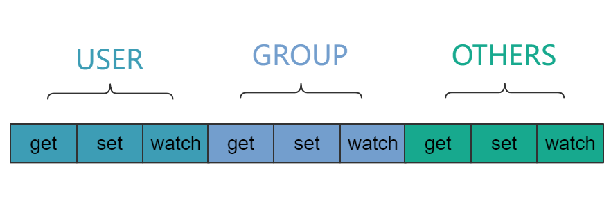

# 系统参数
## 概述
### 功能简介

OHOS系统参数为各系统服务提供简单易用的键值对访问接口，使得各个系统服务可以通过各自的系统参数来进行业务功能的配置。

### 系统参数定义

每个子系统定义各自模块的系统参数，包括系统参数名称、默认值以及系统参数的权限访问信息。
#### 系统参数定义文件

- 系统参数定义文件后缀名为".para" ，其格式示例如下：

	```
	const.product.name=OHOS-PRODUCT
	const.os.version.api=26
	const.telephony.enable=false|true
	```
#### 系统参数名(key)定义

- 系统参数命名格式

  系统参数名称采用点分格式，由多段组成，每一段可以由字母、数字、下划线组成，总长度不超过96字节；系统参数名称分为两类：

  系统参数名称

  | 类别 | 名称 | 示例 | 说明 |
  | -------- | -------- | -------- | -------- |
  | 参数名称 | Parameter Name | const.product.**name** | 完整的系统参数名称，末尾不是"."。 |
  | 参数目录 | Parameter Directory | const.**. | 以"."结尾，标识相同前缀的所有系统参数集合。 |

- 系统参数类型

  系统参数一共分为三大类：

  系统参数分类

  | 类别 | 前缀 | 说明 |
  | -------- | -------- | -------- |
  | 常量 | const. | 常量参数，一旦赋值后续不会再变更；值最大长度为4096字节（包括结束符）。 |
  | 可写 | 其它 | 可写参数，重启后丢失，值最大长度96字节（包括结束符）。|
  | 可持久化 | persist. | 可写并可持久化保存参数，重启后不会丢失，值最大长度96字节（包括结束符）。|

  每个系统参数名称总体格式如下：

  ```java
  [ const | persist ].$sub_system.$desc
  ```
  $sub_system为子系统或模块的名称。

  $desc为子系统或模块下参数的描述字符，可以为点分格式进行分级描述。

#### 系统参数值(value)定义

- 系统参数的赋值分为三大类：

系统参数赋值方式

| 类别 | 示例 | 说明 |
| -------- | -------- | -------- |
| 字符串   | const.product.name=OHOS-PRODUCT | 多行字符串需要通过引号扩起来。 |
| 数字     | const.os.version.api=26         | 数字不需要。|
| 布尔     | const.telephony.enable=false    | 布尔型的可以为0,1,false,true。|

### 系统参数权限设置

系统参数支持DAC和MAC访问控制。
#### 默认权限

系统参数没有定义任何DAC，MAC权限时，其默认权限为：

| [DAC] User | [DAC] Group | [DAC] UGO | [MAC] SELinux Label |
| ---------- | ----------- | --------- | ------------------- |
| root       | root        | 775       | default_param       |

Other进程对默认权限参数的访问行为列举如下：

| 操作  | 系统Native进程 | 系统应用进程 | 三方应用进程 |
| ----- | -------------- | ------------ | ------------ |
| get   | 允许           | 允许         | 允许         |
| watch | 允许           | 允许         | 允许         |
| set   | 不允许         | 不允许       | 不允许       |

#### DAC访问控制权限设置

- 系统参数DAC访问控制定义文件

  当前系统参数的访问权限控制通过自主访问控制（Discretionary Access Control）方式管理，访问权限定义文件后缀名为".para.dac" ，init下的文件路径为/base/startup/init/services/etc/param/ohos.para.dac，具体定义内容示例如下：

  ```
  const.product.              = root:root:0775
  persist.init.               = root:root:0775
  startup.appspawn.           = root:root:0750
  startup.uevent.             = ueventd:ueventd:0775
  ```

  如上所示，可以为相同前缀的所有系统参数定义一类访问权限信息，DAC信息通过":"分三段来描述，分别为参数的user，group以及UGO规则信息。

  UGO规则信息每一位的定义如下：

  **图1** UGO规则信息

  

#### MAC访问控制权限设置

 - 添加selinux标签

    为系统参数添加selinux标签，首先需要在文件/base/security/selinux_adapter/sepolicy/base/public/parameter.te中定义标签，例如：

    ```java
    type servicectrl_param, parameter_attr
    ```

    标签定义完成后，在文件/base/security/selinux_adapter/sepolicy/base/public/parameter_contexts中添加和标签关联的系统参数前缀，这里以前缀ohos.servicectrl.为例：

    ```java
    ohos.servicectrl.           u:object_r:servicectrl_param:s0
    ```

  - 给init授权，允许map等操作，在文件/base/security/selinux/sepolicy/ohos_policy/startup/init/public/init.te中补充下面内容：

    ```java
    allow servicectrl_param tmpfs:filesystem associate;
    allow init servicectrl_param:file { map open read relabelto relabelfrom };
    ```

  - 设置写权限，这里允许init samgr hdf_devmgr 进行系统参数写：

    ```java
    allow { init samgr hdf_devmgr } servicectrl_param:parameter_service { set };
    ```

  - 设置读权限，如果只允许部分进程访问可单独对该进程授权：

    ```java
    allow { xxx } servicectrl_param:file { map open read };
    ```

  - 如果全部允许，则设置为：

    ```java
    allow { domain -limit_domain } servicectrl_param:file { map open read };
    ```

#### 系统参数权限基本要求

    每个selinux标签对应的系统参数有独立的共享内存区，同类型的系统参数建议共用selinux标签，减少系统共享内存的开销。

    以sample部件为例，建议增加以下几类标签进行访问控制：

    a）公开只读的系统参数，不需要定义新的标签，使用default_param

    b）可写系统参数：增加标签{component}_writable_param

    c）仅部件内部可读的系统参数（隐私数据）：增加标签【可选】 {component}_private_param

### 系统参数标签配置

#### 系统参数标签文件大小配置

每个标签默认分配1K内存，能存放5个左右的系统参数。如果标签下支持的系统参数较多，需在ohso.para.size文件中按照标签扩大内存大小。

支持/system/etc/param/ohos.para.size和/sys_prod/etc/param/ohos.para.size进行扩展。

配置规则：

系统参数标签=大小

例如：

```
devinfo_public_param=30720
hilog_param=40960
```

默认系统参数的共享内存大小：80KB

#### 系统参数标签说明

  init 会根据系统参数标签在/dev/__parameters__/目录下创建对应的共享内存映射文件,该共享内存用来存储与该标签绑定的系统参数。

  共享内存文件示例：

  ```
  -rwxr-xr-- 1 root root 30720 2017-08-10 16:22 u:object_r:default_param:s0
  -rwxr-xr-- 1 root root  1024 2017-08-10 16:22 u:object_r:devinfo_private_param:s0
  -rwxr-xr-- 1 root root 30720 2017-08-10 16:22 u:object_r:devinfo_public_param:s0
  -rwxr-xr-- 1 root root 40960 2017-08-10 16:22 u:object_r:hilog_param:s0
  ```

  系统参数标签会在/base/security/selinux_adapter/sepolicy/base/public/parameter.te文件中定义：

  系统参数标签定义：

  ```
  type default_param, parameter_attr;
  type devinfo_private_param, parameter_attr;
  type devinfo_public_param, parameter_attr;
  type hilog_param, parameter_attr;
  ```

  系统参数标签与系统参数的关联在/base/security/selinux_adapter/sepolicy/base/public/parameter_contexts定义：

  以hilog_param标签为例：

  ```
  hilog.                   u:object_r:hilog_param:s0  #以hilog.为前缀的系统参数存储在hilog_param标签对应的共享内存中
  persist.sys.hilog.       u:object_r:hilog_param:s0  #以persist.sys.hilog.为前缀的系统参数也存储在hilog_param标签对应的共享内存中
  ```
### 查看系统参数共享内存占用情况

    系统参数共享内存占用情况的查询，提供了查询命令：param dump [verbose]

    查询结果的介绍说明如下：

    ```
      Dump all parameters begin ...
      Local security information
      pid: 1612 uid: 0 gid: 0
      map file: u:object_r:default_param:s0            // 系统参数标签名称（共享内存映射文件名）
      total size: 10485720                             // 系统参数标签文件大小（标签映射的共享内存大小）
      first offset: 0                                  // 第一个参数节点的偏移量
      current offset: 15948                            // 当前的参数节点的偏移量
      total node: 242                                  // 该标签内节点总数
      total param node: 219                            // 参数节点总数
      total security node: 0                           // selinux节点数
      commitId        : 26                             //
      commitPersistId : 0                              //
      node info:                                       // 该标签下所有节点的信息
      ... ...
    ```
### 系统参数的加载顺序

    系统参数加载顺序

    | 类别 | 路径 | 说明 |
    | -------- | -------- | -------- |
    | 内核参数    | /proc/cmdline | 将内核参数中的部分值转化成系统参数，并保存。内核参数中.xxx=valXXX类型的参数都转换成ohos.boot.xxx=valXXX系统参数。 |
    | OS系统参数 | /system/etc/param/ohos_const/*.para | OS固定系统参数值参数优先加载。                               |
    | vendor参数 | /vendor/etc/param/*.para | 厂商定义的系统参数次优先级加载。                             |
    | system参数 | /system/etc/param/*.para | 加载各子系统定义的参数参数。如果系统参数已经存在，则忽略掉。 |
    | persist参数 | /data/parameters/ | 如果持久化参数存在，则最后加载持久化系统参数。持久化系统参数会覆盖加载的默认系统参数。 |

### 参数和标签的展示

   目前按照子系统，部件把参数和标签统计的信息已经录入数据库，可以搭建[OpenHarmony实时架构信息收集与分析系统](https://gitee.com/handyohos/ohos_archinfo/tree/master)进行查看

   搭建服务可参考：[OpenHarmony实时架构信息analyser模块说明](https://gitee.com/handyohos/ohos_archinfo/blob/master/analyser/README.md)

   自行收集数据库信息可参考：[OpenHarmony实时架构信息收集与分析系统](https://gitee.com/handyohos/ohos_archinfo/tree/master#/handyohos/ohos_archinfo/blob/master/collector/README.md)

   数据库也可以取每日构建的dayu200-db
### 系统参数的基本操作

系统参数操作原语


系统参数操作原语说明
| 功能 | 说明 |
| -------- | -------- |
| get      | 获取系统参数的值        |
| set      | 设置系统参数的值        |
| wait     | 同步等待系统参数的值变更 |
| watch    | 异步观察系统参数的值变更 |

### 约束与限制

仅限小型系统、标准系统下使用。

## 开发指导

### 场景介绍
设定特定的系统参数

### 接口说明

  - Shell命令接口

    通过shell命令中可直接操作系统参数（只在标准系统提供）。系统参数shell命令如下表所示：

    **表6** 系统参数shell命令说明

    | 功能 | 说明 |
    | -------- | -------- |
    | param get [**key**] | 获取指定key名称的系统参数值；如果不指定任何name，则返回所有系统参数值。 |
    | param set **key value** | 设置指定key名称的参数值为value。 |
    | param wait **key** **value** | 同步等待指定key名称的系统参数值与value匹配。value可支持模糊匹配，如"*"表示任何值，"val\*"表示只匹配前三个val字符。 |

  - syspara系统接口

    在Coding中可以调用下列函数接口，获取对应的系统参数值（系统参数接口返回的为const字符串，不支持free操作）。

    **表7** 系统属性接口说明
    | 接口名 | 描述 |
    | -------- | -------- |
    | int&nbsp;GetParameter(const&nbsp;char\*&nbsp;key,&nbsp;const&nbsp;char\*&nbsp;def,&nbsp;char\*&nbsp;value,&nbsp;unsigned&nbsp;int&nbsp;len) | 获取系统参数。 |
    | int&nbsp;SetParameter(const&nbsp;char\*&nbsp;key,&nbsp;const&nbsp;char\*&nbsp;value) | 设置/更新系统参数。 |
    | const&nbsp;char\*&nbsp;GetDeviceType(void) | 返回当前设备类型。 |
    | const&nbsp;char\*&nbsp;GetManufacture(void) | 返回当前设备生产厂家信息。 |
    | const&nbsp;char\*&nbsp;GetBrand(void) | 返回当前设备品牌信息。 |
    | const&nbsp;char\*&nbsp;GetMarketName(void) | 返回当前设备传播名。 |
    | const&nbsp;char\*&nbsp;GetProductSeries(void) | 返回当前设备产品系列名。 |
    | const&nbsp;char\*&nbsp;GetProductModel(void) | 返回当前设备认证型号。 |
    | const&nbsp;char\*&nbsp;GetSoftwareModel(void) | 返回当前设备内部软件子型号。 |
    | const&nbsp;char\*&nbsp;GetHardwareModel(void) | 返回当前设备硬件版本号。 |
    | const&nbsp;char\*&nbsp;GetHardwareProfile(void) | 返回当前设备硬件profile。 |
    | const&nbsp;char\*&nbsp;GetSerial(void) | 返回当前设备序列号（SN号）。 |
    | const&nbsp;char\*&nbsp;GetOSFullName(void) | 返回操作系统名。 |
    | const&nbsp;char\*&nbsp;GetDisplayVersion(void) | 返回当前设备用户可见的软件版本号。 |
    | const&nbsp;char\*&nbsp;GetBootloaderVersion(void) | 返回当前设备Bootloader版本号。 |
    | const&nbsp;char\*&nbsp;GetSecurityPatchTag(void) | 返回安全补丁标签。 |
    | const&nbsp;char\*&nbsp;GetAbiList(void) | 返回当前设备支持的指令集（Abi）列表。 |
    | int&nbsp;GetSdkApiVersion(void) | 返回与当前系统软件匹配的SDK&nbsp;API&nbsp;版本号。 |
    | int&nbsp;GetFirstApiVersion(void) | 返回系统软件首版本SDK&nbsp;API&nbsp;版本号。 |
    | const&nbsp;char\*&nbsp;GetIncrementalVersion(void) | 返回差异版本号。 |
    | const&nbsp;char\*&nbsp;GetVersionId(void) | 返回版本id。 |
    | const&nbsp;char\*&nbsp;GetBuildType(void) | 返回构建类型。 |
    | const&nbsp;char\*&nbsp;GetBuildUser(void) | 返回构建账户用户名。 |
    | const&nbsp;char\*&nbsp;GetBuildHost(void) | 返回构建主机名。 |
    | const&nbsp;char\*&nbsp;GetBuildTime(void) | 返回构建时间。 |
    | const&nbsp;char\*&nbsp;GetBuildRootHash(void) | 返回当前版本hash。 |
    | const&nbsp;char\*&nbsp;GetOsReleaseType(void) | 返回系统发布类型。 |
    | int&nbsp;GetDevUdid(char&nbsp;\*udid,&nbsp;int&nbsp;size) | 获取设备udid。 |
    | const char *AclGetSerial(void); | 返回当前设备序列号（SN号）（带访问权限检查）。 |
    | int AclGetDevUdid(char *udid, int size); | 获取设备udid（带访问权限检查）。 |

### 开发步骤

1. 系统参数定义

    通过定义子系统或者产品的.para和.para.dac文件，实现默认系统参数的定义和权限控制。

    ​    	在标准系统上通过ohos_prebuilt_para模版安装配置文件到到/etc/param/目录下，GN脚本示例如下：

    ```go
    import("//base/startup/init/services/etc/param/param_fixer.gni")

    ohos_prebuilt_para("ohos.para") {
        source = "//base/startup/init/services/etc/ohos.para"
        part_name = "init"
        module_install_dir = "etc/param"
    }

    ohos_prebuilt_para("ohos.para.dac") {
        source = "//base/startup/init/services/etc/ohos.para.dac"
        part_name = "init"
        module_install_dir = "etc/param"
    }
    ```

    在小系统上，通过copy命令，把对应的系统参数定义文件拷贝到system/etc/param目录下
    ```go
    copy("ohos.para") {
      sources = [ "//base/startup/init/services/etc/param/ohos.para" ]
      outputs = [ "$root_out_dir/system/etc/param/ohos.para" ]
    }
    copy("ohos.para.dac") {
      sources = [ "//base/startup/init/services/etc/param/ohos.para.dac" ]
      outputs = [ "$root_out_dir/system/etc/param/ohos.para.dac" ]
    }
    ```
    在mini系统上，通过action把所有定义的默认系统参数转化成头文件，并编译到系统中
    ```go
    action("lite_const_param_to") {
      script = "//base/startup/init/scripts/param_cfg_to_code.py"
      args = [
        "--source",
        rebase_path(
            "//base/startup/init/services/etc_lite/param/ohos_const/ohospara"),
        "--dest_dir",
        rebase_path("$root_out_dir/gen/init/"),
        "--priority",
        "0",
      ]
      outputs = [ "$target_gen_dir/${target_name}_param_cfg_to_code.log" ]
    }
    ```
2. 系统参数使用实例
    ```
    // set && get
    char key1[] = "rw.sys.version";
    char value1[] = "10.1.0";
    int ret = SetParameter(key1, value1);
    char valueGet1[128] = {0};
    ret = GetParameter(key1, "version=10.1.0", valueGet1, 128);

    // get sysparm
    char* value1 = GetDeviceType();
    printf("Product type =%s\n", value1);

    char* value2 = GetManufacture();
    printf("Manufacture =%s\n", value2);

    char* value3 = GetBrand();
    printf("GetBrand =%s\n", value3);

    char* value4 = GetMarketName();
    printf("MarketName =%s\n", value4);

    char* value5 = GetProductSeries();
    printf("ProductSeries =%s\n", value5);

    char* value6 = GetProductModel();
    printf("ProductModel =%s\n", value6);

    char* value7 = GetSoftwareModel();
    printf("SoftwareModel =%s\n", value7);

    char* value8 = GetHardwareModel();
    printf("HardwareModel =%s\n", value8);

    char* value9 = GetHardwareProfile();
    printf("Software profile =%s\n", value9);

    char* value10 = GetSerial();
    printf("Serial =%s\n", value10);

    char* value11 = GetOSFullName();
    printf("OS name =%s\n", value11);

    char* value12 = GetDisplayVersion();
    printf("Display version =%s\n", value12);

    char* value13 = GetBootloaderVersion();
    printf("bootloader version =%s\n", value13);

    char* value14 = GetSecurityPatchTag();
    printf("secure patch level =%s\n", value14);

    char* value15 = GetAbiList();
    printf("abi list =%s\n", value15);

    int value16 = GetFirstApiVersion();
    printf("first api level =%d\n", value16);

    char* value17 = GetIncrementalVersion();
    printf("Incremental version = %s\n", value17);

    char* value18 = GetVersionId();
    printf("formal id =%s\n", value18);

    char* value19 = GetBuildType();
    printf("build type =%s\n", value19);

    char* value20 = GetBuildUser();
    printf("build user =%s\n", value20);

    char* value21 = GetBuildHost();
    printf("Build host = %s\n", value21);

    char* value22 = GetBuildTime();
    printf("build time =%s\n", value22);

    char* value23 = GetBuildRootHash();
    printf("build root later..., %s\n", value23);

    char* value24 = GetOsReleaseType();
    printf("OS release type =%s\n", value24);

    char* value25 = GetOsReleaseType();
    printf("OS release type =%s\n", value25);

    char value26[65] = {0};
    GetDevUdid(value26, 65);
    printf("device udid =%s\n", value26);
    ```
### 系统参数错误码说明

**错误码说明**

| 枚举                             | 枚举值 | 说明                                      |
| -------------------------------- | ------ | ----------------------------------------- |
| PARAM_CODE_ERROR                 | -1     | 系统错误                                  |
| PARAM_CODE_SUCCESS               | 0      | 成功                                      |
| PARAM_CODE_INVALID_PARAM         | 100    | 系统参数接口的入参为空                     |
| PARAM_CODE_INVALID_NAME          | 101    | 系统参数key不符合规范，长度或非法字符      |
| PARAM_CODE_INVALID_VALUE         | 102    | 系统参数value值不符合规范，长度或非法字符  |
| PARAM_CODE_REACHED_MAX           | 103    | 树节点已达最大值                          |
| PARAM_CODE_NOT_SUPPORT           | 104    | 不支持此接口                              |
| PARAM_CODE_TIMEOUT               | 105    | 访问服务端超时                            |
| PARAM_CODE_NOT_FOUND             | 106    | 没有找到该参数                            |
| PARAM_CODE_READ_ONLY             | 107    | 系统参数为只读参数                        |
| PARAM_CODE_IPC_ERROR             | 108    | IPC通信异常                               |
| PARAM_CODE_NODE_EXIST            | 109    | 系统参数的节点存在                        |
| PARAM_WATCHER_CALLBACK_EXIST     | 110    | watcher的callback重复添加                 |
| PARAM_WATCHER_GET_SERVICE_FAILED | 111    | watcher获取服务失败                       |
| PARAM_CODE_MEMORY_MAP_FAILED     | 112    | 建立文件共享内存映射失败                  |
| PARAM_WORKSPACE_NOT_INIT         | 113    | workspace 没有初始化                      |
| PARAM_CODE_FAIL_CONNECT          | 114    | 连接paramServer 失败                      |
| PARAM_CODE_MEMORY_NOT_ENOUGH     | 115    | 系统参数空间不足                          |
| DAC_RESULT_INVALID_PARAM         | 1000   | 无用，定义权限错误的起始值                |
| DAC_RESULT_FORBIDED              | 1001   | DAC权限被禁止                             |
| SELINUX_RESULT_FORBIDED          | 1002   | selinux权限被禁止                         |
| PARAM_CODE_MAX                   | 1003   | 枚举最大值                                |

**错误定位关键日志**

- system parameter set:

    SetParameter failed! the errNum is: xx!

    SystemSetParameter failed! name is : xxx, errNum is: xx!

- system parameter get:

    GetParameter_ failed! the errNum is: xx!

    SystemReadParam failed! name is: xxxx, errNum is: xx!

- system parameter wait:

    WaitParameter failed! the errNum is: xx!

    SystemWaitParameter failed! name is: xxx, errNum is: xx!

- system parameter Watcher:

    WatchParameter failed! the errNum is xx!

    SystemWatchParameter is failed! keyPrefix is:xxx, errNum is:xx!
## 系统参数常见问题

### 如何设置一个系统参数

  1、hdc shell进入终端，执行param set param.key.xxx(系统参数名) param.value.xxx(系统参数名值), 确认参数是否可以设置成功，成功则无需其他设置

  2、代码侧设置系统参数，调用SetParameter接口，具体参照[接口说明](#接口说明)
  
  3、执行param set 失败，则根据失败的日志确定对应的排查操作：

  若dac 权限不足，参照DAC访问控制权限设置进行设置

  若selinux 权限不足，根据" avc:  denied" 告警信息设置对应规则

  若内存不够，参照[系统参数标签配置](#系统参数标签配置)进行扩展

### 如何读取一个系统参数

  1、hdc shell进入终端，执行param get param.key.xxx(系统参数名), 查看参数是否可以读取成功，读取成功则无需其他操作

  2、代码侧获取系统参数，调用GetParameter接口，具体参照[接口说明](#接口说明)

  3、执行param get 失败，则根据失败的日志确定对应的排查操作：

  首先需要确认该参数是否被设置，若没有被设置，则需要先设置该参数；若已设置，则进行下一步排查

  若dac 权限不足，参照DAC访问控制权限设置进行设置

  若selinux 权限不足，根据" avc:  denied" 告警信息设置对应规则

### 如何订阅一个系统参数的变化

  1、hdc shell进入终端，执行param shell，进入Parameter shell后执行 watcher parameter param.key.xxx(系统参数名)，当系统参数值发生变化时，会收到类似"Receive parameter commit 691 change aaa.aaa 11111"的消息

  2、代码侧监控系统参数变化，调用WatchParameter接口

  3、执行watcher parameter 失败，则根据失败的日志确定对应的排查操作：

  若dac 权限不足，参照DAC访问控制权限设置进行设置

  若selinux 权限不足，根据" avc:  denied" 告警信息设置对应规则

### 三方应用为何无法访问系统参数

默认DAC规则只允许三方应用对参数具有get, watch 的权限，因此三方应用若需要set权限需要重新设置DAC规则。 此外, 三方应用的selinux权限默认是未设置的，因此需要参照mac访问控制权限设置进行设置
