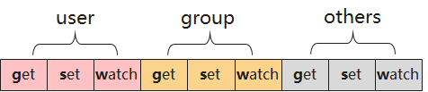

# syspara系统属性组件<a name="ZH-CN_TOPIC_0000001063362360"></a>

-   [系统参数简介](#section381564832813)
-   [系统参数定义规则](#section431671411293)
    -   [系统参数值定义文件](#section885018321291)
    -   [系统参数DAC访问控制定义文件](#section1333155762915)
    -   [系统参数定义文件安装方法](#section43801513193014)
    -   [系统参数值定义文件的加载顺序](#section89971332173017)

-   [shell命令使用说明](#section2039119283111)
-   [syspara系统接口说明](#section0137175692616)
-   [开发实例](#section118404913233)

## 系统参数简介<a name="section381564832813"></a>

syspara系统为各系统服务提供简单易用的键值对访问接口，使得各个系统服务可以通过各自的系统参数来进行业务功能的配置。系统参数的访问和操作有以下几个基本原语

**图 1**  系统参数操作原语<a name="fig1976004014480"></a>  


**表 1**  系统参数操作原语说明

<a name="table899071145116"></a>
<table><thead align="left"><tr id="row699014115513"><th class="cellrowborder" valign="top" width="15.97%" id="mcps1.2.3.1.1"><p id="p9990111195119"><a name="p9990111195119"></a><a name="p9990111195119"></a>功能</p>
</th>
<th class="cellrowborder" valign="top" width="84.03%" id="mcps1.2.3.1.2"><p id="p5990614518"><a name="p5990614518"></a><a name="p5990614518"></a>说明</p>
</th>
</tr>
</thead>
<tbody><tr id="row1699011113511"><td class="cellrowborder" valign="top" width="15.97%" headers="mcps1.2.3.1.1 "><p id="p099071175116"><a name="p099071175116"></a><a name="p099071175116"></a>get</p>
</td>
<td class="cellrowborder" valign="top" width="84.03%" headers="mcps1.2.3.1.2 "><p id="p199021165116"><a name="p199021165116"></a><a name="p199021165116"></a>获取系统参数的值</p>
</td>
</tr>
<tr id="row1299019117513"><td class="cellrowborder" valign="top" width="15.97%" headers="mcps1.2.3.1.1 "><p id="p159901918510"><a name="p159901918510"></a><a name="p159901918510"></a>set</p>
</td>
<td class="cellrowborder" valign="top" width="84.03%" headers="mcps1.2.3.1.2 "><p id="p1990181115112"><a name="p1990181115112"></a><a name="p1990181115112"></a>设置系统参数的值</p>
</td>
</tr>
<tr id="row19901812519"><td class="cellrowborder" valign="top" width="15.97%" headers="mcps1.2.3.1.1 "><p id="p1999014105117"><a name="p1999014105117"></a><a name="p1999014105117"></a>wait</p>
</td>
<td class="cellrowborder" valign="top" width="84.03%" headers="mcps1.2.3.1.2 "><p id="p399010135114"><a name="p399010135114"></a><a name="p399010135114"></a>同步等待系统参数的值变更</p>
</td>
</tr>
<tr id="row1990161115119"><td class="cellrowborder" valign="top" width="15.97%" headers="mcps1.2.3.1.1 "><p id="p16990515518"><a name="p16990515518"></a><a name="p16990515518"></a>watch</p>
</td>
<td class="cellrowborder" valign="top" width="84.03%" headers="mcps1.2.3.1.2 "><p id="p49914114514"><a name="p49914114514"></a><a name="p49914114514"></a>异步观察系统参数的值变更</p>
</td>
</tr>
</tbody>
</table>

系统参数名称采用点分格式由多段组成，每一段由字母、数字、下划线组成，总长度不超过96字节；系统参数名称分为两类：

**表 2**  系统参数名称

<a name="table112542320396"></a>
<table><thead align="left"><tr id="row14254173103914"><th class="cellrowborder" valign="top" width="16.18%" id="mcps1.2.5.1.1"><p id="p14949687392"><a name="p14949687392"></a><a name="p14949687392"></a>类别</p>
</th>
<th class="cellrowborder" valign="top" width="22.03%" id="mcps1.2.5.1.2"><p id="p694920810396"><a name="p694920810396"></a><a name="p694920810396"></a>名称</p>
</th>
<th class="cellrowborder" valign="top" width="21.16%" id="mcps1.2.5.1.3"><p id="p294910814394"><a name="p294910814394"></a><a name="p294910814394"></a>示例</p>
</th>
<th class="cellrowborder" valign="top" width="40.63%" id="mcps1.2.5.1.4"><p id="p139499833914"><a name="p139499833914"></a><a name="p139499833914"></a>说明</p>
</th>
</tr>
</thead>
<tbody><tr id="row925413163910"><td class="cellrowborder" valign="top" width="16.18%" headers="mcps1.2.5.1.1 "><p id="p1594948123911"><a name="p1594948123911"></a><a name="p1594948123911"></a>参数名称</p>
</td>
<td class="cellrowborder" valign="top" width="22.03%" headers="mcps1.2.5.1.2 "><p id="p29497883916"><a name="p29497883916"></a><a name="p29497883916"></a>Parameter Name</p>
</td>
<td class="cellrowborder" valign="top" width="21.16%" headers="mcps1.2.5.1.3 "><p id="p0949128173919"><a name="p0949128173919"></a><a name="p0949128173919"></a>const.product.<strong id="b149490833912"><a name="b149490833912"></a><a name="b149490833912"></a>name</strong></p>
</td>
<td class="cellrowborder" valign="top" width="40.63%" headers="mcps1.2.5.1.4 "><p id="p179491489392"><a name="p179491489392"></a><a name="p179491489392"></a>完整的系统参数名称，末尾不是"."。</p>
</td>
</tr>
<tr id="row92543373919"><td class="cellrowborder" valign="top" width="16.18%" headers="mcps1.2.5.1.1 "><p id="p159496813399"><a name="p159496813399"></a><a name="p159496813399"></a>参数目录</p>
</td>
<td class="cellrowborder" valign="top" width="22.03%" headers="mcps1.2.5.1.2 "><p id="p12950118133918"><a name="p12950118133918"></a><a name="p12950118133918"></a>Parameter Directory</p>
</td>
<td class="cellrowborder" valign="top" width="21.16%" headers="mcps1.2.5.1.3 "><p id="p49501863913"><a name="p49501863913"></a><a name="p49501863913"></a>const.product<strong id="b4950189395"><a name="b4950189395"></a><a name="b4950189395"></a>.</strong></p>
</td>
<td class="cellrowborder" valign="top" width="40.63%" headers="mcps1.2.5.1.4 "><p id="p49502843912"><a name="p49502843912"></a><a name="p49502843912"></a>以"."结尾，标识相同前缀的所有系统参数集合。</p>
</td>
</tr>
</tbody>
</table>

系统参数一共分为三大类：

**表 3**  系统参数分类

<a name="table115286426391"></a>
<table><thead align="left"><tr id="row1852954263910"><th class="cellrowborder" valign="top" width="16.6016601660166%" id="mcps1.2.4.1.1"><p id="p240948143911"><a name="p240948143911"></a><a name="p240948143911"></a>类别</p>
</th>
<th class="cellrowborder" valign="top" width="21.242124212421242%" id="mcps1.2.4.1.2"><p id="p8403483399"><a name="p8403483399"></a><a name="p8403483399"></a>前缀</p>
</th>
<th class="cellrowborder" valign="top" width="62.15621562156216%" id="mcps1.2.4.1.3"><p id="p1540748153916"><a name="p1540748153916"></a><a name="p1540748153916"></a>说明</p>
</th>
</tr>
</thead>
<tbody><tr id="row145291642143915"><td class="cellrowborder" valign="top" width="16.6016601660166%" headers="mcps1.2.4.1.1 "><p id="p040134815392"><a name="p040134815392"></a><a name="p040134815392"></a>常量</p>
</td>
<td class="cellrowborder" valign="top" width="21.242124212421242%" headers="mcps1.2.4.1.2 "><p id="p114014814391"><a name="p114014814391"></a><a name="p114014814391"></a><strong id="b16400482395"><a name="b16400482395"></a><a name="b16400482395"></a>const.</strong></p>
</td>
<td class="cellrowborder" valign="top" width="62.15621562156216%" headers="mcps1.2.4.1.3 "><p id="p04018486398"><a name="p04018486398"></a><a name="p04018486398"></a>常量参数，一旦赋值后续不会再变更；值最大长度为4096字节（包括结束符）。</p>
</td>
</tr>
<tr id="row452954223914"><td class="cellrowborder" valign="top" width="16.6016601660166%" headers="mcps1.2.4.1.1 "><p id="p174064843918"><a name="p174064843918"></a><a name="p174064843918"></a>可写</p>
</td>
<td class="cellrowborder" valign="top" width="21.242124212421242%" headers="mcps1.2.4.1.2 "><p id="p040114873910"><a name="p040114873910"></a><a name="p040114873910"></a>其它</p>
</td>
<td class="cellrowborder" valign="top" width="62.15621562156216%" headers="mcps1.2.4.1.3 "><p id="p17401548203919"><a name="p17401548203919"></a><a name="p17401548203919"></a>可写参数，重启后丢失，值最大长度96字节（包括结束符）。</p>
</td>
</tr>
<tr id="row125292042103912"><td class="cellrowborder" valign="top" width="16.6016601660166%" headers="mcps1.2.4.1.1 "><p id="p240154813918"><a name="p240154813918"></a><a name="p240154813918"></a>可持久化</p>
</td>
<td class="cellrowborder" valign="top" width="21.242124212421242%" headers="mcps1.2.4.1.2 "><p id="p1340124812396"><a name="p1340124812396"></a><a name="p1340124812396"></a><strong id="b74094893920"><a name="b74094893920"></a><a name="b74094893920"></a>persist.</strong></p>
</td>
<td class="cellrowborder" valign="top" width="62.15621562156216%" headers="mcps1.2.4.1.3 "><p id="p124011485394"><a name="p124011485394"></a><a name="p124011485394"></a>可写并可持久化保存参数，重启后不会丢失，值最大长度96字节（包括结束符）。</p>
</td>
</tr>
</tbody>
</table>

每个系统参数名称总体格式如下：\[**const**|**persist**\].**$sub\_system**.**$desc**。

$sub\_system为子系统或模块的名称。

$desc为子系统或模块下参数的描述字符，可以为点分格式进行分级描述。

## 系统参数定义规则<a name="section431671411293"></a>

每个子系统定义各自模块的系统参数，包括系统参数名称、默认值以及系统参数的权限访问信息。

### 系统参数值定义文件<a name="section885018321291"></a>

系统参数值定义文件后缀名为**".para"**，其格式示例如下：

```
# This is comment
const.product.name=OHOS-PRODUCT
const.os.version.api=26
const.telephony.enable=false|true

const.test.withblank=My Value
```

注意：系统参数值不支持注释及换行。

```
# 不支持
const.test.withcomment=MyValue # This should be ommitted
# 不支持
const.test.multiline="This is a multiline parameter.
Line2 value.
Last line."
```

系统参数必须通过完整的系统参数命令来赋值，赋值方式分为三大类：

**表 4**  系统参数赋值方式

<a name="table52741681265"></a>
<table><thead align="left"><tr id="row127520817617"><th class="cellrowborder" valign="top" width="12.221222122212222%" id="mcps1.2.4.1.1"><p id="p34581418615"><a name="p34581418615"></a><a name="p34581418615"></a>类别</p>
</th>
<th class="cellrowborder" valign="top" width="34.41344134413441%" id="mcps1.2.4.1.2"><p id="p134517146610"><a name="p134517146610"></a><a name="p134517146610"></a>示例</p>
</th>
<th class="cellrowborder" valign="top" width="53.36533653365336%" id="mcps1.2.4.1.3"><p id="p15451614166"><a name="p15451614166"></a><a name="p15451614166"></a>说明</p>
</th>
</tr>
</thead>
<tbody><tr id="row1527514815619"><td class="cellrowborder" valign="top" width="12.221222122212222%" headers="mcps1.2.4.1.1 "><p id="p045181414616"><a name="p045181414616"></a><a name="p045181414616"></a>字符串</p>
</td>
<td class="cellrowborder" valign="top" width="34.41344134413441%" headers="mcps1.2.4.1.2 "><p id="p1745111415617"><a name="p1745111415617"></a><a name="p1745111415617"></a>const.product.name=OHOS-PRODUCT</p>
</td>
<td class="cellrowborder" valign="top" width="53.36533653365336%" headers="mcps1.2.4.1.3 "><p id="p154513142069"><a name="p154513142069"></a><a name="p154513142069"></a>不支持多行字符串，不支持注释。</p>
</td>
</tr>
<tr id="row627519814617"><td class="cellrowborder" valign="top" width="12.221222122212222%" headers="mcps1.2.4.1.1 "><p id="p5457144620"><a name="p5457144620"></a><a name="p5457144620"></a>数字</p>
</td>
<td class="cellrowborder" valign="top" width="34.41344134413441%" headers="mcps1.2.4.1.2 "><p id="p94519149617"><a name="p94519149617"></a><a name="p94519149617"></a>const.os.version.api=26</p>
</td>
<td class="cellrowborder" valign="top" width="53.36533653365336%" headers="mcps1.2.4.1.3 "><p id="p1453146614"><a name="p1453146614"></a><a name="p1453146614"></a>数字不需要引号。</p>
</td>
</tr>
<tr id="row92751882069"><td class="cellrowborder" valign="top" width="12.221222122212222%" headers="mcps1.2.4.1.1 "><p id="p17457141864"><a name="p17457141864"></a><a name="p17457141864"></a>布尔</p>
</td>
<td class="cellrowborder" valign="top" width="34.41344134413441%" headers="mcps1.2.4.1.2 "><p id="p945131413611"><a name="p945131413611"></a><a name="p945131413611"></a>const.telephony.enable=false</p>
</td>
<td class="cellrowborder" valign="top" width="53.36533653365336%" headers="mcps1.2.4.1.3 "><p id="p164551415610"><a name="p164551415610"></a><a name="p164551415610"></a>布尔型的可以为0,1,false,true。</p>
</td>
</tr>
</tbody>
</table>

### 系统参数DAC访问控制定义文件<a name="section1333155762915"></a>

当前系统参数的访问权限控制通过自主访问控制（**Discretionary Access Control**）方式管理，访问权限定义文件后缀名为**".para.dac"**，示例如下：

```
const.product.="root:root:660"
```

如上所示，可以通过**参数路径**为相同前缀的所有系统参数定义一类访问权限信息；DAC信息通过":"分三段来描述，分别为参数的user，group以及UGO规则信息。

UGO规则信息每一位的定义如下：

**图 2**  UGO规则信息<a name="fig929815371095"></a>  


### 系统参数定义文件安装方法<a name="section43801513193014"></a>

.para和.para.dac文件都安装到/etc/param/目录下，GN脚本示例如下：

```
ohos_prebuilt_etc("ohos.para") {
    source = "//base/startup/init_lite/services/etc/ohos.para"
    part_name = "init"
    module_install_dir = "etc/param"
}

ohos_prebuilt_etc("ohos.para.dac") {
    source = "//base/startup/init_lite/services/etc/ohos.para.dac"
    part_name = "init"
    module_install_dir = "etc/param"
}
```

### 系统参数值定义文件的加载顺序<a name="section89971332173017"></a>

系统参数值的加载顺序如下：

**表 5**  系统参数加载顺序

<a name="table1799911716110"></a>
<table><thead align="left"><tr id="row19993720112"><th class="cellrowborder" valign="top" width="16.661666166616662%" id="mcps1.2.4.1.1"><p id="p934241851112"><a name="p934241851112"></a><a name="p934241851112"></a>类别</p>
</th>
<th class="cellrowborder" valign="top" width="30.183018301830185%" id="mcps1.2.4.1.2"><p id="p6342018191114"><a name="p6342018191114"></a><a name="p6342018191114"></a>路径</p>
</th>
<th class="cellrowborder" valign="top" width="53.15531553155315%" id="mcps1.2.4.1.3"><p id="p193421518141113"><a name="p193421518141113"></a><a name="p193421518141113"></a>说明</p>
</th>
</tr>
</thead>
<tbody><tr id="row1299987141116"><td class="cellrowborder" valign="top" width="16.661666166616662%" headers="mcps1.2.4.1.1 "><p id="p4342171816117"><a name="p4342171816117"></a><a name="p4342171816117"></a>内核参数</p>
</td>
<td class="cellrowborder" valign="top" width="30.183018301830185%" headers="mcps1.2.4.1.2 "><p id="p19342141817113"><a name="p19342141817113"></a><a name="p19342141817113"></a>/proc/cmdline</p>
</td>
<td class="cellrowborder" valign="top" width="53.15531553155315%" headers="mcps1.2.4.1.3 "><p id="p7342151818115"><a name="p7342151818115"></a><a name="p7342151818115"></a>内核参数中ohospara.xxx=valXXX类型的参数都转换成ohos.boot.xxx=valXXX系统参数</p>
</td>
</tr>
<tr id="row1899910718117"><td class="cellrowborder" valign="top" width="16.661666166616662%" headers="mcps1.2.4.1.1 "><p id="p23421818131112"><a name="p23421818131112"></a><a name="p23421818131112"></a>OS固定值</p>
</td>
<td class="cellrowborder" valign="top" width="30.183018301830185%" headers="mcps1.2.4.1.2 "><p id="p20342161881115"><a name="p20342161881115"></a><a name="p20342161881115"></a>/system/etc/param/ohos_const/*.para</p>
</td>
<td class="cellrowborder" valign="top" width="53.15531553155315%" headers="mcps1.2.4.1.3 "><p id="p163421186115"><a name="p163421186115"></a><a name="p163421186115"></a>OS固定系统参数值参数优先加载。</p>
</td>
</tr>
<tr id="row1098101119"><td class="cellrowborder" valign="top" width="16.661666166616662%" headers="mcps1.2.4.1.1 "><p id="p14342171815115"><a name="p14342171815115"></a><a name="p14342171815115"></a>vendor参数值</p>
</td>
<td class="cellrowborder" valign="top" width="30.183018301830185%" headers="mcps1.2.4.1.2 "><p id="p33425183117"><a name="p33425183117"></a><a name="p33425183117"></a>/vendor/etc/param/*.para</p>
</td>
<td class="cellrowborder" valign="top" width="53.15531553155315%" headers="mcps1.2.4.1.3 "><p id="p9342171861112"><a name="p9342171861112"></a><a name="p9342171861112"></a>厂商参数值定义文件次优先级加载，可以覆盖system参数值定义。</p>
</td>
</tr>
<tr id="row1301784115"><td class="cellrowborder" valign="top" width="16.661666166616662%" headers="mcps1.2.4.1.1 "><p id="p234241851115"><a name="p234241851115"></a><a name="p234241851115"></a>system参数值</p>
</td>
<td class="cellrowborder" valign="top" width="30.183018301830185%" headers="mcps1.2.4.1.2 "><p id="p123421618161111"><a name="p123421618161111"></a><a name="p123421618161111"></a>/system/etc/param/*.para</p>
</td>
<td class="cellrowborder" valign="top" width="53.15531553155315%" headers="mcps1.2.4.1.3 "><p id="p134351881120"><a name="p134351881120"></a><a name="p134351881120"></a>最后加载system参数值定义文件，文件中的系统参数值如果已经存在，则忽略掉。</p>
</td>
</tr>
</tbody>
</table>

## shell命令使用说明<a name="section2039119283111"></a>

通过shell命令中可直接操作系统参数：

**表 6**  系统参数shell命令说明

<a name="table59129731519"></a>
<table><thead align="left"><tr id="row209121710156"><th class="cellrowborder" valign="top" width="20.5%" id="mcps1.2.3.1.1"><p id="p119421012181520"><a name="p119421012181520"></a><a name="p119421012181520"></a>功能</p>
</th>
<th class="cellrowborder" valign="top" width="79.5%" id="mcps1.2.3.1.2"><p id="p394210128157"><a name="p394210128157"></a><a name="p394210128157"></a>说明</p>
</th>
</tr>
</thead>
<tbody><tr id="row169122781510"><td class="cellrowborder" valign="top" width="20.5%" headers="mcps1.2.3.1.1 "><p id="p6942112161517"><a name="p6942112161517"></a><a name="p6942112161517"></a>param get [<strong id="b1942161281515"><a name="b1942161281515"></a><a name="b1942161281515"></a>key</strong>]</p>
</td>
<td class="cellrowborder" valign="top" width="79.5%" headers="mcps1.2.3.1.2 "><p id="p594291216151"><a name="p594291216151"></a><a name="p594291216151"></a>获取指定key名称的系统参数值；如果不指定任何name，则返回所有系统参数值。</p>
</td>
</tr>
<tr id="row17912472157"><td class="cellrowborder" valign="top" width="20.5%" headers="mcps1.2.3.1.1 "><p id="p3942191271519"><a name="p3942191271519"></a><a name="p3942191271519"></a>param set <strong id="b7942171219153"><a name="b7942171219153"></a><a name="b7942171219153"></a>key value</strong></p>
</td>
<td class="cellrowborder" valign="top" width="79.5%" headers="mcps1.2.3.1.2 "><p id="p1494271218159"><a name="p1494271218159"></a><a name="p1494271218159"></a>设置指定key名称的参数值为value</p>
</td>
</tr>
<tr id="row0912572155"><td class="cellrowborder" valign="top" width="20.5%" headers="mcps1.2.3.1.1 "><p id="p194221231518"><a name="p194221231518"></a><a name="p194221231518"></a>param wait <strong id="b16942141213156"><a name="b16942141213156"></a><a name="b16942141213156"></a>key</strong> <strong id="b10943312161515"><a name="b10943312161515"></a><a name="b10943312161515"></a>value</strong></p>
</td>
<td class="cellrowborder" valign="top" width="79.5%" headers="mcps1.2.3.1.2 "><p id="p6943912161512"><a name="p6943912161512"></a><a name="p6943912161512"></a>同步等待指定key名称的系统参数值与value匹配。value可支持模糊匹配，如"*"表示任何值，"val*"表示只匹配前三个val字符。</p>
</td>
</tr>
<tr id="row1091287141516"><td class="cellrowborder" valign="top" width="20.5%" headers="mcps1.2.3.1.1 "><p id="p3943712191519"><a name="p3943712191519"></a><a name="p3943712191519"></a>param dump</p>
</td>
<td class="cellrowborder" valign="top" width="79.5%" headers="mcps1.2.3.1.2 "><p id="p89431212201516"><a name="p89431212201516"></a><a name="p89431212201516"></a>显示系统参数的统计信息。</p>
</td>
</tr>
</tbody>
</table>

## syspara系统接口说明<a name="section0137175692616"></a>

**表 7**  系统属性接口说明

<a name="table1731550155318"></a>
<table><thead align="left"><tr id="row4419501537"><th class="cellrowborder" valign="top" width="57.29%" id="mcps1.2.3.1.1"><p id="p54150165315"><a name="p54150165315"></a><a name="p54150165315"></a>接口名</p>
</th>
<th class="cellrowborder" valign="top" width="42.71%" id="mcps1.2.3.1.2"><p id="p941150145313"><a name="p941150145313"></a><a name="p941150145313"></a>描述</p>
</th>
</tr>
</thead>
<tbody><tr id="row34145016535"><td class="cellrowborder" valign="top" width="57.29%" headers="mcps1.2.3.1.1 "><p id="p15146174185515"><a name="p15146174185515"></a><a name="p15146174185515"></a>int GetParameter(const char* key, const char* def, char* value, unsigned int len)</p>
</td>
<td class="cellrowborder" valign="top" width="42.71%" headers="mcps1.2.3.1.2 "><p id="p13562171015712"><a name="p13562171015712"></a><a name="p13562171015712"></a>获取系统参数。</p>
</td>
</tr>
<tr id="row57882012954"><td class="cellrowborder" valign="top" width="57.29%" headers="mcps1.2.3.1.1 "><p id="p77897122517"><a name="p77897122517"></a><a name="p77897122517"></a>int SetParameter(const char* key, const char* value)</p>
</td>
<td class="cellrowborder" valign="top" width="42.71%" headers="mcps1.2.3.1.2 "><p id="p8150164120555"><a name="p8150164120555"></a><a name="p8150164120555"></a>设置/更新系统参数。</p>
</td>
</tr>
<tr id="row1746172917474"><td class="cellrowborder" valign="top" width="57.29%" headers="mcps1.2.3.1.1 "><p id="p1315210414552"><a name="p1315210414552"></a><a name="p1315210414552"></a>const char* GetDeviceType(void)</p>
</td>
<td class="cellrowborder" valign="top" width="42.71%" headers="mcps1.2.3.1.2 "><p id="p12366194110514"><a name="p12366194110514"></a><a name="p12366194110514"></a>返回当前设备类型。</p>
</td>
</tr>
<tr id="row10992232154714"><td class="cellrowborder" valign="top" width="57.29%" headers="mcps1.2.3.1.1 "><p id="p19154174135517"><a name="p19154174135517"></a><a name="p19154174135517"></a>const char* GetManufacture(void)</p>
</td>
<td class="cellrowborder" valign="top" width="42.71%" headers="mcps1.2.3.1.2 "><p id="p191521415555"><a name="p191521415555"></a><a name="p191521415555"></a>返回当前设备生产厂家信息。</p>
</td>
</tr>
<tr id="row137112185917"><td class="cellrowborder" valign="top" width="57.29%" headers="mcps1.2.3.1.1 "><p id="p16371201145918"><a name="p16371201145918"></a><a name="p16371201145918"></a>const char* GetBrand(void)</p>
</td>
<td class="cellrowborder" valign="top" width="42.71%" headers="mcps1.2.3.1.2 "><p id="p2371719599"><a name="p2371719599"></a><a name="p2371719599"></a>返回当前设备品牌信息。</p>
</td>
</tr>
<tr id="row981535875818"><td class="cellrowborder" valign="top" width="57.29%" headers="mcps1.2.3.1.1 "><p id="p18151586589"><a name="p18151586589"></a><a name="p18151586589"></a>const char* GetMarketName(void)</p>
</td>
<td class="cellrowborder" valign="top" width="42.71%" headers="mcps1.2.3.1.2 "><p id="p1081545865810"><a name="p1081545865810"></a><a name="p1081545865810"></a>返回当前设备传播名。</p>
</td>
</tr>
<tr id="row45019563583"><td class="cellrowborder" valign="top" width="57.29%" headers="mcps1.2.3.1.1 "><p id="p3501195617581"><a name="p3501195617581"></a><a name="p3501195617581"></a>const char* GetProductSeries(void)</p>
</td>
<td class="cellrowborder" valign="top" width="42.71%" headers="mcps1.2.3.1.2 "><p id="p65011156165811"><a name="p65011156165811"></a><a name="p65011156165811"></a>返回当前设备产品系列名。</p>
</td>
</tr>
<tr id="row732525410585"><td class="cellrowborder" valign="top" width="57.29%" headers="mcps1.2.3.1.1 "><p id="p10325125465819"><a name="p10325125465819"></a><a name="p10325125465819"></a>const char* GetProductModel(void)</p>
</td>
<td class="cellrowborder" valign="top" width="42.71%" headers="mcps1.2.3.1.2 "><p id="p332565412582"><a name="p332565412582"></a><a name="p332565412582"></a>返回当前设备认证型号。</p>
</td>
</tr>
<tr id="row5746145116588"><td class="cellrowborder" valign="top" width="57.29%" headers="mcps1.2.3.1.1 "><p id="p20746145145812"><a name="p20746145145812"></a><a name="p20746145145812"></a>const char* GetSoftwareModel(void)</p>
</td>
<td class="cellrowborder" valign="top" width="42.71%" headers="mcps1.2.3.1.2 "><p id="p14746175165810"><a name="p14746175165810"></a><a name="p14746175165810"></a>返回当前设备内部软件子型号。</p>
</td>
</tr>
<tr id="row536404914589"><td class="cellrowborder" valign="top" width="57.29%" headers="mcps1.2.3.1.1 "><p id="p1364749135819"><a name="p1364749135819"></a><a name="p1364749135819"></a>const char* GetHardwareModel(void)</p>
</td>
<td class="cellrowborder" valign="top" width="42.71%" headers="mcps1.2.3.1.2 "><p id="p1536424935819"><a name="p1536424935819"></a><a name="p1536424935819"></a>返回当前设备硬件版本号。</p>
</td>
</tr>
<tr id="row453414616584"><td class="cellrowborder" valign="top" width="57.29%" headers="mcps1.2.3.1.1 "><p id="p15534164685817"><a name="p15534164685817"></a><a name="p15534164685817"></a>const char* GetHardwareProfile(void)</p>
</td>
<td class="cellrowborder" valign="top" width="42.71%" headers="mcps1.2.3.1.2 "><p id="p15534154619588"><a name="p15534154619588"></a><a name="p15534154619588"></a>返回当前设备硬件profile。</p>
</td>
</tr>
<tr id="row3279655002"><td class="cellrowborder" valign="top" width="57.29%" headers="mcps1.2.3.1.1 "><p id="p112791755204"><a name="p112791755204"></a><a name="p112791755204"></a>const char* GetSerial(void)</p>
</td>
<td class="cellrowborder" valign="top" width="42.71%" headers="mcps1.2.3.1.2 "><p id="p1827910551901"><a name="p1827910551901"></a><a name="p1827910551901"></a>返回当前设备序列号（SN号）。</p>
</td>
</tr>
<tr id="row101032053602"><td class="cellrowborder" valign="top" width="57.29%" headers="mcps1.2.3.1.1 "><p id="p810395319016"><a name="p810395319016"></a><a name="p810395319016"></a>const char* GetOSFullName(void)</p>
</td>
<td class="cellrowborder" valign="top" width="42.71%" headers="mcps1.2.3.1.2 "><p id="p181037531301"><a name="p181037531301"></a><a name="p181037531301"></a>返回操作系统名。</p>
</td>
</tr>
<tr id="row081175112010"><td class="cellrowborder" valign="top" width="57.29%" headers="mcps1.2.3.1.1 "><p id="p13821151707"><a name="p13821151707"></a><a name="p13821151707"></a>const char* GetDisplayVersion(void)</p>
</td>
<td class="cellrowborder" valign="top" width="42.71%" headers="mcps1.2.3.1.2 "><p id="p582251708"><a name="p582251708"></a><a name="p582251708"></a>返回当前设备用户可见的软件版本号。</p>
</td>
</tr>
<tr id="row19112249108"><td class="cellrowborder" valign="top" width="57.29%" headers="mcps1.2.3.1.1 "><p id="p1411224911016"><a name="p1411224911016"></a><a name="p1411224911016"></a>const char* GetBootloaderVersion(void)</p>
</td>
<td class="cellrowborder" valign="top" width="42.71%" headers="mcps1.2.3.1.2 "><p id="p11122497014"><a name="p11122497014"></a><a name="p11122497014"></a>返回当前设备Bootloader版本号。</p>
</td>
</tr>
<tr id="row138384461706"><td class="cellrowborder" valign="top" width="57.29%" headers="mcps1.2.3.1.1 "><p id="p20839194620019"><a name="p20839194620019"></a><a name="p20839194620019"></a>const char* GetSecurityPatchTag(void)</p>
</td>
<td class="cellrowborder" valign="top" width="42.71%" headers="mcps1.2.3.1.2 "><p id="p118393469018"><a name="p118393469018"></a><a name="p118393469018"></a>返回安全补丁标签。</p>
</td>
</tr>
<tr id="row58521914120"><td class="cellrowborder" valign="top" width="57.29%" headers="mcps1.2.3.1.1 "><p id="p48527149215"><a name="p48527149215"></a><a name="p48527149215"></a>const char* GetAbiList(void)</p>
</td>
<td class="cellrowborder" valign="top" width="42.71%" headers="mcps1.2.3.1.2 "><p id="p8852114628"><a name="p8852114628"></a><a name="p8852114628"></a>返回当前设备支持的指令集（Abi）列表。</p>
</td>
</tr>
<tr id="row394071216210"><td class="cellrowborder" valign="top" width="57.29%" headers="mcps1.2.3.1.1 "><p id="p6140142115818"><a name="p6140142115818"></a><a name="p6140142115818"></a>int GetSdkApiVersion(void)</p>
</td>
<td class="cellrowborder" valign="top" width="42.71%" headers="mcps1.2.3.1.2 "><p id="p18940171215214"><a name="p18940171215214"></a><a name="p18940171215214"></a>返回与当前系统软件匹配的SDK API 版本号。</p>
</td>
</tr>
<tr id="row138205101425"><td class="cellrowborder" valign="top" width="57.29%" headers="mcps1.2.3.1.1 "><p id="p19239130582"><a name="p19239130582"></a><a name="p19239130582"></a>int GetFirstApiVersion(void)</p>
</td>
<td class="cellrowborder" valign="top" width="42.71%" headers="mcps1.2.3.1.2 "><p id="p3820810521"><a name="p3820810521"></a><a name="p3820810521"></a>返回系统软件首版本SDK API 版本号。</p>
</td>
</tr>
<tr id="row156198627"><td class="cellrowborder" valign="top" width="57.29%" headers="mcps1.2.3.1.1 "><p id="p75622084212"><a name="p75622084212"></a><a name="p75622084212"></a>const char* GetIncrementalVersion(void)</p>
</td>
<td class="cellrowborder" valign="top" width="42.71%" headers="mcps1.2.3.1.2 "><p id="p95621087211"><a name="p95621087211"></a><a name="p95621087211"></a>返回差异版本号。</p>
</td>
</tr>
<tr id="row138721511320"><td class="cellrowborder" valign="top" width="57.29%" headers="mcps1.2.3.1.1 "><p id="p28715156318"><a name="p28715156318"></a><a name="p28715156318"></a>const char* GetVersionId(void)</p>
</td>
<td class="cellrowborder" valign="top" width="42.71%" headers="mcps1.2.3.1.2 "><p id="p148761512312"><a name="p148761512312"></a><a name="p148761512312"></a>返回版本id。</p>
</td>
</tr>
<tr id="row18749712234"><td class="cellrowborder" valign="top" width="57.29%" headers="mcps1.2.3.1.1 "><p id="p10749912738"><a name="p10749912738"></a><a name="p10749912738"></a>const char* GetBuildType(void)</p>
</td>
<td class="cellrowborder" valign="top" width="42.71%" headers="mcps1.2.3.1.2 "><p id="p67491212437"><a name="p67491212437"></a><a name="p67491212437"></a>返回构建类型。</p>
</td>
</tr>
<tr id="row178451710639"><td class="cellrowborder" valign="top" width="57.29%" headers="mcps1.2.3.1.1 "><p id="p58461810136"><a name="p58461810136"></a><a name="p58461810136"></a>const char* GetBuildUser(void)</p>
</td>
<td class="cellrowborder" valign="top" width="42.71%" headers="mcps1.2.3.1.2 "><p id="p178466109315"><a name="p178466109315"></a><a name="p178466109315"></a>返回构建账户用户名。</p>
</td>
</tr>
<tr id="row126721685315"><td class="cellrowborder" valign="top" width="57.29%" headers="mcps1.2.3.1.1 "><p id="p9673781832"><a name="p9673781832"></a><a name="p9673781832"></a>const char* GetBuildHost(void)</p>
</td>
<td class="cellrowborder" valign="top" width="42.71%" headers="mcps1.2.3.1.2 "><p id="p12673089315"><a name="p12673089315"></a><a name="p12673089315"></a>返回构建主机名。</p>
</td>
</tr>
<tr id="row146494315815"><td class="cellrowborder" valign="top" width="57.29%" headers="mcps1.2.3.1.1 "><p id="p565184335811"><a name="p565184335811"></a><a name="p565184335811"></a>const char* GetBuildTime(void)</p>
</td>
<td class="cellrowborder" valign="top" width="42.71%" headers="mcps1.2.3.1.2 "><p id="p1466114365814"><a name="p1466114365814"></a><a name="p1466114365814"></a>返回构建时间。</p>
</td>
</tr>
<tr id="row933265824817"><td class="cellrowborder" valign="top" width="57.29%" headers="mcps1.2.3.1.1 "><p id="p18200134111553"><a name="p18200134111553"></a><a name="p18200134111553"></a>const char* GetBuildRootHash(void)</p>
</td>
<td class="cellrowborder" valign="top" width="42.71%" headers="mcps1.2.3.1.2 "><p id="p7945171118466"><a name="p7945171118466"></a><a name="p7945171118466"></a>返回当前版本hash。</p>
</td>
</tr>
<tr id="row9489179195318"><td class="cellrowborder" valign="top" width="57.29%" headers="mcps1.2.3.1.1 "><p id="p8489119105313"><a name="p8489119105313"></a><a name="p8489119105313"></a>const char* GetOsReleaseType(void)</p>
</td>
<td class="cellrowborder" valign="top" width="42.71%" headers="mcps1.2.3.1.2 "><p id="p1510173425513"><a name="p1510173425513"></a><a name="p1510173425513"></a>返回系统发布类型</p>
</td>
</tr>
<tr id="row39251243533"><td class="cellrowborder" valign="top" width="57.29%" headers="mcps1.2.3.1.1 "><p id="p119261643535"><a name="p119261643535"></a><a name="p119261643535"></a>int GetDevUdid(char *udid, int size)</p>
</td>
<td class="cellrowborder" valign="top" width="42.71%" headers="mcps1.2.3.1.2 "><p id="p1292654125319"><a name="p1292654125319"></a><a name="p1292654125319"></a>获取设备udid</p>
</td>
</tr>
</tbody>
</table>

## 开发实例<a name="section118404913233"></a>

系统属性使用实例

```
// set && get
char key1[] = "rw.sys.version";
char value1[] = "10.1.0";
int ret = SetParameter(key1, value1);
char valueGet1[128] = {0};
ret = GetParameter(key1, "version=10.1.0", valueGet1, 128);

// get sysparm
char* value1 = GetDeviceType();
printf("Product type =%s\n", value1);
free(value1);
char* value2 = GetManufacture();
printf("Manufacture =%s\n", value2);
free(value2);
char* value3 = GetBrand();
printf("GetBrand =%s\n", value3);
free(value3);
char* value4 = GetMarketName();
printf("MarketName =%s\n", value4);
free(value4);
char* value5 = GetProductSeries();
printf("ProductSeries =%s\n", value5);
free(value5);
char* value6 = GetProductModel();
printf("ProductModel =%s\n", value6);
free(value6);
char* value7 = GetSoftwareModel();
printf("SoftwareModel =%s\n", value7);
free(value7);
char* value8 = GetHardwareModel();
printf("HardwareModel =%s\n", value8);
free(value8);
char* value9 = GetHardwareProfile();
printf("Software profile =%s\n", value9);
free(value9);
char* value10 = GetSerial();
printf("Serial =%s\n", value10);
free(value10);
char* value11 = GetOSFullName();
printf("OS name =%s\n", value11);
free(value11);
char* value12 = GetDisplayVersion();
printf("Display version =%s\n", value12);
free(value12);
char* value13 = GetBootloaderVersion();
printf("bootloader version =%s\n", value13);
free(value13);
char* value14 = GetSecurityPatchTag();
printf("secure patch level =%s\n", value14);
free(value14);
char* value15 = GetAbiList();
printf("abi list =%s\n", value15);
free(value15);
int value16 = GetFirstApiVersion();
printf("first api level =%d\n", value16);
free(value16);
char* value17 = GetIncrementalVersion();
printf("Incremental version = %s\n", value17);
free(value17);
char* value18 = GetVersionId();
printf("formal id =%s\n", value18);
free(value18);
char* value19 = GetBuildType();
printf("build type =%s\n", value19);
free(value19);
char* value20 = GetBuildUser();
printf("build user =%s\n", value20);
free(value20);
char* value21 = GetBuildHost();
printf("Build host = %s\n", value21);
free(value21);
char* value22 = GetBuildTime();
printf("build time =%s\n", value22);
free(value22);
char* value23 = GetBuildRootHash();
printf("build root later..., %s\n", value23);
free(value23);
char* value24 = GetOsReleaseType();
printf("OS release type =%s\n", value24);
free(value24);
char* value25 = GetOsReleaseType();
printf("OS release type =%s\n", value25);
free(value25);
char value26[65] = {0};
GetDevUdid(value26, 65);
printf("device udid =%s\n", value26);
free(value26);
```

