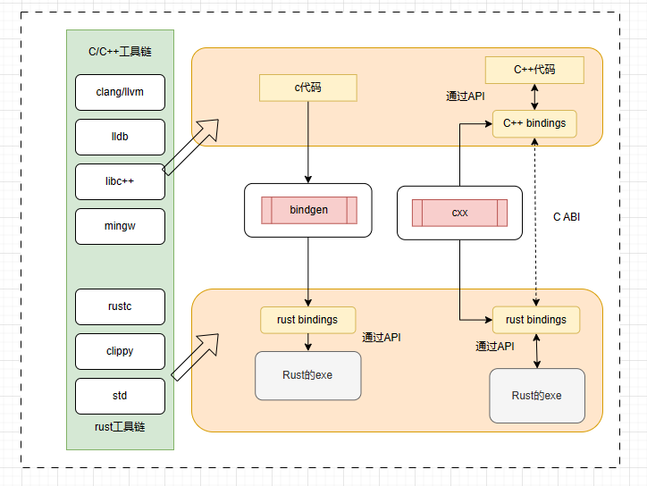
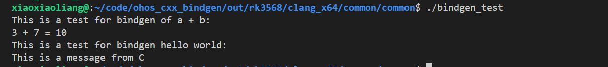
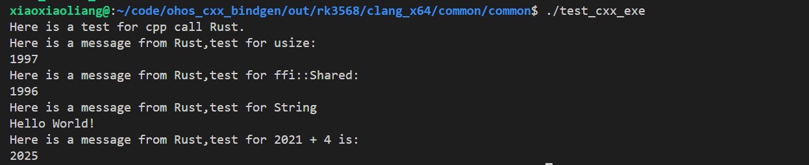
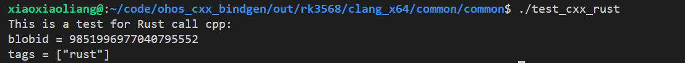

# 交互工具使用指导

## 概述

Bindgen和CXX工具的主要功能是实现Rust和C/C++之间的交互。其中，Bindgen通过将C接口转换为Rust接口来实现Rust对C的调用，CXX可以通过建立C接口和Rust接口的映射关系来实现C++和Rust的相互调用。



## Bindgen工具使用指导

### 操作步骤
下面是一个使用bindgen实现Rust调用C的示例。

1. 在C代码侧，使用头文件lib.h定义两个接口，接口FuncAAddB用来实现两数求和，接口SayHello用来打印字符串。

   ```c
   #ifndef BUILD_RUST_TESTS_BINDGEN_TEST_LIB_H_
   #define BUILD_RUST_TESTS_BINDGEN_TEST_LIB_H_
   #include <stdint.h>
   #include "build/rust/tests/test_bindgen_test/test_for_hello_world/lib2.h"
   
   uint32_t FuncAAddB(uint32_t a, uint32_t b);
   void SayHello(const char *message);
   
   #endif  //  BUILD_RUST_TESTS_BINDGEN_TEST_LIB_H_
   ```


2. 在lib.c中添加对两个接口的对应实现。

   ```c
   #include "build/rust/tests/test_bindgen_test/test_for_hello_world/lib.h"
   #include <stdint.h>
   #include <stdio.h>

   void SayHello(const char *message)
   {
       printf("This is a test for bindgen hello world:\n");
       printf("%s\n", message);
   }

   uint32_t FuncAAddB(uint32_t a, uint32_t b)
   {
       printf("This is a test for bindgen of a + b:\n");
       return a + b;
   }
   ```

3. 添加文件main.rs，就可以在Rust侧通过c_ffi实现对C侧的接口调用。注意Rust侧调用的不安全接口需要使用unsafe封装。

   ```rust
   //!  bindgen test for hello world
   #![allow(clippy::approx_constant)]
   mod c_ffi {
       #![allow(dead_code)]
       #![allow(non_upper_case_globals)]
       #![allow(non_camel_case_types)]
       include!(env!("BINDGEN_RS_FILE"));
   }
   /// pub fn add_two_numbers_in_c
   pub fn add_two_numbers_in_c(a: u32, b: u32) -> u32 {
       unsafe { c_ffi::FuncAAddB(a, b) }
   }

   use std::ffi::c_char;
   use std::ffi::CString;

   /// fn main()
   fn main() {
       println!("{} + {} = {}", 3, 7, add_two_numbers_in_c(3, 7));
       let c_str = CString::new("This is a message from C").unwrap();
       let c_world: *const c_char = c_str.as_ptr() as *const c_char;
       unsafe {
           c_ffi::SayHello(c_world);
       }
   }

   ```

4. 添加构建文件BUILD.gn，建立Rust模块对C模块的依赖。

   ```GN
   import("//build/ohos.gni")

   ohos_shared_library("c_lib") {
     sources = [ "lib.c" ]
     defines = [ "COMPONENT_IMPLEMENTATION" ]
   }

   rust_bindgen("c_lib_bindgen") {
     header = "lib.h"
   }

   ohos_rust_executable("bindgen_test") {
     deps = [ ":c_lib" ]
     deps += [ ":c_lib_bindgen" ]
     sources = [ "main.rs" ]
     bindgen_output = get_target_outputs(":c_lib_bindgen")
     inputs = bindgen_output
     rustenv = [ "BINDGEN_RS_FILE=" + rebase_path(bindgen_output[0]) ]
     crate_root = "main.rs"
   }
   ```

**调测验证**




## CXX工具使用指导

### C++调用Rust接口

1. 在Rust侧文件lib.rs里mod ffi写清楚需要调用的C++接口，并将接口包含在extern "Rust"里面，暴露给C++侧使用。

   ```rust
   //! #[cxx::bridge]
   #[cxx::bridge]
   mod ffi{
       #![allow(dead_code)]
       #[derive(Clone, Debug, PartialEq, Eq, PartialOrd, Ord)]
       struct Shared {
           z: usize,
       }
       extern "Rust"{
           fn print_message_in_rust();
           fn r_return_primitive() -> usize;
           fn r_return_shared() -> Shared;
           fn r_return_rust_string() -> String;
           fn r_return_sum(_: usize, _: usize) -> usize;
       }
   }

   fn print_message_in_rust(){
       println!("Here is a test for cpp call Rust.");
   }
   fn r_return_shared() -> ffi::Shared {
       println!("Here is a message from Rust,test for ffi::Shared:");
       ffi::Shared { z: 1996 }
   }
   fn r_return_primitive() -> usize {
       println!("Here is a message from Rust,test for usize:");
       1997
   }
   fn r_return_rust_string() -> String {
       println!("Here is a message from Rust,test for String");
       "Hello World!".to_owned()
   }
   fn r_return_sum(n1: usize, n2: usize) -> usize {
       println!("Here is a message from Rust,test for {} + {} is:",n1 ,n2);
       n1 + n2
   }

   ```

2. C++侧将cxx工具转换出来的lib.rs.h包含进来，就可以使用C++侧的接口。

   ```c++
   #include <iostream>
   #include "build/rust/tests/test_cxx/src/lib.rs.h"

   int main(int argc, const char* argv[])
   {
       int a = 2021;
       int b = 4;
       print_message_in_rust();
       std::cout << r_return_primitive() << std::endl;
       std::cout << r_return_shared().z << std::endl;
       std::cout << std::string(r_return_rust_string()) << std::endl;
       std::cout << r_return_sum(a, b) << std::endl;
       return 0;
   }
   ```

3. 添加构建文件BUILD.gn。rust_cxx底层调用CXX工具将lib.rs文件转换成lib.rs.h和lib.rs.cc文件，ohos_rust_static_ffi实现Rust侧源码的编译，ohos_executable实现C++侧代码的编译。

   ```
   import("//build/ohos.gni")
   import("//build/templates/rust/rust_cxx.gni")

   rust_cxx("test_cxx_exe_gen") {
       sources = [ "src/lib.rs" ]
   }

   ohos_rust_static_ffi("test_cxx_examp_rust") {
       sources = [ "src/lib.rs" ]
       deps = [ "//build/rust:cxx_rustdeps" ]
   }

   ohos_executable("test_cxx_exe") {
       sources = [ "main.cpp" ]
       sources += get_target_outputs(":test_cxx_exe_gen")

       include_dirs = [ "${target_gen_dir}" ]
       deps = [
       ":test_cxx_examp_rust",
       ":test_cxx_exe_gen",
       "//build/rust:cxx_cppdeps",
       ]
   }
   ```

**调测验证**



### Rust调用C++

1. 添加头文件client_blobstore.h。

   ```c++
   #ifndef BUILD_RUST_TESTS_CLIENT_BLOBSTORE_H
   #define BUILD_RUST_TESTS_CLIENT_BLOBSTORE_H
   #include <memory>
   #include "third_party/rust/cxx/include/cxx.h"

   namespace nsp_org {
   namespace nsp_blobstore {
   struct MultiBufs;
   struct Metadata_Blob;

   class client_blobstore {
   public:
       client_blobstore();
       uint64_t put_buf(MultiBufs &buf) const;
       void add_tag(uint64_t blobid, rust::Str add_tag) const;
       Metadata_Blob get_metadata(uint64_t blobid) const;

   private:
       class impl;
       std::shared_ptr<impl> impl;
   };

   std::unique_ptr<client_blobstore> blobstore_client_new();
   } // namespace nsp_blobstore
   } // namespace nsp_org
   #endif
   ```

2. 添加cpp文件client_blobstore.cpp。

   ```c++
   #include <algorithm>
   #include <functional>
   #include <set>
   #include <string>
   #include <unordered_map>
   #include "src/main.rs.h"
   #include "build/rust/tests/test_cxx_rust/include/client_blobstore.h"

   namespace nsp_org {
   namespace nsp_blobstore {
   // Toy implementation of an in-memory nsp_blobstore.
   //
   // In reality the implementation of client_blobstore could be a large complex C++
   // library.
   class client_blobstore::impl {
       friend client_blobstore;
       using Blob = struct {
           std::string data;
           std::set<std::string> tags;
       };
       std::unordered_map<uint64_t, Blob> blobs;
   };

   client_blobstore::client_blobstore() : impl(new class client_blobstore::impl) {}

   // Upload a new blob and return a blobid that serves as a handle to the blob.
   uint64_t client_blobstore::put_buf(MultiBufs &buf) const
   {
       std::string contents;

       // Traverse the caller's res_chunk iterator.
       //
       // In reality there might be sophisticated batching of chunks and/or parallel
       // upload implemented by the nsp_blobstore's C++ client.
       while (true) {
           auto res_chunk = next_chunk(buf);
           if (res_chunk.size() == 0) {
           break;
           }
           contents.append(reinterpret_cast<const char *>(res_chunk.data()), res_chunk.size());
       }

       // Insert into map and provide caller the handle.
       auto res = std::hash<std::string> {} (contents);
       impl->blobs[res] = {std::move(contents), {}};
       return res;
   }

   // Add add_tag to an existing blob.
   void client_blobstore::add_tag(uint64_t blobid, rust::Str add_tag) const
   {
       impl->blobs[blobid].tags.emplace(add_tag);
   }

   // Retrieve get_metadata about a blob.
   Metadata_Blob client_blobstore::get_metadata(uint64_t blobid) const
   {
       Metadata_Blob get_metadata {};
       auto blob = impl->blobs.find(blobid);
       if (blob != impl->blobs.end()) {
           get_metadata.size = blob->second.data.size();
           std::for_each(blob->second.tags.cbegin(), blob->second.tags.cend(),
               [&](auto &t) { get_metadata.tags.emplace_back(t); });
       }
       return get_metadata;
   }

   std::unique_ptr<client_blobstore> blobstore_client_new()
   {
       return std::make_unique<client_blobstore>();
   }
   } // namespace nsp_blobstore
   } // namespace nsp_org

   ```

3. main.rs文件，在main.rs文件的ffi里面，通过宏include!将头文件client_blobstore.h引入进来，从而在Rust的main函数里面就可以通过ffi的方式调用C++的接口。

   ```rust
   //! test_cxx_rust
   #[cxx::bridge(namespace = "nsp_org::nsp_blobstore")]
   mod ffi {
       // Shared structs with fields visible to both languages.
       struct Metadata_Blob {
           size: usize,
           tags: Vec<String>,
       }

       // Rust types and signatures exposed to C++.
       extern "Rust" {
           type MultiBufs;

           fn next_chunk(buf: &mut MultiBufs) -> &[u8];
       }

       // C++ types and signatures exposed to Rust.
       unsafe extern "C++" {
           include!("build/rust/tests/test_cxx_rust/include/client_blobstore.h");

           type client_blobstore;

           fn blobstore_client_new() -> UniquePtr<client_blobstore>;
           fn put_buf(&self, parts: &mut MultiBufs) -> u64;
           fn add_tag(&self, blobid: u64, add_tag: &str);
           fn get_metadata(&self, blobid: u64) -> Metadata_Blob;
       }
   }

   // An iterator over contiguous chunks of a discontiguous file object.
   //
   // Toy implementation uses a Vec<Vec<u8>> but in reality this might be iterating
   // over some more complex Rust data structure like a rope, or maybe loading
   // chunks lazily from somewhere.
   /// pub struct MultiBufs
   pub struct MultiBufs {
       chunks: Vec<Vec<u8>>,
       pos: usize,
   }
   /// pub fn next_chunk
   pub fn next_chunk(buf: &mut MultiBufs) -> &[u8] {
       let next = buf.chunks.get(buf.pos);
       buf.pos += 1;
       next.map_or(&[], Vec::as_slice)
   }

   /// fn main()
   fn main() {
       let client = ffi::blobstore_client_new();

       // Upload a blob.
       let chunks = vec![b"fearless".to_vec(), b"concurrency".to_vec()];
       let mut buf = MultiBufs { chunks, pos: 0 };
       let blobid = client.put_buf(&mut buf);
       println!("This is a test for Rust call cpp:");
       println!("blobid = {}", blobid);

       // Add a add_tag.
       client.add_tag(blobid, "rust");

       // Read back the tags.
       let get_metadata = client.get_metadata(blobid);
       println!("tags = {:?}", get_metadata.tags);
   }
   ```

4. 添加构建文件BUILD.gn。使用CXX将main.rs转换成lib.rs.h和lib.rs.cc，同时将产物作为test_cxx_rust_staticlib的源码，编译Rust源码main.rs并将test_cxx_rust_staticlib依赖进来。

   ```
   import("//build/ohos.gni")

   rust_cxx("test_cxx_rust_gen") {
     sources = [ "src/main.rs" ]
   }

   ohos_static_library("test_cxx_rust_staticlib") {
     sources = [ "src/client_blobstore.cpp" ]
     sources += get_target_outputs(":test_cxx_rust_gen")
     include_dirs = [
       "${target_gen_dir}",
       "//third_party/rust/cxx/v1/crate/include",
       "include",
     ]
     deps = [
       ":test_cxx_rust_gen",
       "//build/rust:cxx_cppdeps",
     ]
   }

   ohos_rust_executable("test_cxx_rust") {
     sources = [ "src/main.rs" ]
     deps = [
       ":test_cxx_rust_staticlib",
       "//build/rust:cxx_rustdeps",
     ]
   }
   ```

**调测验证**
