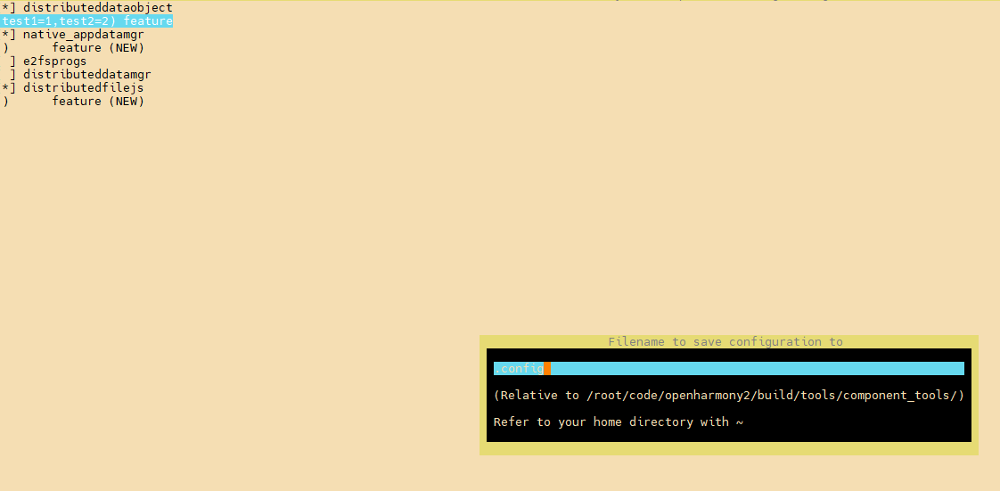

# 编译构建Kconfig可视化配置指导

## 概述

### 功能简介
该功能基于[Kconfiglib](https://github.com/ulfalizer/Kconfiglib)与[Kconfig]( https://www.kernel.org/doc/html/latest/kbuild/kconfig-language.html#introduction)实现，方便用户个性化配置OpenHarmony产品子系统部件。

基于Kconfig实现的可视化配置功能具有以下优点：

- 能直观且全面地展示软件的部件选项。
- 可靠性强，如Linux-kernel、buildroot等知名软件都采用Kconfig进行可视化配置。

### 基本概念

- [Kconfig]( https://www.kernel.org/doc/html/latest/kbuild/kconfig-language.html#introduction) ：是一款Linux可视化配置文件格式。

- [Kconfiglib](https://github.com/ulfalizer/Kconfiglib)：是一款基于Kconfig格式实现的Linux可视化配置工具。

### 相关模块

- [Kconfig更新模块](https://gitee.com/openharmony/build/blob/master/tools/component_tools/generate_kconfig.py)：用于更新Kconfig菜单栏目最新的部件信息列表。

- [config配置格式转换](https://gitee.com/openharmony/build/blob/master/tools/component_tools/parse_kconf.py)：用于将界面生成的config文件，转化为系统编译构建的标准化格式配置文件。

## 操作指导

1. 获取源码

   OpenHarmony版本发布的源码获取请参考：[源码获取教程](../get-code/sourcecode-acquire.md)

2. 环境准备

   环境配置所需要的Kconfiglib已内置在OpenHarmony自带的hb工具中，如需安装hb工具，可参考：[hb安装教程](../quick-start/quickstart-pkg-install-tool.md#安装hb)

3. 开启可视化配置界面

   ```shell
   #进入build仓下目录
   cd build/tools/component_tools
   menuconfig kconfig
   ```

   

4. 参数填写

   参数配置项可以参考：productdefine/common/base/base_product.json

   

5. 选择部件并配置

   1. 点击方向键->选择子系统，进入子系统的部件列表。

   2. 按回车健选择子系统。

   3. 输入`feature`时，注意用英语逗号隔开多项输入。

      

6. 保存所选配置

   按S键保存文件，可自定义输出文件名，默认为当前目录下`.config`文件。

   

7. 生成OpenHarmony Style配置文件

   示例步骤：

   1. gn编译全量产品

      ```shell
      cp productdefine/common/base/base_product.json productdefine/common/products/ohos-arm64.json
      ./build.sh --product-name ohos-arm64  --build-only-gn --ccache --gn-args pycache_enable=true --gn-args check_deps=true --build-only-gn
      ```

   2. 生成部件依赖文件

      ```shell
      ./build/tools/module_dependence/part_deps.py --deps-files-path out/arm64/deps_files
      # output: out/arm64/part_deps_info/part_deps_info.json
      ```

   3. 生成OpenHarmony Style配置文件

      ```shell
      cd build/tools/component_tools
      python3 parse_kconf.py --deps=/path/to/out/arm64/part_deps_info/part_deps_info.json
      ```

      输出文件默认为当前目录下：`product.json`， 也可以使用`python3 parse_kconf.py --out="example/out.json"`来指定输出文件位置

      更多操作可查看`python3 parse_kconf.py -h`

​	

## 常见问题

### 菜单列表缺失最新部件信息

由于产品不断的更新迭代，全量部件列表productdefine/common/base/base_product.json也会随之不断更新，从而导致Kconfig菜单缺少最新部件。

解决办法：

更新[Kconfig文件](https://gitee.com/openharmony/build/blob/master/tools/component_tools/kconfig)

```shell
cd build/tools/component_tools
python3 generate_kconfig.py
```

更多选项通过`python3 generate_kconfig.py -h`查看。

