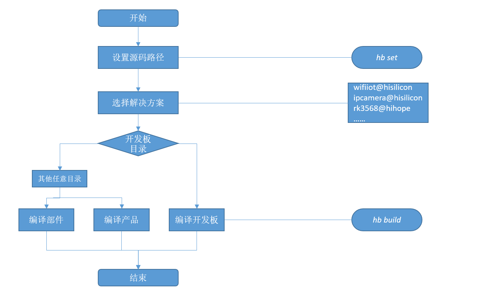

# 轻量和小型系统编译构建指导

## 概述

  一个基于gn和ninja的构建系统，以支持OpenHarmony部件化开发为目标，提供以下基本功能：

- 支持按部件拼装产品并编译。

- 独立构建芯片解决方案厂商源码。

- 独立构建单个部件。

### 基本概念

在使用编译构建子系统前，应了解如下基本概念：

- 子系统  
  子系统是一个逻辑概念，它由一个或多个具体的部件组成。OpenHarmony整体遵从分层设计，从下向上依次为：内核层、系统服务层、框架层和应用层。系统功能按照“系统 &gt; 子系统 &gt; 部件”逐级展开，在多设备部署场景下，支持根据实际需求裁剪某些非必要的子系统或部件。

- 部件  
  系统最小的可复用、可配置、可裁剪的功能单元。部件具备目录独立可并行开发、可独立编译、可独立测试的特征。

- gn  
  Generate ninja的缩写，用于产生ninja文件。

- ninja  
  ninja是一个专注于速度的小型构建系统。

- hb  
  OpenHarmony的命令行工具，用来执行编译命令。

### 目录结构

```
build/lite
├── components                  # 部件描述文件
├── figures                     # readme中的图片
├── hb                          # hb pip安装包源码
├── make_rootfs                 # 文件系统镜像制作脚本
├── config                      # 编译配置项
│   ├── component               # 部件相关的模板定义
│   ├── kernel                  # 内核相关的编译配置
│   └── subsystem               # 子系统编译配置
├── platform                    # ld脚本
├── testfwk                     # 测试编译框架
└── toolchain                   # 编译工具链配置，包括：编译器路径、编译选项、链接选项等
```

### 构建流程

编译构建流程如下图所示，主要分设置和编译两步：

  **图1** 编译构建流程

  

1. hb set: 设置OpenHarmony源码目录和要编译的产品。

2. hb build: 编译产品、开发板或者部件。编译主要过程如下：
   
   1. 读取编译配置：根据产品选择的开发板，读取开发板config.gni文件内容，主要包括编译工具链、编译链接命令和选项等。
   2. 调用gn：调用gn gen命令，读取产品配置生成产品解决方案out目录和ninja文件。
   3. 调用ninja：调用ninja -C out/board/product启动编译。
   4. 系统镜像打包：将部件编译产物打包，设置文件属性和权限，制作文件系统镜像。

## 配置规则

为了实现芯片解决方案、产品解决方案与OpenHarmony是解耦的、可插拔的，部件、芯片解决方案和产品解决方案的路径、目录树和配置需遵循一定的规则，具体如下：

### 部件

  部件源码路径命名规则为：**{领域}/{子系统}/{部件}**，部件目录树规则如下：

>  **注意：**
> 部件的名称、源码路径、功能简介、是否必选、编译目标、RAM、ROM、编译输出、已适配的内核、可配置的特性和依赖等属性定义在build/lite/components目录下对应子系统的json文件中，新增部件时需要在对应子系统json文件中添加相应的部件定义。产品所配置的部件必须在某个子系统中被定义过，否则会校验失败。

```
component
├── interfaces
│   ├── innerkits  # 系统内接口，部件间使用
│   └── kits       # 应用接口，应用开发者使用
├── frameworks     # framework实现
├── services       # service实现
└── BUILD.gn       # 部件编译脚本
```

  以泛sensor子系统的sensor服务部件为例，部件属性定义描述文件字段说明如下：

 ```
 {
     "name": "@ohos/sensor_lite",		                          # HPM部件英文名称，格式"@组织/部件名称"
     "description": "Sensor services",		                          # 部件功能一句话描述	
     "version": "3.1",			                                  # 版本号，版本号与OpenHarmony版本号一致
     "license": "MIT",			                                  # 部件License
     "publishAs": "code-segment",		                          # HPM包的发布方式，当前默认都为code_segment
     "segment": {										
         "destPath": ""			
     },					                                  # 发布类型为code_segment时为必填项，定义发布类型code_segment的代码还原路径（源码路径）			
     "dirs": {"base/sensors/sensor_lite"},	                          # HPM包的目录结构，字段必填内容可以留空
     "scripts": {},			                                  # HPM包定义需要执行的脚本，字段必填，值非必填
     "licensePath": "COPYING",			
     "readmePath": {
         "en": "README.rst"
     },
     "component": {			                                  # 部件属性
         "name": "sensor_lite",			                          # 部件名称		
         "subsystem": "",		                                  # 部件所属子系统
         "syscap": [],				                          # 部件为应用提供的系统能力
         "features": [],                                                  # 部件对外的可配置特性列表，一般与build中的sub_component对应，可供产品配置
         "adapted_system_type": [],		                          # 轻量(mini)小型(small)和标准(standard)，可以是多个
         "rom": "92KB",                                                   # 部件ROM值
         "ram": "~200KB",                                                 # 部件RAM估值       
         "deps": {                      
         "components": [                                                  # 部件依赖的其他部件
           "samgr_lite",
           "ipc_lite"
         ],
         "third_party": [                                                 # 部件依赖的三方开源软件
           "bounds_checking_function"
         ]
       }         
         "build": {				                          # 编译相关配置
             "sub_component": [
                 ""//base/sensors/sensor_lite/services:sensor_service"",  # 部件编译入口
             ],			                                          # 部件编译入口，模块在此处配置
             "inner_kits": [],						  # 部件间接口
             "test": []							  # 部件测试用例编译入口
         }
     }
  }
  ```

  部件BUILD.gn的编写建议如下：

- 编译目标名称与部件一致。

- 部件对外可配置的特性变量需声明在该部件BUILD.gn中，特性变量命名规则：ohos_{subsystem}_{component}_{feature}。特性在部件描述中也需要同步定义，在产品配置文件config.json中按需配置。

- 宏定义规则：OHOS_{SUBSYSTEM}_{COMPONENT}_{FEATURE}
  
  >  **说明：**
  > 部件的编译脚本语言为gn，gn的基本用法请见[gn快速入门](https://gn.googlesource.com/gn/+/master/docs/quick_start.md)。部件即为gn定义的编译目标，可以为静态库、动态库、可执行文件或group。
  
  以图形的UI部件为例，foundation/graphic/ui/BUILD.gn文件如下：

   ```
    # 声明部件可配置的特性
    declare_args() {
      enable_ohos_graphic_ui_animator = false # 动效特性开关
      ohos_ohos_graphic_ui_font = "vector"    # 可配置的字体类型，vector或者bitmap
    }

    # 部件基础功能
    shared_library("base") {
      sources = [
        ......
      ]
      include_dirs = [
        ......
      ]
    }

    # 仅在animator开启时编译
    if(enable_ohos_graphic_ui_animator ) { 
      shared_library("animator") {
        sources = [
          ......
        ]
        include_dirs = [
              ......
        ]
        deps = [ :base ]
      }
    }
    ......
    # target名称建议与部件名称一致, 部件target类型可以是executable(bin文件)，shared_library(动态库.so)，static_library(静态库.a)，group等等
    executable("ui") {
      deps = [
        ":base"
      ]

      # animator特性由产品配置
      if(enable_ohos_graphic_ui_animator ) {
          deps += [
            "animator"
          ]
      }
    }
   ```

### 芯片解决方案

- 芯片解决方案是指基于某款开发板的完整解决方案，包含驱动、设备侧接口适配、开发板sdk等。

- 芯片解决方案是一个特殊的部件，源码路径规则为：**device/{开发板}/{芯片解决方案厂商}**。

- 芯片解决方案部件会随产品选择的开发板默认编译。
  
- 芯片解决方案目录树规则如下：

  ```
  device                                      
  └── board                         # 芯片解决方案厂商
      └── company                       # 开发板名称
          ├── BUILD.gn                # 编译脚本
          ├── hals                    # OS南向接口适配
          ├── linux                   # 可选，linux内核版本
          │   └── config.gni          # linux版本编译配置
          └── liteos_a                # 可选，liteos内核版本
               └── config.gni          # liteos_a版本编译配置
  ```

  >  **说明：**
  > config.gni为开发板编译相关的配置，编译时会采用该配置文件中的参数编译所有OS部件，编译阶段系统全局可见。

- config.gni的关键字段介绍如下：

  ```
  kernel_type:            开发板使用的内核类型，例如：“liteos_a”, “liteos_m”, “linux”。
  kernel_version:         开发使用的内核版本，例如：“4.19”。
  board_cpu:              开发板CPU类型，例如：“cortex-a7”, “riscv32”。
  board_arch:             开发芯片arch, 例如： “armv7-a”, “rv32imac”。
  board_toolchain:        开发板自定义的编译工具链名称，例如：“gcc-arm-none-eabi”。若为空，则使用默认为ohos-clang。
  board_toolchain_prefix：编译工具链前缀，例如：“gcc-arm-none-eabi”。
  board_toolchain_type：  编译工具链类型，目前支持gcc和clang。例如：“gcc” ，“clang”。
  board_cflags：          开发板配置的c文件编译选项。
  board_cxx_flags：       开发板配置的cpp文件编译选项。
  board_ld_flags：        开发板配置的链接选项。
  ```

### 产品解决方案

产品解决方案为基于开发板的完整产品，主要包含产品对OS的适配、部件拼装配置、启动配置和文件系统配置等。产品解决方案的源码路径规则为：**vendor/{产品解决方案厂商}/{产品名称}**_。_产品解决方案也是一个特殊的部件。

产品解决方案的目录树规则如下：

```
vendor                              
└── company                         # 产品解决方案厂商
    ├── product                     # 产品名称
    │   ├── init_configs
    │   │     ├── etc               # init进程启动配置（可选，仅linux内核需要）
    │   │     └── init.cfg          # 系统服务启动配置
    │   ├── hals                    # 产品解决方案OS适配
    │   ├── BUILD.gn                # 产品编译脚本
    │   └── config.json             # 产品配置文件
    │   └── fs.yml                  # 文件系统打包配置
    └── ......
```

>  **注意：**
> **新增产品须按如上的规则创建目录和文件，编译构建系统将按该规则扫描已配置的产品。**

关键的目录和文件详细介绍如下：

1. **vendor/company/product/init_configs/etc**
   该文件夹中包含rcS脚本，Sxxx脚本和fstab脚本。init进程在启动系统服务之前执行这些脚本。执行的流程为“rcS-&gt;fstab-&gt;S00-xxx“。Sxxx脚本中的内容与开发板和产品需要有关，主要包括设备节点的创建、创建目录、扫描设备节点、修改文件权限等等。这些文件在产品编译的BUILD.gn中按需拷贝到产品out目录中，最终打包到rootfs镜像中。

2. **vendor/company/product/init_configs/init.cfg**
   init进程启动服务的配置文件，当前支持解析的命令有：
   
   - start:  启动某个服务
   
   - mkdir: 创建文件夹
   
   - chmod: 修改指定路径/文件的权限
   
   - chown: 修改指定路径/文件的属组
   
   - mount: 挂载命令
     
     该文件中的各个字段的解释如下：
   
   ```
   {
       "jobs" : [{                                                     # job数组，一个job对应一个命令集合。job的执行顺序：pre-init -> init -> post-init。
               "name" : "pre-init",
               "cmds" : [
                   "mkdir /storage/data",                              # 创建目录
                   "chmod 0755 /storage/data",                         # 修改权限，权限值的格式为0xxx, 如0755
                   "mkdir /storage/data/log",
                   "chmod 0755 /storage/data/log",
                   "chown 4 4 /storage/data/log",                      # 修改属组，第一个数字为uid, 第二个数字为gid
                   ......
                   "mount vfat /dev/mmcblock0 /sdcard rw,umask=000"    # 挂载，格式为： mount [文件系统类型] [source] [target] [flags] [data]
                                                                       # 其中flags仅支持：nodev、noexec、nosuid和rdonly
               ]
           }, {
               "name" : "init",
               "cmds" : [                                              # 按cmds数组顺序启动启动服务
                   "start shell",                                      # 注意：start与服务名称之间有且只有一个空格
                   ......
                   "start service1"
               ]
           }, {
               "name" : "post-init",                                   # 最后执行的job, init进程启动完成后的处理（如驱动初始化后再mount设备）
               "cmds" : []
           }
       ],
       "services" : [{                                                 # service数组，一个service对应一个进程
               "name" : "shell",                                       # 服务名称
               "path" : ["/sbin/getty", "-n", "-l", "/bin/sh", "-L", "115200", "ttyS000", "vt100"],    # 可执行文件全路径，path必须为第一个元素
               "uid" : 0,                                              # 进程的uid，须与二进制文件的uid保持一致
               "gid" : 0,                                              # 进程的gid，须与二进制文件的gid保持一致
               "once" : 0,                                             # 是否为一次性进程，1：进程退出后，init不在重新拉起。0：常驻进程，进程若退出，init将重新拉起
               "importance" : 0,                                       # 是否为关键进程，1：是关键进程，若进程退出，init将会重启单板。0：非关键进程，若进程退出，init不会重启单板
               "caps" : [4294967295]
           }, 
           ......
       ]
   }
   ```

3. **vendor/company/product/init_configs/hals**
   解决方案厂商对OS的适配，需要实现的接口请见各个部件的readme说明文档。

4. **vendor/company/product/config.json**
   config.json为编译构建的主入口，包含了开发板、OS部件和内核等配置信息。
   
   以基于hispark_taurus开发板的ipcamera产品为例，配置文件如下：

   ```
   {
        "product_name": "ipcamera",                       # 产品名称
        "version": "3.0",                                 # config.json的版本号, 固定"3.0"
        "type": "small",                                  # 系统类型, 可选[mini, small, standard]
        "ohos_version": "OpenHarmony 1.0",                # 选择的OS版本
        "device_company": "hisilicon",                    # 芯片厂商
        "board": "hispark_taurus",                        # 开发板名称
        "kernel_type": "liteos_a",                        # 选择的内核类型
        "kernel_version": "3.0.0",                        # 选择的内核版本
        "subsystems": [                            
          {
            "subsystem": "aafwk",                         # 选择的子系统
            "components": [
              { "component": "ability", "features":[ "enable_ohos_appexecfwk_feature_ability = true" ] }   # 选择的部件和部件特性配置
            ]
          },
          {
           ......
          }
         ......
         更多子系统和部件
        }
    }
    ```

5. **vendor/company/product/fs.yml**
   该文件用于配置文件系统镜像制作过程，将编译产物打包成文件系统镜像，比如用户态根文件系统rootfs.img和可读写的userfs.img。它由多个列表组成，每个列表对应一个文件系统。字段说明如下：

   ```
   fs_dir_name： 必填，声明文件系统文件名, 如rootfs、userfs
   fs_dirs：     选填，配置out下文件目录与文件系统文件目录的映射关系，每个文件目录对应一个列表
   source_dir：  选填，out下目标文件目录，若缺失则将根据target_dir在文件系统下创建空目录
   target_dir：  必填，文件系统下对应文件目录
   ignore_files：选填，声明拷贝忽略文件
   dir_mode：    选填，文件目录权限，默认755
   file_mode：   选填，该文件目录下所有文件的权限，默认555
   fs_filemode： 选填，配置需要特殊声明权限的文件，每个文件对应一个列表
   file_dir：    必填，文件系统下具体文件路径
   file_mode：   必填，文件权限声明
   fs_symlink：  选填，配置文件系统软连接
   fs_make_cmd： 必填，配置需要制作文件系统脚本，OS提供的脚本在build/lite/make_rootfs下, 支持linux，liteos内核和ext4、jffs2、vfat格式。也支持芯片解决方案厂商自定义。   
   fs_attr：     选填，根据配置项动态调整文件系统
   ```

   其中fs_symlink、fs_make_cmd字段支持以下变量：

   - ${root_path}
   代码根目录，对应gn的${ohos_root_path}

   - ${out_path}
   产品out目录，对应gn的${root_out_dir}

   - ${fs_dir}
   文件系统目录，由以下变量拼接而成
  
   - ${root_path}
   - ${fs_dir_name}
  
  >  **说明：**
  > fs.yml是可选的，对于没有文件系统的设备可不配置。
6. **vendor/company/product/BUILD.gn**
   产品编译的入口，主要用于编译解决方案厂商源码和拷贝启动配置文件。如果某个产品被选择为要编译的产品，那么对应产品目录下的BUILD.gn会默认编译。一个典型的产品编译BUILD.gn应该如下：

   ```
   group("product") { # target名称需与product名称即三级目录名称一致
     deps = []
     # 拷贝init配置
     deps += [ "init_configs" ]
     # 其他
     ......
   }
   ```

## 使用指导

### 前提条件

开发环境需安装gn、ninja构建工具、python 3.9.2及以上和hb。安装方法请见[搭建基础环境](../quick-start/quickstart-lite-env-setup.md)。

### hb工具使用说明

hb是OpenHarmony的命令行工具，用来执行编译命令。以下对hb的常用命令进行说明。

  **hb set**

```
hb set -h
usage: hb set [-h] [-root [ROOT_PATH]] [-p]

optional arguments:
  -h, --help            show this help message and exit
  -root [ROOT_PATH], --root_path [ROOT_PATH]
                        Set OHOS root path
  -p, --product         Set OHOS board and kernel
```

- hb set 后无参数，进入默认设置流程

- hb set -root dir可直接设置代码根目录

- hb set -p设置要编译的产品

**hb env**

查看当前设置信息

```
hb env
[OHOS INFO] root path: xxx
[OHOS INFO] board: hispark_taurus
[OHOS INFO] kernel: liteos
[OHOS INFO] product: ipcamera
[OHOS INFO] product path: xxx/vendor/hisilicon/ipcamera
[OHOS INFO] device path: xxx/device/hisilicon/hispark_taurus/sdk_linux_4.19
```

  **hb build**

```
hb build -h
usage: hb build [-h] [-b BUILD_TYPE] [-c COMPILER] [-t [TEST [TEST ...]]] [-cpu TARGET_CPU] [--dmverity] [--tee]
                [-p PRODUCT] [-f] [-n] [-T [TARGET [TARGET ...]]] [-v] [-shs] [--patch] [--compact-mode]
                [--gn-args GN_ARGS] [--keep-ninja-going] [--build-only-gn] [--log-level LOG_LEVEL] [--fast-rebuild]
                [--device-type DEVICE_TYPE] [--build-variant BUILD_VARIANT]
                [component [component ...]]

positional arguments:
  component             name of the component, mini/small only

optional arguments:
  -h, --help            show this help message and exit
  -b BUILD_TYPE, --build_type BUILD_TYPE
                        release or debug version, mini/small only
  -c COMPILER, --compiler COMPILER
                        specify compiler, mini/small only
  -t [TEST [TEST ...]], --test [TEST [TEST ...]]
                        compile test suit
  -cpu TARGET_CPU, --target-cpu TARGET_CPU
                        select cpu
  --dmverity            enable dmverity
  --tee                 Enable tee
  -p PRODUCT, --product PRODUCT
                        build a specified product with {product_name}@{company}
  -f, --full            full code compilation
  -n, --ndk             compile ndk
  -T [TARGET [TARGET ...]], --target [TARGET [TARGET ...]]
                        compile single target
  -v, --verbose         show all command lines while building
  -shs, --sign_haps_by_server
                        sign haps by server
  --patch               apply product patch before compiling
  --compact-mode        compatible with standard build system set to false if we use build.sh as build entrance
  --gn-args GN_ARGS     specifies gn build arguments, eg: --gn-args="foo="bar" enable=true blah=7"
  --keep-ninja-going    keeps ninja going until 1000000 jobs fail
  --build-only-gn       only do gn parse, donot run ninja
  --log-level LOG_LEVEL
                        specifies the log level during compilationyou can select three levels: debug, info and error
  --fast-rebuild        it will skip prepare, preloader, gn_gen steps so we can enable it only when there is no change
                        for gn related script
  --device-type DEVICE_TYPE
                        specifies device type
  --build-variant BUILD_VARIANT
                        specifies device operating mode
```

- hb build后无参数，会按照设置好的代码路径、产品进行编译，编译选项使用与之前保持一致。-f 选项将删除当前产品所有编译产品，等同于hb clean + hb build.

- hb build {component_name}：基于设置好的产品对应的单板、内核，单独编译部件（e.g.：hb build kv_store)。

- hb build -p ipcamera\@hisilicon：免set编译产品，该命令可以跳过set步骤，直接编译产品。

- 在device/board/device_company下单独执行hb build会进入内核选择界面，选择完成后会根据当前路径的单板、选择的内核编译出仅包含内核、驱动的镜像。

**hb clean**

清除out目录对应产品的编译产物，仅保留args.gn、build.log。清除指定路径可输入路径参数：hb clean out/board/product，默认将清除当前hb set的产品对应out路径。

```
hb clean
usage: hb clean [-h] [out_path]

positional arguments:
  out_path    clean a specified path.

optional arguments:
  -h, --help  show this help message and exit
```

### 新增部件

本小节介绍如何新增一个部件，首先确定部件归属的子系统和部件名称，然后按如下步骤新增：

1. 源码开发完成后，添加部件编译脚本。
   
   以编译部件hello_world可执行文件为例，applications/sample/hello_world/BUILD.gn可以写为：

   ```
   executable("hello_world") {
     include_dirs = [
       "include",
      ]
     sources = [
       "src/hello_world.c"
     ]
   }
   ```

   如上编译脚本，可编译出一个可在OpenHarmony上运行的名为hello_world的可执行文件。

   单独编译该部件，hb set任意选择一款产品，然后使用-T选项单独编译部件：

   ```
   hb build -f -T //applications/sample/hello_world
   ```

   部件在开发板上功能验证完成后，可按步骤2-4将部件配置到产品中。

2. 添加部件描述。
   
   部件描述位于build/lite/components下，新增的部件需加入对应子系统的json文件中。一个部件描述必选的字段有：
   
   - component：部件名称。
   - description：部件的一句话功能描述。
   - optional：部件是否为系统可选。
   - dirs：部件源码路径。
   - targets：部件编译入口。
   
   以将hello_world部件加入应用子系统为例，在applications.json中添加hello_world对象：

   ```
   {
     "components": [
       {
         "component": "hello_world",
         "description": "Hello world.",
         "optional": "true",
         "dirs": [
           "applications/sample/hello_world"
         ],
         "targets": [
           "//applications/sample/hello_world"
         ]
       },
       ...
      ]
   }
   ```

3. 将部件配置到产品。
   
   产品的配置文件config.json位于vendor/company/product/下，产品配置文件需包含产品名称、OpenHarmony版本号、device厂商、开发板、内核类型、内核版本号，以及配置的子系统和部件。以将hello_world部件加入产品配置文件my_product.json中为例，加入hello_world对象：

   ```
   {
       "product_name": "hello_world_test",
       "ohos_version": "OpenHarmony 1.0",
       "device_company": "hisilicon",
       "board": "hispark_taurus",
       "kernel_type": "liteos_a",
       "kernel_version": "1.0.0",
       "subsystems": [
         {
           "subsystem": "applications",
           "components": [
             { "component": "hello_world", "features":[] }
           ]
         },
         ...
       ]
   }
   ```

4. 编译产品。
   
   1. 代码根目录输入hb set选择对应产品。
   
   2. 执行hb build。

### 新增芯片解决方案

编译构建支持添加新的芯片解决方案厂商，具体步骤如下：

1. 创建芯片解决方案目录。
   按照[芯片解决方案配置规则](#配置规则)创建目录，以芯片厂商realtek的“rtl8720“开发板为例, 在代码根目录执行：

   ```
   mkdir -p device/board/realtek/rtl8720
   ```

2. 创建内核适配目录，并编写开发板编译配置config.gni文件。
     以realtek的“rtl8720“开发板的liteos_a适配为例，device/board/realtek/rtl8720/liteo_a/config.gni的内容如下：
   
   ```
   # Kernel type, e.g. "linux", "liteos_a", "liteos_m".
   kernel_type = "liteos_a"
   
   # Kernel version.
   kernel_version = "3.0.0"
   
   # Board CPU type, e.g. "cortex-a7", "riscv32".
   board_cpu = "real-m300"
   
   # Board arch, e.g. "armv7-a", "rv32imac".
   board_arch = ""
   
   # Toolchain name used for system compiling.
   # E.g. gcc-arm-none-eabi, arm-linux-harmonyeabi-gcc, ohos-clang, riscv32-unknown-elf.
   # Note: The default toolchain is "ohos-clang". It's not mandatory if you use the default toochain.
   board_toolchain = "gcc-arm-none-eabi"
   
   # The toolchain path instatlled, it's not mandatory if you have added toolchian path to your ~/.bashrc.
   board_toolchain_path =
       rebase_path("//prebuilts/gcc/linux-x86/arm/gcc-arm-none-eabi/bin",
                   root_build_dir)
   
   # Compiler prefix.
   board_toolchain_prefix = "gcc-arm-none-eabi-"
   
   # Compiler type, "gcc" or "clang".
   board_toolchain_type = "gcc"
   
   # Board related common compile flags.
   board_cflags = []
   board_cxx_flags = []
   board_ld_flags = []
   ```

3. 编写编译脚本。
     在开发板目录下创建BUILD.gn，target名称应与开发板名称一致。以realtek的rtl8720开发板为例，device/board/realtek/rtl8720/BUILD.gn内容可以是：
   
   ```
   group("rtl8720") { # target类型也可以shared_library, static_library, executable
     # 具体内容
     ......
   }
   ```

4. 编译芯片解决方案。
   在开发板目录下执行hb build，即可启动芯片解决方案的编译。

### 新增产品解决方案

编译构建支持芯片解决方案和部件的灵活拼装，形成定制化的产品解决方案。具体步骤如下：

1. 创建产品目录
   按照[产品解决方案配置规则](#配置规则)创建产品目录，以基于“rtl8720“开发板的wifiiot模组为例，在代码根目录执行：

   ```
   mkdir -p vendor/my_company/wifiiot
   ```

2. 拼装产品
     在新建的产品目录下新建config.json文件，以步骤1中的wifiiot为例，vendor/my_company/wifiiot/config.json可以是：
   
   ```
   {
       "product_name": "wifiiot",                        # 产品名称
       "version": "3.0",                                 # config.json的版本号, 固定"3.0"
       "type": "small",                                  # 系统类型, 可选[mini, small, standard]
       "ohos_version": "OpenHarmony 1.0",                # 使用的OS版本
       "device_company": "realtek",                      # 芯片解决方案厂商名称
       "board": "rtl8720",                               # 开发板名称
       "kernel_type": "liteos_m",                        # 选择的内核类型
       "kernel_version": "3.0.0",                        # 选择的内核版本
       "subsystems": [                            
         {
           "subsystem": "kernel",                        # 选择的子系统
           "components": [
             { "component": "liteos_m", "features":[] }  # 选择的部件和部件特性
           ]
         },
         ...
         {
            更多子系统和部件
         }
       ]
   }
   ```
   
   注意：编译构建系统编译前会对device_company，board，kernel_type，kernel_version、subsystem、component字段进行有效性检查，其中device_company，board，kernel_type，kernel_version应与已知的芯片解决方案匹配，subsystem、component应与build/lite/components下的部件描述匹配。

3. 适配OS接口
   在产品目录下创建hals目录，并将产品解决方案对OS适配的源码和编译脚本放入该目录下。

4. 配置系统服务
   在产品目录下创建init_configs目录，并在init_configs目录下创建init.cfg文件，按需配置要启动的系统服务。

5. 配置init进程（仅linux内核需要）
   在init_configs目录下创建etc目录，然后在etc下创建init.d文件夹和fstab文件。最后按产品需求在init.d文件下创建并编辑rcS文件和Sxxx文件。

6. 配置文件系统镜像（可选，仅支持文件系统的开发板需要）
     在产品目录下创建fs.yml文件。fs.yml需按产品实际情况配置，一个典型的fs.yml文件如下：
   
   ```
   -
     fs_dir_name: rootfs # 镜像的名称
     fs_dirs:
       -
         # 将编译生成的out/my_board/my_product/bin目录下的文件拷贝到rootfs/bin中，并忽略测试bin
         source_dir: bin
         target_dir: bin
         ignore_files:
           - Test.bin
           - TestSuite.bin
       -
         # 将编译生成的out/my_board/my_product/libs目录下的文件拷贝到rootfs/lib中，忽略所有.a文件，并设置文件和文件夹的权限为644和755
         source_dir: libs
         target_dir: lib
         ignore_files:
           - .a
         dir_mode: 755
         file_mode: 644
       -
         source_dir: usr/lib
         target_dir: usr/lib
         ignore_files:
           - .a
         dir_mode: 755
         file_mode: 644
       -
         source_dir: config
         target_dir: etc
       -
         source_dir: system
         target_dir: system
       -
         source_dir: sbin
         target_dir: sbin
       -
         source_dir: usr/bin
         target_dir: usr/bin
       -
         source_dir: usr/sbin
         target_dir: usr/sbin
       -
         # 创建一个proc空目录
         target_dir: proc
       -
         target_dir: mnt
       -
         target_dir: opt
       -
         target_dir: tmp
       -
         target_dir: var
       -
         target_dir: sys
       -
         source_dir: etc
         target_dir: etc
       -
         source_dir: vendor
         target_dir: vendor
       -
         target_dir: storage
   
     fs_filemode:
       -
         file_dir: lib/ld-uClibc-0.9.33.2.so
         file_mode: 555
       -
         file_dir: lib/ld-2.24.so
         file_mode: 555
       -
         file_dir: etc/init.cfg
         file_mode: 400
     fs_symlink:
       -
         # 在rootfs/lib下创建软连接ld-musl-arm.so.1 -> libc.so
         source: libc.so
         link_name: ${fs_dir}/lib/ld-musl-arm.so.1
       -
         source: mksh
         link_name: ${fs_dir}/bin/sh
       -
         source: mksh
         link_name: ${fs_dir}/bin/shell
     fs_make_cmd:
       # 使用脚本将rootfs制作为ext4格式的image
       - ${root_path}/build/lite/make_rootfs/rootfsimg_linux.sh ${fs_dir} ext4
   -
     fs_dir_name: userfs
     fs_dirs:
       -
         source_dir: storage/etc
         target_dir: etc
       -
         source_dir: data
         target_dir: data
     fs_make_cmd:
       - ${root_path}/build/lite/make_rootfs/rootfsimg_linux.sh ${fs_dir} ext4
   
   ```

7. 配置产品Patch（可选，视产品涉及部件是否需要打补丁而定）
     在产品目录下创建patch.yml文件。patch.yml需按产品实际情况配置，一个典型的patch.yml文件如下：
   
   ```
   # 需要打patch的路径
   foundation/communication/dsoftbus:
     # 该路径下需要打的patch存放路径
     - foundation/communication/dsoftbus/1.patch
     - foundation/communication/dsoftbus/2.patch
   third_party/wpa_supplicant:
     - third_party/wpa_supplicant/1.patch
     - third_party/wpa_supplicant/2.patch
     - third_party/wpa_supplicant/3.patch
   ...
   ```
   
     配置完成后，编译时增加--patch参数，即可在产品编译前将配置的Patch文件打到对应目录中，再进行编译：
   
   ```
   hb build -f --patch
   ```

8. 编写编译脚本
     在产品目录下创建BUILD.gn文件，按产品实际情况编写脚本。以步骤1中的wifiiot为例，BUILD.gn示例如下：
   
   ```
   group("wifiiot") { # target名称与产品名一致
     deps = []
     # 拷贝init配置
     deps += [ "init_configs" ]
     # 将hals加入编译
     deps += [ "hals" ]
     # 其他
     ......
   }
   ```

9. 编译产品。
   在代码根目录执行hb set按提示选择新增的产品，然后执行hb build即可启动编译。

## 常见问题

### 编译构建过程中，提示“usr/sbin/ninja: invalid option -- w”

- **现象描述：**
  编译失败，提示“usr/sbin/ninja: invalid option -- w”。

- **可能原因：**
  编译环境中ninja版本太低，不支持--w选项。

- **解决办法：**
  卸载环境中ninja和gn，按照[获取工具](../get-code/gettools-ide.md)。

### 编译构建过程中，提示“/usr/bin/ld: cannot find -lncurses”

- **现象描述：**
  编译失败，提示“/usr/bin/ld: cannot find -lncurses”。

- **可能原因：**
  编译环境ncurses库缺失。

- **解决办法：**
  
  ```
  sudo apt-get install lib32ncurses5-dev
  ```

### 编译构建过程中，提示“line 77: mcopy: command not found”

- **现象描述：**
  ​编译失败，提示“line 77: mcopy: command not found”。

- **可能原因：**
  编译环境未安装mcopy。

- **解决办法：**
  
  ```
  ​sudo apt-get install dosfstools mtools
  ```

### 编译构建过程中，提示“riscv32-unknown-elf-gcc: error trying to exec 'cc1': execvp: No such file or directory”

- **现象描述：**
  编译失败，提示“riscv32-unknown-elf-gcc: error trying to exec 'cc1': execvp: No such file or directory”。

- ​**可能原因：**
  当前用户对riscv编译器路径下的文件访问权限不够。

- ​**解决办法：**
    查询gcc_riscv32所在目录。
  
  ```
  which riscv32-unknown-elf-gcc
  ```
  
  使用chmod命令修改目录权限为755。

### 编译构建过程中，提示“No module named 'Crypto'”

- **现象描述：**
  编译失败，提示“No module named 'Crypto'”。

- **可能原因：**
  python3未安装Crypto。

- **解决办法：**
  
  1. 查询Python版本号。
     
     ```
     python3 --version
     ```
  
  2. 需使用python3.9.2以上版本，然后安装pycryptodome。
     
     ```
     sudo pip3 install pycryptodome
     ```

### 编译构建过程中，提示“xx.sh : xx unexpected operator”

- **现象描述：**
  编译失败：“xx.sh [: xx unexpected operator”。

- **可能原因：**
  编译环境shell不是bash。

- **解决办法：**
  
  ```
  sudo rm -rf /bin/sh
  sudo ln -s /bin/bash /bin/sh
  ```