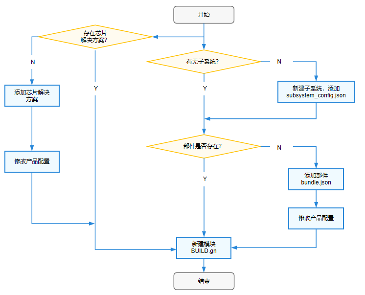

# 模块
## 模块配置规则

编译子系统通过模块、部件和产品三层配置来实现编译和打包。模块就是编译子系统的一个目标，包括（动态库、静态库、配置文件、预编译模块等）。模块要定义属于哪个部件，一个模块只能归属于一个部件。OpenHarmony使用定制化的Gn模板来配置模块规则，Gn语法相关的基础知识请参考[官网手册](https://gn.googlesource.com/gn/+/main/docs/reference.md)。

以下是常用的模块配置规则：

```
# C/C++模板
ohos_shared_library
ohos_static_library
ohos_executable
ohos_source_set

# 预编译模板：
ohos_prebuilt_executable
ohos_prebuilt_shared_library
ohos_prebuilt_static_library

#hap模板
ohos_hap
ohos_app_scope
ohos_js_assets
ohos_resources

#rust模板
ohos_rust_executable
ohos_rust_shared_library
ohos_rust_static_library
ohos_rust_proc_macro
ohos_rust_shared_ffi
ohos_rust_static_ffi
ohos_rust_cargo_crate
ohos_rust_systemtest
ohos_rust_unittest
ohos_rust_fuzztest

#其他常用模板
#配置文件
ohos_prebuilt_etc

#sa配置
ohos_sa_profile
```

ohos开头的模板与内建模板的差异主要在于：推荐使用ohos定制模板。

### C/C++模板示例

ohos开头的模板对应的.gni文件路径在：openharmony/build/templates/cxx/cxx.gni。

ohos_shared_library示例

```shell
import("//build/ohos.gni")
ohos_shared_library("helloworld") {
  sources = ["file"]
  include_dirs = []             # 如有重复头文件定义，优先使用前面路径头文件。
  cflags = []                   # 如重复冲突定义，后面的参数优先生效，也就是该配置项中优先生效。
  cflags_c = []
  cflags_cc = []
  ldflags = []                  # 如重复冲突定义，前面参数优先生效，也就是ohos_template中预制参数优先生效。
  configs = []
  deps = []                     # 部件内模块依赖

  external_deps = [             # 跨部件模块依赖定义
  "part_name:module_name",      # 定义格式为 "部件名:模块名称"。
  ]                             # 这里依赖的模块必须是依赖的部件声明在inner_kits中的模块。

  output_name = [string]        # 模块输出名
  output_extension = []         # 模块名后缀
  module_install_dir = ""       # 模块安装路径，缺省在/system/lib64或/system/lib下; 模块安装路径从system/，vendor/后开始指定。
  relative_install_dir = ""     # 模块安装相对路径，相对于/system/lib64或/system/lib；如果有module_install_dir配置时，该配置不生效。

  part_name = ""                # 必选，所属部件名称
  output_dir

  # Sanitizer配置，每项都是可选的，默认为false/空。
  sanitize = {
    # 各个Sanitizer开关
    cfi = [boolean]               # 控制流完整性检测
    cfi_cross_dso = [boolean]     # 开启跨so调用的控制流完整性检测
    integer_overflow = [boolean]  # 整数溢出检测
    boundary_sanitize = [boolean] # 边界检测
    ubsan = [boolean]             # 部分ubsan选项
    all_ubsan = [boolean]         # 全量ubsan选项
    ...

    debug = [boolean]             # 调测模式
    blocklist = [string]          # 屏蔽名单路径
  }

  testonly = [boolean]
  license_as_sources = []
  license_file = []               # 后缀名是.txt的文件
  remove_configs = []
  no_default_deps = []
  install_images = []
  install_enable = [boolean]
  symlink_target_name = []
  version_script = []
  use_exceptions = []
}
```

ohos_static_library示例

```shell
import("//build/ohos.gni")
ohos_static_library("helloworld") {
  sources = ["file"]            # 后缀名是.c的相关文件
  include_dirs = ["dir"]        # 包含目录
  configs = []                  # 配置
  deps = []                     # 部件内模块依赖
  part_name = ""                # 部件名称
  subsystem_name = ""           # 子系统名称
  cflags = []

  external_deps = [             # 跨部件模块依赖定义，
  "part_name:module_name",      # 定义格式为 "部件名:模块名称"
  ]                             # 这里依赖的模块必须是依赖的部件声明在inner_kits中的模块。

  lib_dirs = []
  public_configs = []

  # Sanitizer配置，每项都是可选的，默认为false/空
  sanitize = {
    # 各个Sanitizer开关
    cfi = [boolean]               # 控制流完整性检测
    cfi_cross_dso = [boolean]     # 开启跨so调用的控制流完整性检测
    integer_overflow = [boolean]  # 整数溢出检测
    boundary_sanitize = [boolean] # 边界检测
    ubsan = [boolean]             # 部分ubsan选项
    all_ubsan = [boolean]         # 全量ubsan选项
    ...

    debug = [boolean]             # 调测模式
    blocklist = [string]          # 屏蔽名单路径
  }

  remove_configs = []
  no_default_deps = []
  license_file = []               # 后缀名是.txt的文件
  license_as_sources = []
  use_exceptions = []
}
```

ohos_executable示例

```shell
import("//build/ohos.gni")
ohos_executable("helloworld") {
  configs = []                       # 配置  
  part_name = ""                     # 部件名称 
  subsystem_name = ""                # 子系统名称
  deps = []                          # 部件内模块依赖

  external_deps = [                  # 跨部件模块依赖定义，
  "part_name:module_name",           # 定义格式为 "部件名:模块名称"
  ]                                  # 这里依赖的模块必须是依赖的部件声明在inner_kits中的模块。
  ohos_test = []
  test_output_dir = []

  # Sanitizer配置，每项都是可选的，默认为false/空
  sanitize = {
    # 各个Sanitizer开关
    cfi = [boolean]               # 控制流完整性检测
    cfi_cross_dso = [boolean]     # 开启跨so调用的控制流完整性检测
    integer_overflow = [boolean]  # 整数溢出检测
    boundary_sanitize = [boolean] # 边界检测
    ubsan = [boolean]             # 部分ubsan选项
    all_ubsan = [boolean]         # 全量ubsan选项
    ...

    debug = [boolean]             # 调测模式
    blocklist = [string]          # 屏蔽名单路径
  }

  testonly = [boolean]
  license_as_sources = []
  license_file = []                  # 后缀名是.txt的文件
  remove_configs = []
  static_link = []
  install_images = []
  module_install_dir = ""            # 模块安装路径，从system/，vendor/后开始指定
  relative_install_dir = ""
  symlink_target_name = []
  output_dir = [directory]           # 存放输出文件的目录
  install_enable = [boolean]
  version_script = []
  use_exceptions = []
}
```

ohos_source_set示例

```shell
import("//build/ohos.gni")
ohos_source_set("helloworld") {
  sources = ["file"]              # 后缀名是.c的相关文件
  include_dirs = []               # 包含目录
  configs = []                    # 配置
  public = []                     # .h类型头文件
  defines = []
  public_configs = []
  part_name = ""                  # 部件名称
  subsystem_name = ""             # 子系统名称
  deps = []  # 部件内模块依赖

  external_deps = [               # 跨部件模块依赖定义，
  "part_name:module_name",        # 定义格式为 "部件名:模块名称"
  ]                               # 这里依赖的模块必须是依赖的部件声明在inner_kits中的模块

  # Sanitizer配置，每项都是可选的，默认为false/空
  sanitize = {
    # 各个Sanitizer开关
    cfi = [boolean]               # 控制流完整性检测
    cfi_cross_dso = [boolean]     # 开启跨so调用的控制流完整性检测
    integer_overflow = [boolean]  # 整数溢出检测
    boundary_sanitize = [boolean] # 边界检测
    ubsan = [boolean]             # 部分ubsan选项
    all_ubsan = [boolean]         # 全量ubsan选项
    ...

    debug = [boolean]             # 调测模式
    blocklist = [string]          # 屏蔽名单路径
  }

  testonly = [boolean]
  license_as_sources = []
  license_file = []
  remove_configs = []
  no_default_deps = []
  license_file = []               # 后缀名是.txt的文件
  license_as_sources = []
  use_exceptions = []
}
```

**注意**：
  - 只有sources和part_name是必选，其他都是可选的；
  - Sanitizer配置详见：[Sanitizer使用说明](subsys-build-reference.md#Sanitizer使用说明)

### 预编译模板示例

预编译模板的.gni相关文件路径在：openharmony/build/templates/cxx/prebuilt.gni。

ohos_prebuilt_executable示例

```shell
import("//build/ohos.gni")
ohos_prebuilt_executable("helloworld") {
  source = "file"                         # 源
  output = []
  install_enable = [boolean]         

  deps = []                               # 部件内模块依赖
  public_configs = []
  subsystem_name = ""                     # 子系统名
  part_name = ""                          # 部件名

  testonly = [boolean]
  visibility = []

  install_images = []
  module_install_dir = ""                 # 模块安装路径，从system/，vendor/后开始指定
  relative_install_dir = ""               # 模块安装相对路径，相对于system/etc；如果有module_install_dir配置时，该配置不生效。
  symlink_target_name = []


  license_file = []                       # 后缀名是.txt的文件
  license_as_sources = []
}
```

ohos_prebuilt_shared_library示例

```shell
import("//build/ohos.gni")
ohos_prebuilt_shared_library("helloworld") {
  source = "file"                      # 一般是后缀为.so的文件
  output = []
  install_enable = [boolean]

  deps = []                            # 部件内模块依赖
  public_configs = []
  subsystem_name = ""                  # 子系统名
  part_name = ""                       # 部件名

  testonly = [boolean]
  visibility = []

  install_images = []
  module_install_dir = ""              # 模块安装路径，从system/，vendor/后开始指定
  relative_install_dir = ""            # 模块安装相对路径，相对于system/etc；如果有module_install_dir配置时，该配置不生效。
  symlink_target_name = [string]


  license_file = [string]              # 后缀名是.txt的文件
  license_as_sources = []
}
```

ohos_prebuilt_static_library示例

```shell
import("//build/ohos.gni")
ohos_prebuilt_static_library("helloworld") {
  source = "file"                  # 一般是后缀为.so的文件
  output = []

  deps = []                        # 部件内模块依赖
  public_configs = []
  subsystem_name = ""              # 子系统名
  part_name = ""                   # 部件名

  testonly = [boolean]
  visibility = []

  license_file = [string]          # 后缀名是.txt的文件
  license_as_sources = []
}
```

**注意**：只有sources和part_name是必选，其他都是可选的。

### Hap模板

hap模板详见：[ HAP编译构建指导](subsys-build-gn-hap-compilation-guide.md)

### Rust模板

rust模板详见：[ Rust模块配置规则和指导](subsys-build-rust-compilation.md)

### 其他常用模板

ohos_prebuilt_etc示例：

```shell
import("//build/ohos.gni")
ohos_prebuilt_etc("helloworld") {
  # ohos_prebuilt_etc模板最常用属性:
  source = "file"                          # 指定单个原文件
  module_install_dir = ""                  # 模块安装路径，从system/，vendor/后开始指定
  subsystem_name = ""                      # 子系统名
  part_name = ""                           # 必选，所属部件名称
  install_images = []
  relative_install_dir = ""                # 模块安装相对路径，相对于system/etc；如果有module_install_dir配置时，该配置不生效。
  
  # ohos_prebuilt_etc模板不常用属性:
  deps = []                                # 部件内模块依赖
  testonly = [boolean]
  visibility = []
  public_configs = []
  symlink_target_name = [string]
  license_file = [string]
  license_as_sources = []
}
```

ohos_sa_profile示例：

```shell
import("//build/ohos.gni")
ohos_sa_profile("helloworld") {
  sources = [".xml"]                   # xml文件
  part_name = ""                       # 部件名
  subsystem_name = ""                  # 子系统名
}
```

**注意**：只有sources和part_name是必选，其他都是可选的。

## 新增并编译模块

新建模块可以分为以下三种情况。主要的添加逻辑如下面的流程图所示，若没有子系统则需新建子系统并在该子系统的部件下添加模块，若没有部件则需新建部件并在其中添加模块，否则直接在原有部件中添加模块即可，需要注意的是芯片解决方案作为特殊部件是没有对应子系统的。

- 在原有部件中添加一个模块

- 新建部件并在其中添加模块

- 新建子系统并在该子系统的部件下添加模块

  

**在原有部件中添加一个模块**

1. 在模块目录下配置BUILD.gn，根据模板类型选择对应的gn模板。 

2. 修改bundle.json配置文件。

   ```shell
   {
      "name": "@ohos/<component_name>",                         # HPM部件英文名称，格式"@组织/部件名称"
      "description": "xxxxxxxxxxxxxxxxxxx",                     # 部件功能一句话描述
      "version": "3.1",                                         # 版本号，版本号与OpenHarmony版本号一致
      "license": "MIT",                                         # 部件License
      "publishAs": "code-segment",                              # HPM包的发布方式，当前默认都为code-segment
      "segment": {
          "destPath": "third_party/nghttp2"
      },                                                        # 发布类型为code-segment时为必填项，定义发布类型code-segment的代码还原路径（源码路径）。
      "dirs": {},                                               # HPM包的目录结构，字段必填内容可以留空
      "scripts": {},                                            # HPM包定义需要执行的脚本，字段必填，值非必填
      "licensePath": "COPYING",
      "readmePath": {
          "en": "README.rst"
      },
      "component": {                                            # 部件属性
          "name": "<component_name>",                           # 部件名称
          "subsystem": ,                                        # 部件所属子系统
          "syscap": [],                                         # 部件为应用提供的系统能力
          "features": [],                                       # 部件对外的可配置特性列表，一般与build中的sub_component对应，可供产品配置。
          "adapted_system_type": [],                            # 轻量(mini)小型(small)和标准(standard)，可以是多个
          "rom": "xxxKB"                                        # ROM基线，没有基线写当前值
          "ram": "xxxKB",                                       # RAM基线，没有基线写当前值
          "deps": {
              "components": [],                                 # 部件依赖的其他部件
              "third_party": []                                 # 部件依赖的三方开源软件
          },
       
          "build": {                                            # 编译相关配置
              "sub_component": [
                  "//foundation/arkui/napi:napi_packages",      # 原有模块1
                  "//foundation/arkui/napi:napi_packages_ndk"   # 原有模块2
                  "//foundation/arkui/napi:new"                 # 新增模块new
              ],                                                # 部件编译入口，模块在此处配置
              "inner_kits": [],                                 # 部件间接口
              "test": []                                        # 部件测试用例编译入口
          }
      }
   }
   ```

   **注意**：无论哪种方式该bundle.json文件均在对应子系统所在文件夹下。

3. 成功添加验证：编译完成后打包到image中去，生成对应的so文件或者二进制文件。

**新建部件并在其中添加一个模块**

1. 在模块目录下配置BUILD.gn，根据模板类型选择对应的gn模板。这一步与在原有部件中添加一个模块的方法基本一致，只需注意该模块对应BUILD.gn文件中的part_name为新建部件的名称即可。

2. 新建一个bundle.json文件，bundle.json文件均在对应子系统所在文件夹下。

3. 在vendor/{product_company}/{product-name}/config.json中添加对应的部件，直接添加到原有部件后即可。

   ```shell
    "subsystems": [
         {
           "subsystem": "部件所属子系统名",
           "components": [
             { "component": "部件名1", "features":[] },         # 子系统下的原有部件1
             { "component": "部件名2", "features":[] },         # 子系统下的原有部件2
             { "component": "部件名new", "features":[] }        # 子系统下的新增部件new
           ]
         },
         .
    ]
   ```

4. 成功添加验证：编译完成后打包到image中去，生成对应的so文件或者二进制文件。
   

**新建子系统并在该子系统的部件下添加模块**

1. 在模块目录下配置BUILD.gn，根据模板类型选择对应的gn模板。这一步与新建部件并在其中添加模块中对应的步骤并无区别。

2. 在新建的子系统目录下每个部件对应的文件夹下创建bundle.json文件，定义部件信息。这一步与新建部件并在其中添加模块中对应的步骤并无区别。

3. 修改build目录下的subsystem_config.json文件。

   ```shell
   {
    "子系统名1": {                     # 原有子系统1
      "path": "子系统目录1",
      "name": "子系统名1"
    },
     "子系统名2": {                    # 原有子系统2
      "path": "子系统目录2",
      "name": "子系统名2"
    },
    "子系统名new": {                   # 新增子系统new
      "path": "子系统目录new",
      "name": "子系统名new"
    },
   
   }
   ```

   该文件定义了有哪些子系统以及这些子系统所在文件夹路径，添加子系统时需要说明子系统path与name，分别表示子系统路径和子系统名。

4. 在vendor/{product_company}/{product-name}目录下的产品配置如product-name是hispark_taurus_standard时，在config.json中添加对应的部件，直接添加到原有部件后即可。

   ```shell
   "subsystems": [
     {
       "subsystem": "arkui",                      # 原有的子系统名
       "components": [                            # 单个子系统下的所有部件集合
         {
           "component": "ace_engine_standard",    # 原有的部件名
           "features": []
         },
         {
           "component": "napi",                   # 原有的部件名
           "features": []
         }
          {
           "component": "component_new1",         # 原有子系统新增的的部件名component_new1
           "features": []
         }
      ]
     },
     {
       "subsystem": "subsystem_new",              #  新增的子系统名
       "components": [
         {
           "component": "component_new2",         # 新增子系统新增的的部件名component_new2
           "features": []
         }
       ]
     },
    
    ]
   ```

4. 成功添加验证：编译完成后打包到image中去，生成对应的so文件或者二进制文件。


**编译模块**

主要有两种编译方式，[命令行方式和hb方式](subsys-build-all.md#编译命令)，这里以命令行方式为例。

   模块可以使用“--build-target 模块名"单独编译，编译命令如下：

   ```shell
   ./build.sh --build-target 模块名
   ```

   也可以编译相应产品，以编译hispark_taurus_standard为例，编译命令如下：

   ```shell
   ./build.sh --product-name hispark_taurus_standard --build-target 模块名 --ccache
   ```

   还可以编译模块所在的部件：

   ```shell
   ./build.sh --product-name hispark_taurus_standard --build-target musl --build-target 模块名 --ccache
   ```
