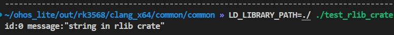

# Rust模块配置规则和指导

## 概述

Rust是一门静态强类型语言，具有更安全的内存管理、更好的运行性能、原生支持多线程开发等优势。Rust官方也使用Cargo工具来专门为Rust代码创建工程和构建编译。
OpenHarmony为了集成C/C++代码和提升编译速度，使用了GN + Ninja的编译构建系统。GN的构建语言简洁易读，Ninja的汇编级编译规则直接高效。
为了在OpenHarmony中集成Rust代码，并最大程度发挥Rust和OpenHarmony中原有C/C++代码的交互性，采用GN作为统一构建工具，即通过GN构建Rust源码文件(xxx.rs)，并增加与C/C++互操作、编译时lint、测试、IDL转换、三方库集成、IDE等功能。同时扩展gn框架，支持接口自动化转换，最大程度简化开发。

### 基本概念

| 术语  | 描述                                                         |
| ----- | ------------------------------------------------------------ |
| Cargo | Cargo是Rust官方使用的构建工具,允许Rust项目声明其各种依赖项，并确保您始终获得可重复的构建。 |
| crate | crate是一个独立的可编译单元。                                |
| Lint  | Lint是指出常见编程错误、错误、样式错误和可疑结构的工具。可以对程序进行更加广泛的错误分析。 |


## 配置规则
OpenHarmony提供了用于Rust代码编译构建的各类型GN模板，可以用于编译Rust可执行文件，动态库和静态库等。各类型模板说明如下：

| GN模板                     | 功能              | 输出                                |
|--------------------------|-----------------|-----------------------------------|
| ohos_rust_executable     | rust可执行文件       | rust可执行文件，不带后缀                    |
| ohos_rust_shared_library | rust动态库         | rust dylib动态库，默认后缀.dylib.so       |
| ohos_rust_static_library | rust静态库         | rust rlib静态库，默认后缀.rlib            |
| ohos_rust_proc_macro     | rust proc_macro | rust proc_macro库， 默认后缀.so         |
| ohos_rust_shared_ffi     | rust FFI动态库     | rust cdylib动态库，给C/C++模块调用，默认后缀.so |
| ohos_rust_static_ffi     | rust FFI静态库     | rust staticlib库，给C/C++模块调用，默认后缀.a |
| ohos_rust_cargo_crate    | 三方包Cargo crate  | rust三方crate，支持rlib、dylib、bin      |
| ohos_rust_systemtest     | rust系统测试用例      | rust可执行系统测试用例，不带后缀                |
| ohos_rust_unittest       | rust单元测试用例      | rust可执行单元测试用例，不带后缀                |
| ohos_rust_fuzztest       | rust Fuzz测试用例   | rust可执行Fuzz测试用例，不带后缀              |


## 配置指导
配置Rust模块与C/C++模块类似，参考[模块配置规则](subsys-build-module.md)。下面是使用不同模板的示例。
### 配置Rust静态库示例
该示例用于测试Rust可执行bin文件和静态库rlib文件的编译，以及可执行文件对静态库的依赖，使用模板ohos_rust_executable和ohos_rust_static_library。操作步骤如下：

1. 创建build/rust/tests/test_rlib_crate/src/simple_printer.rs，如下所示：

   ```rust
   //! simple_printer
   
   /// struct RustLogMessage
   
   pub struct RustLogMessage {
       /// i32: id
       pub id: i32,
       /// String: msg
       pub msg: String,
   }
   
   /// function rust_log_rlib
   pub fn rust_log_rlib(msg: RustLogMessage) {
       println!("id:{} message:{:?}", msg.id, msg.msg)
   }
   ```

2. 创建build/rust/tests/test_rlib_crate/src/main.rs，如下所示：

   ```rust
   //! rlib_crate example for Rust.
   
   extern crate simple_printer_rlib;
   
   use simple_printer_rlib::rust_log_rlib;
   use simple_printer_rlib::RustLogMessage;
   
   fn main() {
       let msg: RustLogMessage = RustLogMessage {
           id: 0,
           msg: "string in rlib crate".to_string(),
       };
       rust_log_rlib(msg);
   }
   ```

3. 配置gn脚本build/rust/tests/test_rlib_crate/BUILD.gn，如下所示：

   ```
   import("//build/ohos.gni")
   
   ohos_rust_executable("test_rlib_crate") {
     sources = [ "src/main.rs" ]
     deps = [ ":simple_printer_rlib" ]
   }
   
   ohos_rust_static_library("simple_printer_rlib") {
     sources = [ "src/simple_printer.rs" ]
     crate_name = "simple_printer_rlib"
     crate_type = "rlib"
     features = [ "std" ]
   }
   ```

4. 执行编译得到的可执行文件，运行结果如下：

   

### 配置三方库示例

rust三方库的BUILD.gn文件可通过cargo2gn工具自动生成。参见：[Cargo2gn工具操作指导](subsys-build-cargo2gn-guide.md)

该示例用于测试包含预编译文件build.rs的三方静态库rlib文件的编译，使用了模板ohos_rust_executable和ohos_rust_cargo_crate。操作步骤如下：

1. 创建build/rust/tests/test_rlib_cargo_crate/crate/src/lib.rs，如下所示：

   ```rust
   include!(concat!(env!("OUT_DIR"), "/generated/generated.rs"));
   
   pub fn say_hello_from_crate() {
       assert_eq!(run_some_generated_code(), 45);
       #[cfg(is_new_rustc)]
       println!("Is new rustc");
       #[cfg(is_old_rustc)]
       println!("Is old rustc");
       #[cfg(is_ohos)]
       println!("Is ohos");
       #[cfg(is_mac)]
       println!("Is darwin");
       #[cfg(has_feature_a)]
       println!("Has feature_a");
       #[cfg(not(has_feature_a))]
       panic!("Wasn't passed feature_a");
       #[cfg(not(has_feature_b))]
       #[cfg(test_a_and_b)]
       panic!("feature_b wasn't passed");
       #[cfg(has_feature_b)]
       #[cfg(not(test_a_and_b))]
       panic!("feature_b was passed");
   }
   
   #[cfg(test)]
   mod tests {
       /// Test features are passed through from BUILD.gn correctly. This test is the target configuration.
       #[test]
       #[cfg(test_a_and_b)]
       fn test_features_passed_target1() {
           #[cfg(not(has_feature_a))]
           panic!("feature a was not passed");
           #[cfg(not(has_feature_b))]
           panic!("feature b was not passed");
       }
   
       #[test]
       fn test_generated_code_works() {
           assert_eq!(crate::run_some_generated_code(), 45);
       }
   }
   ```

2. 创建build/rust/tests/test_rlib_cargo_crate/crate/src/main.rs，如下所示：

   ```rust
   pub fn main() {
       test_rlib_crate::say_hello_from_crate();
   }
   ```

3. 创建build/rust/tests/test_rlib_cargo_crate/crate/build.rs，如下所示：

   ```rust
   use std::env;
   use std::path::Path;
   use std::io::Write;
   use std::process::Command;
   use std::str::{self, FromStr};
   
   fn main() {
       println!("cargo:rustc-cfg=build_script_ran");
       let my_minor = match rustc_minor_version() {
           Some(my_minor) => my_minor,
           None => return,
       };
   
       if my_minor >= 34 {
           println!("cargo:rustc-cfg=is_new_rustc");
       } else {
           println!("cargo:rustc-cfg=is_old_rustc");
       }
   
       let target = env::var("TARGET").unwrap();
   
       if target.contains("ohos") {
           println!("cargo:rustc-cfg=is_ohos");
       }
       if target.contains("darwin") {
           println!("cargo:rustc-cfg=is_mac");
       }
   
       let feature_a = env::var_os("CARGO_FEATURE_MY_FEATURE_A").is_some();
       if feature_a {
           println!("cargo:rustc-cfg=has_feature_a");
       }
       let feature_b = env::var_os("CARGO_FEATURE_MY_FEATURE_B").is_some();
       if feature_b {
           println!("cargo:rustc-cfg=has_feature_b");
       }
   
       // Some tests as to whether we're properly emulating various cargo features.
       assert!(Path::new("build.rs").exists());
       assert!(Path::new(&env::var_os("CARGO_MANIFEST_DIR").unwrap()).join("build.rs").exists());
       assert!(Path::new(&env::var_os("OUT_DIR").unwrap()).exists());
   
       // Confirm the following env var is set
       env::var_os("CARGO_CFG_TARGET_ARCH").unwrap();
   
       generate_some_code().unwrap();
   }
   
   fn generate_some_code() -> std::io::Result<()> {
       let test_output_dir = Path::new(&env::var_os("OUT_DIR").unwrap()).join("generated");
       let _ = std::fs::create_dir_all(&test_output_dir);
       // Test that environment variables from .gn files are passed to build scripts
       let preferred_number = env::var("ENV_VAR_FOR_BUILD_SCRIPT").unwrap();
       let mut file = std::fs::File::create(test_output_dir.join("generated.rs"))?;
       write!(file, "fn run_some_generated_code() -> u32 {{ {} }}", preferred_number)?;
       Ok(())
   }
   
   fn rustc_minor_version() -> Option<u32> {
       let rustc_bin = match env::var_os("RUSTC") {
           Some(rustc_bin) => rustc_bin,
           None => return None,
       };
   
       let output = match Command::new(rustc_bin).arg("--version").output() {
           Ok(output) => output,
           Err(_) => return None,
       };
   
       let rustc_version = match str::from_utf8(&output.stdout) {
           Ok(rustc_version) => rustc_version,
           Err(_) => return None,
       };
   
       let mut pieces = rustc_version.split('.');
       if pieces.next() != Some("rustc 1") {
           return None;
       }
   
       let next_var = match pieces.next() {
           Some(next_var) => next_var,
           None => return None,
       };
   
       u32::from_str(next_var).ok()
   }
   ```

4. 配置gn脚本build/rust/tests/test_rlib_cargo_crate/BUILD.gn，如下所示：

   ```
   import("//build/templates/rust/ohos_cargo_crate.gni")
   
   ohos_cargo_crate("target") {
     crate_name = "test_rlib_crate"
     crate_root = "crate/src/lib.rs"
     sources = [ "crate/src/lib.rs" ]
   
     #To generate the build_script binary
     build_root = "crate/build.rs"
     build_sources = [ "crate/build.rs" ]
     build_script_outputs = [ "generated/generated.rs" ]
   
     features = [
       "my-feature_a",
       "my-feature_b",
       "std",
     ]
     rustflags = [
       "--cfg",
       "test_a_and_b",
     ]
     rustenv = [ "ENV_VAR_FOR_BUILD_SCRIPT=45" ]
   }
   
   # Exists to test the case that a single crate has both a library and a binary
   ohos_cargo_crate("test_rlib_crate_associated_bin") {
     crate_root = "crate/src/main.rs"
     crate_type = "bin"
     sources = [ "crate/src/main.rs" ]
   
     #To generate the build_script binary
     build_root = "crate/build.rs"
     build_sources = [ "crate/build.rs" ]
     features = [
       "my-feature_a",
       "my-feature_b",
       "std",
     ]
     rustenv = [ "ENV_VAR_FOR_BUILD_SCRIPT=45" ]
     deps = [ ":target" ]
   }
   ```

5. 执行编译得到的可执行文件，运行结果如下：

   

### 其他源码实例
在build/rust/tests目录下有Rust各类型模块的配置实例可供参考：

| 用例目录                                         | 测试功能                                                     |
|----------------------------------------------|----------------------------------------------------------|
| build/rust/tests/test_bin_crate              | 用ohos_rust_executable模板在host平台编译可执行文件，在target平台上运行可执行文件。 |
| build/rust/tests/test_static_link            | 测试可执行文件对标准库的静态链接。                                        |
| build/rust/tests/test_dylib_crate            | 测试对动态库的编译和动态链接功能                                         |
| build/rust/tests/test_rlib_crate             | 测试对静态库的编译和静态链接功能                                         |
| build/rust/tests/test_proc_macro_crate       | 测试对Rust过程宏的编译和链接功能。提供对不同类型的宏的测试用例。                       |
| build/rust/tests/test_cdylib_crate           | 测试将Rust代码编译成C/C++动态库。                                    |
| build/rust/tests/test_staticlib_crate        | 测试将Rust代码编译成C/C++静态库。                                    |
| build/rust/tests/rust_test_ut                | 测试Rust代码单元测试模板功能（ability）。                               |
| build/rust/tests/rust_test_st                | 测试Rust代码系统测试模板功能（ability）。                               |
| build/rust/tests/test_bin_cargo_crate        | 测试Rust三方可执行文件的编译和运行。三方源码中包含build.rs。                     |
| build/rust/tests/test_rlib_cargo_crate       | 测试Rust三方静态库的编译和静态链接。三方源码中包含build.rs。                     |
| build/rust/tests/test_proc_macro_cargo_crate | 测试Rust三方过程宏的编译和链接。三方源码中包含build.rs。                       |
| build/rust/tests/rust_test_fuzzb             | 测试Rust代码Fuzz测试模板功能。                                      |
## 参考

### 特性点实例

#### Rust源码依赖调用C/C++库
OpenHarmony上C/C++模块动态库默认用.z.so后缀，但是Rust的编译命令通过-l链接时，默认只会链接.so后缀的动态库。因此如果要依赖一个C/C++动态库编译模块，需要在该动态库的GN构建文件中添加output_extension = "so"的声明，这样编译得到的动态库将会以".so"作为后缀，而不是".z.so"。
在Rust源码中如果直接链接动态库，后缀也需要使用".so"，这时使用动态库的中间名，不需要添加lib前缀。例如Rust源码中链接libhilog.so:

```rust
#[link(name = "hilog")]
```
#### externs使用
某个模块如果依赖二进制的rlib库，可以使用externs属性：
```
executable("foo") {
    sources = [ "main.rs" ]
    externs = [{                    # 编译时会转成`--extern bar=path/to/bar.rlib`
        crate_name = "bar"
        path = "path/to/bar.rlib"
    }]
}
```
### Lint规则
OpenHarmony框架支持rustc lints和clippy lints两种Lint，每种Lint划为三个等级的标准："openharmony"、"vendor"和"none"，严格程度按照"openharmony" -> "vendor" -> "none"逐级递减。
配置Rust模块时可以通过rustc_lints和clippy_lints来指定使用Lint的等级。
模块中没有配置rustc_lints或者clippy_lints时会根据模块所在路径来匹配lints等级。不同路径下的Rust代码的语法规范会有不同程度地约束，因此用户在OpenHarmony配置Rust代码编译模块时还应关注模块所在路径。

#### rustc lints和clippy lints的各等级标志
| **lints类型** | **模块属性** | **lints等级** | **lints等级标志** | **lints内容**                                                |
| ------------- | ------------ | ------------- | ----------------- | ------------------------------------------------------------ |
| rustc_lints   | rustc_lints  | openharmony   | RustOhosLints     | "-A deprecated", "-D missing-docs", "-D warnigngs"           |
| rustc_lints   | rustc_lints  | vendor        | RustcVendorLints  | "-A deprecated", "-D warnigs"                                |
| rustc_lints   | rustc_lints  | none          | allowAllLints     | "-cap-lints allow"                                           |
| clippy lints  | clippy lints | openharmony   | ClippyOhosLints   | "-A clippy::type-complexity", "-A clippy::unnecessary-wraps", "-A clippy::unusual-byte-groupings", "-A clippy::upper-case-acronyms" |
| clippy lints  | clippy lints | vendor        | ClippyVendorLints | "-A clippy::complexity", "-A Clippy::perf", "-A clippy::style" |
| clippy lints  | clippy lints | none          | allowAllLints     | "--cap-lints allow"                                          |

#### 代码路径与lints等级的对应关系
| 路径       | Lints等级   |
| ---------- | ----------- |
| thirdparty | none        |
| prebuilts  | none        |
| vendor     | vendor      |
| device     | vendor      |
| others     | openharmony |

### [交互工具使用指导](subsys-build-bindgen-cxx-guide.md)
### [Cargo2gn工具操作指导](subsys-build-cargo2gn-guide.md)