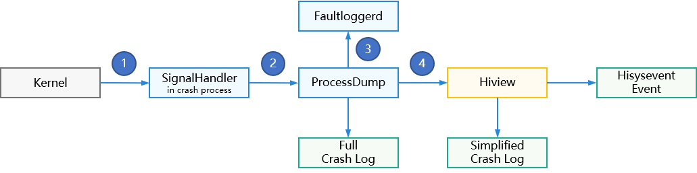

# Faultlogger开发指导


## 概述


### 功能简介

Faultlogger是OpenHarmony为开发者提供的一个维测日志框架，能够为应用、元能力、系统服务进程崩溃故障提供统一检测、日志采集、日志存储、日志上报功能，为应用崩溃故障提供详细的维测日志用以辅助故障定位。本章节内容适用于标准系统以及Linux内核的小型系统。

FaultLogger承载OpenHarmony系统上的故障记录功能，按照服务对象不同分别运行在两个部件中：

- Hiview部件中的服务：服务于应用层和native层的功能模块，功能是分类管理系统中发生的各类故障信息，并为模块提供查询故障的API。

- Faultloggerd部件中的服务：服务于崩溃进程，功能是收集C/C++运行时异常的守护进程和获取进程调用栈。

基于Faultlogger服务，进程崩溃的处理流程如下图所示：

  **图1** 进程崩溃处理流程图



1. 进程安装信号处理器后，通过DFX_SignalHandler函数检测并响应由Kernel抛出的进程崩溃异常信号；

2. SignalHandler检测到异常信号后Fork出子进程，并运行ProcessDump程序开始dump崩溃进程和线程的堆栈信息；

3. ProcessDump程序向Faultloggerd服务申请用于存储故障日志的文件句柄，在读取到异常堆栈信息后写入到该文件中，进而生成完整的崩溃日志；

4. ProcessDump完成崩溃日志收集后，根据需要将故障通过Hiview提供的AddFaultLog()接口进行上报，hiview将处理生成简化的崩溃日志，并上报Hisysevent事件。

基于这样的设计，在资源有限的小型系统上可只部署Faultloggerd，也依然可以获取用于定位崩溃问题的日志。


### 使用场景

Faultloggerd意在为开发者在开发测试过程中遇到的崩溃或卡死问题提供一种简单轻量的定位手段。

主要包含以下应用场景：

  **表1** Faultloggerd模块应用场景

| 场景描述 | 使用工具 | 使用方式 |
| -------- | -------- | -------- |
| 了解函数的调用顺序 | DumpCatcher API | 参见：[使用DumpCatcher接口获取调用栈](#使用dumpcatcher接口获取调用栈) |
| 应用卡死/CPU占用高 | DumpCatcher Command Tool | 参见：[使用DumpCatcher命令获取调用栈](#使用dumpcatcher命令获取调用栈) |
| 崩溃问题定位 | 崩溃日志和addr2line工具 | 参见：[基于崩溃日志定位问题](#基于崩溃日志定位问题) |


## 使用DumpCatcher接口获取调用栈


### 接口说明

DumpCatcher可以抓取OpenHarmony指定进程（线程）的调用栈。

  **表2** DumpCatcher接口说明

| 类 | 方法 | 描述 |
| -------- | -------- | -------- |
| DfxDumpCatcher | bool DumpCatch(const int pid, const int tid, std::string&amp; msg) |   接口返回值：<br/>- true：回栈成功，回栈信息存储在msg字符串对象中；<br/>- false：回栈失败。<br/>  输入参数：<br/>- pid：目标进程号；<br/>- tid：目标线程号，如果需要回栈进程中的所有线程，则tid设定为0；<br/>  输出参数：<br/>- msg：如果回栈成功，则通过msg返回调用栈信息。 |
| DfxDumpCatcher | bool DumpCatchMix(const int pid, const int tid, std::string&amp; msg) |   接口返回值：<br/>- true：回栈成功，回栈信息存储在msg字符串对象中；<br/>- false：回栈失败。<br/>  输入参数：<br/>- pid：目标进程号；<br/>- tid：目标线程号，如果需要回栈进程中的所有线程，则tid设定为0；<br/>  输出参数：<br/>- msg：如果回栈成功，则通过msg返回混合栈信息。 |
| DfxDumpCatcher | bool DumpCatchFd(const int pid, const int tid, std::string&amp; msg, int fd) |   接口返回值：<br/>- true：回栈成功，回栈信息存储在msg字符串对象中；<br/>- false：回栈失败。<br/>  输入参数：<br/>- pid：目标进程号；<br/>- tid：目标线程号，如果需要回栈进程中的所有线程，则tid设定为0；<br/>- fd：指定写入的文件句柄号；<br/>  输出参数：<br/>- msg：如果回栈成功，则通过msg返回调用栈信息。 |
| DfxDumpCatcher | bool DumpCatchMultiPid(const std::vector\<int> pidV, std::string&amp; msg) |   接口返回值：<br/>- true：回栈成功，回栈信息存储在msg字符串对象中；<br/>- false：回栈失败。<br/>  输入参数：<br/>- pidV：目标进程号列表；<br/>  输出参数：<br/>- msg：如果回栈成功，则通过msg返回调用栈信息。 |

>  **说明：**
> 当调用此接口的进程id与目标pid不一致时需要调用者是管理员（system，root）用户。


### 开发实例


系统应用开发者可以用DumpCatcher在自己的应用中获取指定进程（线程）的调用栈。下文以dumpcatcherdemo模块使用DumpCatcher基础接口获取调用栈作为实例进行讲解。


1. 编译构建文件添加dumpcatcher依赖：以/base/hiviewdfx/faultloggerd/example/BUILD.gn为例，在include_dirs中添加DfxDumpCatcher头文件路径，并在deps中添加“//base/hiviewdfx/faultloggerd/interfaces/innerkits/dump_catcher:lib_dfx_dump_catcher”模块依赖。

   ```
   import("//base/hiviewdfx/faultloggerd/faultloggerd.gni")
   import("//build/ohos.gni")

   config("dumpcatcherdemo_config") {
     visibility = [ ":*" ]

     include_dirs = [
       ".",
       "//utils/native/base/include",
       "//base/hiviewdfx/faultloggerd/interfaces/innerkits/dump_catcher/include/",  # 添加dumpcatcher头文件路径
     ]
   }

   ohos_executable("dumpcatcherdemo") {
    sources = [ "dump_catcher_demo.cpp" ]
    configs = [ ":dumpcatcherdemo_config" ]
    deps = [
      "//base/hiviewdfx/faultloggerd/interfaces/innerkits/dump_catcher:lib_dfx_dump_catcher", # 添加dumpcathcer模块依赖
      "//utils/native/base:utils",
    ]
    external_deps = [ "hilog_native:libhilog" ]
    install_enable = true
    part_name = "faultloggerd"
    subsystem_name = "hiviewdfx"
   }
   ```

2. 头文件定义用到的函数：以/base/hiviewdfx/faultloggerd/example/dump_catcher_demo.h为例，本样例代码中，通过调用栈深度测试的测试函数来构造一个指定深度的调用栈。

   ```
   #ifndef DUMP_CATCHER_DEMO_H
   #define DUMP_CATCHER_DEMO_H

   #include <inttypes.h>

   #define NOINLINE __attribute__((noinline))

   // 定义该宏函数用于自动生成函数调用链
   #define GEN_TEST_FUNCTION(FuncNumA, FuncNumB)          \
       __attribute__((noinline)) int TestFunc##FuncNumA() \
       {                                                  \
           return TestFunc##FuncNumB();                   \
       }

   // 调用栈深度测试的测试函数
   int TestFunc0(void);
   int TestFunc1(void);
   int TestFunc2(void);
   int TestFunc3(void);
   int TestFunc4(void);
   int TestFunc5(void);
   int TestFunc6(void);
   int TestFunc7(void);
   int TestFunc8(void);
   int TestFunc9(void);
   int TestFunc10(void);

   #endif // DUMP_CATCHER_DEMO_H
   ```

3. 在源文件中调用DumpCatch接口：以/base/hiviewdfx/faultloggerd/example/dump_catcher_demo.cpp为例，引用dfx_dump_catcher.h头文件，声明DfxDumpCatcher对象，通过宏函数构造函数调用链，并最后调用DumpCatch接口方法，传入需要抓取调用栈的进程号、线程号。

   ```
   #include "dump_catcher_demo.h"

   #include <iostream>
   #include <string>
   #include <unistd.h>
   // dfx_dump_catcher.h头文件引入
   #include "dfx_dump_catcher.h"
   using namespace std;

   NOINLINE int TestFunc10(void)
   {
       OHOS::HiviewDFX::DfxDumpCatcher dumplog;
       string msg = "";
       bool ret = dumplog.DumpCatch(getpid(), gettid(), msg);  // 调用DumpCatch接口获取调用栈
       if (ret) {
           cout << msg << endl;
       }
       return 0;
   }

   // 通过宏函数自动生成函数调用链
   GEN_TEST_FUNCTION(0, 1)
   GEN_TEST_FUNCTION(1, 2)
   GEN_TEST_FUNCTION(2, 3)
   GEN_TEST_FUNCTION(3, 4)
   GEN_TEST_FUNCTION(4, 5)
   GEN_TEST_FUNCTION(5, 6)
   GEN_TEST_FUNCTION(6, 7)
   GEN_TEST_FUNCTION(7, 8)
   GEN_TEST_FUNCTION(8, 9)
   GEN_TEST_FUNCTION(9, 10)

   int main(int argc, char *argv[])
   {
       TestFunc0();
       return 0;
   }
   ```


## 使用DumpCatcher命令获取调用栈


### 工具说明

DumpCatcher Command Tool是一个抓取调用栈的命令行工具，在OpenHarmony系统中可直接使用，该工具通过-p、-t参数指定进程和线程，命令执行后在命令行窗口打印指定进程的线程栈信息。还可通过添加-m参数来抓取应用进程的JS Native混合栈。

  **表3** DumpCatcher Command Tool使用说明

| 工具名称 | 命令行工具路径 | 执行命令 | 描述 |
| -------- | -------- | -------- | -------- |
| dumpcatcher | /system/bin | - dumpcatcher -p [pid]<br/>- dumpcatcher -p [pid] -t [tid]<br/>- dumpcatcher -m -p [pid]<br/>- dumpcatcher -m -p [pid] -t [tid]<br/> | **参数说明：**<br/>- -p [pid]：打印指定进程下面的所有线程栈信息。<br/>- -p [pid] -t [tid]：打印指定进程下面的指定线程信息。<br/>- -m -p [pid]：打印指定进程下面的所有线程混合栈信息。<br/>- -m -p [pid] -t [tid]：打印指定进程下面的指定线程混合栈信息。<br/>**返回值说明：**<br/>如果栈信息解析成功，则将信息显示到标准输出；失败则打印错误信息。 |


### 使用实例

通过dumpcatcher命令打印hiview进程的调用栈。


```
# ps -ef |grep hiview
hiview         240     1 0 17:01:49 ?     00:00:14 hiview
root          1822  1560 7 20:56:36 pts/0 00:00:00 grep hiview
# dumpcatcher -p 240 -t 240
Result: 0 ( no error )
Timestamp:2017-08-05 20:56:43.000
Pid:240
Uid:1201
Process name:/system/bin/hiview
Tid:240, Name:hiview
#00 pc 00098f8c /system/lib/ld-musl-arm.so.1(ioctl+68)
#01 pc 0000e2a1 /system/lib/chipset-pub-sdk/libipc_single.z.so
#02 pc 0000ed59 /system/lib/chipset-pub-sdk/libipc_single.z.so
#03 pc 0000ee1f /system/lib/chipset-pub-sdk/libipc_single.z.so
#04 pc 0000f745 /system/lib/chipset-pub-sdk/libipc_single.z.so
#05 pc 00037577 /system/bin/hiview
#06 pc 00025973 /system/bin/hiview
#07 pc 000db210 /system/lib/ld-musl-arm.so.1
#08 pc 000258d8 /system/bin/hiview
#09 pc 0002587c /system/bin/hiview
```


## 基于崩溃日志定位问题

开发者可以通过faultloggerd生成的崩溃堆栈日志进行问题定位。本章节将主要介绍如何利用addr2line工具进行崩溃问题定位。

1. 程序自崩溃或构造崩溃。
   例如将如下代码植入自己的代码中，调用触发一个无效内存访问故障（SIGSEGV）。


   ```
   NOINLINE int TriggerSegmentFaultException()
   {
       printf("test TriggerSegmentFaultException \n");
       // 为构造崩溃，强制进行类型转换
       int *a = (int *)(&RaiseAbort);
       *a = SIGSEGV;
       return 0;
   }
   ```

2. 获取崩溃函数调用栈日志。
   因为存在未处理的异常，进程会在/data/log/faultlog/temp路径下生成临时的日志文件，其命名规则为：


   ```
   cppcrash-pid-time
   ```

   获取其生成的调用栈如下：


   ```
   Timestamp:2017-08-05 17:35:03.000
   Pid:816
   Uid:0
   Process name:./crasher_c
   Reason:Signal:SIGSEGV(SEGV_ACCERR)@0x0042d33d
   Fault thread Info:
   Tid:816, Name:crasher
   #00 pc 0000332c /data/crasher(TriggerSegmentFaultException+15)(8bc37ceb8d6169e919d178fdc7f5449e)
   #01 pc 000035c7 /data/crasher(ParseAndDoCrash+277)(8bc37ceb8d6169e919d178fdc7f5449e)
   #02 pc 00003689 /data/crasher(main+39)(8bc37ceb8d6169e919d178fdc7f5449e)
   #03 pc 000c3b08 /system/lib/ld-musl-arm.so.1(__libc_start_main+116)
   #04 pc 000032f8 /data/crasher(_start_c+112)(8bc37ceb8d6169e919d178fdc7f5449e)
   #05 pc 00003284 /data/crasher(_start+32)(8bc37ceb8d6169e919d178fdc7f5449e)
   Registers:
   r0:0042d33d r1:0000000b r2:1725d4c4 r3:b6f9fa84
   r4:bec97e69 r5:b6fc0268 r6:0042d661 r7:bec97d60
   r8:00000000 r9:00000000 r10:00000000
   fp:bec97d20 ip:00000020 sp:bec97cd0 lr:b6f9fae4 pc:0042d32c
   ```

3. 利用addr2line工具进行调用栈分析。
   使用addr2line工具根据偏移地址解析行号:


   ```
   root:~/OpenHarmony/out/hi3516dv300/exe.unstripped/hiviewdfx/faultloggerd$ addr2line -e crasher 0000332c
   base/hiviewdfx/faultloggerd/tools/crasher/dfx_crasher.c:57
   ```

   这个崩溃是由赋值给一块不可写的区域导致的，代码行为dfx_crasher.c文件的57行，修改后可以避免发生此崩溃。
