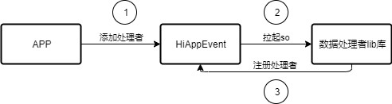
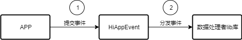
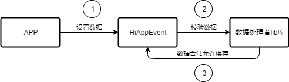

# HiAppEvent数据处理者lib库概述


## 简介

HiAppEvent是面向OpenHarmony应用开发者提供的打点功能，数据处理者lib库为HiAppEvent提供事件处理能力，lib库需要数据处理者开发方在设备开发时提供。

HiAppEvent数据处理者lib库处理流程图如下图所示：

  **图1** HiAppEvent数据处理者lib库处理流程图

  

## 使用场景

开发者使用HiAppEvent接口添加处理者并提交应用事件时，事件将会分发给事件处理者，由处理者对事件进行相应处理，例如上报。

## 功能说明

HiAppEvent数据处理者lib库为HiAppEvent事件处理者提供事件处理能力，功能介绍如下：

- 初始化注册：提供了数据处理者lib库加载时初始化so的逻辑，以及向HiAppEvent进行处理者注册。初始化注册功能如下图所示：

  **图2** 初始化注册

  


- 事件上报：提供了事件打点的相关接口能力，支持对打点事件进行上报。事件上报功能如下图所示：

  **图3** 事件上报

  

- 校验UserId：提供了校验UserId的相关接口能力，支持对UserId合法性进行校验。校验UserId功能如图4所示。

- 校验UserProperty：提供了校验UserProperty的相关接口能力，支持对UserProperty合法性进行校验。校验UserProperty功能如图4所示。

- 校验Event：提供了校验Event的相关接口能力，支持对Event合法性进行校验。校验Event功能如图4所示。

  **图4** 校验数据

  

## 开发指导

#### 接口说明

**表1** 数据处理者lib库需调用的API接口功能介绍

| 接口名                                                                                         | 描述                         |
| ---------------------------------------------------------------------------------------------- | ---------------------------- |
| int RegisterProcessor(const std::string& name, std::shared_ptr\<AppEventProcessor\> processor) | 向HiAppEvent注册数据处理者。 |

**表2** 数据处理者lib库需实现的API接口功能介绍

| 接口名                                                                                                                                                                 | 描述               |
| ---------------------------------------------------------------------------------------------------------------------------------------------------------------------- | ------------------ |
| int OnReport(int64_t processorSeq, const std::vector\<UserId\>& userIds, const std::vector\<UserProperty\>& userProperties, const std::vector\<AppEventInfo\>& events) | 事件上报。         |
| int ValidateUserId(const UserId& userId)                                                                                                                               | 校验UserId。       |
| int ValidateUserProperty(const UserProperty& userProperty)                                                                                                             | 校验UserProperty。 |
| int ValidateEvent(const AppEventInfo& event)                                                                                                                           | 校验Event。        |

#### 开发步骤

1. 在`processor_init.cpp`添加以下so初始化的方法，并进行初始化注册：

   ```c++
      #include "app_event_processor_mgr.h"

      using namespace OHOS::HiviewDFX::HiAppEvent;

      void __attribute__((constructor)) x_init(void)
      {
        ...
        int result = AppEventProcessorMgr::RegisterProcessor("processor_example", new ProcessorExample());
        printf("ProcessorExample OnReport\n");
      }
   ```

2. 在`processor_example.h`定义`ProcessorExample`类，继承于处理者基类AppEventProcessor的处理者实现类：

   ```c++
      #include <vector>
      #include "app_event_processor.h"

      using namespace OHOS::HiviewDFX::HiAppEvent;

      class ProcessorExample : public AppEventProcessor {
      public:
          int OnReport(int64_t processorSeq, const std::vector<UserId>& userIds, const std::vector<UserProperty>& userProperties, const std::vector<AppEventInfo>& events) override;
          int ValidateUserId(const UserId& userId) override;
          int ValidateUserProperty(const UserProperty& userProperty) override;
          int ValidateEvent(const AppEventInfo& event) override;
      ...
      };
   ```

3. 在`processor_example.cpp`实现`ProcessorExample`类，根据业务覆写实现相应的函数。

   ```c++
    #include "processor_example.h"

    int ProcessorExample::OnReport(int64_t processorSeq, const std::vector<UserId>& userIds, const std::vector<UserProperty>& userProperties, const std::vector<AppEventInfo>& events)
    {
        ... // 在事件上报函数中，可以对事件进行特定业务处理
        printf("ProcessorExample OnReport\n");
        return 0;
    }

    int ProcessorExample::ValidateUserId(const UserId& userId)
    {
        ... // 在校验UserId函数中，可以对UserId进行校验
        printf("ProcessorExample ValidateUserId\n");
        return 0;
    }

    int ProcessorExample::ValidateUserProperty(const UserProperty& userProperty)
    {
        ... // 在校验UserProperty函数中，可以对UserProperty进行校验
        printf("ProcessorExample ValidateUserProperty\n");
        return 0;
    }

    int ProcessorExample::ValidateEvent(const AppEventInfo& event)
    {
        ... // 在校验Event函数中，可以对Event进行校验
        printf("ProcessorExample ValidateEvent\n");
        return 0;
    }
   ```

4. 将处理者类配置在build.gn文件中，随数据处理者lib库进行编译：

   ```conf
    sources = [
      ... // 添加所需使用的源文件
      "./src/processor_init.cpp",
      "./src/processor_example.cpp",
    ]
    external_deps = [
      ... // 添加所需使用的外部依赖库
      "hiappevent:hiappevent_innerapi",
    ]
   ```

## 参考

如果您想了解更多关于HiAppEvent特性的源码及使用信息，请参考[HiAppEvent代码仓](https://gitee.com/openharmony/hiviewdfx_hiappevent)。