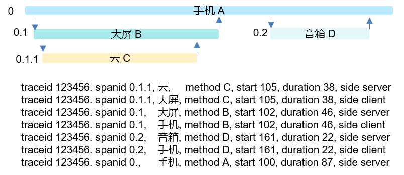

# HiTrace开发指导<a name="ZH-CN_TOPIC_0000001186134310"></a>


## 概述<a name="section3986195420436"></a>

HiTrace主要是对于跨设备/跨进程/跨线程的业务流程，通过相同的traceid在整个业务流程中传递，将流程处理过程中的调用关系、各种输出信息关联和展现出来，帮助使用者分析、定位问题和系统调优。

## 应用场景<a name="section134561822574"></a>

HiTrace在产品中应用场景如下，包括：

-   端侧业务流程信息（日志、事件等）关联、上报
-   云侧对上报信息的关联展示和分析，辅助问题定位
-   IDE对业务流程详细信息、耗时分布进行调试，辅助系统调优

    **图 1**  HiTrace应用场景<a name="fig179241023125715"></a>  
    


### 业务使用示例<a name="section63861653124417"></a>

**图 2**  业务调用流程图（跨设备、跨进程同步调用）<a name="fig173491014145819"></a>  


1.  调试时展示业务流程中的调用关系，进行关键路径分析、功能依赖分析，确定各调用点耗时、调用频率，提前发现性能瓶颈点。

    **图 3**  业务调用流程序列图<a name="fig205051834145813"></a>  
    

    **图 4**  业务调用流程性能耗时分布<a name="fig1212812422586"></a>  
    

2.  在日志和事件等信息中自动附加traceid信息，便于开发人员综合分析和快速实现问题定界定位。

## 接口说明<a name="section1517945334617"></a>

HiTrace提供C++、C接口。上层业务主要使用HiTrace跟踪启动、结束接口。

HiTrace实现在C层，主要原理是在一次业务调用流程中，利用通信传递traceid，在业务处理前将traceid设置到当前线程的TLS\(Thread Local Storage\)中，业务处理结束清除当前线程的TLS；这样的话，在业务处理中可以从当前线程的上下文TLS取到traceid，自动附加到日志、事件信息中。

### 接口形式对比<a name="section932504474"></a>

**表 1**  C++、C的函数接口

<a name="table0218014155811"></a>
<table><thead align="left"><tr id="row3218171455817"><th class="cellrowborder" valign="top" width="12.540000000000001%" id="mcps1.2.4.1.1">&nbsp;&nbsp;</th>
<th class="cellrowborder" valign="top" width="41.42%" id="mcps1.2.4.1.2"><p id="p17257112417232"><a name="p17257112417232"></a><a name="p17257112417232"></a><strong id="b7257324122319"><a name="b7257324122319"></a><a name="b7257324122319"></a>C++</strong></p>
</th>
<th class="cellrowborder" valign="top" width="46.04%" id="mcps1.2.4.1.3"><p id="p13218151413588"><a name="p13218151413588"></a><a name="p13218151413588"></a><strong id="b5218181416588"><a name="b5218181416588"></a><a name="b5218181416588"></a>C</strong></p>
</th>
</tr>
</thead>
<tbody><tr id="row1218714155816"><td class="cellrowborder" valign="top" width="12.540000000000001%" headers="mcps1.2.4.1.1 "><p id="p10218121475811"><a name="p10218121475811"></a><a name="p10218121475811"></a><strong id="b13218111445813"><a name="b13218111445813"></a><a name="b13218111445813"></a>类</strong></p>
</td>
<td class="cellrowborder" valign="top" width="41.42%" headers="mcps1.2.4.1.2 "><p id="p112189146582"><a name="p112189146582"></a><a name="p112189146582"></a><strong id="b122181814185813"><a name="b122181814185813"></a><a name="b122181814185813"></a>函数</strong></p>
</td>
<td class="cellrowborder" valign="top" width="46.04%" headers="mcps1.2.4.1.3 "><p id="p19219151413589"><a name="p19219151413589"></a><a name="p19219151413589"></a><strong id="b12219514135811"><a name="b12219514135811"></a><a name="b12219514135811"></a>函数</strong></p>
</td>
</tr>
<tr id="row1219111415585"><td class="cellrowborder" valign="top" width="12.540000000000001%" headers="mcps1.2.4.1.1 "><p id="p15219101455812"><a name="p15219101455812"></a><a name="p15219101455812"></a>HiTrace</p>
</td>
<td class="cellrowborder" valign="top" width="41.42%" headers="mcps1.2.4.1.2 "><p id="p821971495820"><a name="p821971495820"></a><a name="p821971495820"></a>HiTraceId Begin(const std::string&amp; name, int flags)</p>
</td>
<td class="cellrowborder" valign="top" width="46.04%" headers="mcps1.2.4.1.3 "><p id="p2219914195817"><a name="p2219914195817"></a><a name="p2219914195817"></a>HiTraceIdStruct HiTraceBegin(const char* name, int flags)</p>
</td>
</tr>
<tr id="row16219171417584"><td class="cellrowborder" valign="top" width="12.540000000000001%" headers="mcps1.2.4.1.1 ">&nbsp;&nbsp;</td>
<td class="cellrowborder" valign="top" width="41.42%" headers="mcps1.2.4.1.2 "><p id="p021971414588"><a name="p021971414588"></a><a name="p021971414588"></a>void End(const HiTraceId&amp; id)</p>
</td>
<td class="cellrowborder" valign="top" width="46.04%" headers="mcps1.2.4.1.3 "><p id="p16219191435814"><a name="p16219191435814"></a><a name="p16219191435814"></a>void HiTraceEnd(const HiTraceIdStruct* pId)</p>
</td>
</tr>
<tr id="row02191414115819"><td class="cellrowborder" valign="top" width="12.540000000000001%" headers="mcps1.2.4.1.1 ">&nbsp;&nbsp;</td>
<td class="cellrowborder" valign="top" width="41.42%" headers="mcps1.2.4.1.2 "><p id="p42191143585"><a name="p42191143585"></a><a name="p42191143585"></a>HiTraceId GetId();</p>
</td>
<td class="cellrowborder" valign="top" width="46.04%" headers="mcps1.2.4.1.3 "><p id="p1221901419588"><a name="p1221901419588"></a><a name="p1221901419588"></a>HiTraceIdStruct HiTraceGetId()</p>
</td>
</tr>
<tr id="row11219131415582"><td class="cellrowborder" valign="top" width="12.540000000000001%" headers="mcps1.2.4.1.1 ">&nbsp;&nbsp;</td>
<td class="cellrowborder" valign="top" width="41.42%" headers="mcps1.2.4.1.2 "><p id="p6219111415812"><a name="p6219111415812"></a><a name="p6219111415812"></a>void SetId(const HiTraceId&amp; id)</p>
</td>
<td class="cellrowborder" valign="top" width="46.04%" headers="mcps1.2.4.1.3 "><p id="p221971465818"><a name="p221971465818"></a><a name="p221971465818"></a>void HiTraceSetId(const HiTraceIdStruct* pId)</p>
</td>
</tr>
<tr id="row162191814105815"><td class="cellrowborder" valign="top" width="12.540000000000001%" headers="mcps1.2.4.1.1 ">&nbsp;&nbsp;</td>
<td class="cellrowborder" valign="top" width="41.42%" headers="mcps1.2.4.1.2 "><p id="p12191147586"><a name="p12191147586"></a><a name="p12191147586"></a>void ClearId()</p>
</td>
<td class="cellrowborder" valign="top" width="46.04%" headers="mcps1.2.4.1.3 "><p id="p18219181445813"><a name="p18219181445813"></a><a name="p18219181445813"></a>void HiTraceClearId()</p>
</td>
</tr>
<tr id="row12219151475812"><td class="cellrowborder" valign="top" width="12.540000000000001%" headers="mcps1.2.4.1.1 ">&nbsp;&nbsp;</td>
<td class="cellrowborder" valign="top" width="41.42%" headers="mcps1.2.4.1.2 "><p id="p1721981418580"><a name="p1721981418580"></a><a name="p1721981418580"></a>HiTraceId CreateSpan()</p>
</td>
<td class="cellrowborder" valign="top" width="46.04%" headers="mcps1.2.4.1.3 "><p id="p1121981420584"><a name="p1121981420584"></a><a name="p1121981420584"></a>HiTraceIdStruct HiTraceCreateSpan()</p>
</td>
</tr>
<tr id="row1721911140582"><td class="cellrowborder" valign="top" width="12.540000000000001%" headers="mcps1.2.4.1.1 ">&nbsp;&nbsp;</td>
<td class="cellrowborder" valign="top" width="41.42%" headers="mcps1.2.4.1.2 "><p id="p18219514195814"><a name="p18219514195814"></a><a name="p18219514195814"></a>void Tracepoint(HiTraceTracepointType type, const HiTraceId&amp; id, const char* fmt, ...)</p>
</td>
<td class="cellrowborder" valign="top" width="46.04%" headers="mcps1.2.4.1.3 "><p id="p3219914175813"><a name="p3219914175813"></a><a name="p3219914175813"></a>void HiTraceTracepoint(HiTraceTracepointType type, const HiTraceIdStruct* pId, const char* fmt, ...)</p>
</td>
</tr>
<tr id="row521911410582"><td class="cellrowborder" valign="top" width="12.540000000000001%" headers="mcps1.2.4.1.1 ">&nbsp;&nbsp;</td>
<td class="cellrowborder" valign="top" width="41.42%" headers="mcps1.2.4.1.2 "><p id="p2219101415814"><a name="p2219101415814"></a><a name="p2219101415814"></a>void Tracepoint(HiTraceCommunicationMode mode, HiTraceTracepointType type, const HiTraceId&amp; id, const char* fmt, ...)</p>
</td>
<td class="cellrowborder" valign="top" width="46.04%" headers="mcps1.2.4.1.3 "><p id="p2220141413584"><a name="p2220141413584"></a><a name="p2220141413584"></a>void HiTraceTracepointEx(HiTraceCommunicationMode mode, HiTraceTracepointType type, const HiTraceIdStruct* pId, const char* fmt, ...)</p>
</td>
</tr>
<tr id="row8220181411586"><td class="cellrowborder" valign="top" width="12.540000000000001%" headers="mcps1.2.4.1.1 "><p id="p522018149588"><a name="p522018149588"></a><a name="p522018149588"></a>HiTraceId</p>
</td>
<td class="cellrowborder" valign="top" width="41.42%" headers="mcps1.2.4.1.2 "><p id="p102201914105811"><a name="p102201914105811"></a><a name="p102201914105811"></a>HiTraceId();</p>
</td>
<td class="cellrowborder" valign="top" width="46.04%" headers="mcps1.2.4.1.3 "><p id="p16220161419581"><a name="p16220161419581"></a><a name="p16220161419581"></a>void HiTraceInitId(HiTraceIdStruct* pId)</p>
</td>
</tr>
<tr id="row8220191405817"><td class="cellrowborder" valign="top" width="12.540000000000001%" headers="mcps1.2.4.1.1 ">&nbsp;&nbsp;</td>
<td class="cellrowborder" valign="top" width="41.42%" headers="mcps1.2.4.1.2 "><p id="p162201314155813"><a name="p162201314155813"></a><a name="p162201314155813"></a>HiTraceId(const uint8_t* pIdArray, int len)</p>
</td>
<td class="cellrowborder" valign="top" width="46.04%" headers="mcps1.2.4.1.3 "><p id="p122011425814"><a name="p122011425814"></a><a name="p122011425814"></a>HiTraceIdStruct HiTraceBytesToId(const uint8_t* pIdArray, int len)</p>
</td>
</tr>
<tr id="row1522041435820"><td class="cellrowborder" valign="top" width="12.540000000000001%" headers="mcps1.2.4.1.1 ">&nbsp;&nbsp;</td>
<td class="cellrowborder" valign="top" width="41.42%" headers="mcps1.2.4.1.2 "><p id="p1422012146587"><a name="p1422012146587"></a><a name="p1422012146587"></a>bool IsValid()</p>
</td>
<td class="cellrowborder" valign="top" width="46.04%" headers="mcps1.2.4.1.3 "><p id="p1322016149586"><a name="p1322016149586"></a><a name="p1322016149586"></a>int HiTraceIsValid(const HiTraceIdStruct* pId)</p>
</td>
</tr>
<tr id="row8220714155810"><td class="cellrowborder" valign="top" width="12.540000000000001%" headers="mcps1.2.4.1.1 ">&nbsp;&nbsp;</td>
<td class="cellrowborder" valign="top" width="41.42%" headers="mcps1.2.4.1.2 "><p id="p322021485814"><a name="p322021485814"></a><a name="p322021485814"></a>bool IsFlagEnabled(HiTraceFlag flag)</p>
</td>
<td class="cellrowborder" valign="top" width="46.04%" headers="mcps1.2.4.1.3 "><p id="p922010148583"><a name="p922010148583"></a><a name="p922010148583"></a>int HiTraceIsFlagEnabled(const HiTraceIdStruct* pId, HiTraceFlag flag)</p>
</td>
</tr>
<tr id="row12220161485814"><td class="cellrowborder" valign="top" width="12.540000000000001%" headers="mcps1.2.4.1.1 ">&nbsp;&nbsp;</td>
<td class="cellrowborder" valign="top" width="41.42%" headers="mcps1.2.4.1.2 "><p id="p1122011140588"><a name="p1122011140588"></a><a name="p1122011140588"></a>void EnableFlag(HiTraceFlag flag)</p>
</td>
<td class="cellrowborder" valign="top" width="46.04%" headers="mcps1.2.4.1.3 "><p id="p152201146583"><a name="p152201146583"></a><a name="p152201146583"></a>void HiTraceEnableFlag(HiTraceIdStruct* pId, HiTraceFlag flag)</p>
</td>
</tr>
<tr id="row922061411589"><td class="cellrowborder" valign="top" width="12.540000000000001%" headers="mcps1.2.4.1.1 ">&nbsp;&nbsp;</td>
<td class="cellrowborder" valign="top" width="41.42%" headers="mcps1.2.4.1.2 "><p id="p202208143588"><a name="p202208143588"></a><a name="p202208143588"></a>int GetFlags()</p>
</td>
<td class="cellrowborder" valign="top" width="46.04%" headers="mcps1.2.4.1.3 "><p id="p182206142587"><a name="p182206142587"></a><a name="p182206142587"></a>int HiTraceGetFlags(const HiTraceIdStruct* pId)</p>
</td>
</tr>
<tr id="row82204145589"><td class="cellrowborder" valign="top" width="12.540000000000001%" headers="mcps1.2.4.1.1 ">&nbsp;&nbsp;</td>
<td class="cellrowborder" valign="top" width="41.42%" headers="mcps1.2.4.1.2 "><p id="p12201414205815"><a name="p12201414205815"></a><a name="p12201414205815"></a>void SetFlags(int flags)</p>
</td>
<td class="cellrowborder" valign="top" width="46.04%" headers="mcps1.2.4.1.3 "><p id="p162201514175813"><a name="p162201514175813"></a><a name="p162201514175813"></a>void HiTraceSetFlags(HiTraceIdStruct* pId, int flags)</p>
</td>
</tr>
<tr id="row152204143585"><td class="cellrowborder" valign="top" width="12.540000000000001%" headers="mcps1.2.4.1.1 ">&nbsp;&nbsp;</td>
<td class="cellrowborder" valign="top" width="41.42%" headers="mcps1.2.4.1.2 "><p id="p722113147580"><a name="p722113147580"></a><a name="p722113147580"></a>uint64_t GetChainId()</p>
</td>
<td class="cellrowborder" valign="top" width="46.04%" headers="mcps1.2.4.1.3 "><p id="p322119149584"><a name="p322119149584"></a><a name="p322119149584"></a>uint64_t HiTraceGetChainId(const HiTraceIdStruct* pId)</p>
</td>
</tr>
<tr id="row1221214175815"><td class="cellrowborder" valign="top" width="12.540000000000001%" headers="mcps1.2.4.1.1 ">&nbsp;&nbsp;</td>
<td class="cellrowborder" valign="top" width="41.42%" headers="mcps1.2.4.1.2 "><p id="p922131445815"><a name="p922131445815"></a><a name="p922131445815"></a>void SetChainId(uint64_t chainId)</p>
</td>
<td class="cellrowborder" valign="top" width="46.04%" headers="mcps1.2.4.1.3 "><p id="p922101411588"><a name="p922101411588"></a><a name="p922101411588"></a>void HiTraceSetChainId(HiTraceIdStruct* pId, uint64_t chainId)</p>
</td>
</tr>
<tr id="row1922115142588"><td class="cellrowborder" valign="top" width="12.540000000000001%" headers="mcps1.2.4.1.1 ">&nbsp;&nbsp;</td>
<td class="cellrowborder" valign="top" width="41.42%" headers="mcps1.2.4.1.2 "><p id="p1122141414588"><a name="p1122141414588"></a><a name="p1122141414588"></a>uint64_t GetSpanId()</p>
</td>
<td class="cellrowborder" valign="top" width="46.04%" headers="mcps1.2.4.1.3 "><p id="p32211145584"><a name="p32211145584"></a><a name="p32211145584"></a>uint64_t HiTraceGetSpanId(const HiTraceIdStruct* pId)</p>
</td>
</tr>
<tr id="row4221171414587"><td class="cellrowborder" valign="top" width="12.540000000000001%" headers="mcps1.2.4.1.1 ">&nbsp;&nbsp;</td>
<td class="cellrowborder" valign="top" width="41.42%" headers="mcps1.2.4.1.2 "><p id="p10221191412588"><a name="p10221191412588"></a><a name="p10221191412588"></a>void SetSpanId(uint64_t spanId)</p>
</td>
<td class="cellrowborder" valign="top" width="46.04%" headers="mcps1.2.4.1.3 "><p id="p42211614105810"><a name="p42211614105810"></a><a name="p42211614105810"></a>void HiTraceSetSpanId(HiTraceIdStruct* pId, uint64_t spanId)</p>
</td>
</tr>
<tr id="row322171425818"><td class="cellrowborder" valign="top" width="12.540000000000001%" headers="mcps1.2.4.1.1 ">&nbsp;&nbsp;</td>
<td class="cellrowborder" valign="top" width="41.42%" headers="mcps1.2.4.1.2 "><p id="p1722111418582"><a name="p1722111418582"></a><a name="p1722111418582"></a>uint64_t GetParentSpanId()</p>
</td>
<td class="cellrowborder" valign="top" width="46.04%" headers="mcps1.2.4.1.3 "><p id="p8221314195817"><a name="p8221314195817"></a><a name="p8221314195817"></a>uint64_t HiTraceGetParentSpanId(const HiTraceIdStruct* pId)</p>
</td>
</tr>
<tr id="row622114147589"><td class="cellrowborder" valign="top" width="12.540000000000001%" headers="mcps1.2.4.1.1 ">&nbsp;&nbsp;</td>
<td class="cellrowborder" valign="top" width="41.42%" headers="mcps1.2.4.1.2 "><p id="p92219145589"><a name="p92219145589"></a><a name="p92219145589"></a>void SetParentSpanId(uint64_t parentSpanId)</p>
</td>
<td class="cellrowborder" valign="top" width="46.04%" headers="mcps1.2.4.1.3 "><p id="p922191435813"><a name="p922191435813"></a><a name="p922191435813"></a>void HiTraceSetParentSpanId(HiTraceIdStruct* pId, uint64_t parentSpanId)</p>
</td>
</tr>
<tr id="row5221614135814"><td class="cellrowborder" valign="top" width="12.540000000000001%" headers="mcps1.2.4.1.1 ">&nbsp;&nbsp;</td>
<td class="cellrowborder" valign="top" width="41.42%" headers="mcps1.2.4.1.2 "><p id="p11221121435820"><a name="p11221121435820"></a><a name="p11221121435820"></a>int ToBytes(uint8_t* pIdArray, int len)</p>
</td>
<td class="cellrowborder" valign="top" width="46.04%" headers="mcps1.2.4.1.3 "><p id="p1122131415814"><a name="p1122131415814"></a><a name="p1122131415814"></a>int HiTraceIdToBytes(const HiTraceIdStruct* pId, uint8_t* pIdArray, int len)</p>
</td>
</tr>
</tbody>
</table>

### 接口功能参数<a name="section2514638125"></a>

**表 2**  C++接口说明函数参数和功能

<a name="table19597131833715"></a>
<table><thead align="left"><tr id="row7839141817375"><th class="cellrowborder" valign="top" width="9.8%" id="mcps1.2.4.1.1"><p id="p383919182379"><a name="p383919182379"></a><a name="p383919182379"></a><strong id="b0839191863717"><a name="b0839191863717"></a><a name="b0839191863717"></a>类</strong></p>
</th>
<th class="cellrowborder" valign="top" width="31.430000000000003%" id="mcps1.2.4.1.2"><p id="p168392018203711"><a name="p168392018203711"></a><a name="p168392018203711"></a><strong id="b4208111244510"><a name="b4208111244510"></a><a name="b4208111244510"></a>方法</strong></p>
</th>
<th class="cellrowborder" valign="top" width="58.77%" id="mcps1.2.4.1.3"><p id="p168391618193717"><a name="p168391618193717"></a><a name="p168391618193717"></a><strong id="b521141218453"><a name="b521141218453"></a><a name="b521141218453"></a>描述</strong></p>
</th>
</tr>
</thead>
<tbody><tr id="row383911183378"><td class="cellrowborder" valign="top" width="9.8%" headers="mcps1.2.4.1.1 "><p id="p10839318133713"><a name="p10839318133713"></a><a name="p10839318133713"></a>HiTrace</p>
</td>
<td class="cellrowborder" valign="top" width="31.430000000000003%" headers="mcps1.2.4.1.2 "><p id="p198391118193717"><a name="p198391118193717"></a><a name="p198391118193717"></a>HiTraceId Begin(const std::string&amp; name, int flags)</p>
</td>
<td class="cellrowborder" valign="top" width="58.77%" headers="mcps1.2.4.1.3 "><p id="p684013182375"><a name="p684013182375"></a><a name="p684013182375"></a>功能：启动HiTrace跟踪、生成HiTraceId对象并设置到当前线程TLS中。</p>
<p id="p1384081812377"><a name="p1384081812377"></a><a name="p1384081812377"></a>输入参数：</p>
<a name="ul1537854218177"></a><a name="ul1537854218177"></a><ul id="ul1537854218177"><li>name：业务流程名称。</li><li>flags：跟踪指示位，可以组合使用，具体含义为：<a name="ul18842248101915"></a><a name="ul18842248101915"></a><ul id="ul18842248101915"><li>HITRACE_FLAG_INCLUDE_ASYNC：同时跟踪同步调用和异步调用，缺省只跟踪同步调用。</li><li>HITRACE_FLAG_DONOT_CREATE_SPAN：不创建子分支，缺省创建子分支。</li><li>HITRACE_FLAG_TP_INFO：输出tracepoint信息，缺省不输出。</li><li>HITRACE_FLAG_NO_BE_INFO：不输出起始、结束信息，缺省输出。</li><li>HITRACE_FLAG_DONOT_ENABLE_LOG：不与日志关联输出，缺省关联。</li><li>HITRACE_FLAG_FAULT_TRIGGER：故障触发的跟踪，缺省为正常启动的。</li><li>HITRACE_FLAG_D2D_TP_INFO：输出设备间tracepoint信息，缺省不输出。</li><li>HITRCE_FLAG_DEFAULT: 缺省标志。</li></ul>
</li><li>输出参数：无</li><li>返回值：启动跟踪超过返回有效HiTraceId对象，否则返回无效对象。</li></ul>
<p id="p188401918203713"><a name="p188401918203713"></a><a name="p188401918203713"></a>注意：嵌套启动跟踪时，内层启动调用返回无效对象。</p>
</td>
</tr>
<tr id="row16840101803720"><td class="cellrowborder" valign="top" width="9.8%" headers="mcps1.2.4.1.1 ">&nbsp;&nbsp;</td>
<td class="cellrowborder" valign="top" width="31.430000000000003%" headers="mcps1.2.4.1.2 "><p id="p13840191893718"><a name="p13840191893718"></a><a name="p13840191893718"></a>void End(const HiTraceId&amp; id)</p>
</td>
<td class="cellrowborder" valign="top" width="58.77%" headers="mcps1.2.4.1.3 "><p id="p3840181820372"><a name="p3840181820372"></a><a name="p3840181820372"></a>功能：根据Begin返回的HiTraceId停止HiTrace跟踪；清除当前线程TLS中HiTraceId内容。</p>
<p id="p9840718103720"><a name="p9840718103720"></a><a name="p9840718103720"></a>输入参数：</p>
<a name="ul2917140133015"></a><a name="ul2917140133015"></a><ul id="ul2917140133015"><li>id：HiTraceId对象。</li></ul>
<p id="p14840151803718"><a name="p14840151803718"></a><a name="p14840151803718"></a>输出参数：无。</p>
<p id="p2840201893719"><a name="p2840201893719"></a><a name="p2840201893719"></a>返回值：无。</p>
</td>
</tr>
<tr id="row198401818193712"><td class="cellrowborder" valign="top" width="9.8%" headers="mcps1.2.4.1.1 ">&nbsp;&nbsp;</td>
<td class="cellrowborder" valign="top" width="31.430000000000003%" headers="mcps1.2.4.1.2 "><p id="p20840191893718"><a name="p20840191893718"></a><a name="p20840191893718"></a>HiTraceId GetId();</p>
</td>
<td class="cellrowborder" valign="top" width="58.77%" headers="mcps1.2.4.1.3 "><p id="p98401818123720"><a name="p98401818123720"></a><a name="p98401818123720"></a>功能：从当前线程TLS中获取HiTraceId对象。</p>
<p id="p984001893712"><a name="p984001893712"></a><a name="p984001893712"></a>输入参数：无。</p>
<p id="p2084021817379"><a name="p2084021817379"></a><a name="p2084021817379"></a>输出参数：无。</p>
<p id="p9840418133716"><a name="p9840418133716"></a><a name="p9840418133716"></a>返回值：当前线程上下文的HiTraceId对象。</p>
</td>
</tr>
<tr id="row118401118203714"><td class="cellrowborder" valign="top" width="9.8%" headers="mcps1.2.4.1.1 ">&nbsp;&nbsp;</td>
<td class="cellrowborder" valign="top" width="31.430000000000003%" headers="mcps1.2.4.1.2 "><p id="p1840151843715"><a name="p1840151843715"></a><a name="p1840151843715"></a>void SetId(const HiTraceId&amp; id)</p>
</td>
<td class="cellrowborder" valign="top" width="58.77%" headers="mcps1.2.4.1.3 "><p id="p384061893715"><a name="p384061893715"></a><a name="p384061893715"></a>功能：设置HiTraceId对象内容到当前线程TLS中。</p>
<p id="p16840718153717"><a name="p16840718153717"></a><a name="p16840718153717"></a>输入参数：</p>
<a name="ul1355016467304"></a><a name="ul1355016467304"></a><ul id="ul1355016467304"><li>id：HiTraceId对象。</li></ul>
<p id="p684051817376"><a name="p684051817376"></a><a name="p684051817376"></a>输出参数：无。</p>
<p id="p884091812374"><a name="p884091812374"></a><a name="p884091812374"></a>返回值：无。</p>
</td>
</tr>
<tr id="row3840171813374"><td class="cellrowborder" valign="top" width="9.8%" headers="mcps1.2.4.1.1 ">&nbsp;&nbsp;</td>
<td class="cellrowborder" valign="top" width="31.430000000000003%" headers="mcps1.2.4.1.2 "><p id="p18840131873717"><a name="p18840131873717"></a><a name="p18840131873717"></a>void ClearId()</p>
</td>
<td class="cellrowborder" valign="top" width="58.77%" headers="mcps1.2.4.1.3 "><p id="p584019184379"><a name="p584019184379"></a><a name="p584019184379"></a>功能：清除当前线程TLS中的HiTraceId对象。</p>
<p id="p108401718173714"><a name="p108401718173714"></a><a name="p108401718173714"></a>输入参数：无。</p>
<p id="p1784014183377"><a name="p1784014183377"></a><a name="p1784014183377"></a>输出参数：无。</p>
<p id="p2084041811377"><a name="p2084041811377"></a><a name="p2084041811377"></a>返回值：无。</p>
</td>
</tr>
<tr id="row6840818193716"><td class="cellrowborder" valign="top" width="9.8%" headers="mcps1.2.4.1.1 ">&nbsp;&nbsp;</td>
<td class="cellrowborder" valign="top" width="31.430000000000003%" headers="mcps1.2.4.1.2 "><p id="p16840171823719"><a name="p16840171823719"></a><a name="p16840171823719"></a>HiTraceId CreateSpan()</p>
</td>
<td class="cellrowborder" valign="top" width="58.77%" headers="mcps1.2.4.1.3 "><p id="p984031812378"><a name="p984031812378"></a><a name="p984031812378"></a>接口功能：获取当前HiTraceId对象中的分支ID。</p>
<p id="p5840101814371"><a name="p5840101814371"></a><a name="p5840101814371"></a>输入参数：无。</p>
<p id="p20840111843718"><a name="p20840111843718"></a><a name="p20840111843718"></a>输出参数：无。</p>
<p id="p88401218193710"><a name="p88401218193710"></a><a name="p88401218193710"></a>返回值：当前分支ID。</p>
</td>
</tr>
<tr id="row198401118123714"><td class="cellrowborder" valign="top" width="9.8%" headers="mcps1.2.4.1.1 ">&nbsp;&nbsp;</td>
<td class="cellrowborder" valign="top" width="31.430000000000003%" headers="mcps1.2.4.1.2 "><p id="p178411618183711"><a name="p178411618183711"></a><a name="p178411618183711"></a>void Tracepoint(HiTraceTracepointType type, const HiTraceId&amp; id, const char* fmt, ...)</p>
</td>
<td class="cellrowborder" valign="top" width="58.77%" headers="mcps1.2.4.1.3 "><p id="p88419184373"><a name="p88419184373"></a><a name="p88419184373"></a>功能：根据埋点信息类型输出HiTrace埋点信息，包括时间戳、子分支HiTraceId对象信息。</p>
<p id="p1984116184376"><a name="p1984116184376"></a><a name="p1984116184376"></a>输入参数：</p>
<a name="ul18619103153812"></a><a name="ul18619103153812"></a><ul id="ul18619103153812"><li>type：埋点信息类型，具体为<a name="ul1941510328297"></a><a name="ul1941510328297"></a><ul id="ul1941510328297"><li>HITRACE_TP_CS：Client Send，同步/异步通信客户端发送信息。</li><li>HITRACE_TP_SR：Server Receive， 同步/异步通信服务端接收信息。</li><li>HITRACE_TP_SS：Server Send，同步通信服务端发送响应信息。</li><li>HITRACE_TP_CR：Client Receive，同步通信客户端接收响应信息。</li><li>HITRACE_TP_GENERAL：普通输出信息。</li></ul>
</li><li>id：当前子分支id。</li><li>fmt：格式化变参描述字符串。</li><li>args：变参。</li></ul>
<p id="p11841121863717"><a name="p11841121863717"></a><a name="p11841121863717"></a>输出参数：无。</p>
<p id="p16841161816376"><a name="p16841161816376"></a><a name="p16841161816376"></a>返回值：无。</p>
</td>
</tr>
<tr id="row11841191811379"><td class="cellrowborder" valign="top" width="9.8%" headers="mcps1.2.4.1.1 ">&nbsp;&nbsp;</td>
<td class="cellrowborder" valign="top" width="31.430000000000003%" headers="mcps1.2.4.1.2 "><p id="p08411318163716"><a name="p08411318163716"></a><a name="p08411318163716"></a>void Tracepoint(HiTraceCommunicationMode mode, HiTraceTracepointType type, const HiTraceId&amp; id, const char* fmt, ...)</p>
</td>
<td class="cellrowborder" valign="top" width="58.77%" headers="mcps1.2.4.1.3 "><p id="p68411618153713"><a name="p68411618153713"></a><a name="p68411618153713"></a>功能：根据通信模式、埋点信息类型输出HiTrace埋点信息，包括时间戳、子分支HiTraceId对象信息。</p>
<p id="p98418189375"><a name="p98418189375"></a><a name="p98418189375"></a>输入参数：</p>
<a name="ul914264413811"></a><a name="ul914264413811"></a><ul id="ul914264413811"><li>mode：通信模式，具体为<a name="ul137382469451"></a><a name="ul137382469451"></a><ul id="ul137382469451"><li>HITRACE_CM_DEFAULT：未指定通信模式。</li><li>HITRACE_CM_THREAD：线程间通信。</li><li>HITRACE_CM_PROCESS：进程间通信。</li><li>HITRACE_CM_DEVICE：设备间通信。</li></ul>
</li><li>type：埋点信息类型，具体为<a name="ul19648426458"></a><a name="ul19648426458"></a><ul id="ul19648426458"><li>HITRACE_TP_CS：Client Send，同步/异步通信客户端发送信息。</li><li>HITRACE_TP_SR：Server Receive， 同步/异步通信服务端接收信息。</li><li>HITRACE_TP_SS：Server Send，同步通信服务端发送响应信息。</li><li>HITRACE_TP_CR：Client Receive，同步通信客户端接收响应信息。</li><li>HITRACE_TP_GENERAL：普通输出信息。</li></ul>
</li><li>id：当前子分支id。</li><li>fmt：格式化变参描述字符串。</li><li>args：变参。</li></ul>
<p id="p784111810377"><a name="p784111810377"></a><a name="p784111810377"></a>输出参数：无。</p>
<p id="p1984181810374"><a name="p1984181810374"></a><a name="p1984181810374"></a>返回值：无。</p>
</td>
</tr>
<tr id="row15841191813371"><td class="cellrowborder" valign="top" width="9.8%" headers="mcps1.2.4.1.1 "><p id="p28411718143712"><a name="p28411718143712"></a><a name="p28411718143712"></a>HiTraceId</p>
</td>
<td class="cellrowborder" valign="top" width="31.430000000000003%" headers="mcps1.2.4.1.2 "><p id="p158414182379"><a name="p158414182379"></a><a name="p158414182379"></a>HiTraceId();</p>
</td>
<td class="cellrowborder" valign="top" width="58.77%" headers="mcps1.2.4.1.3 "><p id="p48419181372"><a name="p48419181372"></a><a name="p48419181372"></a>功能：缺省构造函数，生成无效HiTraceId对象。</p>
<p id="p16841121815372"><a name="p16841121815372"></a><a name="p16841121815372"></a>输入参数：无。</p>
<p id="p17841161803713"><a name="p17841161803713"></a><a name="p17841161803713"></a>输出参数：无。</p>
<p id="p1884121818375"><a name="p1884121818375"></a><a name="p1884121818375"></a>返回值：无。</p>
</td>
</tr>
<tr id="row138418186374"><td class="cellrowborder" valign="top" width="9.8%" headers="mcps1.2.4.1.1 ">&nbsp;&nbsp;</td>
<td class="cellrowborder" valign="top" width="31.430000000000003%" headers="mcps1.2.4.1.2 "><p id="p19841111813712"><a name="p19841111813712"></a><a name="p19841111813712"></a>HiTraceId(const uint8_t* pIdArray, int len)</p>
</td>
<td class="cellrowborder" valign="top" width="58.77%" headers="mcps1.2.4.1.3 "><p id="p684110183377"><a name="p684110183377"></a><a name="p684110183377"></a>功能：构造函数，根据字节数组创建跟踪HiTraceId对象。</p>
<div class="p" id="p9841151833711"><a name="p9841151833711"></a><a name="p9841151833711"></a>输入参数：<a name="ul783818256482"></a><a name="ul783818256482"></a><ul id="ul783818256482"><li>pIdArray：字节数组指针。</li><li>len：字节数组长度。</li></ul>
</div>
<p id="p484121893716"><a name="p484121893716"></a><a name="p484121893716"></a>输出参数：无。</p>
<p id="p984161813376"><a name="p984161813376"></a><a name="p984161813376"></a>返回值：无。</p>
</td>
</tr>
<tr id="row2084112189377"><td class="cellrowborder" valign="top" width="9.8%" headers="mcps1.2.4.1.1 ">&nbsp;&nbsp;</td>
<td class="cellrowborder" valign="top" width="31.430000000000003%" headers="mcps1.2.4.1.2 "><p id="p1184271814377"><a name="p1184271814377"></a><a name="p1184271814377"></a>bool IsValid()</p>
</td>
<td class="cellrowborder" valign="top" width="58.77%" headers="mcps1.2.4.1.3 "><p id="p1084251893713"><a name="p1084251893713"></a><a name="p1084251893713"></a>功能：HiTraceId对象是否有效。</p>
<p id="p1084231815374"><a name="p1084231815374"></a><a name="p1084231815374"></a>输入参数：无。</p>
<p id="p15842121815376"><a name="p15842121815376"></a><a name="p15842121815376"></a>输出参数：无。</p>
<p id="p884261893710"><a name="p884261893710"></a><a name="p884261893710"></a>返回值：true 有效；false 无效。</p>
</td>
</tr>
<tr id="row7842161873716"><td class="cellrowborder" valign="top" width="9.8%" headers="mcps1.2.4.1.1 ">&nbsp;&nbsp;</td>
<td class="cellrowborder" valign="top" width="31.430000000000003%" headers="mcps1.2.4.1.2 "><p id="p88422188379"><a name="p88422188379"></a><a name="p88422188379"></a>bool IsFlagEnabled(HiTraceFlag flag)</p>
</td>
<td class="cellrowborder" valign="top" width="58.77%" headers="mcps1.2.4.1.3 "><p id="p128421518153712"><a name="p128421518153712"></a><a name="p128421518153712"></a>功能：HiTraceId对象的某标志是否置位。</p>
<p id="p12842518113714"><a name="p12842518113714"></a><a name="p12842518113714"></a>输入参数：</p>
<a name="ul9760031103115"></a><a name="ul9760031103115"></a><ul id="ul9760031103115"><li>flag：跟踪指示位，具体含义见Begin函数中的定义。</li></ul>
<p id="p784217189379"><a name="p784217189379"></a><a name="p784217189379"></a>输出参数：无。</p>
<p id="p98421318143720"><a name="p98421318143720"></a><a name="p98421318143720"></a>返回值：true 该标志置位；false 该标志未置位。</p>
</td>
</tr>
<tr id="row4842318123713"><td class="cellrowborder" valign="top" width="9.8%" headers="mcps1.2.4.1.1 ">&nbsp;&nbsp;</td>
<td class="cellrowborder" valign="top" width="31.430000000000003%" headers="mcps1.2.4.1.2 "><p id="p8842818103712"><a name="p8842818103712"></a><a name="p8842818103712"></a>void EnableFlag(HiTraceFlag flag)短短</p>
</td>
<td class="cellrowborder" valign="top" width="58.77%" headers="mcps1.2.4.1.3 "><p id="p1084221893717"><a name="p1084221893717"></a><a name="p1084221893717"></a>功能：设置某跟踪标志位到HiTraceId对象中。</p>
<p id="p484241853710"><a name="p484241853710"></a><a name="p484241853710"></a>输入参数：</p>
<a name="ul144862816319"></a><a name="ul144862816319"></a><ul id="ul144862816319"><li>flag：跟踪指示位，具体含义见Begin函数中的定义。</li></ul>
<p id="p18421018153710"><a name="p18421018153710"></a><a name="p18421018153710"></a>输出参数：无。</p>
<p id="p138421618163715"><a name="p138421618163715"></a><a name="p138421618163715"></a>返回值：无。</p>
</td>
</tr>
<tr id="row128421918153717"><td class="cellrowborder" valign="top" width="9.8%" headers="mcps1.2.4.1.1 ">&nbsp;&nbsp;</td>
<td class="cellrowborder" valign="top" width="31.430000000000003%" headers="mcps1.2.4.1.2 "><p id="p4842218193714"><a name="p4842218193714"></a><a name="p4842218193714"></a>int GetFlags()</p>
</td>
<td class="cellrowborder" valign="top" width="58.77%" headers="mcps1.2.4.1.3 "><p id="p12842151803718"><a name="p12842151803718"></a><a name="p12842151803718"></a>功能：获取HiTraceId对象中设置的标志位。</p>
<p id="p108421018193716"><a name="p108421018193716"></a><a name="p108421018193716"></a>输入参数：无。</p>
<p id="p284271843715"><a name="p284271843715"></a><a name="p284271843715"></a>输出参数：无。</p>
<p id="p19842101853716"><a name="p19842101853716"></a><a name="p19842101853716"></a>返回值：跟踪指示位组合，具体含义见Begin函数中的定义。</p>
</td>
</tr>
<tr id="row18842181863712"><td class="cellrowborder" valign="top" width="9.8%" headers="mcps1.2.4.1.1 ">&nbsp;&nbsp;</td>
<td class="cellrowborder" valign="top" width="31.430000000000003%" headers="mcps1.2.4.1.2 "><p id="p13842718153717"><a name="p13842718153717"></a><a name="p13842718153717"></a>void SetFlags(int flags)</p>
</td>
<td class="cellrowborder" valign="top" width="58.77%" headers="mcps1.2.4.1.3 "><p id="p7842141823718"><a name="p7842141823718"></a><a name="p7842141823718"></a>功能：设置跟踪标志位到HiTraceId对象中。</p>
<p id="p784214187374"><a name="p784214187374"></a><a name="p784214187374"></a>输入参数：</p>
<a name="ul6490121183115"></a><a name="ul6490121183115"></a><ul id="ul6490121183115"><li>flags：跟踪指示位组合，具体含义见Begin函数中的定义。</li></ul>
<p id="p17842141833710"><a name="p17842141833710"></a><a name="p17842141833710"></a>输出参数：无。</p>
<p id="p1842718203716"><a name="p1842718203716"></a><a name="p1842718203716"></a>返回值：无。</p>
</td>
</tr>
<tr id="row68421418163715"><td class="cellrowborder" valign="top" width="9.8%" headers="mcps1.2.4.1.1 ">&nbsp;&nbsp;</td>
<td class="cellrowborder" valign="top" width="31.430000000000003%" headers="mcps1.2.4.1.2 "><p id="p484221810371"><a name="p484221810371"></a><a name="p484221810371"></a>uint64_t GetChainId()</p>
</td>
<td class="cellrowborder" valign="top" width="58.77%" headers="mcps1.2.4.1.3 "><p id="p1784231833713"><a name="p1784231833713"></a><a name="p1784231833713"></a>功能：获取跟踪链ID。</p>
<p id="p48428188373"><a name="p48428188373"></a><a name="p48428188373"></a>输入参数：无。</p>
<p id="p158421418163710"><a name="p158421418163710"></a><a name="p158421418163710"></a>输出参数：无。</p>
<p id="p1484217183376"><a name="p1484217183376"></a><a name="p1484217183376"></a>返回值：跟踪链ID。</p>
</td>
</tr>
<tr id="row2842818153719"><td class="cellrowborder" valign="top" width="9.8%" headers="mcps1.2.4.1.1 ">&nbsp;&nbsp;</td>
<td class="cellrowborder" valign="top" width="31.430000000000003%" headers="mcps1.2.4.1.2 "><p id="p158422182376"><a name="p158422182376"></a><a name="p158422182376"></a>void SetChainId(uint64_t chainId)</p>
</td>
<td class="cellrowborder" valign="top" width="58.77%" headers="mcps1.2.4.1.3 "><p id="p784271815372"><a name="p784271815372"></a><a name="p784271815372"></a>功能：设置跟踪链ID到HiTraceId对象中。</p>
<p id="p3842131883718"><a name="p3842131883718"></a><a name="p3842131883718"></a>输入参数：</p>
<a name="ul45791717103118"></a><a name="ul45791717103118"></a><ul id="ul45791717103118"><li>chainId：跟踪链ID。</li></ul>
<p id="p9842171818371"><a name="p9842171818371"></a><a name="p9842171818371"></a>输出参数：无。</p>
<p id="p2842141853718"><a name="p2842141853718"></a><a name="p2842141853718"></a>返回值：无。</p>
</td>
</tr>
<tr id="row1484217185372"><td class="cellrowborder" valign="top" width="9.8%" headers="mcps1.2.4.1.1 ">&nbsp;&nbsp;</td>
<td class="cellrowborder" valign="top" width="31.430000000000003%" headers="mcps1.2.4.1.2 "><p id="p12843161817378"><a name="p12843161817378"></a><a name="p12843161817378"></a>uint64_t GetSpanId()</p>
</td>
<td class="cellrowborder" valign="top" width="58.77%" headers="mcps1.2.4.1.3 "><p id="p1484351820374"><a name="p1484351820374"></a><a name="p1484351820374"></a>接口功能：获取当前HiTraceId对象中的分支ID。</p>
<p id="p584391823715"><a name="p584391823715"></a><a name="p584391823715"></a>输入参数：无。</p>
<p id="p198431418153714"><a name="p198431418153714"></a><a name="p198431418153714"></a>输出参数：无。</p>
<p id="p19843161833719"><a name="p19843161833719"></a><a name="p19843161833719"></a>返回值：当前分支ID。</p>
</td>
</tr>
<tr id="row48438182378"><td class="cellrowborder" valign="top" width="9.8%" headers="mcps1.2.4.1.1 ">&nbsp;&nbsp;</td>
<td class="cellrowborder" valign="top" width="31.430000000000003%" headers="mcps1.2.4.1.2 "><p id="p184361810373"><a name="p184361810373"></a><a name="p184361810373"></a>void SetSpanId(uint64_t spanId)</p>
</td>
<td class="cellrowborder" valign="top" width="58.77%" headers="mcps1.2.4.1.3 "><p id="p14843171816375"><a name="p14843171816375"></a><a name="p14843171816375"></a>功能：设置分支ID到HiTraceId对象中。</p>
<p id="p1684381811375"><a name="p1684381811375"></a><a name="p1684381811375"></a>输入参数：</p>
<a name="ul1799516134316"></a><a name="ul1799516134316"></a><ul id="ul1799516134316"><li>spanId：分支ID。</li></ul>
<p id="p6843181820372"><a name="p6843181820372"></a><a name="p6843181820372"></a>输出参数：无。</p>
<p id="p8843518113714"><a name="p8843518113714"></a><a name="p8843518113714"></a>返回值：无。</p>
</td>
</tr>
<tr id="row178435181375"><td class="cellrowborder" valign="top" width="9.8%" headers="mcps1.2.4.1.1 ">&nbsp;&nbsp;</td>
<td class="cellrowborder" valign="top" width="31.430000000000003%" headers="mcps1.2.4.1.2 "><p id="p10843141816371"><a name="p10843141816371"></a><a name="p10843141816371"></a>uint64_t GetParentSpanId()</p>
</td>
<td class="cellrowborder" valign="top" width="58.77%" headers="mcps1.2.4.1.3 "><p id="p884381819373"><a name="p884381819373"></a><a name="p884381819373"></a>功能：获取当前HiTraceId对象中的父分支ID。</p>
<p id="p1684321812371"><a name="p1684321812371"></a><a name="p1684321812371"></a>输入参数：无。</p>
<p id="p8843131803711"><a name="p8843131803711"></a><a name="p8843131803711"></a>输出参数：无。</p>
<p id="p1584371833710"><a name="p1584371833710"></a><a name="p1584371833710"></a>返回值：父分支ID。</p>
</td>
</tr>
<tr id="row18843161893718"><td class="cellrowborder" valign="top" width="9.8%" headers="mcps1.2.4.1.1 ">&nbsp;&nbsp;</td>
<td class="cellrowborder" valign="top" width="31.430000000000003%" headers="mcps1.2.4.1.2 "><p id="p6843151819377"><a name="p6843151819377"></a><a name="p6843151819377"></a>void SetParentSpanId(uint64_t parentSpanId)</p>
</td>
<td class="cellrowborder" valign="top" width="58.77%" headers="mcps1.2.4.1.3 "><p id="p1884361803719"><a name="p1884361803719"></a><a name="p1884361803719"></a>功能：设置父分支ID到HiTraceId对象中。</p>
<p id="p0843318113715"><a name="p0843318113715"></a><a name="p0843318113715"></a>输入参数：</p>
<a name="ul1393128173120"></a><a name="ul1393128173120"></a><ul id="ul1393128173120"><li>parentSpanId：父分支ID。</li></ul>
<p id="p138431518153712"><a name="p138431518153712"></a><a name="p138431518153712"></a>输出参数：无。</p>
<p id="p108431418163710"><a name="p108431418163710"></a><a name="p108431418163710"></a>返回值：无。</p>
</td>
</tr>
<tr id="row128435182379"><td class="cellrowborder" valign="top" width="9.8%" headers="mcps1.2.4.1.1 ">&nbsp;&nbsp;</td>
<td class="cellrowborder" valign="top" width="31.430000000000003%" headers="mcps1.2.4.1.2 "><p id="p5843181816371"><a name="p5843181816371"></a><a name="p5843181816371"></a>int ToBytes(uint8_t* pIdArray, int len)</p>
</td>
<td class="cellrowborder" valign="top" width="58.77%" headers="mcps1.2.4.1.3 "><p id="p8843171818378"><a name="p8843171818378"></a><a name="p8843171818378"></a>功能：将HiTraceId对象转换为字节数组，便于缓存或者通信传递。</p>
<p id="p1884391819376"><a name="p1884391819376"></a><a name="p1884391819376"></a>输入参数：</p>
<a name="ul169461002314"></a><a name="ul169461002314"></a><ul id="ul169461002314"><li>pIdArray：字节数组指针，数组长度至少为HITRACE_ID_LEN。</li><li>len: 字节数组长度</li></ul>
<p id="p8843101819379"><a name="p8843101819379"></a><a name="p8843101819379"></a>输出参数：</p>
<a name="ul116274319312"></a><a name="ul116274319312"></a><ul id="ul116274319312"><li>pIdArray：字节数组指针，对象有效时存储转换后的对象数据。</li></ul>
<p id="p8843618143720"><a name="p8843618143720"></a><a name="p8843618143720"></a>返回值：0 转换失败； &gt;0 有效对象转换数组长度。</p>
</td>
</tr>
</tbody>
</table>

## 通信调用处理<a name="section11257133933"></a>

业务使用时跨设备/跨进程/跨线程的调用是通过通信机制实现的，HiTrace需要通信机制传递traceid。

OpenHarmony系统内置部分通信机制（如ZIDL）已经支持传递traceid。

下面描述了同步通信调用传递traceid的处理过程，异步通信调用处理类似。

对于不支持的扩展通信机制可以参照该方式实现。

**图 5**  同步通信处理<a name="fig36822045171020"></a>  


处理流程：

1.  client侧业务模块调用begin\(\)接口启动调用链跟踪。
2.  client侧业务模块发起同步调用transact，到client侧通信组件。
3.  client侧通信组件：
    1.  从当前线程TLS中获取traceid。
    2.  生成子调用分支（child traceid）。
    3.  将child traceid写入同步调用通信数据（transaction data）中。
    4.  进行CS埋点（Client Send）。
    5.  将通信数据发送到server侧通信组件。

4.  server侧通信组件收到通信数据：
    1.  从数据消息包中取出traceid。
    2.  将traceid设置到当前线程TLS中。
    3.  进行SR埋点（Server Receive）。
    4.  然后进行同步调用回调（onTransact）到server侧业务模块。

5.  server侧业务模块进行服务处理，处理完毕发送处理结果（transact reply）到通信组件。
6.  server侧通信组件：
    1.  进行SS埋点（Server Send）。
    2.  将响应数据发送到client侧通信组件。
    3.  清除当前线程TLS中的traceid信息。

7.  client侧通信组件收到响应数据：
    1.  进行CR埋点（Client Receive）。
    2.  发送同步调用响应（transact reply）到client侧业务模块。

8.  client侧业务模块进行同步调用响应处理。
9.  client侧业务模块在流程结束时调用end\(\)接口停止调用链跟踪。

## 开发实例<a name="section14310412491"></a>

### C++接口实例<a name="section114916381509"></a>

1.  源代码开发

    在类定义头文件或者类实现源文件中，包含hitrace头文件：

    ```
    #include "hitrace/trace.h"
    ```

    在业务类实现源文件中使用（启动/结束跟踪）：

    ```
    using namespace OHOS::HiviewDFX;
    HiTraceId traceId = HiTrace::Begin("MyServiceFlow", HITRACE_FLAG_DEFAULT);
    ......
    HiTrace::End(traceId);
    ```

2.  编译设置，在BUILD.gn里增加子系统SDK依赖：

    ```
    external_deps = [ "hiviewdfx:libhitrace" ]
    ```


### C接口实例<a name="section108292107514"></a>

1.  源代码开发

    在源文件中，包含hitrace头文件：

    ```
    #include "hitrace/trace.h"
    ```

    在业务类实现源文件中使用（启动/结束跟踪）：

    ```
    HiTraceIdStruct traceId = HiTraceBegin("MyServiceFlow", HITRACE_FLAG_DEFAULT);
    ......
    HiTraceEnd(traceId);
    ```

2.  编译设置，在BUILD.gn里增加子系统SDK依赖：

    ```
    external_deps = [ "hiviewdfx:libhitrace" ]
    ```


