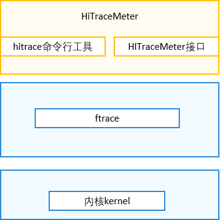

# HiTraceMeter概述

## 简介

HiTraceMeter在OpenHarmony中，为开发者提供业务流程调用链跟踪的维测接口。通过使用该接口所提供的功能，可以帮助开发者迅速获取指定业务流程调用链的运行日志、定位跨设备/跨进程/跨线程的故障问题。HiTraceMeter用来支持用户态的打点，采集用户态和内核态的trace数据,从而进行性能跟踪与分析的系统。

## 基本概念

HiTraceMeter系统主要分为三部分：

- JS/C++应用打点API；
- Trace数据采集命令行工具；
- Trace数据图形分析工具。

其中，前两者运行在设备端侧，图形工具运行在PC主机侧。打点API部分提供了C++和JS接口，供开发过程中打点使用，打点用于产生Trace数据流，是抓Trace数据的基础条件。

命令行工具用于采集Trace数据，用来抓取Trace数据流并保存到文本文件。

Trace数据分析可以在图形工具中人工分析，也可以使用分析脚本自动化分析，Trace分析工具以Trace命令行工具的采集结果数据文件为输入。

  HiTraceMeter跟踪数据使用类别分类，类别分类称作Trace Tag或Trace Category，一般一个端侧软件子系统对应一个Tag。该Tag在打点API中以类别Tag参数传入。Trace命令行工具采集跟踪数据时，只采集Tag类别选项指定的跟踪数据。应用程序跟踪数据标签都是属于APP Tag，从而JS接口不需要输入tag参数。目前HiTraceMeter支持的Trace Tag表如下(可在hitrace_meter.h [hitrace_meter.h](https://gitee.com/openharmony/hiviewdfx_hitrace/blob/master/interfaces/native/innerkits/include/hitrace_meter/hitrace_meter.h) 中查看)：

```cpp
constexpr uint64_t HITRACE_TAG_NEVER = 0; // This tag is never enabled.
constexpr uint64_t HITRACE_TAG_ALWAYS = (1ULL << 0); // This tag is always enabled.
constexpr uint64_t HITRACE_TAG_DLP_CREDENTIAL = (1ULL << 21); // This tag is dlp credential service.
constexpr uint64_t HITRACE_TAG_ACCESS_CONTROL = (1ULL << 22); // This tag is access control tag.
constexpr uint64_t HITRACE_TAG_NET = (1ULL << 23); // Net tag.
constexpr uint64_t HITRACE_TAG_NWEB = (1ULL << 24); // NWeb tag.
constexpr uint64_t HITRACE_TAG_HUKS = (1ULL << 25); // This tag is huks.
constexpr uint64_t HITRACE_TAG_USERIAM = (1ULL << 26); // This tag is useriam.
constexpr uint64_t HITRACE_TAG_DISTRIBUTED_AUDIO = (1ULL << 27); // Distributed audio tag.
constexpr uint64_t HITRACE_TAG_DLSM = (1ULL << 28); // device security level tag.
constexpr uint64_t HITRACE_TAG_FILEMANAGEMENT = (1ULL << 29); // filemanagement tag.
constexpr uint64_t HITRACE_TAG_OHOS = (1ULL << 30); // OHOS generic tag.
constexpr uint64_t HITRACE_TAG_ABILITY_MANAGER = (1ULL << 31); // Ability Manager tag.
constexpr uint64_t HITRACE_TAG_ZCAMERA = (1ULL << 32); // Camera module tag.
constexpr uint64_t HITRACE_TAG_ZMEDIA = (1ULL << 33); // Media module tag.
constexpr uint64_t HITRACE_TAG_ZIMAGE = (1ULL << 34); // Image module tag.
constexpr uint64_t HITRACE_TAG_ZAUDIO = (1ULL << 35); // Audio module tag.
constexpr uint64_t HITRACE_TAG_DISTRIBUTEDDATA = (1ULL << 36); // Distributeddata manager module tag.
constexpr uint64_t HITRACE_TAG_MDFS = (1ULL << 37); // Mobile distributed file system tag.
constexpr uint64_t HITRACE_TAG_GRAPHIC_AGP = (1ULL << 38); // Graphic module tag.
constexpr uint64_t HITRACE_TAG_ACE = (1ULL << 39); // ACE development framework tag.
constexpr uint64_t HITRACE_TAG_NOTIFICATION = (1ULL << 40); // Notification module tag.
constexpr uint64_t HITRACE_TAG_MISC = (1ULL << 41); // Notification module tag.
constexpr uint64_t HITRACE_TAG_MULTIMODALINPUT = (1ULL << 42); // Multi modal module tag.
constexpr uint64_t HITRACE_TAG_SENSORS = (1ULL << 43); // Sensors mudule tag.
constexpr uint64_t HITRACE_TAG_MSDP = (1ULL << 44); // Multimodal Sensor Data Platform module tag.
constexpr uint64_t HITRACE_TAG_DSOFTBUS = (1ULL << 45); // Distributed Softbus tag.
constexpr uint64_t HITRACE_TAG_RPC = (1ULL << 46); // RPC and IPC tag.
constexpr uint64_t HITRACE_TAG_ARK = (1ULL << 47); // ARK tag.
constexpr uint64_t HITRACE_TAG_WINDOW_MANAGER = (1ULL << 48); // window manager tag.
constexpr uint64_t HITRACE_TAG_ACCOUNT_MANAGER = (1ULL << 49); // account manager tag.
constexpr uint64_t HITRACE_TAG_DISTRIBUTED_SCREEN = (1ULL << 50); // Distributed screen tag.
constexpr uint64_t HITRACE_TAG_DISTRIBUTED_CAMERA = (1ULL << 51); // Distributed camera tag.
constexpr uint64_t HITRACE_TAG_DISTRIBUTED_HARDWARE_FWK = (1ULL << 52); // Distributed hardware fwk tag.
constexpr uint64_t HITRACE_TAG_GLOBAL_RESMGR = (1ULL << 53); // Global resource manager tag.
constexpr uint64_t HITRACE_TAG_DEVICE_MANAGER = (1ULL << 54); // Distributed hardware devicemanager tag.
constexpr uint64_t HITRACE_TAG_SAMGR = (1ULL << 55); // SA tag.
constexpr uint64_t HITRACE_TAG_POWER = (1ULL << 56); // power manager tag.
constexpr uint64_t HITRACE_TAG_DISTRIBUTED_SCHEDULE = (1ULL << 57); // Distributed schedule tag.
constexpr uint64_t HITRACE_TAG_DEVICE_PROFILE = (1ULL << 58); // device profile tag.
constexpr uint64_t HITRACE_TAG_DISTRIBUTED_INPUT = (1ULL << 59); // Distributed input tag.
constexpr uint64_t HITRACE_TAG_BLUETOOTH = (1ULL << 60); // bluetooth tag.
constexpr uint64_t HITRACE_TAG_ACCESSIBILITY_MANAGER = (1ULL << 61); // accessibility manager tag.
constexpr uint64_t HITRACE_TAG_APP = (1ULL << 62); // App tag.

constexpr uint64_t HITRACE_TAG_LAST = HITRACE_TAG_APP;
constexpr uint64_t HITRACE_TAG_NOT_READY = (1ULL << 63); // Reserved for initialization.
constexpr uint64_t HITRACE_TAG_VALID_MASK = ((HITRACE_TAG_LAST - 1) | HITRACE_TAG_LAST);
```

## 实现原理

HiTraceMeter主要提供抓取用户态和内核态Trace数据的命令行工具，提供用户态打点的innerkits接口（c++）和kits接口（js），HiTraceMeter基于内核ftrace提供的用户态打点的扩展，利用ftrace的trace_marker节点，将用户空间通过打点接口写入的数据写进内核循环buffer缓冲区。其基本架构图如下：





## 约束与限制

- HiTraceMeter所有功能与接口的实现都依赖于内核提供的ftrace功能，ftrace 是内核提供的一个 framework，采用 plugin 的方式支持开发人员添加更多种类的 trace 功能，因此使用HiTraceMeter之前要使能 ftrace，否则HiTraceMeter的功能无法使用（目前大部分Linux内核默认使能了ftrace，关于ftrace的详细介绍可查看内核ftrace相关资料 
  [ftrace相关资料](https://blog.csdn.net/Luckiers/article/details/124646205) ）。
- HiTraceMeter仅限小型系统、标准系统下使用。
  
  

# HiTraceMeter开发指导

HiTraceMeter分为JS/C++应用打点API与数据采集命令行工具hitrace，下面分别介绍接口和命令行工具。


## 场景介绍

在实际开发过程中，开发者可能会遇到app卡顿或者在代码调试过程中需要查看代码调用流程，HiTraceMeter接口提供了相应的接口来跟踪程序延时和代码调用流程，分析性能问题。

## 接口说明

C++接口仅系统开发者使用，JS（目前暂未开放js接口）应用开发者可以略过本节。标准系统上接口描述如下（hitrace_meter.h  [hitrace_meter.h](https://gitee.com/openharmony/hiviewdfx_hitrace/blob/master/interfaces/native/innerkits/include/hitrace_meter/hitrace_meter.h) ）：

**表 1**  同步接口

| Sync trace                                                                   | 功能描述      | 参数说明                                                                  |
|:---------------------------------------------------------------------------- | --------- | --------------------------------------------------------------------- |
| void StartTrace(uint64_t label, const std::string& value, float limit = -1); | 启动同步trace | label: Trace category。<br />value: Trace携带的信息，表明当前的某种状态，例如内存大小，队列长短等。 |
| void FinishTrace(uint64_t label);                                            | 关闭同步trace | label: Trace category。                                                |

同步接口StartTrace和FinishTrace必须配对使用，FinishTrace和前面最近的StartTrace进行匹配。StartTrace和FinishTrace函数对可以嵌套模式使用，跟踪数据解析时使用栈式数据结构进行匹配。接口中的limit参数用于限流，使用默认值即可。

**表 2**  异步接口

| Async trace                                                                                       | 功能描述      | 参数说明                                                                                                 |
| ------------------------------------------------------------------------------------------------- | --------- | ---------------------------------------------------------------------------------------------------- |
| void StartAsyncTrace(uint64_t label, const std::string& value, int32_t taskId, float limit = -1); | 开启异步trace | label: Trace category。<br />value: Trace携带的信息，表明当前的某种状态，例如内存大小，队列长短等。<br />taskId：异步Trace中用来表示关联的ID。 |
| void FinishAsyncTrace(uint64_t label, const std::string& value, int32_t taskId);                  | 关闭异步trace | label: Trace category。<br />value: Trace携带的信息，表明当前的某种状态，例如内存大小，队列长短等。<br />taskId：异步Trace中用来表示关联的ID。 |


异步接口StartAsyncTrace和FinishAsyncTrace的跟踪数据匹配时，使用参数中的value和taskId配对匹配，可以不按顺序使用，主要用于异步场景。在C++程序中，使用异步跟踪的场景很少。

**表 3**  计数器接口

| Counter Trace                                                      | 功能描述    | 参数说明                                                           |
| ------------------------------------------------------------------ | ------- | -------------------------------------------------------------- |
| void CountTrace(uint64_t label, const std::string& name, int64_t); | 计数trace | label: Trace category。<br />name: Trace的名称，IDE中会以此字段展示这段Trace。 |

## 开发步骤

1. 编译依赖添加，需要修改的编译配置文件base\hiviewdfx\hitrace\cmd\BUILD.gn 。
   
   ```
   external_deps = [ "hitrace:hitrace_meter"]
   ```

2. 头文件依赖添加。
   
   ```cpp
   #include "hitrace_meter.h"//接口函数定义头文件
   ```

3. 接口调用，将需要跟踪的Trace value传入参数，目前HiTraceMeter支持的Trace Tag在基本概念hitrace_meter.h中都已列出，我们以OHOS这个Tag为例，假设我们需要获取func1，func2函数的Trace数据，参考下面实例，在shell中执行hitrace命令后会自动抓取Trace数据，抓到的Trace数据中包括了函数调用过程以及调用过程消耗的内存和时间，可用于分析代码调用流程，代码性能问题。
   
   ```cpp
   #include "hitrace_meter.h" // 包含hitrace_meter.h
   using namespace std;
   
   int main()
   {
      uint64_t label = BYTRACE_TAG_OHOS;
      sleep(1);
      CountTrace(label, "count number", 2000);  // 整数跟踪
   
      StartTrace(label, "func1Trace", -1); // func1Start的跟踪起始点
      sleep(1);
      StartTrace(label, "func2Trace", -1);   // func2Start的跟踪起始点
      sleep(2);
      FinishTrace(label);   // func2Trace的结束点
      sleep(1);
      FinishTrace(label);   // func1Trace的结束点
   
      StartAsyncTrace(label, "asyncTrace1", 1234); // 异步asyncTrace1的开始点   
      FinishAsyncTrace(label, "asyncTrace1", 1234); // 异步asyncTrace1的结束点
   
      return 0;
   } 
   ```

4. 使用方法，打点编译部署完成后，运行下面命令行来抓取Trace。然后在端侧shell里运行应用，可以抓取到Trace数据。
   
   ```
   hdc_std shell hitrace -t 10 ohos > .\myapp_demo.ftrace
   ```
   
   抓取之后的数据可以在smartperf中"Open trace file"或者直接拖入图形区打开，关于smartperf的详细介绍可查看 [smartperf](https://toscode.gitee.com/openharmony-sig/smartperf) 。

## 调测验证

以下为一个demo调试过程，该demo使用了同步接口中的StartTrace和FinishTrace。

1. 编写测试代码hitrace_example.cpp（ [hitrace_example.cpp](https://gitee.com/openharmony/hiviewdfx_hitrace/blob/master/cmd/example/hitrace_example.cpp)  ），将使用到的接口加入代码：
   
   ```cpp
   int main()
   {
       thread t1(ThreadFunc1);
       t1.join();
   
       StartTrace(LABEL, "testStart");
       sleep(SLEEP_ONE_SECOND);
   
       StartTrace(LABEL, "funcAStart", SLEEP_ONE_SECOND); // 打印起始点
       FuncA();
       FinishTrace(LABEL);
       sleep(SLEEP_TWO_SECOND);
   
       thread t2(ThreadFunc2);
       t2.join();
   
       StartTrace(LABEL, "funcBStart", SLEEP_TWO_SECOND);
       FuncB();
       FinishTrace(LABEL);// 打印结束点
       sleep(SLEEP_TWO_SECOND);
   
       sleep(SLEEP_ONE_SECOND);
       FinishTrace(LABEL);
       FuncC();
   
       return 0;
   }
   ```

2. 修改gn编译文件并编译，编译配置文件路径base\hiviewdfx\hitrace\cmd\BUILD.gn 。
   
   ```
   ohos_executable("hitrace_example") {
     sources = [ "example/hitrace_example.cpp" ]
   
     external_deps = [ "hitrace:hitrace_meter" ]
   
     subsystem_name = "hiviewdfx"
     part_name = "hitrace_native"
   }
   
   group("hitrace_target") {
     deps = [
       ":hitrace",
       ":hitrace_example",
     ]
   }
   ```

3. 将编译出来的hitrace_example可执行文件放到设备中的/system/bin目录下，在shell中执行依次执行如下命令：
   
   ```shell
   hitrace --trace_begin ohos
   hitrace_exampe
   hitrace --trace_dump
   ```
   
    当我们看到Trace数据中有我们需要的Trace value时，说明成功抓取Trace，成功的数据如下所示：
   
   ```
   <...>-1651    (-------) [002] ....   327.194136: tracing_mark_write: S|1650|H:testAsync 111
   <...>-1650    (-------) [001] ....   332.197640: tracing_mark_write: B|1650|H:testStart
   <...>-1650    (-------) [001] ....   333.198018: tracing_mark_write: B|1650|H:funcAStart
   <...>-1650    (-------) [001] ....   334.198507: tracing_mark_write: E|1650|
   <...>-1654    (-------) [003] ....   341.201673: tracing_mark_write: F|1650|H:testAsync 111
   <...>-1650    (-------) [001] ....   341.202168: tracing_mark_write: B|1650|H:funcBStart
   <...>-1650    (-------) [001] ....   343.202557: tracing_mark_write: E|1650|
   <...>-1650    (-------) [001] ....   346.203178: tracing_mark_write: E|1650|
   <...>-1650    (-------) [001] ....   346.203457: tracing_mark_write: C|1650|H:count number 1
   <...>-1650    (-------) [001] ....   347.203818: tracing_mark_write: C|1650|H:count number 2
   <...>-1650    (-------) [001] ....   348.204207: tracing_mark_write: C|1650|H:count number 3
   <...>-1650    (-------) [001] ....   349.204473: tracing_mark_write: C|1650|H:count number 4
   <...>-1650    (-------) [001] ....   350.204851: tracing_mark_write: C|1650|H:count number 5
   <...>-1655    (-------) [001] ....   365.944658: tracing_mark_write: trace_event_clock_sync: realtime_ts=1502021460925
   <...>-1655    (-------) [001] ....   365.944686: tracing_mark_write: trace_event_clock_sync: parent_ts=365.944641
   ```
   
   

# HiTraceMeter命令行工具使用指导

HiTraceMeter提供了可执行的二进制程序hitrace，设备刷openharmony后直接在shell中运行以下命令，抓取内核运行的数据，当前支持的操作如下：

**表 4**  命令行列表

| Option                        | Description                                              |
| ----------------------------- | -------------------------------------------------------- |
| -h，--help                     | 查看option帮助                                               |
| -b n，--buffer_size n          | 指定n(KB)内存大小用于存取trace日志，默认2048KB                          |
| -t n，--time n                 | 用来指定trace运行的时间（单位：s），取决于需要分析过程的时间                        |
| --trace_clock clock           | trace输出的时钟类型，一般设备支持boot、global、mono、uptime、perf等，默认为boot |
| --trace_begin                 | 启动抓trace                                                 |
| --trace_dump                  | 将数据输出到指定位置（默认控制台）                                        |
| --trace_finish                | 停止抓trace，并将数据输出到指定位置（默认控制台）                              |
| --trace_finish_nodump         | 停止抓trace，不输出trace信息                                 |
| -l，--list_categories          | 输出手机能支持的trace模块                                          |
| --overwrite                   | 当缓冲区满的时候，将丢弃最新的信息。（默认丢弃最老的日志）                            |
| -o filename，--output filename | 指定输出的目标文件名称                                              |
| -z                            | 抓取trace后进行压缩                                             |

以下是常用hitrace命令示例，供开发者参考：

- 查询支持的label。
  
  ```
  
  hitrace -l
  
  ```
  
  或者
  
  ```
  
  hitrace --list_categories
  
  ```

- 设置4M缓存，抓取10秒，抓取label为ability的trace信息。
  
  ```
  
  hitrace -b 4096 -t 10 --overwrite ability > /data/log/mytrace.ftrace
  
  ```

- 设置trace的输出时钟为mono。
  
  ```
  
  hitrace --trace_clock mono  -b 4096 -t 10 --overwrite ability > /data/log/mytrace.ftrace
  
  ```

- 抓取trace后进行压缩。
  
  ```
  
  hitrace -z  -b 4096 -t 10 --overwrite ability > /data/log/mytrace.ftrace
  
  ```
  
  

# 常见问题

### hitrace抓数据不全或者没抓到数据

#### 现象描述

执行hitrace命令抓数据不全或者没抓到数据。

#### 根因分析

参数-t 时间设置过小或者-b缓冲区buffer设置过小导致数据丢失。

#### 解决方法

可设置-t 60，-b 204800扩大抓trace时间和缓冲区buffer解决。


# 参考

更多关于HiTraceMeter的详细内容请参考：[轻量级的分布式调用链跟踪](https://gitee.com/openharmony/hiviewdfx_hitrace) 。
