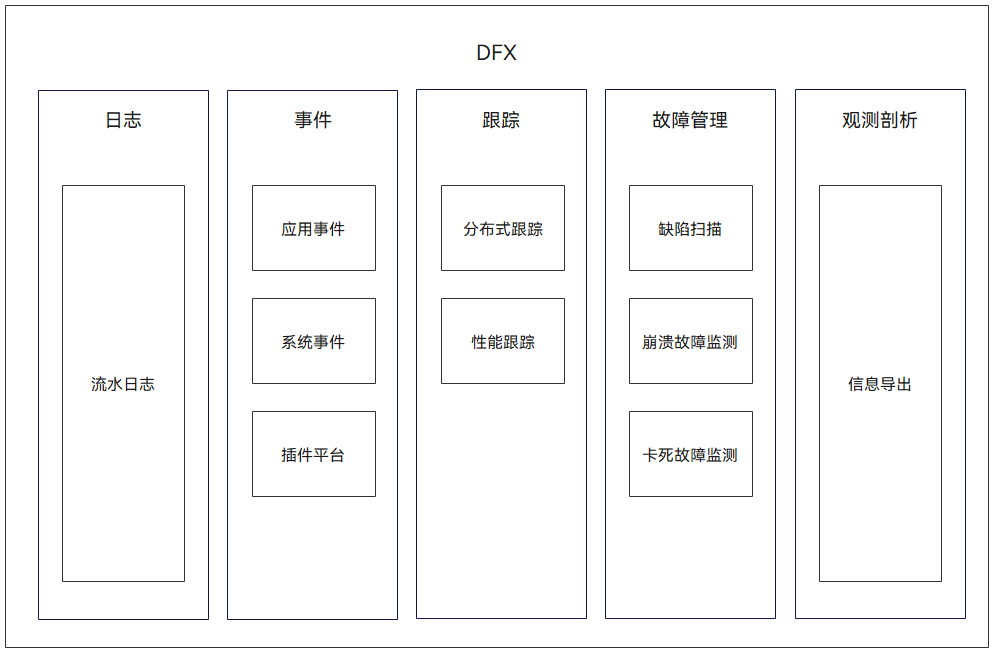

# DFX概述

## 简介

在OpenHarmony中，DFX([Design for X](https://en.wikipedia.org/wiki/Design_for_X))是为了提升质量属性的软件设计，目前包含的内容主要有：DFR（Design for Reliability，可靠性）和DFT（Design for Testability，可测试性）特性。

提供以下功能：

- HiLog流水日志，标准系统类设备（参考内存≥128MB）适用、HiLog_Lite轻量流水日志，轻量系统类设备（参考内存≥128KiB），小型系统类设备（参考内存≥1MiB）适用。

- HiTraceChain分布式跟踪，标准系统类设备（参考内存≥128MiB）适用。

- HiTraceMeter性能跟踪，标准系统类设备（参考内存≥128MiB）适用。

- HiCollie卡死故障检测，标准系统类设备（参考内存≥128MiB）适用。

- HiSysEvent系统事件埋点，标准系统类设备（参考内存≥128MiB）适用。

- HiDumper信息导出，标准系统类设备（参考内存≥128MB）适用。

- Faultlogger崩溃故障检测，标准系统类设备（参考内存≥128MB）适用。

- Hiview插件平台，标准系统类设备（参考内存≥128MB）适用。

- HiAppEvent应用事件及HiChecker缺陷扫描仅供应用开发者使用。

## 基本概念

**流水日志：**

流水日志是系统运行过程中产生的一些日志信息，用于开发人员了解系统或应用运行过程、状态。

**分布式跟踪：**

在一个分布式系统中，一次业务的发起往往会涉及多个软件模块，通过进程内、进程间、设备间的通信接口进行控制和数据传递，为了便于开发人员对这类复杂流程的理解和问题跟踪定界，DFX提供了一个分布式跟踪框架。

**线程卡死故障：**

线程在运行过程中，如果进入死循环，或者陷入内核态（Uninterruptable Sleep、Traced、Zombie等状态，或者其他同步等待状态），将无法响应正常的业务请求，且无法自己实现故障的感知和恢复。检测和定位这类故障需要通过一个简单的watchdog机制，在易于发生卡死的流程中插入检测点，在发生卡死故障的时候，进行故障恢复和日志采集。

**埋点：**

是在程序关键处理流程中加入一些代码，采集程序运行过程中信息的一种技术，用于支持分析产品的使用情况。

**系统事件：**

是OpenHarmony系统某种状态产生的一种标识，通过定义各种事件用于分析系统的状态变化情况。
<!--no_check-->
