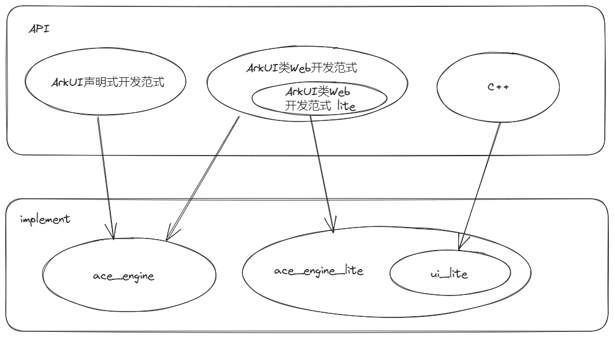
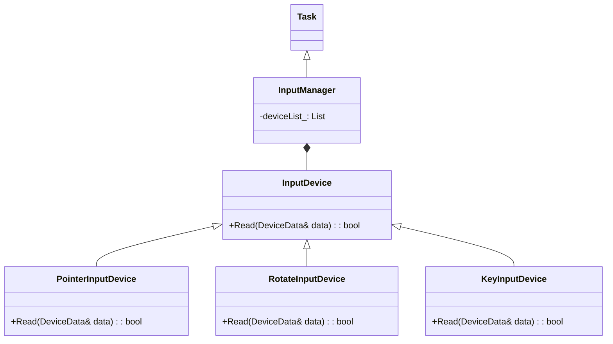
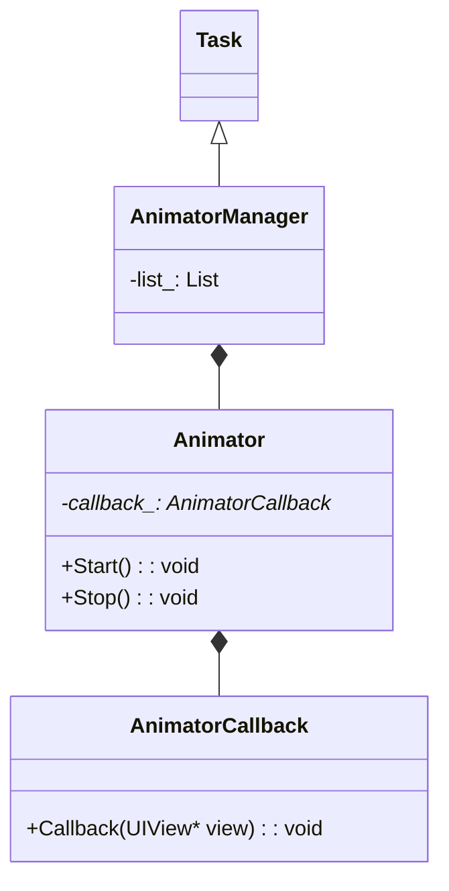
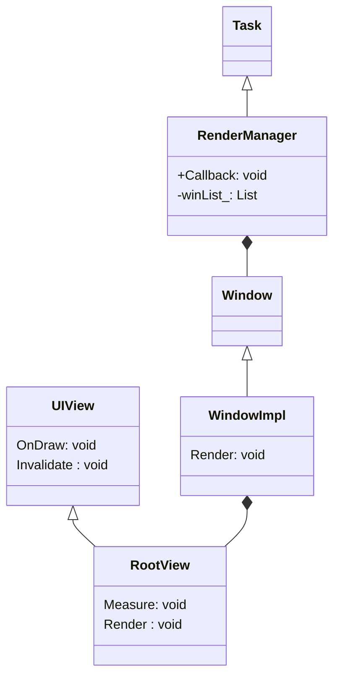

# 小型系统图形图像框架介绍

## 概述
小型系统图形图像子系统是一套轻量级图形框架，框架包括轻量级 UI 控件、动画、事件、2D 图形库、字体布局引擎、多后端渲染和窗口管理等模块，主要用于运动手表、智能家居等小型带屏设备的图形 UI 显示。

### OpenHarmony 中各 UI 之间的关系
当前对于 OpenHarmony 应用界面开发，你可能已经了解到几个不同的概念，比如 ArkUI 声明式开发范式、ArkUI 类 Web 开发范式等，那他们和当前小型系统图形图像框架之间是什么关系呢？

当前 [ace_engine](https://gitee.com/openharmony/arkui_ace_engine)  实现了标准系统的 ArkUI 声明式开发范式和 ArkUI 类 Web 开发范式两套开发框架，他们之间的详细对比可以参考 [方舟开发框架（ArkUI）概述](../../application-dev/ui/arkui-overview.md)；根据小型系统的特点 [ace_engine_lite](https://gitee.com/openharmony/arkui_ace_engine_lite) 实现了轻量级的 ArkUI 类 Web 开发范式 lite 版本，其能力是 ArkUI 类 Web 开发范式的子集。

按照系统类型分类如下：
- 标准系统：
  - ArkUI 声明式开发范式 (推荐)
  - ArkUI 类 Web 开发范式
- 小型系统：
  - ArkUI 类 Web 开发范式 Lite
  - C++ (系统应用)

小型系统图形图像框架中的 [ui_lite](https://gitee.com/openharmony/arkui_ui_lite) 和 [ace_engine_lite](https://gitee.com/openharmony/arkui_ace_engine_lite)、 [ace_engine](https://gitee.com/openharmony/arkui_ace_engine) 的代码实现关系如下图：

如何确定应用开发所需的 API 套件？对于标准系统，优先选择 ArkUI 声明式开发范式；对于小型系统，请优先考虑使用 ArkUI 类 Web 开发范式 lite。而在某些配置较低的设备上进行系统应用开发时，则可以考虑选择 C++ API，因为相比类 Web 范式，它具有更高的性能和更好的灵活性。

### UI 控件
实现各种控件，如按钮、文本、进度条等各种基本控件。

提供列表、Swiper、图片序列帧等复杂控件。

### 布局
实现网格布局、灵活布局（如居中、左对齐、右对齐）。

布局为一次性布局。布局函数每运行一次，会计算一次控件的位置，但是控件位置由其他方式改变时（如拖动），其他相关联的控件位置不会自动发生变化，需要重新调用一次布局函数。

### 动画
框架支持自定义动画，所有动画由 AnimatorManager 管理，根据屏幕刷新事件，由 AnimatorManager 周期性调用回调函数处理修改属性变化，然后触发刷新重新绘制组件，达到组件动画效果。

提供动画的开始/停止、暂停/恢复、创建/销毁等各种操作 ，用于实现动画效果。

### 事件
Input 事件包括触摸屏触摸输入事件和物理按键输入事件，引擎每运行一次，InputManager 是管理所有输入设备的模块，GUI 引擎每运行一次，InputManager 会读取一次所有注册的硬件设备的输入，转化为各种事件供UI控件使用。

### 绘制
2D 图形绘制： 实现线、矩形、三角形、弧线的绘制操作。

图像绘制：实现各种类型图片的绘制能力，如 RGB565、RGB888、ARGB8888、PNG、JPG 格式。

字体绘制：支持矢量字体的实时绘制、布局排版。

## 实现原理

小型系统图形框架中，任务队列由屏幕刷新同步信号驱动。每个任务都是一个 task，并存放在任务队列中。周期性的屏幕刷新信号触发周期性回调，从而循环驱动任务队列中的 task 执行。输入事件、动画和渲染等操作均作为单独的 task 运行。

### 事件交互

当前图形框架支持触摸事件（PointerInputDevice）、按键事件（KeyInputDevice）、旋转表冠事件（RotateInputDevice）。

输入事件相关类图如上，每类输入事件根据自己特点，重写 InputDevice 基类的 Read 函数，读取对应的输入数据，然后根据输入数据生成对应的事件分发给 UI 控件，如 PointerInputDevice 读取触摸的坐标点，根据坐标点，从组件树查找当前坐标对应的控件，生成对应的点击、长按、拖拽事件，分发给对应控件。

### 动效框架

每一个自定义动画都需要继承自 Animator 类，实现 AnimatorCallback 的 Callback 接口。所有的 Animator 都由 AnimatorManager 统一管理。 Callback 接口入参为当前动画的 View，可以通过修改 View 对应的属性来产生动画效果，如坐标位置、颜色变换、缩放效果等。

### 渲染框架

 - 每一个窗口 Window 持有一个 RootView
 - RootView 为当前窗口的根节点，当前窗口所有控件都必须挂载在 RootView 下才能显示
 - UIView 为所有 View 的基类，每个 View 实现自己的 OnDraw 绘制函数
 - 每个 View 显示发生变化时，调用 Invalidate 函数，将当前区域标记为脏区域
 - RootView 统一管理当前窗口所有的脏区域信息
 - 每次刷新信号触发，会遍历绘制所有的 Window，每个 Window 从 RootView 开始先进行 Measure 布局，然后调用 Render 函数绘制，遍历绘制所有脏区域内的 View。

