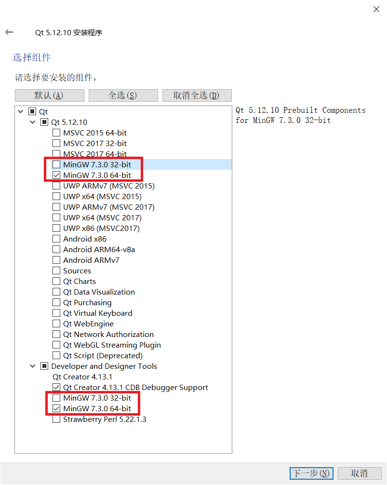
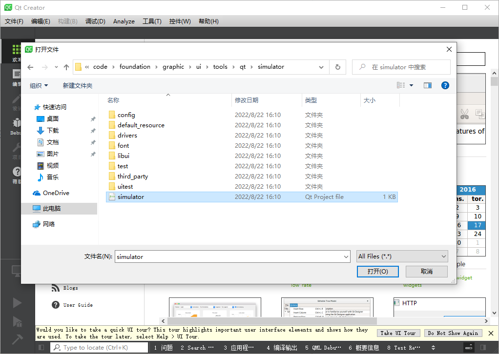
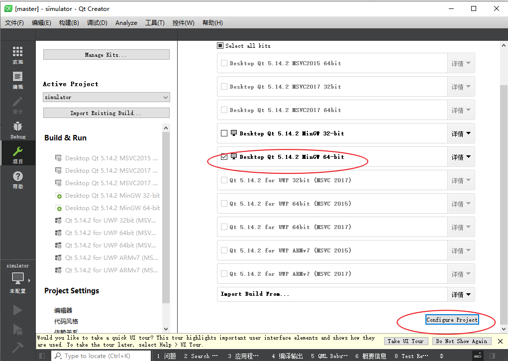
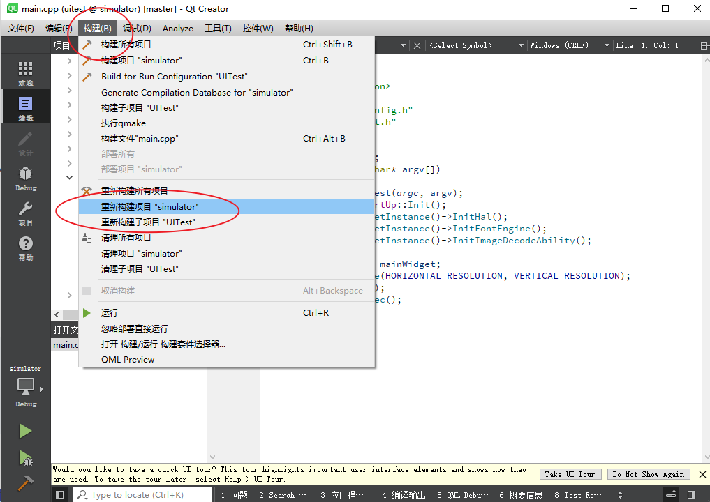
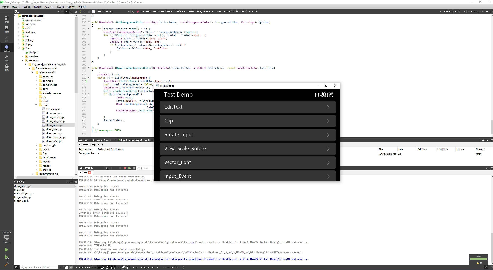

# Windows QT 模拟器使用指导

本文介绍在 Windows 系统下如何使用 Qt Creator 模拟器快速开发调试图形框架，Qt Creator 是跨平台的集成开发环境（IDE），通过此IDE，开发者可以快速上手和操作，高效且相对轻松地完成项目和程序的开发工作。当前图形框架也提供了 Qt Creator 运行工程，方便开发者快速上手熟悉图形框架。

主要内容有：在PC端如何安装 QT、Git 软件，获取 UI 模拟器最小代码仓，实现程序编译和运行。

## 软件安装

此次需下载安装 QT Creator 和 Git 软件，详细步骤如下：

### QT Creator 安装
Qt 可在官网 [https://www.qt.io/offline-installers](https://www.qt.io/offline-installers) 下载。

注意安装时必须包含以下3个组件：



### Git 安装
Git 下载网址：[Git官网链接](https://git-scm.com/)


双击下载的安装程序，按引导界面完成安装即可。

## 获取UI模拟器最小代码仓

### 源码获取

使用 git 命令拉取 UI 模拟器最小代码仓：

```git
git clone https://gitee.com/openharmony/arkui_ui_lite.git                        -b   master  foundation/arkui/ui_lite
git clone https://gitee.com/openharmony/graphic_graphic_utils_lite.git           -b   master  foundation/graphic/graphic_utils_lite

git clone https://gitee.com/openharmony/graphic_surface_lite.git                 -b   master  foundation/graphic/surface_lite
git clone https://gitee.com/openharmony/window_window_manager_lite.git           -b   master  foundation/window/window_window_manager_lite

git clone https://gitee.com/openharmony/third_party_zlib.git                     -b   master  third_party/zlib
git clone https://gitee.com/openharmony/third_party_qrcodegen.git                -b   master  third_party/qrcodegen
git clone https://gitee.com/openharmony/third_party_libpng.git                   -b   master  third_party/libpng
git clone https://gitee.com/openharmony/third_party_libjpeg.git                  -b   master  third_party/libjpeg
git clone https://gitee.com/openharmony/third_party_icu.git                      -b   master  third_party/icu
git clone https://gitee.com/openharmony/third_party_harfbuzz.git                 -b   master  third_party/harfbuzz
git clone https://gitee.com/openharmony/third_party_freetype.git                 -b   master  third_party/freetype
git clone https://gitee.com/openharmony/third_party_bounds_checking_function.git -b   master  third_party/bounds_checking_function
git clone https://gitee.com/openharmony/third_party_cJSON.git                    -b   master  third_party/cJSON
git clone https://gitee.com/openharmony/third_party_giflib.git                   -b   master  third_party/giflib
git clone https://gitee.com/openharmony/third_party_libjpeg-turbo.git            -b   master  third_party/libjpeg-turbo
```

1. 新建一个源码工程目录。
2. 在新建目录按鼠标右键选择 Git Bash Here。
3. 复制粘贴上面命令到终端回车等待下载。或者在当前目录新建一个clone.bat文件，将上面命令复制保存，双击运行clone.bat，等待下载完成。

  

### 打开 QT Creator

1. 点击菜单：文件—>打开文件或项目。
2. 弹出的文件选择框中选择工程项目。

   参考源码路径：
   ```bash
   foundation/arkui/ui_lite/tools/qt/simulator/simulator.pro
   ```

   注意：第一次打开项目时，需要在 Configure Project 界面，kits 列表中勾选 minGW（仅勾选 minGW）。

   

3. 点击 configure project 按钮加载工程。

   

### UI Test应用运行入口

展开项目树。

```
simulator
  |-UITest
    |-Sources
      |-main.cpp
```


### 编译

依次点击：**构建—>编译项目**，或者直接在项目树中右键，在右键菜单中选择**重新构建**即可。



### 调试

点击左下角运行三角形即可运行代码，点击调试按钮即可运行调试。




