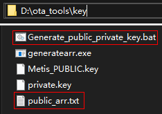

# OTA升级<a name="ZH-CN_TOPIC_0000001052170816"></a>

-   [约束与限制](#section691733275418)
-   [生成公私钥对](#section94411533155010)
-   [生成升级包](#section632383718539)
-   [上传升级包](#section5772112473213)
-   [下载升级包](#section251732474917)
-   [厂商应用集成OTA能力](#section298217330534)
-   [API应用场景-默认场景](#section7685171192916)
    -   [开发指导](#section0745926153017)
    -   [示例代码](#section1337111363306)

-   [API应用场景-定制场景](#section1686395317306)
    -   [开发指导](#section524515314317)
    -   [示例代码](#section525974743120)

-   [系统升级](#section151997114334)

OTA（Over the Air）提供对设备远程升级的能力，可以让您的设备（如IP摄像头等），轻松支持远程升级能力。目前仅支持全量包升级，暂不支持差分包升级。全量包升级是将新系统全部内容做成升级包，进行升级；差分包升级是将新老系统的差异内容做成升级包，进行升级。

## 约束与限制<a name="section691733275418"></a>

-   支持基于Hi3861/Hi3518EV300/Hi3516DV300芯片的开源套件。
-   对Hi3518EV300/Hi3516DV300开源套件，设备需要支持SD卡（VFAT格式）。

## 生成公私钥对<a name="section94411533155010"></a>

1.  准备工作：在Windows PC 上，下载安装OpenSSL工具，并配置环境变量。OpenSSL下载路径：

    [http://slproweb.com/products/Win32OpenSSL.html](http://slproweb.com/products/Win32OpenSSL.html)

2.  在tools\\update\_tools\\update\_pkg\_tools目录下，下载升级包制作工具，保存到Windows本地路径，例如D:\\ota\_tools。
3.  如图，运行ota\_tools\\key下的Generate\_public\_private\_key.bat ，生成公钥Metis\_PUBLIC.key、私钥private.key和公钥对应的数组public\_arr.txt文件，请妥善保管私钥private.key。

    **图 1**  生成公私钥对<a name="fig12913135294011"></a>  
    

    

4.  用public\_arr.txt里面的全部内容替换OTA模块base\\update\\ota\_lite\\frameworks\\source\\verify\\hota\_verify.c中的g\_pubKeyBuf 。

    示例，public\_arr.txt内容

    ```
    0x30,0x82,0x1,0xa,0x2,0x82,0x1,0x1,0x0,0xc7,0x8c,0xf3,0x91,0xa1,0x98,0xbf,0xb1,0x8c,
    0xbe,0x22,0xde,0x32,0xb2,0xfa,0xec,0x2c,0x69,0xf6,0x8f,0x43,0xa7,0xb7,0x6f,0x1e,0x4a,0x97,
    0x4b,0x27,0x5d,0x56,0x33,0x9a,0x73,0x4e,0x7c,0xf8,0xfd,0x1a,0xf0,0xe4,0x50,0xda,0x2b,0x8,
    0x74,0xe6,0x28,0xcc,0xc8,0x22,0x1,0xa8,0x14,0x9,0x46,0x46,0x6a,0x10,0xcd,0x39,0xd,0xf3,
    0x4a,0x7f,0x1,0x63,0x21,0x33,0x74,0xc6,0x4a,0xeb,0x68,0x40,0x55,0x3,0x80,0x1d,0xd9,0xbc,
    0xd4,0xb0,0x4a,0x84,0xb7,0xac,0x43,0x1d,0x76,0x3a,0x61,0x40,0x23,0x3,0x88,0xcc,0x80,0xe,
    0x75,0x10,0xe4,0xad,0xac,0xb6,0x4c,0x90,0x8,0x17,0x26,0x21,0xff,0xbe,0x1,0x82,0x16,0x76,
    0x9a,0x1c,0xee,0x8e,0xd9,0xb0,0xea,0xd5,0x50,0x61,0xcc,0x9c,0x2e,0x78,0x15,0x2d,0x1f,0x8b,
    0x94,0x77,0x30,0x39,0x70,0xcf,0x16,0x22,0x82,0x99,0x7c,0xe2,0x55,0x37,0xd4,0x76,0x9e,0x4b,
    0xfe,0x48,0x26,0xc,0xff,0xd9,0x59,0x6f,0x77,0xc6,0x92,0xdd,0xce,0x23,0x68,0x83,0xbd,0xd4,
    0xeb,0x5,0x1b,0x2a,0x7e,0xda,0x9a,0x59,0x93,0x41,0x7b,0x4d,0xef,0x19,0x89,0x4,0x8d,0x5,
    0x7d,0xbc,0x3,0x1f,0x77,0xe6,0x3d,0xa5,0x32,0xf5,0x4,0xb7,0x9c,0xe9,0xfa,0x6e,0xc,0x9f,
    0x4,0x62,0xfe,0x2a,0x5f,0xbf,0xeb,0x9a,0x73,0xa8,0x2a,0x72,0xe3,0xf0,0x57,0x56,0x5c,0x59,
    0x14,0xdd,0x79,0x11,0x42,0x3a,0x48,0xf7,0xe8,0x80,0xb1,0xaf,0x1c,0x40,0xa2,0xc6,0xec,0xf5,
    0x67,0xc1,0x88,0xf6,0x26,0x5c,0xd3,0x11,0x5,0x11,0xed,0xb1,0x45,0x2,0x3,0x1,0x0,0x1,
    ```

    示例，OTA模块的公钥

    ```
    #define PUBKEY_LENGTH 270
    
    static uint8 g_pubKeyBuf[PUBKEY_LENGTH] = {
        0x30, 0x82, 0x01, 0x0A, 0x02, 0x82, 0x01, 0x01, 0x00, 0xBF, 0xAA, 0xA5, 0xB3, 0xC2, 0x78, 0x5E,
        0x63, 0x07, 0x84, 0xCF, 0x37, 0xF0, 0x45, 0xE8, 0xB9, 0x6E, 0xEF, 0x04, 0x88, 0xD3, 0x43, 0x06,
    ```

5.  对Hi3518EV300/Hi3516DV300套件，在上一步的基础上，还需用public\_arr.txt里面的全部内容替换uboot模块device\\hisilicon\\third\_party\\uboot\\u-boot-2020.01\\product\\hiupdate\\verify\\update\_public\_key.c中的g\_pub\_key中的全部内容。

    示例，uboot模块的公钥

    ```
    static unsigned char g_pub_key[PUBKEY_LEN] = {
    	0x30, 0x82, 0x01, 0x0A, 0x02, 0x82, 0x01, 0x01,
    	0x00, 0xBF, 0xAA, 0xA5, 0xB3, 0xC2, 0x78, 0x5E,
    ```


## 生成升级包<a name="section632383718539"></a>

1.  在ota\_tools\\Components目录下，归放需要升级的文件。

    **图 2**  原始镜像归放位置<a name="fig98691649182817"></a>  
    

    

    **表 1**  升级包内的文件

    <a name="table49058318812"></a>
    <table><thead align="left"><tr id="row16905131385"><th class="cellrowborder" valign="top" width="18.790000000000003%" id="mcps1.2.3.1.1"><p id="p390543111811"><a name="p390543111811"></a><a name="p390543111811"></a>包内文件名</p>
    </th>
    <th class="cellrowborder" valign="top" width="81.21000000000001%" id="mcps1.2.3.1.2"><p id="p139066318815"><a name="p139066318815"></a><a name="p139066318815"></a>说明</p>
    </th>
    </tr>
    </thead>
    <tbody><tr id="row3906631180"><td class="cellrowborder" valign="top" width="18.790000000000003%" headers="mcps1.2.3.1.1 "><p id="p14906331987"><a name="p14906331987"></a><a name="p14906331987"></a>u-boot.bin</p>
    </td>
    <td class="cellrowborder" valign="top" width="81.21000000000001%" headers="mcps1.2.3.1.2 "><p id="p11368820172317"><a name="p11368820172317"></a><a name="p11368820172317"></a>将编译生成的u-boot-hi351XevX00.bin文件重命名后得到。</p>
    </td>
    </tr>
    <tr id="row775316253222"><td class="cellrowborder" valign="top" width="18.790000000000003%" headers="mcps1.2.3.1.1 "><p id="p14753102517226"><a name="p14753102517226"></a><a name="p14753102517226"></a>kernel.bin</p>
    </td>
    <td class="cellrowborder" valign="top" width="81.21000000000001%" headers="mcps1.2.3.1.2 "><p id="p675362582216"><a name="p675362582216"></a><a name="p675362582216"></a>将编译生成的liteos.bin/kernel文件重命名后得到。</p>
    </td>
    </tr>
    <tr id="row2171010122214"><td class="cellrowborder" valign="top" width="18.790000000000003%" headers="mcps1.2.3.1.1 "><p id="p2017171022212"><a name="p2017171022212"></a><a name="p2017171022212"></a>rootfs.img</p>
    </td>
    <td class="cellrowborder" valign="top" width="81.21000000000001%" headers="mcps1.2.3.1.2 "><p id="p618310192211"><a name="p618310192211"></a><a name="p618310192211"></a>将编译生成的rootfs_xxxxx.img文件重命名后得到。</p>
    </td>
    </tr>
    <tr id="row1499631732214"><td class="cellrowborder" valign="top" width="18.790000000000003%" headers="mcps1.2.3.1.1 "><p id="p999617175226"><a name="p999617175226"></a><a name="p999617175226"></a>config</p>
    </td>
    <td class="cellrowborder" valign="top" width="81.21000000000001%" headers="mcps1.2.3.1.2 "><p id="p199621712227"><a name="p199621712227"></a><a name="p199621712227"></a>与开发板类型和内核类型相关，参考开源套件的SD卡烧写说明。</p>
    </td>
    </tr>
    <tr id="row8996101712222"><td class="cellrowborder" valign="top" width="18.790000000000003%" headers="mcps1.2.3.1.1 "><p id="p4996141772214"><a name="p4996141772214"></a><a name="p4996141772214"></a>OTA.tag</p>
    </td>
    <td class="cellrowborder" valign="top" width="81.21000000000001%" headers="mcps1.2.3.1.2 "><p id="p1735535514293"><a name="p1735535514293"></a><a name="p1735535514293"></a>共32字节，内容为：“package_type:otaA1S2D3F4G5H6J7K8”；其中后16字节为随机数，需要随版本变化。</p>
    </td>
    </tr>
    </tbody>
    </table>

2.  修改ota\_tools\\xml下的packet\_harmony.xml文件，配置compAddr分区名，对应ota\_tools\\Components\\的文件，其它项不需修改，作为扩展项预留。

    示例，配置组件信息

    ```
        <group name="own">
            <list>
                <component compAddr="rootfs" compId="0x0017" resType="0x05" isDelete="0x00" compType ="0x00" compVer="1.0">.\Components\rootfs_jffs2.img</component>
    			<component compAddr="kernel_A" compId="0x0018" resType="0x05" isDelete="0x00" compType ="0x00" compVer="1.1">.\Components\liteos.bin</component>
    			<component compAddr="data" compId="0x0019" resType="0x05" isDelete="0x00" compType ="0x00" compVer="1.2">.\Components\userfs_jffs2.img</component>
            </list>
    ```

3.  将生成的公私钥路径配置到ota\_tools\\xml路径下的packet\_harmony.xml中。

    示例，配置公私钥路径

    ```
    <encryption>
        <privateKey type="der">.\key\private.key</privateKey>
        <publicKey type="der">.\key\Metis_PUBLIC.key</publicKey>
    </encryption>
    ```

4.  在ota\_tools\\VersionDefine.bat中设置产品名称、软件版本号（用于防回滚校验）。

    示例，配置产品名称和版本号

    ```
    set FILE_PRODUCT_NAME=Hisi
    
    @rem 设置软件版本号 不要超过16位
    set SOFTWARE_VER=OpenHarmony 1.1 
    ```

5.  执行ota\_tools下的Make\_Harmony\_PKG.bat，生成升级包Hisi\_OpenHarmony 1.1.bin。升级包通过SHA256+RSA2048方式签名，保证完整性和合法性。

    **图 3**  升级包制作工具<a name="fig046712449315"></a>  
    

    


## 上传升级包<a name="section5772112473213"></a>

将升级包Hisi\_OpenHarmony 1.1.bin上传到厂商的OTA服务器。

## 下载升级包<a name="section251732474917"></a>

1.  厂商应用从OTA服务器下载Hisi\_OpenHarmony 1.1.bin。
2.  对Hi3518EV300/Hi3516DV300开源套件，需要插入SD卡\(容量\>100MBytes\)。

## 厂商应用集成OTA能力<a name="section298217330534"></a>

-   调用OTA模块的动态库libhota.so，对应头文件位于：base\\update\\ota\_lite\\interfaces\\kits\\hota\_partition.h&hota\_updater.h；
-   libhota.so对应的源码路径为base\\update\\ota\_lite\\frameworks\\source。
-   API的使用方法，见本文“API应用场景”和API文档的OTA接口章节。
-   如果需要适配开发板，请参考HAL层头文件：base\\update\\ota\_lite\\hals\\hal\_hota\_board.h。

## API应用场景-默认场景<a name="section7685171192916"></a>

升级包是按照上文“生成公私钥对”和“生成升级包”章节制作的。

### **开发指导**<a name="section0745926153017"></a>

1.  应用侧通过下载，获取当前设备升级包后，调用HotaInit接口初始化OTA模块。
2.  调用HotaWrite接口传入升级包数据流，接口内部实现校验、解析及写入升级数据流。
3.  写入完成后，调用HotaRestart接口重启系统。

    升级过程中，使用HotaCancel接口可以取消升级。


### **示例代码**<a name="section1337111363306"></a>

使用OpenHarmony的“升级包格式和校验方法“进行升级。

```
int main(int argc, char **argv)
{
    printf("this is update print!\r\n");
    if (HotaInit(NULL, NULL) < 0) {
        printf("ota update init fail!\r\n");
        return -1;
    }
    int fd = open(OTA_PKG_FILE, O_RDWR, S_IRUSR | S_IWUSR);
    if (fd < 0) {
        printf("file open failed, fd = %d\r\n", fd);
        (void)HotaCancel();
        return -1;
    }
    int offset = 0;
    int fileLen = lseek(fd, 0, SEEK_END);
    int leftLen = fileLen;
    while (leftLen > 0) {
        if (lseek(fd, offset, SEEK_SET) < 0) {
            close(fd);
            printf("lseek fail!\r\n");
            (void)HotaCancel();
            return -1;
        }
        int tmpLen = leftLen >= READ_BUF_LEN ? READ_BUF_LEN : leftLen;
        (void)memset_s(g_readBuf, READ_BUF_LEN, 0, READ_BUF_LEN);
        if (read(fd, g_readBuf, tmpLen) < 0) {
            close(fd);
            printf("read fail!\r\n");
            (void)HotaCancel();
            return -1;
        }
        if (HotaWrite((unsigned char *)g_readBuf, offset, tmpLen) != 0) {
            printf("ota write fail!\r\n");
            close(fd);
            (void)HotaCancel();
            return -1;
        }
        offset += READ_BUF_LEN;
        leftLen -= tmpLen;
    }
    close(fd);
    printf("ota write finish!\r\n");
    printf("device will reboot in 10s...\r\n");
    sleep(10);
    (void)HotaRestart();
    return 0;
}
```

## API应用场景-定制场景<a name="section1686395317306"></a>

升级包不是按照上文“生成公私钥对”和“生成升级包”章节制作的，是通过其它方式制作的。

### **开发指导**<a name="section524515314317"></a>

1.  应用侧通过下载，获取当前设备升级包后，调用HotaInit接口初始化。
2.  使用HotaSetPackageType接口设置NOT\_USE\_DEFAULT\_PKG，使用"定制"流程。
3.  调用HotaWrite接口传入升级包数据流，写入设备。
4.  写入完成后，调用HotaRead接口读取数据，厂商可以自行校验升级包。
5.  调用HotaSetBootSettings设置启动标记，在重启后需要进入uboot模式时使用（可选）。
6.  调用HotaRestart接口，进行重启。

    升级过程中，使用HotaCancel接口可以取消升级。


### **示例代码**<a name="section525974743120"></a>

使用非OpenHarmony的“升级包格式和校验方法“进行升级。

```
int main(int argc, char **argv)
{
    printf("this is update print!\r\n");
    if (HotaInit(NULL, NULL) < 0) {
        printf("ota update init fail!\r\n");
        (void)HotaCancel();
        return -1;
    }
    (void)HotaSetPackageType(NOT_USE_DEFAULT_PKG);
    int fd = open(OTA_PKG_FILE, O_RDWR, S_IRUSR | S_IWUSR);
    if (fd < 0) {
        printf("file open failed, fd = %d\r\n", fd);
        (void)HotaCancel();
        return -1;
    }
    int offset = 0;
    int fileLen = lseek(fd, 0, SEEK_END);
    int leftLen = fileLen;
    while (leftLen > 0) {
        if (lseek(fd, offset, SEEK_SET) < 0) {
            close(fd);
            printf("lseek fail!\r\n");
            (void)HotaCancel();
            return -1;
        }
        int tmpLen = leftLen >= READ_BUF_LEN ? READ_BUF_LEN : leftLen;
        (void)memset_s(g_readBuf, READ_BUF_LEN, 0, READ_BUF_LEN);
        if (read(fd, g_readBuf, tmpLen) < 0) {
            close(fd);
            printf("read fail!\r\n");
            (void)HotaCancel();
            return -1;
        }
        if (HotaWrite((unsigned char *)g_readBuf, offset, tmpLen) != 0) {
            printf("ota write fail!\r\n");
            close(fd);
            (void)HotaCancel();
            return -1;
        }
        offset += READ_BUF_LEN;
        leftLen -= tmpLen;
    }
    close(fd);
    printf("ota write finish!\r\n");
    leftLen = fileLen;
    while (leftLen > 0) {
        int tmpLen = leftLen >= READ_BUF_LEN ? READ_BUF_LEN : leftLen;
        (void)memset_s(g_readBuf, READ_BUF_LEN, 0, READ_BUF_LEN);
        if (HotaRead(offset, READ_BUF_LEN, (unsigned char *)g_readBuf) != 0) {}
            printf("ota write fail!\r\n");
            (void)HotaCancel();
            return -1;
        }
        /* do your verify and parse */
        offset += READ_BUF_LEN;
        leftLen -= tmpLen;
    }
    /* set your boot settings */
    (void)HotaSetBootSettings();
    printf("device will reboot in 10s...\r\n");
    sleep(10);
    (void)HotaRestart();
    return 0;
}
```

## 系统升级<a name="section151997114334"></a>

厂商应用调用OTA模块的API，OTA模块执行升级包的签名验证、版本防回滚、烧写落盘功能，升级完成后自动重启系统。

对Hi3518EV300/Hi3516DV300开源套件，在需要实现防回滚功能的版本中，需要增加LOCAL\_VERSION的值，如"ohos default 1.0"-\>"ohos default 1.1"，LOCAL\_VERSION在device\\hisilicon\\third\_party\\uboot\\u-boot-2020.01\\product\\hiupdate\\ota\_update\\ota\_local\_info.c中。

示例，增加版本号

```
const char *get_local_version(void)
{
#if defined(CONFIG_TARGET_HI3516EV200) || \
	defined(CONFIG_TARGET_HI3516DV300) || \
	defined(CONFIG_TARGET_HI3518EV300)
#define LOCAL_VERSION "ohos default 1.0" /* increase: default release version */
```

