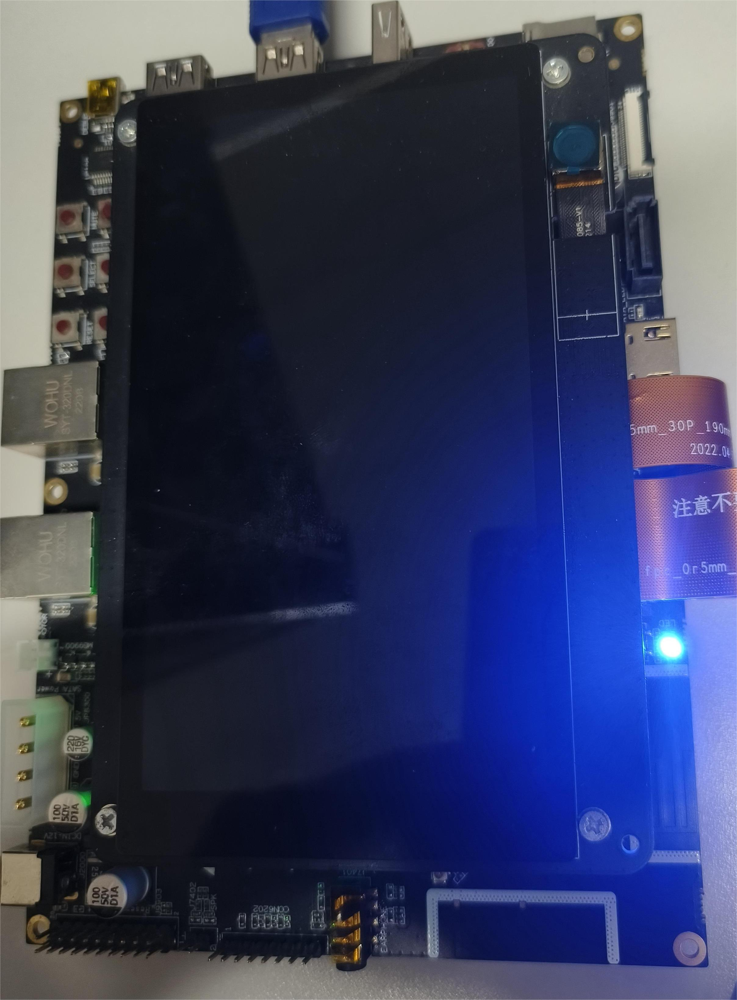

# 电量与LED灯颜色的定制开发指导

## 概述 

### 简介 

OpenHarmony默认提供了电量与LED灯颜色的映射关系。对于部分产品形态（如Pad），会使用LED灯的颜色来展示当前设备充电时的电量信息，如高电量使用绿色、低电量黄色、极低电量使用红色。这种电量与LED灯颜色的映射关系，需要根据产品进行自定义。为此OpenHarmony提供了电量与LED灯颜色映射的定制方式，产品定制开发者可根据产品的设计规格来定制此特性。

### 约束与限制

配置策略：
产品定制的配置路径，需要根据[配置策略](https://gitee.com/openharmony/customization_config_policy)决定。本开发指导中的定制路径以/vendor进行举例，请开发者根据具体的产品配置策略，修改定制路径。

## 开发指导

### 搭建环境 

设备要求：

标准系统开发板，如DAYU200/Hi3516DV300开源套件。

环境要求：

Linux调测环境，相关要求和配置可参考《[快速入门](../quick-start/quickstart-overview.md)》。

### 开发步骤 

本文以[DAYU200](https://gitee.com/openharmony/vendor_hihope/tree/master/rk3568)为例介绍电量与LED灯颜色的定制方法。

1. 在产品目录[（/vendor/hihope/rk3568）](https://gitee.com/openharmony/vendor_hihope/tree/master/rk3568)下创建battery文件夹。

2. 参考[默认电量与LED灯颜色映射的配置文件夹](https://gitee.com/openharmony/powermgr_battery_manager/tree/master/services/native/profile)创建目标文件夹，并安装到`//vendor/hihope/rk3568/battery`目录下，文件格式如下：

    ```text
    profile
    ├── BUILD.gn
    ├── battery_config.json
    ```

3. 参考[默认电量与LED灯颜色映射的配置文件夹中的battery_config.json](https://gitee.com/openharmony/powermgr_battery_manager/blob/master/services/native/profile/battery_config.json)编写定制的battery_config.json。包含定制后的电量与LED灯颜色映射配置如下：

    ```json
    {
        "light": {
            "low": {
                "soc": [0, 20],
                "rgb": [255, 192, 203]
            },
            "normal": {
                "soc": [20, 95],
                "rgb": [255, 0, 255]
            },
            "high": {
                "soc": [95, 100],
                "rgb": [0, 0, 255]
            }
        }
    }
    ```

    **表1** 电量等级说明

    | 电量等级 | 描述 |
    | -------- | -------- |
    | low | 低电量 |
    | normal | 正常电量 |
    | high | 高电量 |

    **表2** 电量区间与LED灯颜色映射配置说明

    | 配置项 | 描述 |
    | -------- | -------- |
    | soc | 电量区间 |
    | rgb | LED灯RGB组合 |


4. 参考[默认电量与LED灯颜色映射的配置文件夹中的BUILD.gn](https://gitee.com/openharmony/powermgr_battery_manager/blob/master/services/native/profile/BUILD.gn)编写BUILD.gn文件，将battery_config.json打包到`//vendor/etc/battery`目录下，配置如下：

    ```shell
    import("//build/ohos.gni")                #引用build/ohos.gni

    ohos_prebuilt_etc("battery_config") {
        source = "battery_config.json"
        relative_install_dir = "battery"
        install_images = [ chipset_base_dir ] #安装到vendor目录下的必要配置
        part_name = "product_rk3568"          #part_name为product_rk3568，以实现后续编译
    }
    ```

5. 将编译目标添加到`/vendor/hihope/rk3568`目录下[ohos.build](https://gitee.com/openharmony/vendor_hihope/blob/master/rk3568/ohos.build)的"module_list"中，例如：

    ```json
    {
    "parts": {
        "product_rk3568": {
        "module_list": [
            "//vendor/hihope/rk3568/default_app_config:default_app_config",
            "//vendor/hihope/rk3568/image_conf:custom_image_conf",
            "//vendor/hihope/rk3568/preinstall-config:preinstall-config",
            "//vendor/hihope/rk3568/resourceschedule:resourceschedule",
            "//vendor/hihope/rk3568/etc:product_etc_conf",
            "//vendor/hihope/rk3568/battery/profile:battery_config" #添加battery_config的编译
        ]
        }
    },
    "subsystem": "product_hihope"
    }
    ```
    “//vendor/hihope/rk3568/battery/”为文件夹路径，“profile”为创建的文件夹名字，“battery_config”为编译目标。

6. 参考《[快速入门](../quick-start/quickstart-overview.md)》编译定制版本，编译命令如下：

    ```shell
    ./build.sh --product-name rk3568 --ccache
    ```

7. 将定制版本烧录到DAYU200开发板中。

### 调测验证 

1. 开机后，进入shell命令行。
    ```
    hdc shell
    ```

2. 进入电池电量的节点路径（以当前DAYU开发版路径为例）。
    ```
    cd /data/service/el0/battery/battery
    ```

3. 以默认的电量与LED灯颜色的映射配置数据为例，修改电量数值，模拟电池信息上报，并观察LED亮灯颜色变化。
    
    1. 修改电量数值
    ```
    echo 5 > capacity
    ```
    2. 上报电量信息改变，触发LED灯映射
    ```
    hidumper -s 3302 -a -r
    ```
    
    
    3. 修改电量数值
    ```
    echo 50 > capacity
    ```
    4. 上报电量信息改变，触发LED灯映射
    ```
    hidumper -s 3302 -a -r
    ```
    
    
    5. 修改电量数值
    ```
    echo 100 > capacity
    ```
    6. 上报电量信息改变，触发LED灯映射
    ```
    hidumper -s 3302 -a -r
    ```
    

4. 以新的电量与LED灯颜色的映射配置数据为例，更改之后：
    ```json
    {
        "light": {
            "low": {
                "soc": [0, 20],
                "rgb": [255, 192, 203]
            },
            "normal": {
                "soc": [20, 95],
                "rgb": [255, 0, 255]
            },
            "high": {
                "soc": [95, 100],
                "rgb": [0, 0, 255]
            }
        }
    }
    ```

    1. 修改电量数值
    ```
    echo 15 > capacity
    ```
    2. 上报电量信息改变，触发LED灯映射
    ```
    hidumper -s 3302 -a -r
    ```
    

    3. 修改电量数值
    ```
    echo 95 > capacity
    ```
    4. 上报电量信息改变，触发LED灯映射
    ```
    hidumper -s 3302 -a -r
    ```
    

    5. 修改电量数值
    ```
    echo 99 > capacity
    ```
    6. 上报电量信息改变，触发LED灯映射
    ```
    hidumper -s 3302 -a -r
    ```
    

## 参考 
开发过程中可参考的配置文件路径：[系统默认亮度范围配置源码路径](https://gitee.com/openharmony/powermgr_battery_manager/tree/master/services/native/profile/) 

默认配置：

```json 
{
    "light": {
        "low": {
            "soc": [0, 10],
            "rgb": [255, 0, 0]
        },
        "normal": {
            "soc": [10, 90],
            "rgb": [255, 255, 0]
        },
        "high": {
            "soc": [90, 100],
            "rgb": [0, 255, 0]
        }
    }
}
``` 

打包路径：/system/etc/battery
