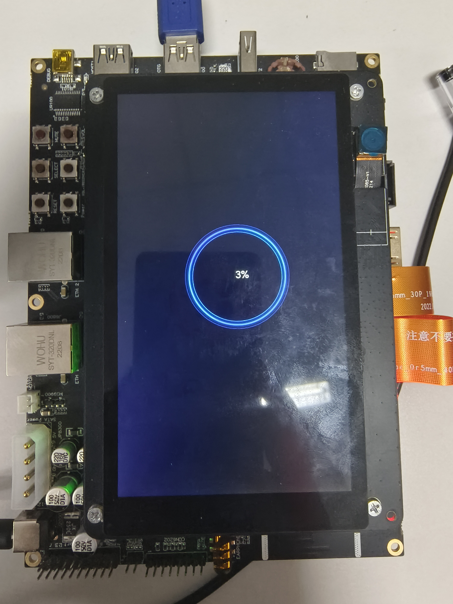
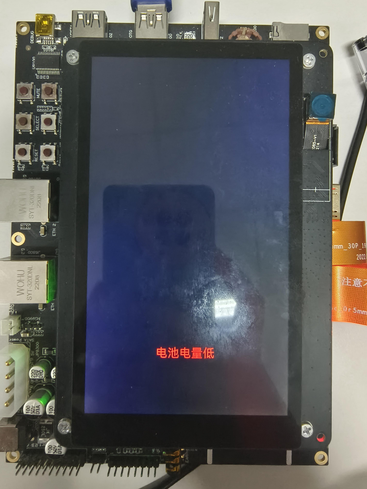
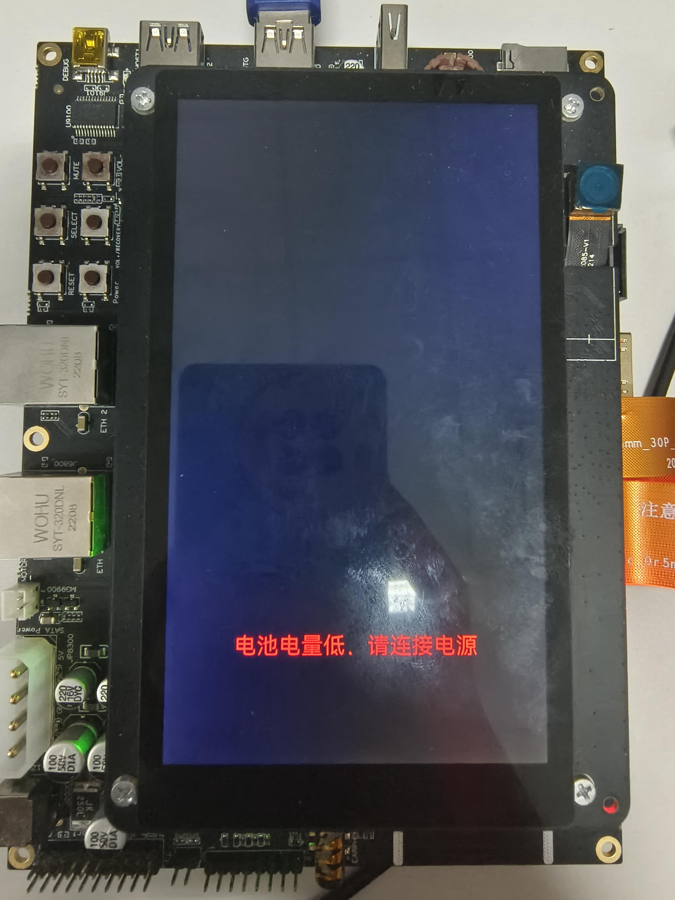
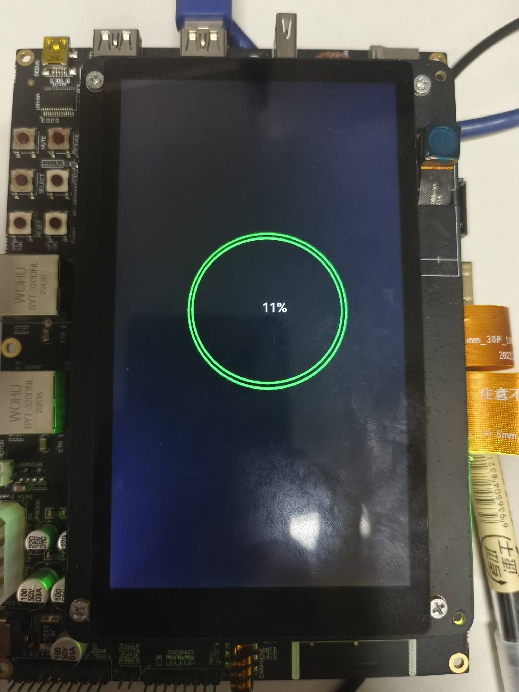

# 关机充电动画开发指导 

## 概述 

### 简介 

OpenHarmony默认提供了关机充电动画的特性，展示关机状态下的充电电量、充电动画等信息。由于定制厂商希望定制符合自身规则和特点的显示样式，希望根据产品的设计规格来定制此特性。为此OpenHarmony提供了关机充电动画的定制方式，产品定制开发者可根据产品的设计规格来定制此特性。

### 约束与限制

配置策略：
产品定制的配置路径，需要根据[配置策略](https://gitee.com/openharmony/customization_config_policy)决定。本开发指导中的定制路径以/vendor进行举例，请开发者根据具体的产品配置策略，修改定制路径。

## 开发指导

### 搭建环境

设备要求：

标准系统开发板，如DAYU200/Hi3516DV300开源套件。

环境要求：

Linux调测环境，相关要求和配置可参考《[快速入门](../quick-start/quickstart-overview.md)》。

### 开发步骤 

本文以[DAYU200](https://gitee.com/openharmony/vendor_hihope/tree/master/rk3568)为例介绍关机充电动画的定制方法。

1. 在产品目录[（/vendor/hihope/rk3568）](https://gitee.com/openharmony/vendor_hihope/tree/master/rk3568)下创建animation文件夹。

2. 参考[默认关机充电动画配置文件夹](https://gitee.com/openharmony/powermgr_battery_manager/tree/master/charger/sa_profile)创建目标文件夹，并安装到`//vendor/hihope/rk3568/animation`目录下，文件格式如下：

    ```text
    profile
    ├── BUILD.gn
    ├── animation.json
    ```

3. 参考[关机充电动画图片资源](https://gitee.com/openharmony/powermgr_battery_manager/tree/master/charger/resources)创建resources文件夹放置构成动画的图片文件，并安装到`//vendor/hihope/rk3568/animation`目录下，文件格式如下：

    ```text
    animation
    ├── resources
    ├── profile
    ```

4. 参考[关机充电动画图片资源中的BUILD.gn](https://gitee.com/openharmony/powermgr_battery_manager/blob/master/charger/resources/BUILD.gn)编写BUILD.gn文件，放入`//vendor/hihope/rk3568/animation/resource`目录下，例如：
    ```gn
    import("//build/ohos.gni")

    ohos_prebuilt_etc("resources_config0") {
        source = "loop00000.png"                                        #图片资源
        relative_install_dir = "poweroff_charger_animation/resources"
        install_images = [ chipset_base_dir ]                           #安装到vendor目录下的必要配置
        part_name = "product_rk3568"
    }
    ```

5. 参考[默认关机充电动画的配置文件夹中的animation.json](https://gitee.com/openharmony/powermgr_battery_manager/blob/master/charger/sa_profile/animation.json)编写定制的animation.json。包含定制后的关机充电动画配置如下：

    ```json
    {
        "animation": {
            "components": [
                {
                    "type": "UIImageView",
                    "id": "Charging_Animation_Image",
                    "x": 200,
                    "y": 480,
                    "w": 400,
                    "h": 400,
                    "resPath": "/system/etc/charger/resources/",
                    "imgCnt": 62,
                    "updInterval": 60,
                    "filePrefix": "loop"
                },
                {
                    "type": "UILabel",
                    "id": "Charging_Percent_Label",
                    "text": "",
                    "x": 326,
                    "y": 616,
                    "w": 68,
                    "h": 48,
                    "fontSize": 32,
                    "fontColor": "#ffffffe6",
                    "bgColor": "#00000000"
                    "align": "center"
                }
            ]
        },
        "lackpowerChargingPrompt": {
            "components": [
                {
                    "type": "UILabel",
                    "id": "LackPower_Charging_Label",
                    "text": "电池电量低",
                    "x": 229,
                    "y": 1037,
                    "w": 250,
                    "h": 45,
                    "fontSize": 42,
                    "fontColor": "#ff0000ff",
                    "bgColor": "#00000000",
                    "align": "center"
                }
            ]
        },
        "lackpowerNotChargingPrompt": {
            "components": [
                {
                    "type": "UILabel",
                    "id": "LackPower_Not_Charging_Label",
                    "text": "电池电量低，请连接电源",
                    "x": 110,
                    "y": 1037,
                    "w": 500,
                    "h": 45,
                    "fontSize": 42,
                    "fontColor": "#ff0000ff",
                    "bgColor": "#00000000",
                    "align": "center"
                }
            ]
        }
    }
    ``` 

    **表1** 关机充电动画配置说明
    | 节点名称 | 作用 |
    | -------- | -------- |
    | animation | 动画配置信息 |
    | lackpowerChargingPrompt| 低电量充电状态提示配置信息 |
    | lackpowerNotChargingPrompt | 低电量未充电状态提示配置信息 |
    | components | 组件集 |
    | type | 组件类型 |
    | id | 组件ID |
    | text | 组件的文本内容 |
    | x | 组件的X轴坐标 |
    | y | 组件的Y轴坐标 |
    | w | 组件的宽度（像素点） |
    | h | 组件的高度（像素点） |
    | fontSize | 文本的字体大小 |
    | fontColor | 文本的字体颜色 |
    | align | 文本对齐方式 |
    | imgCnt | 图片数量 |
    | updInterval | 图片更新的时间间隔（毫秒） |
    | filePrefix | 图片文件名的前缀 |
    | resPath | 组件的资源文件路径 |


6. 参考[默认关机充电动画的配置文件夹中的BUILD.gn](https://gitee.com/openharmony/powermgr_battery_manager/blob/master/charger/sa_profile/BUILD.gn)编写BUILD.gn文件，将animation.json打包到`/vendor/etc/charger`目录下，配置如下：

    ```gn
    import("//build/ohos.gni")

    ohos_prebuilt_etc("animation_config") {
        source = "animation.json"             #引用build/ohos.gni
        relative_install_dir = "animation/resources"
        install_images = [ chipset_base_dir ] #安装到vendor目录下的必要配置
        part_name = "product_rk3568"          #part_name为product_rk3568，以实现后续编译
    }
    ```

7. 将编译目标添加到`/vendor/hihope/rk3568`目录下[ohos.build](https://gitee.com/openharmony/vendor_hihope/blob/master/rk3568/ohos.build)的"module_list"中，例如：

    ```json
    {
    "parts": {
        "product_rk3568": {
        "module_list": [
            "//vendor/hihope/rk3568/default_app_config:default_app_config",
            "//vendor/hihope/rk3568/image_conf:custom_image_conf",
            "//vendor/hihope/rk3568/preinstall-config:preinstall-config",
            "//vendor/hihope/rk3568/resourceschedule:resourceschedule",
            "//vendor/hihope/rk3568/etc:product_etc_conf",
            "//vendor/hihope/rk3568/battery/profile:battery_config",
            "//vendor/hihope/rk3568/animation/profile:animation_config", #添加animation_config的编译
            "//vendor/hihope/rk3568/animation/resource/resources_config" #添加图片资源的编译
        ]
        }
    },
    "subsystem": "product_hihope"
    }
    ```
    “//vendor/hihope/rk3568/animation/”为文件夹路径，“profile”为创建的文件夹名字，“animation_config”为编译目标。

8. 参考《[快速入门](../quick-start/quickstart-overview.md)》编译定制版本，编译命令如下：

    ```shell
    ./build.sh --product-name rk3568 --ccache
    ``` 

9. 将定制版本烧录到DAYU200开发板中。

### 调测验证 
1. 修改代码配置：
    修改代码路径：base/startup/init/services/init/init_config.c
    修改函数：ReadConfig
    修改前
    ```c
    void ReadConfig(void)
    {
        // parse cfg
        char buffer[32] = {0}; // 32 reason max leb
        uint32_t len = sizeof(buffer);
        SystemReadParam("ohos.boot.mode", buffer, &len);
        INIT_LOGI("ohos.boot.mode %s", buffer);
        if (strcmp(buffer, "charger_mode") == 0) {
            // 产品化定制执行此分支流程
            ParseInitCfg(INIT_CONFIGURATION_FILE, NULL);
            ReadFileInDir(OTHER_CHARGE_PATH, ".cfg", ParseInitCfg, NULL);
            ParseInitCfgByPriority();
        } else if (strcmp(buffer, "charger") == 0) {
            ParseInitCfg(INIT_CONFIGURATION_FILE, NULL);
            ReadFileInDir(OTHER_CHARGE_PATH, ".cfg", ParseInitCfg, NULL);
        } else if (InUpdaterMode() == 0) {
            ParseInitCfg(INIT_CONFIGURATION_FILE, NULL);
            ParseInitCfgByPriority();
        } else {
            ReadFileInDir("/etc", ".cfg", ParseInitCfg, NULL);
        }
    }
    ```
    修改后
    ```c
    void ReadConfig(void)
    {
        // parse cfg
        char buffer[32] = {0}; // 32 reason max leb
        uint32_t len = sizeof(buffer);
        SystemReadParam("ohos.boot.mode", buffer, &len);
        INIT_LOGI("ohos.boot.mode %s", buffer);
        ParseInitCfg(INIT_CONFIGURATION_FILE, NULL);
        ReadFileInDir(OTHER_CHARGE_PATH, ".cfg", ParseInitCfg, NULL);
        ParseInitCfgByPriority();
    }
    ```

2. 使用hdc执行如下命令，使开发板进入关机充电状态。
    ```shell
    hdc shell
    reboot charge
    ```

    

3. 进入电池电量的节点路径（以当前DAYU开发版路径为例）。
    ```shell
    cd /data/service/el0/battery/battery
    ```

4. 修改电量数值，并观察充电动画数值变化。
    ```shell
    cat capacity
    ```
    修改当前电量为3
    ```shell
    echo 3 > capacity
    ```
    

5. 切为Not charging状态，直接进入关机状态。
    ```shell
    echo Not charging > status
    ```

6. 在极低电量时（此处默认1%）修改充电状态，不同的充电状态对应显示动画或关机。
    
    1. 进入电池电量的节点路径。
    ```shell
    cd /data/service/el0/battery/battery
    cat capacity
    ```
    2. 修改当前电量为1。
    ```shell
    echo 1 > capacity
    ```
    3. 查看当前状态。
    ```shell
    cat status
    ```
    当前状态为Charging

    

    4. 改变当前状态，为未连接电源状态。
    ```shell
    echo Not charging > status
    ```
    

7. 以下对关机动画的图片进行可定制化的测试修改，步骤与上方相同，只是图片作出替换。

    1. 初始状态。

    

    2. 3%电量状态。

    

    3. 1%电量，充电状态。

    

    4. 1%电量，未充电状态。

    

    5. 当电量高于1%，切为Not charging状态
    ```shell
    echo 3 > capacity
    echo Not charging > status
    ```


## 参考 
开发过程中可参考的配置文件路径：[默认关机充电动画配置源码路径](https://gitee.com/openharmony/powermgr_battery_manager/blob/master/charger/sa_profile/animation.json)

默认配置：
```json
{
        "animation": {
            "components": [
                {
                    "type": "UIImageView",
                    "id": "Charging_Animation_Image",
                    "x": 180,
                    "y": 410,
                    "w": 400,
                    "h": 400,
                    "resPath": "/system/etc/charger/resources/",
                    "imgCnt": 62,
                    "updInterval": 60,
                    "filePrefix": "loop"
                },
                {
                    "type": "UILabel",
                    "id": "Charging_Percent_Label",
                    "text": "",
                    "x": 365,
                    "y": 580,
                    "w": 65,
                    "h": 43,
                    "fontSize": 32,
                    "fontColor": "#ffffffe6",
                    "bgColor": "#00000000",
                    "align": "center"
                }
            ],
        },
        "lackpowerChargingPrompt": {
            "components": [
                {
                    "type": "UILabel",
                    "id": "LackPower_Charging_Label",
                    "text": "电池电量低",
                    "x": 229,
                    "y": 1037,
                    "w": 250,
                    "h": 45,
                    "fontSize": 42,
                    "fontColor": "#ff0000ff",
                    "bgColor": "#00000000",
                    "align": "center"
                }
            ]
        },
        "lackpowerNotChargingPrompt": {
            "components": [
                {
                    "type": "UILabel",
                    "id": "LackPower_Not_Charging_Label",
                    "text": "电池电量低，请连接电源",
                    "x": 110,
                    "y": 1037,
                    "w": 500,
                    "h": 45,
                    "fontSize": 42,
                    "fontColor": "#ff0000ff",
                    "bgColor": "#00000000",
                    "align": "center"
                }
            ]
        }
    }
``` 

打包路径：/system/etc/charger/resource
