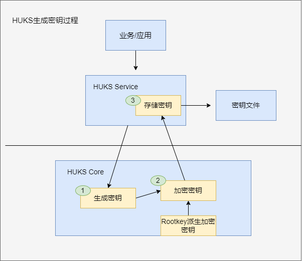

# OpenHarmony通用密钥库开发指导

## 概述

### 功能简介

HUKS（OpenHarmony Universal KeyStore）提供系统级的密钥管理能力，实现密钥全生命周期（生成、存储、使用、销毁）的管理和安全使用，满足生态应用和上层业务的诉求。其中，密钥的安全存储和安全使用环境是密钥安全最重要的约束，如对明文密钥的存储和使用不能出现在非安全环境中，需要保证在安全环境中使用（比如TEE，安全芯片等）；本文档介绍了开发者在OpenHarmony HUKS架构的基础上适配安全存储和安全使用环境的步骤，以及如何去验证适配是否正确，以保证API接口的兼容。

HUKS支持密钥全生命周期管理，包括以下特性：

1. 密钥生成/导入

2. 密钥存储

3. 密钥使用（加解密、签名验签、密钥派生、密钥协商、哈希、密钥访问控制等）

4. 密钥销毁

### 基本概念

- 服务层（HUKS Service）

  承载密钥管理功能的一个独立的OpenHarmony Service附属于huks_service进程，HUKS Service并不直接处理密钥运算，依赖HUKS Core为上层提供服务。

- 核心层（HUKS CORE）

  提供密钥管理服务的核心功能模块，需要保证该模块处于安全环境中且密钥全生命周期明文不出HUKS Core模块。

- 可信执行环境（Trusted Execution Environment）

  通过划分软件和硬件资源的方法构建一个安全区域，使得安全区域内部的程序和数据得到保护。这种划分会分隔出两个执行环境——可信执行环境和普通执行环境。每个执行环境有独立的内部数据通路和计算所需存储空间，保证可信执行环境里的信息不会向外泄露。普通执行环境的应用不能访问可信执行环境的资源，可信执行环境中的应用在没有授权的情况下也无法相互访问。

- 三段式（Init-Update-Finish）

   Init：初始化密钥操作数据。

   Update：分段操作数据并返回结果，或追加数据。

   Finish：结束分段操作或追加数据，返回结果。

### 实现原理

以密钥的生成为例介绍HUKS Service与HUKS Core的通信过程，其他密钥操作类似：
上层应用通过密钥管理SDK调用到HUKS Service，HUKS Service再调用HUKS Core，HUKS Core会调用密钥管理模块生成密钥。之后HUKS Core使用基于RootKey派生的加密密钥对生成的密钥加密再传给Service侧，Service侧再以文件形式存储加密后的密钥。



### 约束与限制

* HUKS的实现需要在可信执行环境中实现，保证密钥管理和操作的可信可靠。

* HuksHdiAttestKey返回的证书链应该按照业务证书、设备证书、CA证书和根证书的顺序组装，在每项证书之前还需要加上证书的长度。证书链组装完成后添加整个证书链的长度组装成Blob格式。证书的具体格式如要自己实现应与服务器侧解析的格式相对应。


* 接口返回的密钥必须按照密钥存储态组装成KeyBlob，哪些接口需要遵循该限制请见[接口说明](#接口说明)。

   KeyBlob存储密钥的同时存储它的属性，结构见下图。构造KeyBlob的示例请参见[hks_keyblob.c/HksBuildKeyBlob](https://gitee.com/openharmony/security_huks/blob/master/services/huks_standard/huks_engine/main/core/src/hks_keyblob.c)。


## 开发指导

### 场景介绍

HUKS Core作为向应用提供密钥库能力的基础，包括密钥管理及密钥的密码学操作等功能。如果想要使用自己的实现替换HUKS Core，需要实现以下接口。

### 接口说明

**表1** 接口功能介绍

| 接口名                                                       | 功能介绍                                  | 约束与限制                     | 对应的js接口                                        |
| ------------------------------------------------------------ | ---------------------------------------- | ----------------------------- | ------------------------------------------------------------ |
| [HuksHdiModuleInit()](#hukshdimoduleinit)                   | HUKS Core的初始化。                            |  无                           | 无 |
| [HuksHdiRefresh()](#hukshdirefresh)                          | 刷新根密钥。                              |  无                            | 无 |
| [HuksHdiGenerateKey()](#hukshdigeneratekey)                  | 生成密钥。                                |  出参要遵循KeyBlob格式          |generateKey(keyAlias: string, options: HuksOptions)|
| [HuksHdiImportKey()](#hukshdiimportkey)                     | 导入明文密钥。                            |  出参要遵循KeyBlob格式           | importKey(keyAlias: string, options: HuksOptions)|
| [HuksHdiImportWrappedKey()](#hukshdiimportwrappedkey)        |导入加密密钥。                              |  出参要遵循KeyBlob格式          | importWrappedKey(keyAlias: string, wrappingKeyAlias: string, options: HuksOptions)|
| [HuksHdiExportPublicKey()](#hukshdiexportpublickey)         | 导出公钥。                                 |无                             | exportKey(keyAlias: string, options: HuksOptions) |
| [HuksHdiInit()](#hukshdiinit)                              | 三段式中的Init接口。                       |无                              | init(keyAlias: string, options: HuksOptions) |
| [HuksHdiUpdate()](#hukshdiupdate)                           | 三段式中的Update接口。                     |签名验签时入参是原始数据          | update(handle: number, token?: Uint8Array, options: HuksOptions) |
| [HuksHdiFinish()](#hukshdifinish)                           | 三段式中的Finish接口。                     |签名验签时入参是签名后数据        | finish(handle: number, options: HuksOptions) |
| [HuksHdiAbort()](#hukshdiabort)                         | 终止三段式。                               |无                             | abort(handle: number, options: HuksOptions) |
| [HuksHdiGetKeyProperties()](#hukshdigetkeyproperties)        | 获取密钥属性。                              |无                            | getKeyProperties(keyAlias: string, options: HuksOptions)|
| [HuksHdiAttestKey()](#hukshdiattestkey)        | 获取密钥证书。                              |出参要遵循certChain格式                      | attestKey(keyAlias: string, options: HuksOptions)|

- - -

#### HuksHdiModuleInit

**接口描述**

HUKS Core的初始化，包括锁，加密算法库，authtoken key和根密钥。

**接口原型**
<pre><code>int32_t HuksHdiModuleInit();</code></pre>

<details>
  <summary><strong>返回值</strong></summary>

  - HKS_SUCCESS：成功

  - 其他：失败
</details>

- - -

#### HuksHdiRefresh

**接口描述**

刷新根密钥。

**接口原型**
<pre><code>int32_t HuksHdiRefresh();</code></pre>

<details>
  <summary><strong>返回值</strong></summary>

  - HKS_SUCCESS：成功

  - 其他：失败
</details>

- - -

#### HuksHdiGenerateKey

**接口描述**

根据paramSet生成密钥。

**接口原型**
<pre><code>int32_t HuksHdiGenerateKey(const struct HksBlob *keyAlias, const struct HksParamSet *paramSet, const struct HksBlob *keyIn, struct HksBlob *keyOut);</code></pre>

<details>
  <summary><strong>参数说明</strong></summary>
  <pre>
  <strong>const struct HksBlob *keyAlias</strong>
  将要生成的密钥的别名，要求：
  1. keyAlias != null
  2. keyAlias -> data != null
  3. keyAlias -> size != 0
  <br></br>
  <strong>const struct HksParamSet *paramSet</strong>
  要生成密钥的参数
  <br></br>
  <strong>const struct HksBlob *keyIn</strong>
  在agree key时使用
  <br></br>
  <strong>struct HksBlob *keyOut</strong>
  出参，将paramset和生成的密钥存放在这里
  </pre>
</details>
<br></br>

<details>
  <summary><strong>约束与限制</strong></summary>

  1. 请在接口内检查上述参数是否符合要求，如是否是空指针、密钥算法是否支持等。

  2. keyOut请参照KeyBlob的结构。

</details>
<br></br>

<details>
  <summary><strong>返回值</strong></summary>

  - HKS_SUCCESS：成功

  - 其他：失败
</details>

- - -

#### HuksHdiImportKey

**接口描述**

导入明文密钥。

**接口原型**
<pre><code>int32_t HuksHdiImportKey(const struct HksBlob *keyAlias, const struct HksBlob *key, const struct HksParamSet *paramSet, struct HksBlob *keyOut);</code></pre>

<details>
  <summary><strong>参数说明</strong></summary>
  <pre>
  <strong>const struct HksBlob *msg</strong>
  将要导入的密钥的别名，要求：
  1. keyAlias != null
  2. keyAlias -> data != null
  3. keyAlias -> size != 0
  <br></br>
  <strong>const struct HksBlob *key</strong>
  要导入的密钥，要求：
  1. key != null
  2. key -> data != null
  3. key -> size != 0
  <br></br>
  <strong>const struct HksParamSet *paramSet</strong>
  导入密钥的参数
  <br></br>
  <strong>struct HksBlob *keyOut</strong>
  出参，将paramset和生成的密钥存放在这里
  <br></br>
  </pre>
</details>
<br></br>

<details>
  <summary><strong>约束与限制</strong></summary>

  1. 请在接口内检查上述参数是否符合要求，如是否是空指针、密钥算法是否支持等。

  2. keyOut请参照KeyBlob的结构。

</details>
<br></br>

<details>
  <summary><strong>返回值</strong></summary>

  - HKS_SUCCESS：成功

  - 其他：失败
</details>

- - -

#### HuksHdiImportWrappedKey

**接口描述**

导入加密密钥。

**接口原型**
<pre><code>int32_t HuksHdiImportWrappedKey(const struct HksBlob *keyAlias, const struct HksBlob *wrappingUsedkey, const struct HksBlob *wrappedKeyData, const struct HksParamSet *paramSet, struct HksBlob *keyOut);</code></pre>

<details>
  <summary><strong>参数说明</strong></summary>
  <pre>
  <strong>const struct HksBlob *KeyAlias</strong>
  将要导入的密钥的别名，要求：
  1. keyAlias != null
  2. keyAlias -> data != null
  3. keyAlias -> size != 0
  <br></br>
  <strong>const struct HksBlob *key</strong>
  要导入的密钥数据被加密时使用的密钥，要求：
  1. wrappingUsedkey != null
  2. wrappingUsedkey -> data != null
  3. wrappingUsedkey -> size != 0
  <br></br>
  <strong>const struct HksBlob *wrappedKeyData</strong>
  要导入的密钥的加密数据，要求：
  1. wrappedKeyData != null
  2. wrappedKeyData -> data != null
  3. wrappedKeyData -> size != 0
  <br></br>
  <strong>const struct HksParamSet *paramSet</strong>
  导入密钥的参数
  <br></br>
  <strong>struct HksBlob *keyOut</strong>
  出参，将paramset和生成的密钥存放在这里
  </pre>
</details>
<br></br>

<details>
  <summary><strong>约束与限制</strong></summary>

  1. 请在接口内检查上述参数是否符合要求，如是否是空指针、密钥算法是否支持等。

  2. keyOut请参照KeyBlob的结构。

</details>
<br></br>

<details>
  <summary><strong>返回值</strong></summary>

  - HKS_SUCCESS：成功

  - 其他：失败
</details>

- - -

#### HuksHdiExportPublicKey

**接口描述**

导出公钥。

**接口原型**
<pre><code>int32_t HuksHdiExportPublicKey(const struct HksBlob *key, const struct HksParamSet *paramSet, struct HksBlob *keyOut);</code></pre>

<details>
  <summary><strong>参数说明</strong></summary>
  <pre>
  <strong>const struct HksBlob *key</strong>
  与要导出的公钥对应的私钥，要求：
  1. key != null
  2. key -> data != null
  3. key -> size != 0
  <br></br>
  <strong>const struct HksParamSet *paramSet</strong>
  空参数
  <br></br>
  <strong>struct HksBlob *keyOut</strong>
  出参，存放导出的公钥
  </pre>
</details>
<br></br>

<details>
  <summary><strong>返回值</strong></summary>

  - HKS_SUCCESS：成功

  - 其他：失败
</details>

- - -

#### HuksHdiInit

**接口描述**

三段式中的Init接口。

**接口原型**
<pre><code>int32_t HuksHdiInit(const struct HksBlob *key, const struct HksParamSet *paramSet, struct HksBlob *handle, struct HksBlob *token);</code></pre>

<details>
  <summary><strong>参数说明</strong></summary>
  <pre>
  <strong>const struct HksBlob *key</strong>
  Init操作的密钥，要求：
  1. key != null
  2. key -> data != null
  3. key -> size != 0
  <br></br>
  <strong>const struct HksParamSet *paramSet</strong>
  Init操作的参数
  <br></br>
  <strong>struct HksBlob *handle</strong>
  三段式的句柄
  <br></br>
  <strong>struct HksBlob *token</strong>
  存放安全访问控制的challenge
  </pre>
</details>
<br></br>

<details>
  <summary><strong>返回值</strong></summary>

  - HKS_SUCCESS：成功

  - 其他：失败
</details>

- - -

#### HuksHdiUpdate

**接口描述**

三段式中的Update接口。

**接口原型**
<pre><code>int32_t HuksHdiUpdate(const struct HksBlob *handle, const struct HksParamSet *paramSet, const struct HksBlob *inData, struct HksBlob *outData);</code></pre>

<details>
  <summary><strong>参数说明</strong></summary>
  <pre>
  <strong>const struct HksBlob *handle</strong>
  三段式的句柄
  <br></br>
  <strong> const struct HksParamSet *paramSet</strong>
  Update操作的参数
  <br></br>
  <strong> const struct HksBlob *inData</strong>
  Update操作的输入
  <br></br>
  <strong> struct HksBlob *outData</strong>
  Update操作的结果
  </pre>
</details>
<br></br>

<details>
  <summary><strong>约束与限制</strong></summary>

  1. 在进行签名验签时inData要传入原文数据。

</details>
<br></br>

<details>
  <summary><strong>返回值</strong></summary>

  - HKS_SUCCESS：成功

  - 其他：失败
</details>

- - -

#### HuksHdiFinish

**接口描述**

三段式中的Finish接口。

**接口原型**
<pre><code>int32_t HuksHdiFinish(const struct HksBlob *handle, const struct HksParamSet *paramSet, const struct HksBlob *inData, struct HksBlob *outData);</code></pre>

<details>
  <summary><strong>参数说明</strong></summary>
  <pre>
  <strong>const struct HksBlob *handle</strong>
  三段式的句柄
  <br></br>
  <strong>const struct HksParamSet *paramSet</strong>
  Finish操作的参数
  <br></br>
  <strong>const struct HksBlob *inData</strong>
  Finish操作的输入
  <br></br>
  <strong>struct HksBlob *outData</strong>
  Finish操作的结果
  </pre>
</details>
<br></br>

<details>
  <summary><strong>约束与限制</strong></summary>

  1. 在进行签名验签时inData要传入需要验证的签名数据，通过返回结果表示验签是否成功。

</details>
<br></br>

<details>
  <summary><strong>返回值</strong></summary>

  - HKS_SUCCESS：成功

  - 其他：失败
</details>

- - -

#### HuksHdiAbort

**接口描述**

终止三段式。当Init，Update和Finish操作中的任一阶段发生错误时，都要调用abort来终止密钥的使用。

**接口原型**
<pre><code>int32_t HuksHdiAbort(const struct HksBlob *handle, const struct HksParamSet *paramSet);</code></pre>

<details>
  <summary><strong>参数说明</strong></summary>
  <pre>
  <strong>const struct HksBlob *handle</strong>
  三段式的句柄
  <br></br>
  <strong>const struct HksParamSet *paramSet</strong>
  Abort操作的参数
  </pre>
</details>
<br></br>

<details>
  <summary><strong>返回值</strong></summary>

  - HKS_SUCCESS：成功

  - 其他：失败
</details>

- - -

#### HuksHdiGetKeyProperties

**接口描述**

获取密钥属性。

**接口原型**
<pre><code>int32_t HuksHdiGetKeyProperties(const struct HksParamSet *paramSet, const struct HksBlob *key);</code></pre>

<details>
  <summary><strong>参数说明</strong></summary>
  <pre>
  <strong>const struct HksParamSet *paramSet</strong>
  空对象
  <br></br>
  <strong>const struct HksBlob *key</strong>
  要获取属性的密钥
  </pre>
</details>
<br></br>

<details>
  <summary><strong>返回值</strong></summary>

  - HKS_SUCCESS：成功

  - 其他：失败
</details>

- - -

#### HuksHdiAttestKey

**接口描述**

获取密钥证书。

**接口原型**
<pre><code>int32_t (*HuksHdiAttestKey)(const struct HksBlob *key, const struct HksParamSet *paramSet, struct HksBlob *certChain);</code></pre>

<details>
  <summary><strong>参数说明</strong></summary>
  <pre>
  <strong>const struct HksBlob *key</strong>
  要获取证书的密钥
  <br></br>
  <strong>const struct HksParamSet *paramSet</strong>
  获取证书操作的参数
  <br></br>
  <strong>struct HksBlob *certChain</strong>
  出参，存放证书
  </pre>
</details>
<br></br>

<details>
  <summary><strong>约束与限制</strong></summary>

  1. certChain的格式需遵循[约束与限制第二点](#约束与限制)。

</details>
<br></br>

<details>
  <summary><strong>返回值</strong></summary>

  - HKS_SUCCESS：成功

  - 其他：失败
</details>

- - -

### 开发步骤

HDI接口到HUKS Core的适配在以下目录中：

```undefined
// base/security/user_auth/services/huks_standard/huks_engine/main
├── BUILD.gn # 编译脚本
├── core_dependency # 实现依赖
└── core # HUKS Core层的软实现
    ├── BUILD.gn # 编译脚本
    ├── include 
    └── src
        ├── hks_core_interfaces.c # HDI到HUKS Core的适配层
        └── hks_core_service.c # 具体实现
        └── ... #其他功能代码
```

关于HUKS Core接口的具体实现，开发者必须采用三段式。以下是三段式的开发步骤以及HUKS CORE的代码示例，开发者应参考以下代码实现所有的Hdi接口。

其他HUKS Core接口的代码可以参考[hks_core_service.c](https://gitee.com/openharmony/security_huks/blob/master/services/huks_standard/huks_engine/main/core/src/hks_core_service.c)文件。

1. 创建一个句柄，通过这个句柄在session中存储密钥操作相关的信息，使得外部可以通过这个句柄分多次进行同一密钥操作。

   ```c

   //三段式Init接口

   int32_t HksCoreInit(const struct  HksBlob *key, const struct HksParamSet *paramSet, struct HksBlob *handle,
    struct HksBlob *token)
   {
       HKS_LOG_D("HksCoreInit in Core start");
       uint32_t pur = 0;
       uint32_t alg = 0;
       //检查参数
       if (key == NULL || paramSet == NULL || handle == NULL || token == NULL) {
           HKS_LOG_E("the pointer param entered is invalid");
           return HKS_FAILURE;
        }

        if (handle->size < sizeof(uint64_t)) {
            HKS_LOG_E("handle size is too small, size : %u", handle->size);
            return HKS_ERROR_INSUFFICIENT_MEMORY;
        }
        //解密密钥文件
        struct HuksKeyNode *keyNode = HksCreateKeyNode(key, paramSet);
        if (keyNode == NULL || handle == NULL) {
            HKS_LOG_E("the pointer param entered is invalid");
            return HKS_ERROR_BAD_STATE;
        }
        //通过handle向session中存储信息，供Update/Finish使用。使得外部可以通过同个handle分多次进行同一密钥操作。
        handle->size = sizeof(uint64_t);
        (void)memcpy_s(handle->data, handle->size, &(keyNode->handle), handle->size);
        //从参数中提取出算法
        int32_t ret = GetPurposeAndAlgorithm(paramSet, &pur, &alg);
        if (ret != HKS_SUCCESS) {
            HksDeleteKeyNode(keyNode->handle);
            return ret;
        }
        //检查密钥参数
        ret = HksCoreSecureAccessInitParams(keyNode, paramSet, token);
        if (ret != HKS_SUCCESS) {
            HKS_LOG_E("init secure access params failed");
            HksDeleteKeyNode(keyNode->handle);
            return ret;
        }
        //通过密钥使用目的获取对应的算法库处理函数  
        uint32_t i;
        uint32_t size = HKS_ARRAY_SIZE(g_hksCoreInitHandler);
        for (i = 0; i < size; i++) {
           if (g_hksCoreInitHandler[i].pur == pur) {
               HKS_LOG_E("Core HksCoreInit [pur] = %d, pur = %d", g_hksCoreInitHandler[i].pur, pur);
               ret = g_hksCoreInitHandler[i].handler(keyNode, paramSet, alg);
               break;
        }
        }
        //异常结果检查
        if (ret != HKS_SUCCESS) {
            HksDeleteKeyNode(keyNode->handle);
            HKS_LOG_E("CoreInit failed, ret : %d", ret);
            return ret;
        }
    
        if (i == size) {
            HksDeleteKeyNode(keyNode->handle);
            HKS_LOG_E("don't found purpose, pur : %u", pur);
            return HKS_FAILURE;
        }
    
        HKS_LOG_D("HksCoreInit in Core end");
        return ret;
    }
   ```

2. 在执行密钥操作前通过句柄获得上下文信息，执行密钥操作时放入分片数据并取回密钥操作结果或者追加数据。
   
    ```c
    //三段式Update接口
    int32_t HksCoreUpdate(const struct HksBlob *handle, const struct HksParamSet *paramSet, const struct HksBlob *inData,
        struct HksBlob *outData)
    {
        HKS_LOG_D("HksCoreUpdate in Core start");
        uint32_t pur = 0;
        uint32_t alg = 0;
        //检查参数
        if (handle == NULL || paramSet == NULL || inData == NULL) {
            HKS_LOG_E("the pointer param entered is invalid");
            return HKS_FAILURE;
        }
        
        uint64_t sessionId;
        struct HuksKeyNode *keyNode = NULL;
        //根据handle获取本次三段式操作需要的上下文
        int32_t ret = GetParamsForUpdateAndFinish(handle, &sessionId, &keyNode, &pur, &alg);
        if (ret != HKS_SUCCESS) {
            HKS_LOG_E("GetParamsForCoreUpdate failed");
            return ret;
        }
        //校验密钥参数
        ret = HksCoreSecureAccessVerifyParams(keyNode, paramSet);
        if (ret != HKS_SUCCESS) {
            HksDeleteKeyNode(sessionId);
            HKS_LOG_E("HksCoreUpdate secure access verify failed");
            return ret;
        }
        //调用对应的算法库密钥处理函数
        uint32_t i;
        uint32_t size = HKS_ARRAY_SIZE(g_hksCoreUpdateHandler);
        for (i = 0; i < size; i++) {
            if (g_hksCoreUpdateHandler[i].pur == pur) {
                struct HksBlob appendInData = { 0, NULL };
                ret = HksCoreAppendAuthInfoBeforeUpdate(keyNode, pur, paramSet, inData, &appendInData);
                if (ret != HKS_SUCCESS) {
                    HKS_LOG_E("before update: append auth info failed");
                    break;
                }
                ret = g_hksCoreUpdateHandler[i].handler(keyNode, paramSet,
                     appendInData.data == NULL ? inData : &appendInData, outData, alg);
                if (appendInData.data != NULL) {
                    HKS_FREE_BLOB(appendInData);
                }
                break;
            }
        }
        //异常结果检查
        if (ret != HKS_SUCCESS) {
            HksDeleteKeyNode(keyNode->handle);
            HKS_LOG_E("CoreUpdate failed, ret : %d", ret);
            return ret;
        }
        
        if (i == size) {
            HksDeleteKeyNode(sessionId);
            HKS_LOG_E("don't found purpose, pur : %u", pur);
            return HKS_FAILURE;
        }
        return ret;
    }
    ```

3. 结束密钥操作并取回结果，销毁句柄。

   ```c
   //三段式Finish接口
   int32_t HksCoreFinish(const struct HksBlob *handle, const struct HksParamSet *paramSet, const struct HksBlob *inData,
    struct HksBlob *outData)
   {
       HKS_LOG_D("HksCoreFinish in Core start");
       uint32_t pur = 0;
       uint32_t alg = 0;
       //检查参数
       if (handle == NULL || paramSet == NULL || inData == NULL) {
           HKS_LOG_E("the pointer param entered is invalid");
           return HKS_FAILURE;
       }
    
       uint64_t sessionId;
       struct HuksKeyNode *keyNode = NULL;
       //根据handle获取本次三段式操作需要的上下文
       int32_t ret = GetParamsForUpdateAndFinish(handle, &sessionId, &keyNode, &pur, &alg);
       if (ret != HKS_SUCCESS) {
           HKS_LOG_E("GetParamsForCoreUpdate failed");
           return ret;
       }
       //校验密钥参数
       ret = HksCoreSecureAccessVerifyParams(keyNode, paramSet);
       if (ret != HKS_SUCCESS) {
           HksDeleteKeyNode(sessionId);
           HKS_LOG_E("HksCoreFinish secure access verify failed");
           return ret;
       }
       //调用对应的算法库密钥处理函数
       uint32_t i;
       uint32_t size = HKS_ARRAY_SIZE(g_hksCoreFinishHandler);
       for (i = 0; i < size; i++) {
           if (g_hksCoreFinishHandler[i].pur == pur) {
               uint32_t outDataBufferSize = (outData == NULL) ? 0 : outData->size;
               struct HksBlob appendInData = { 0, NULL };
               ret = HksCoreAppendAuthInfoBeforeFinish(keyNode, pur, paramSet, inData, &appendInData);
               if (ret != HKS_SUCCESS) {
                   HKS_LOG_E("before finish: append auth info failed");
                   break;
               }
               ret = g_hksCoreFinishHandler[i].handler(keyNode, paramSet,
                   appendInData.data == NULL ? inData : &appendInData, outData, alg);
               if (appendInData.data != NULL) {
                   HKS_FREE_BLOB(appendInData);
               }
               if (ret != HKS_SUCCESS) {
                   break;
               }
               //添加密钥操作结束标签
               ret = HksCoreAppendAuthInfoAfterFinish(keyNode, pur, paramSet, outDataBufferSize, outData);
               break;
           }
       }
       if (i == size) {
           HKS_LOG_E("don't found purpose, pur : %d", pur);
           ret = HKS_FAILURE;
       }
       //删除对应的session
       HksDeleteKeyNode(sessionId);
       HKS_LOG_D("HksCoreFinish in Core end");
       return ret;
   }
   ```

### 调测验证

开发完成后，通过[HUKS JS接口](https://gitee.com/openharmony/security_huks/blob/master/interfaces/kits/js/@ohos.security.huks.d.ts)开发JS应用来验证能力是否完备。

对于每个HDI接口，[接口说明](#接口说明)都提供了对应的JS接口。可以通过调用JS接口组合来验证对应的HDI接口的能力，也可以通过完整的密钥操作来验证接口的能力。

JS测试代码示例如下，如果整个流程能够正常运行，代表HDI接口能力正常。更多的密钥操作类型请见[huks-guidelines.md](https://gitee.com/openharmony/docs/blob/master/zh-cn/application-dev/security/huks-guidelines.md)。

**AES生成密钥和加密**

1. 引入HUKS模块

   ```js
   import huks from '@ohos.security.huks'
   ```

2. 使用generateKey接口生成密钥。

   ```js
   var alias = 'testAlias';
   var properties = new Array();
   properties[0] = {
     tag: huks.HuksTag.HUKS_TAG_ALGORITHM,
     value: huks.HuksKeyAlg.HUKS_ALG_ECC
   };
   properties[1] = {
     tag: huks.HuksTag.HUKS_TAG_KEY_SIZE,
     value: huks.HuksKeySize.HUKS_ECC_KEY_SIZE_224
   };
   properties[2] = {
     tag: huks.HuksTag.HUKS_TAG_PURPOSE,
     value: huks.HuksKeyPurpose.HUKS_KEY_PURPOSE_AGREE
   };
   properties[3] = {
     tag: huks.HuksTag.HUKS_TAG_DIGEST,
     value: huks.HuksKeyDigest.HUKS_DIGEST_NONE
   };
   var options = {
     properties: properties
   }
   var resultA = huks.generateKey(alias, options);
   ```

3. 使用Init接口进行init操作。

   ```js
   var alias = 'test001'
   var properties = new Array();
   properties[0] = {
     tag: huks.HuksTag.HUKS_TAG_ALGORITHM,
     value: huks.HuksKeyAlg.HUKS_ALG_DH
   };
   properties[1] = {
     tag: huks.HuksTag.HUKS_TAG_PURPOSE,
     value: huks.HuksKeyPurpose.HUKS_KEY_PURPOSE_AGREE
   };
   properties[2] = {
     tag: huks.HuksTag.HUKS_TAG_KEY_SIZE,
     value: huks.HuksKeySize.HUKS_DH_KEY_SIZE_4096
   };
   var options = {
     properties: properties
   };
   huks.init(alias, options, function(err, data) {
       if (err.code !== 0) {
           console.log("test init err information: " + JSON.stringify(err));
       } else {
           console.log(`test init data: ${JSON.stringify(data)}`);
       }
   })
   ```
   
4. 使用Update接口进行update操作。

   ```js
   var properties = new Array();
   properties[0] = {
     tag: huks.HuksTag.HUKS_TAG_ALGORITHM,
     value: huks.HuksKeyAlg.HUKS_ALG_DH
   };
   properties[1] = {
     tag: huks.HuksTag.HUKS_TAG_PURPOSE,
     value: huks.HuksKeyPurpose.HUKS_KEY_PURPOSE_AGREE
   };
   properties[2] = {
     tag: huks.HuksTag.HUKS_TAG_KEY_SIZE,
     value: huks.HuksKeySize.HUKS_DH_KEY_SIZE_4096
   };
   var options = {
     properties: properties
   };
   var result = huks.update(handle, options)
   ```
   
5. 使用Finish接口进行finish操作。

   ```js
   var properties = new Array();
   properties[0] = {
     tag: huks.HuksTag.HUKS_TAG_ALGORITHM,
     value: huks.HuksKeyAlg.HUKS_ALG_DH
   };
   properties[1] = {
     tag: huks.HuksTag.HUKS_TAG_PURPOSE,
     value: huks.HuksKeyPurpose.HUKS_KEY_PURPOSE_AGREE
   };
   properties[2] = {
     tag: huks.HuksTag.HUKS_TAG_KEY_SIZE,
     value: huks.HuksKeySize.HUKS_DH_KEY_SIZE_4096
   };
   var options = {
     properties: properties
   };
   var result = huks.finish(handle, options) 
   ```