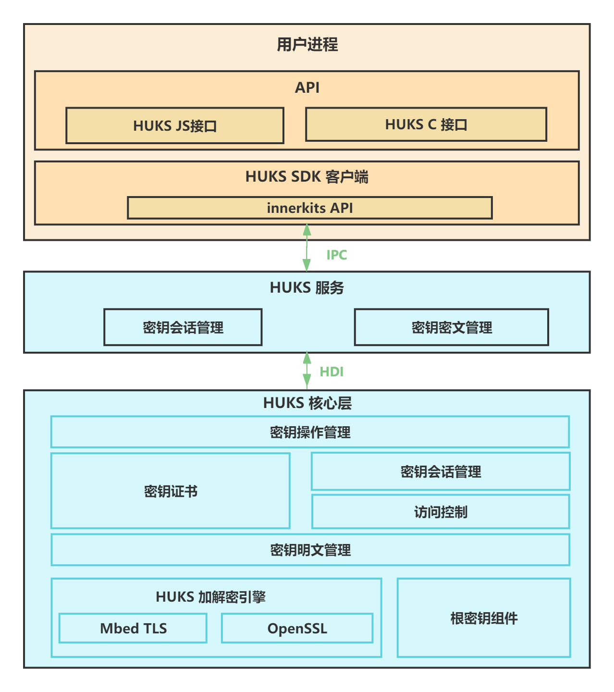
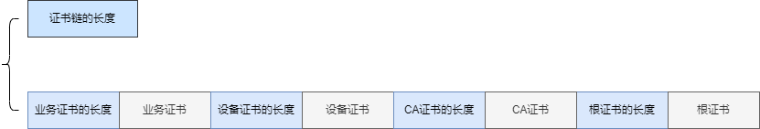
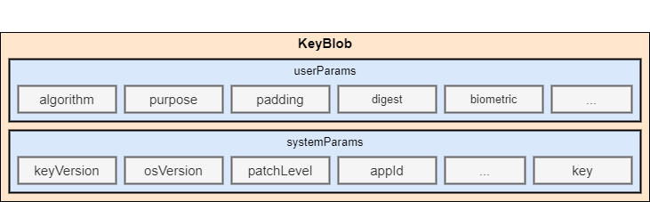

# 通用密钥库设备开发指导

## 概述

### 功能简介

OpenHarmony通用密钥库系统（英文全称：Open**H**armony **U**niversal **K**ey**S**tore，以下简称HUKS）是OpenHarmony提供的系统级的密钥管理系统服务，提供密钥的全生命周期管理能力，包括密钥生成、密钥存储、密钥使用、密钥销毁等功能，以及对存储在HUKS中的密钥提供合法性证明。在HUKS的分层架构中，处于最底层的HUKS核心层（HUKS Core)承载着密钥管理核心功能，一般运行在设备硬件安全环境中（比如TEE、安全芯片等）。由于不同厂商硬件安全环境不同，HUKS核心层的实现方式也不尽相同，为了保证服务层及应用层架构和接口的一致性，HUKS核心层定义了一套HDI接口（硬件设备统一接口），以保证HUKS服务层调用HUKS核心层的兼容。本文基于HUKS HDI接口，提供HUKS核心层功能的开发指导。

HUKS核心层需要支持以下功能：

1. 生成密钥

2. 外部导入密钥

3. 密钥操作（加密解密、签名验签、密钥派生、密钥协商、消息认证码等）

4. 密钥访问控制

5. 密钥证明

6. 芯片平台公钥导出

### 基本概念

- **HUKS Core**
  
  HUKS核心组件，承载HUKS的核心功能，包括密钥的密码学运算、明文密钥的加解密、密钥访问控制等。一般运行在设备的安全环境中（如TEE、安全芯片等，不同的厂商有所不同），保证密钥明文不出HUKS Core。

  
- **密钥会话** 

  应用通过指定密钥别名，给当前操作的密钥建立一个会话，HUKS为每个会话生成一个全局唯一的句柄值来索引该会话。它的作用是缓存密钥使用期间的信息，包括操作数据、密钥信息、访问控制属性等。密钥操作一般需要经过**建立会话、传入数据和参数、结束会话（中止会话）** 三个阶段。


- **可信执行环境（Trusted Execution Environment）**

  通过划分软件和硬件资源的方法构建一个安全区域，使得安全区域内部的程序和数据得到保护。这种划分会分隔出两个执行环境——可信执行环境和普通执行环境。每个执行环境有独立的内部数据通路和计算所需存储空间，保证可信执行环境里的信息不会向外泄露。普通执行环境的应用不能访问可信执行环境的资源，可信执行环境中的应用在没有授权的情况下也无法相互访问。


## 实现原理

HUKS采用分层架构，包含应用层、服务层、核心层（领域层），其中应用层主要对应用提供接口，服务层处理应用的密钥管理请求，进行密钥的密文管理、身份校验、密钥会话管理等，核心层提供密钥生成、密钥操作、密钥访问控制和密钥证明等核心功能。

**图1** HUKS分层架构图



## 约束与限制

 - **密钥不出安全环境**

   HUKS的核心特点是密钥全生命周期明文不出HUKS Core，在有硬件条件的设备上，如有TEE（Trusted Execution Environment)或安全芯片的设备，HUKS Core运行在硬件安全环境中。即使REE（Rich Execution Environment）环境被攻破，也能确保密钥明文也不会泄露。因此，HUKS直通式HDI API所有函数接口密钥材料数据只能是密文格式。

- **系统级安全加密存储**

  必须基于设备根密钥加密业务密钥，在有条件的设备上，叠加用户口令加密保护密钥。

- **严格的访问控制**

  只有合法的业务才有权访问密钥，同时支持用户身份认证访问控制以支持业务的高安敏感场景下安全访问密钥的诉求。
- **密钥的合法性证明**

  业务提供硬件厂商级别的密钥的合法性证明，证明密钥没有被篡改，并确实存在于有硬件保护的HUKS Core中，以及拥有正确的密钥属性。

- **密钥材料格式** 
  
  导入/导出密钥时（包括密钥对、公钥、私钥），密钥材料的数据格式必须满足HUKS要求的格式，具体各个密码算法密钥材料见[密钥材料格式](../../application-dev/security/UniversalKeystoreKit/huks-concepts.md#密钥材料格式)。

- **证书链格式** 

  AttestKey返回的证书链应该按照业务证书、设备证书、CA证书和根证书的顺序组装，在每项证书之前还需要加上证书的长度。证书链组装完成后添加整个证书链的长度组装成Blob格式。证书的具体格式如要自己实现应与服务器侧解析的格式相对应。

  

- **KeyBlob格式**

  接口返回的密钥必须按照密钥存储态组装成KeyBlob，哪些接口需要遵循该限制请见[接口说明](#接口说明)。

  

## 开发指导

### 场景介绍

HUKS Core作为向应用提供密钥库能力的基础，包括密钥管理及密钥的密码学操作等功能。如果想要使用自己的实现替换HUKS Core，需要实现以下接口。

### 接口说明

**表1** 接口功能介绍

| 接口名                                                       | 功能介绍                                  | 约束与限制                     | 对应的js接口                                        |
| ------------------------------------------------------------ | ---------------------------------------- | ----------------------------- | ------------------------------------------------------------ |
| [ModuleInit()](#moduleinit)                   | HUKS Core的初始化。                            |  无                           | 无 |
| [ModuleDestroy()](#moduledestroy)                   | HUKS Core的销毁。                            |  无                           | 无 |无                            | 无 |
| [GenerateKey()](#generatekey)                  | 根据密码算法参数，生成密钥，并返回密文材料。                                |  出参要遵循KeyBlob格式          |generateKey(keyAlias: string, options: HuksOptions)|
| [ImportKey()](#importkey)                     | 导入明文密钥，并返回密文材料。                            |  出参要遵循KeyBlob格式           | importKey(keyAlias: string, options: HuksOptions)|
| [ImportWrappedKey()](#importwrappedkey)        |导入加密密钥，并返回密文材料。                              |  出参要遵循KeyBlob格式          | importWrappedKey(keyAlias: string, wrappingKeyAlias: string, options: HuksOptions)|
| [ExportPublicKey()](#exportpublickey)         | 导出密钥对中的公钥。                                 |无                             | exportKey(keyAlias: string, options: HuksOptions) |
| [Init()](#init)                              | 初始化密钥会话的接口，返回密钥会话句柄和令牌（可选）。                       |无                              | init(keyAlias: string, options: HuksOptions) |
| [Update()](#update)                           | 追加密钥操作数据。                     |签名验签时入参是原始数据          | update(handle: number, token?: Uint8Array, options: HuksOptions) |
| [Finish()](#finish)                           | 结束密钥会话                     |签名验签时入参是签名后数据        | finish(handle: number, options: HuksOptions) |
| [Abort()](#abort)                         | 取消密钥会话                               |无                             | abort(handle: number, options: HuksOptions) |
| [CheckKeyValidity()](#checkkeyvalidity)        | 校验密钥材料（密文）的完整性                              |无                            | 无 |
| [AttestKey()](#attestkey)        | 获取密钥证书。                              |出参要遵循密钥证书链格式                      | attestKey(keyAlias: string, options: HuksOptions)|
| [ExportChipsetPlatformPublicKey()](#exportchipsetplatformpublickey)        | 导出芯片平台级密钥对的公钥。     | 出参为ECC P256的x y轴值裸数据，各32字节                      | 无 |
| [UpgradeKey()](#upgradekey)        | 升级密钥文件。     | 无                      | 无 |
| [GenerateRandom()](#generaterandom)        | 生成安全随机数     | 无                      | 无 |
| [Encrypt()](#encrypt)        | 加密     | 无                      | 无 |
| [Decrypt()](#decrypt)        | 解密     | 无                      | 无 |
| [Sign()](#sign)        | 签名     | 无                      | 无 |
| [Verify()](#verify)        | 验签     | 无                      | 无 |
| [AgreeKey()](#agreekey)        | 密钥协商     | 无                      | 无 |
| [DeriveKey()](#derivekey)        | 密钥派生     | 无                      | 无 |
| [Mac()](#mac)        | 消息认证码     | 无                      | 无 |


#### ModuleInit

**接口原型**
```
int32_t ModuleInit(struct IHuks *self);
```

**接口描述**

HUKS Core的初始化，一般用于初始化全局变量，比如全局线程锁，算法库，用于访问控制的AuthToken Key和根密钥。

**参数说明**

| 名称 | 描述 |
| ------ | ---- | 
|self| HUKS HDI函数指针结构体指针 |

**返回值**

- HKS_SUCCESS：表示成功，值为0。
- 其他：表示失败，值为负数，具体参考[HksErrorCode枚举值定义](https://gitee.com/openharmony/security_huks/blob/master/interfaces/inner_api/huks_standard/main/include/hks_type_enum.h)。

#### ModuleDestroy

**接口原型**
```
int32_t ModuleDestroy(struct IHuks *self);
```

**接口描述**

HUKS Core的销毁，一般用于释放全局变量，包括锁，销毁内存中的AuthToken Key和根密钥等。


**参数说明**

| 名称 | 描述 |
| ------ | ---- | 
|self| HUKS HDI函数指针结构体指针 |


**返回值**

- HKS_SUCCESS：表示成功，值为0。
- 其他：表示失败，值为负数，具体参考[HksErrorCode枚举值定义](https://gitee.com/openharmony/security_huks/blob/master/interfaces/inner_api/huks_standard/main/include/hks_type_enum.h)。


#### GenerateKey

**接口原型**
```
int32_t GenerateKey(struct IHuks *self, const struct HuksBlob *keyAlias, const struct HuksParamSet *paramSet, const struct HuksBlob *keyIn, struct HuksBlob *encKeyOut);
```

**接口描述**

根据密钥属性paramSet生成密钥。

**参数说明**

| 名称 | 描述 |
| ------ | ---- | 
|self| HUKS HDI函数指针结构体指针。 |
|keyAlias | 将要生成的密钥的别名，要求：<br>1. keyAlias != null <br>2. keyAlias -> data != null<br>3. keyAlias -> dataLen != 0 |
|paramSet | 要生成密钥的参数。 |
|keyIn | 可选，通过密钥协商或密钥派生生成密钥时，传原密钥材料。|
|encKeyOut | 出参，密钥密文材料，将密钥属性paramset和生成的密钥密文存放在这里，格式参考KeyBlob。|

**约束与限制**
  
- 请在接口内检查上述参数是否符合要求，如是否是空指针、密钥算法是否支持等。
- encKeyOut请参照KeyBlob的结构。

**返回值**

- HKS_SUCCESS：表示成功，值为0。
- 其他：表示失败，值为负数，具体参考[HksErrorCode枚举值定义](https://gitee.com/openharmony/security_huks/blob/master/interfaces/inner_api/huks_standard/main/include/hks_type_enum.h)。


#### ImportKey

**接口原型**
```
int32_t ImportKey(struct IHuks *self, const struct HuksBlob *keyAlias, const struct HuksBlob *key, const struct HuksParamSet *paramSet, struct HuksBlob *encKeyOut);
```

**接口描述**

导入明文密钥。

**参数说明**

| 名称 | 描述 |
| ------ | ---- | 
|self| HUKS HDI函数指针结构体指针。 |
|keyAlias | 待导入的密钥的别名，要求：<br>1. keyAlias != null <br>2. keyAlias -> data != null<br>3. keyAlias -> dataLen != 0 |
|key | 待导入的密钥明文材料，密钥材料格式见[密钥材料格式](../../application-dev/security/UniversalKeystoreKit/huks-concepts.md)，要求： <br>1. key != null  <br>2. key -> data != null <br>3. key -> dataLen != 0 |
|paramSet | 待导入密钥的参数。 |
|encKeyOut | 出参，密钥密文材料，将密钥属性paramset和生成的密钥密文存放在这里，格式参考KeyBlob。|

**约束与限制**
  
- 请在接口内检查上述参数是否符合要求，如是否是空指针、密钥算法是否支持等。
- encKeyOut请参照KeyBlob的结构。

**返回值**

- HKS_SUCCESS：表示成功，值为0。
- 其他：表示失败，值为负数，具体参考[HksErrorCode枚举值定义](https://gitee.com/openharmony/security_huks/blob/master/interfaces/inner_api/huks_standard/main/include/hks_type_enum.h)。


#### ImportWrappedKey

**接口原型**
```
int32_t ImportWrappedKey(struct IHuks *self, const struct HuksBlob *wrappingKeyAlias, const struct HuksBlob *wrappingEncKey, const struct HuksBlob *wrappedKeyData, const struct HuksParamSet *paramSet, struct HuksBlob *encKeyOut);
```

**接口描述**

导入加密密钥。

**参数说明**

| 名称 | 描述 |
| ------ | ---- | 
|self| HUKS HDI函数指针结构体指针。 |
|wrappingKeyAlias | 用于做加密导入的密钥的别名（非导入密钥本身的别名），要求：<br>1. wrappingKeyAlias != null <br>2. wrappingKeyAlias -> data != null <br>3. wrappingKeyAlias -> dataLen != 0 |
|wrappingEncKey | 要导入的密钥数据被加密时使用的密钥，要求：<br>1. wrappingEncKey != null <br>2. wrappingEncKey -> data != null <br>3. wrappingEncKey -> dataLen != 0 |
|wrappedKeyData | 要导入的密钥的密钥材料数据，格式参考[加密导入材料格式](../../application-dev/security/UniversalKeystoreKit/huks-concepts.md)，要求：<br>1. wrappedKeyData != null <br>2. wrappedKeyData -> data != null <br>3. wrappedKeyData -> dataLen != 0 |
|paramSet | 待导入密钥的密钥属性。|
|encKeyOut | 导入密钥的密文材料，参考KeyBlob格式。|

**约束与限制**
  
- 请在接口内检查上述参数是否符合要求，如是否是空指针、密钥算法是否支持等。
- encKeyOut请参照KeyBlob的结构。

**返回值**

- HKS_SUCCESS：表示成功，值为0。
- 其他：表示失败，值为负数，具体参考[HksErrorCode枚举值定义](https://gitee.com/openharmony/security_huks/blob/master/interfaces/inner_api/huks_standard/main/include/hks_type_enum.h)。


#### ExportPublicKey

**接口原型**
```
int32_t ExportPublicKey(struct IHuks *self, const struct HuksBlob *encKey, const struct HuksParamSet *paramSet, struct HuksBlob *keyOut);
```

**接口描述**

导出密钥对的公钥。

**参数说明**

| 名称 | 描述 |
| ------ | ---- | 
|self| HUKS HDI函数指针结构体指针。 |
|encKey| 与要导出的公钥的密钥对材料，要求：<br>1. encKey != null <br>2. encKey -> data != null<br>3. encKey -> dataLen != 0 |
|paramSet | 导出公钥的所需要的参数，默认为空。 |
|keyOut | 出参，存放导出的公钥。|

**返回值**

- HKS_SUCCESS：表示成功，值为0。
- 其他：表示失败，值为负数，具体参考[HksErrorCode枚举值定义](https://gitee.com/openharmony/security_huks/blob/master/interfaces/inner_api/huks_standard/main/include/hks_type_enum.h)。


#### Init

**接口原型**
```
int32_t Init(struct IHuks *self, const struct HuksBlob *encKey, const struct HuksParamSet *paramSet, struct HuksBlob *handle, struct HuksBlob *token);
```

**接口描述**

初始化密钥会话的接口，传入密钥材料密文，在HUKS Core进行解密，并生成密钥会话句柄和令牌（按需）。

**参数说明**

| 名称 | 描述 |
| ------ | ---- | 
|self| HUKS HDI函数指针结构体指针。 |
|encKey| 待操作密钥的密文材料，要求：<br>1. encKey != null <br>2. encKey -> data != null<br>3. encKey -> dataLen != 0 |
|paramSet | 初始化密钥会话的参数。 |
|handle | 出参，密钥会话的句柄，作为Update、Finish和Abort的入参，用于索引密钥会话。|
|token | 出参，存放密钥访问控制的认证令牌（按需）。|

**约束与限制**

密钥会话操作函数，业务配合Update、Finish、Abort使用。

**返回值**

- HKS_SUCCESS：表示成功，值为0。
- 其他：表示失败，值为负数，具体参考[HksErrorCode枚举值定义](https://gitee.com/openharmony/security_huks/blob/master/interfaces/inner_api/huks_standard/main/include/hks_type_enum.h)。


#### Update

**接口原型**
```
int32_t Update(struct IHuks *self, const struct HuksBlob *handle, const struct HuksParamSet *paramSet, const struct HuksBlob *inData, struct HuksBlob *outData);
```

**接口描述**

追加密钥操作数据，如密码算法的要求需要对数据进行分段操作。

**参数说明**

| 名称 | 描述 |
| ------ | ---- | 
|self| HUKS HDI函数指针结构体指针。 |
|handle | 密钥会话的句柄。|
|paramSet | 追加操作的参数。|
|inData | 追加操作的输入。|
|outData | 追加操作的结果。|

**约束与限制**

- 密钥会话操作函数，业务配合Init、Finish、Abort使用。
- 在进行签名验签时inData要传入原文数据。

**返回值**

- HKS_SUCCESS：表示成功，值为0。
- 其他：表示失败，值为负数，具体参考[HksErrorCode枚举值定义](https://gitee.com/openharmony/security_huks/blob/master/interfaces/inner_api/huks_standard/main/include/hks_type_enum.h)。


#### Finish

**接口原型**
```
int32_t Finish(struct IHuks *self, const struct HuksBlob *handle, const struct HuksParamSet *paramSet, const struct HuksBlob *inData, struct HuksBlob *outData);
```

**接口描述**

结束密钥会话，操作最后一段数据并结束密钥会话。

**参数说明**

| 名称 | 描述 |
| ------ | ---- | 
|self| HUKS HDI函数指针结构体指针。 |
|handle | 密钥会话的句柄。|
|paramSet | 最后一段操作的参数。|
|inData | 最后一段操作的输入。|
|outData | 密钥操作的结果。|

**约束与限制**

- 密钥会话操作函数，业务配合Init、Update、Abort使用。
- 在进行验签时inData要传入需要验证的签名数据，通过返回结果表示验签是否成功。

**返回值**

- HKS_SUCCESS：表示成功，值为0。
- 其他：表示失败，值为负数，具体参考[HksErrorCode枚举值定义](https://gitee.com/openharmony/security_huks/blob/master/interfaces/inner_api/huks_standard/main/include/hks_type_enum.h)。


#### Abort

**接口原型**
```
int32_t Abort(struct IHuks *self, const struct HuksBlob *handle, const struct HuksParamSet *paramSet);
```

**接口描述**

取消密钥会话。当Init，Update和Finish操作中的任一阶段发生错误时，都要调用abort来终止密钥会话。

**参数说明**

| 名称 | 描述 |
| ------ | ---- | 
|self| HUKS HDI函数指针结构体指针。 |
|handle | 密钥会话的句柄。|
|paramSet | Abort操作的参数。|

**约束与限制**

密钥会话操作函数，业务配合Init、Update、Finish使用。

**返回值**

- HKS_SUCCESS：表示成功，值为0。
- 其他：表示失败，值为负数，具体参考[HksErrorCode枚举值定义](https://gitee.com/openharmony/security_huks/blob/master/interfaces/inner_api/huks_standard/main/include/hks_type_enum.h)。


#### CheckKeyValidity

**接口原型**
```
int32_t CheckKeyValidity(struct IHuks *self, const struct HuksParamSet *paramSet, const struct HuksBlob *encKey);
```

**接口描述**

获取密钥属性。

**参数说明**

| 名称 | 描述 |
| ------ | ---- | 
|self| HUKS HDI函数指针结构体指针。 |
|paramSet | 用于校验密钥完整性接口的参数，默认传空。|
|encKey | 待校验密钥完整性的密钥材料（密文）。|

**返回值**

- HKS_SUCCESS：表示成功，值为0。
- 其他：表示失败，值为负数，具体参考[HksErrorCode枚举值定义](https://gitee.com/openharmony/security_huks/blob/master/interfaces/inner_api/huks_standard/main/include/hks_type_enum.h)。


#### AttestKey

**接口原型**
```
int32_t AttestKey(struct IHuks *self, const struct HuksBlob *encKey, const struct HuksParamSet *paramSet, struct HuksBlob *certChain);
```

**接口描述**

获取密钥证书。

**参数说明**

| 名称 | 描述 |
| ------ | ---- | 
|self| HUKS HDI函数指针结构体指针。 |
|encKey| 要获取证书的密钥对材料密文。|
|paramSet |获取密钥证书操作的参数，如challenge等。|
|certChain |出参，存放证书链，格式参考上述证书链格式。|

**约束与限制**

certChain的格式需遵循[约束与限制第二点](#约束与限制)。


**返回值**

- HKS_SUCCESS：表示成功，值为0。
- 其他：表示失败，值为负数，具体参考[HksErrorCode枚举值定义](https://gitee.com/openharmony/security_huks/blob/master/interfaces/inner_api/huks_standard/main/include/hks_type_enum.h)。


#### ExportChipsetPlatformPublicKey

**接口原型**
```
int32_t ExportChipsetPlatformPublicKey(struct IHuks *self, const struct HuksBlob *salt, enum HuksChipsetPlatformDecryptScene scene, struct HuksBlob *publicKey);
```

**接口描述**

导出芯片平台级密钥对的公钥。

**参数说明**

| 名称 | 描述 |
| ------ | ---- | 
|self| HUKS HDI函数指针结构体指针。 |
|salt| 用来派生芯片平台密钥对时的派生因子。|
|scene |业务预期进行芯片平台解密的场景。|
|publicKey |出参为ECC P256的x y轴值裸数据，各32字节。|


**约束与限制**

入参`salt`长度必须为16字节，且最后一个字节的内容会被忽略，将由huks内部根据入参`scene`进行修改填充。

当前huks的芯片平台级密钥对为软实现，硬编码了一对ECC-P256密钥对到代码中，`salt`值被忽略，即无论传入什么`salt`，派生出的密钥都是一样的。在真正基于硬件的芯片平台级密钥实现中，`salt`为用来派生密钥的派生因子，传入不同的`salt`会得到不同的密钥对。

**返回值**

- HKS_SUCCESS：表示成功，值为0。
- 其他：表示失败，值为负数，具体参考[HksErrorCode枚举值定义](https://gitee.com/openharmony/security_huks/blob/master/interfaces/inner_api/huks_standard/main/include/hks_type_enum.h)。


#### UpgradeKey

**接口原型**
```
int32_t UpgradeKey(struct IHuks *self, const struct HuksBlob *encOldKey, const struct HuksParamSet *paramSet, struct HuksBlob *encNewKey);
```

**接口描述**

升级密钥文件。当密钥文件版本号小于最新版本号时，触发该升级能力。

**参数说明**

| 名称 | 描述 |
| ------ | ---- | 
|self| HUKS HDI函数指针结构体指针。 |
|encOldKey| 待升级的密钥文件数据。|
|paramSet |升级密钥文件数据的参数。|
|encNewKey |出参，升级后的密钥文件数据。|

**返回值**

- HKS_SUCCESS：表示成功，值为0。
- 其他：表示失败，值为负数，具体参考[HksErrorCode枚举值定义](https://gitee.com/openharmony/security_huks/blob/master/interfaces/inner_api/huks_standard/main/include/hks_type_enum.h)。


#### GenerateRandom

**接口原型**
```
int32_t GenerateRandom(struct IHuks *self, const struct HuksParamSet *paramSet, struct HuksBlob *random);
```

**接口描述**

生成安全随机数。

**参数说明**

| 名称 | 描述 |
| ------ | ---- | 
|self| HUKS HDI函数指针结构体指针。 |
|paramSet |待生成安全随机数的参数，如长度。|
|random|出参，随机数。|

**返回值**

- HKS_SUCCESS：表示成功，值为0。
- 其他：表示失败，值为负数，具体参考[HksErrorCode枚举值定义](https://gitee.com/openharmony/security_huks/blob/master/interfaces/inner_api/huks_standard/main/include/hks_type_enum.h)。


#### Sign

**接口原型**
```
int32_t Sign(struct IHuks *self, const struct HuksBlob *encKey, const struct HuksParamSet *paramSet, const struct HuksBlob *srcData, struct HuksBlob *signature);
```

**接口描述**

对数据进行签名

**参数说明**

| 名称 | 描述 |
| ------ | ---- | 
|self| HUKS HDI函数指针结构体指针。 |
|encKey |用于签名的密钥对材料（密文）。|
|paramSet |用于签名的参数，如摘要模式。|
|srcData | 用于签名的数据。|
|signature |出参，数据签名。|

**返回值**

- HKS_SUCCESS：表示成功，值为0。
- 其他：表示失败，值为负数，具体参考[HksErrorCode枚举值定义](https://gitee.com/openharmony/security_huks/blob/master/interfaces/inner_api/huks_standard/main/include/hks_type_enum.h)。


#### Verify

**接口原型**
```
int32_t Verify(struct IHuks *self, const struct HuksBlob *encKey, const struct HuksParamSet *paramSet, const struct HuksBlob *srcData, const struct HuksBlob *signature);
```

**接口描述**

对数据签名进行验签

**参数说明**

| 名称 | 描述 |
| ------ | ---- | 
|self| HUKS HDI函数指针结构体指针。 |
|encKey |用于验签的密钥对材料（密文）。|
|paramSet |用于验签的参数，如摘要模式。|
|srcData | 待验签的数据。|
|signature | 用于验签的签名。|

**返回值**

- HKS_SUCCESS：表示成功，值为0。
- 其他：表示失败，值为负数，具体参考[HksErrorCode枚举值定义](https://gitee.com/openharmony/security_huks/blob/master/interfaces/inner_api/huks_standard/main/include/hks_type_enum.h)。


#### Encrypt

**接口原型**
```
int32_t Encrypt(struct IHuks *self, const struct HuksBlob *encKey, const struct HuksParamSet *paramSet, const struct HuksBlob *plainText, struct HuksBlob *cipherText);
```

**接口描述**

对数据进行单次加密，相比密钥会话接口，该接口需满足一次调用即可完成加密操作

**参数说明**

| 名称 | 描述 |
| ------ | ---- | 
|self| HUKS HDI函数指针结构体指针。 |
|encKey |用于加密的密钥材料（密文）。|
|paramSet |用于加密的密钥参数，如密钥工作模式、填充模式等。|
|plainText| 待加密的数据明文。|
|cipherText| 加密后的数据密文。|

**返回值**

- HKS_SUCCESS：表示成功，值为0。
- 其他：表示失败，值为负数，具体参考[HksErrorCode枚举值定义](https://gitee.com/openharmony/security_huks/blob/master/interfaces/inner_api/huks_standard/main/include/hks_type_enum.h)。


#### Decrypt

**接口原型**
```
int32_t Decrypt(struct IHuks *self, const struct HuksBlob *encKey, const struct HuksParamSet *paramSet, const struct HuksBlob *cipherText, struct HuksBlob *plainText);
```

**接口描述**

对数据进行单次解密，相比密钥会话接口，该接口需要满足一次调用完成解密操作

**参数说明**

| 名称 | 描述 |
| ------ | ---- | 
|self| HUKS HDI函数指针结构体指针。 |
|encKey | 用于解密的密钥材料（密文）。|
|paramSet |用于解密的密钥参数，如密钥工作模式、填充模式等。|
|cipherText| 待解密的数据密文。|
|plainText| 解密后的数据明文。|

**返回值**

- HKS_SUCCESS：表示成功，值为0。
- 其他：表示失败，值为负数，具体参考[HksErrorCode枚举值定义](https://gitee.com/openharmony/security_huks/blob/master/interfaces/inner_api/huks_standard/main/include/hks_type_enum.h)。


#### AgreeKey

**接口原型**
```
int32_t AgreeKey(struct IHuks *self, const struct HuksParamSet *paramSet, const struct HuksBlob *encPrivateKey, const struct HuksBlob *peerPublicKey, struct HuksBlob *agreedKey);
```

**接口描述**

对密钥进行协商，相比密钥会话接口，该接口需要满足一次调用完成密钥协商操作

**参数说明**

| 名称 | 描述 |
| ------ | ---- | 
|self| HUKS HDI函数指针结构体指针。 |
|paramSet |用于协商的参数，如协商密钥的长度。|
|encPrivateKey|  用于协商的密钥对材料（密文）。|
|peerPublicKey| 用于协商密钥对公钥（明文）。|
|agreedKey |出参，协商出的密钥明文。|

**返回值**

- HKS_SUCCESS：表示成功，值为0。
- 其他：表示失败，值为负数，具体参考[HksErrorCode枚举值定义](https://gitee.com/openharmony/security_huks/blob/master/interfaces/inner_api/huks_standard/main/include/hks_type_enum.h)。

#### DeriveKey

**接口原型**
```
int32_t DeriveKey(struct IHuks *self, const struct HuksParamSet *paramSet, const struct HuksBlob *encKdfKey, struct HuksBlob *derivedKey);
```

**接口描述**

对密钥进行派生，相比密钥会话接口，该接口需要满足一次调用完成密钥派生操作

**参数说明**

| 名称 | 描述 |
| ------ | ---- | 
|self| HUKS HDI函数指针结构体指针。 |
|paramSet |用于密钥派生的参数，如派生密钥的长度。|
|encKdfKey| 用于派生的密钥材料（密文）。|
|derivedKey| 出参，派生出的密钥（明文）。|


**返回值**

- HKS_SUCCESS：表示成功，值为0。
- 其他：表示失败，值为负数，具体参考[HksErrorCode枚举值定义](https://gitee.com/openharmony/security_huks/blob/master/interfaces/inner_api/huks_standard/main/include/hks_type_enum.h)。


#### Mac

**接口原型**
```
int32_t Mac(struct IHuks *self, const struct HuksBlob *encKey, const struct HuksParamSet *paramSet, const struct HuksBlob *srcData, struct HuksBlob *mac);
```

**接口描述**

根据密钥生成消息认证码。

**参数说明**

| 名称 | 描述 |
| ------ | ---- | 
|self| HUKS HDI函数指针结构体指针。 |
|encKey| 用于生成消息认证码的密钥材料（密文）。|
|paramSet | 用于生成消息认证码的参数。|
|srcData | 消息数据。|
|mac| 出参，消息认证码。|


**返回值**

- HKS_SUCCESS：表示成功，值为0。
- 其他：表示失败，值为负数，具体参考[HksErrorCode枚举值定义](https://gitee.com/openharmony/security_huks/blob/master/interfaces/inner_api/huks_standard/main/include/hks_type_enum.h)。


### 开发步骤

#### 代码目录

1. HDI接口的适配在以下目录中：

    ```undefined
    //drivers_peripheral/huks
    ├── BUILD.gn # 编译脚本
    ├── hdi_service # 实现依赖，通过dlopen方式引用libhuks_engine_core_standard.z.so(软实现的HUKS Core，仅用于参考)
        ├── huks_sa_type.h # HUKS服务层的数据结构定义
        ├── huks_sa_hdi_struct.h # libhuks_engine_core_standard.z.so中函数指针结构体的定义
        ├── huks_hdi_template.h # HUKS服务层和HDI接口数据结构的转化适配
        ├── huks_hdi_service.c # HUKS直通式HDI服务层的接口实现
        └── huks_hdi_passthrough_adapter.c # HUKS直通式HDI服务层到软实现HUKS Core的适配层
    └── test # HUKS HDI接口unittest和fuzztest
        ├── BUILD.gn # 编译脚本
        ├── fuzztest # fuzz测试
        └── unittest # 单元测试
    ```

2. HUKS Core软实现的代码在以下目录中：

    ```undefined
    //base/security/huks/services/huks_standard/huks_engine
    ├── BUILD.gn # 编译脚本
    ├── core_dependency # HUKS Core依赖
    └── core # HUKS Core层的软实现
        ├── BUILD.gn # 编译脚本
        ├── include 
        └── src
            ├── hks_core_interfaces.c # HDI到HUKS Core的适配层
            └── hks_core_service.c # HUKS Core详细实现
            └── ... #其他功能代码
    ```

   >  **注意：**
   >
   > HUKS Core软实现中存在硬编码相关敏感数据，包括根密钥、访问控制用的AuthToken密钥、加密AuthToken用的密钥、证书相关等，如设备开发者使用了相关代码，一定要替换成自有实现。


   - **根密钥**

     用于加密HUKS业务密钥，一般由设备根密钥派生而来，HUKS Core软实现中硬编码在代码中，详细代码见[hks_core_get_main_key.c](https://gitee.com/openharmony/security_huks/blob/master/frameworks/huks_standard/main/crypto_engine/crypto_common/src/hks_core_get_main_key.c)。

   - **访问控制用于对AuthToken做HMAC的密钥**   

     用于UserIAM对AuthToken进行HMAC，HUKS Core软实现中硬编码在代码中，值为"huks_default_user_auth_token_key"，详细代码见[hks_keyblob.c](https://gitee.com/openharmony/security_huks/blob/master/services/huks_standard/huks_engine/main/core/src/hks_keyblob.c)。

   - **访问控制用于对AuthToken敏感字段加密的密钥**

     用于UserIAM对AuthToken敏感字段进行加密的密钥，HUKS Core软实现中硬编码在代码中，值为"huks_default_user_auth_token_key"，详细代码见[hks_keyblob.c](https://gitee.com/openharmony/security_huks/blob/master/services/huks_standard/huks_engine/main/core/src/hks_keyblob.c)。

   - **根证书、设备CA、设备证书**

     用于密钥证明，一般由设备证书管理模块预置在硬件设备安全存储当中，HUKS Core软实现中硬编码在代码中，详细代码见[dcm_certs_and_key.h](https://gitee.com/openharmony/security_huks/blob/master/services/huks_standard/huks_engine/main/device_cert_manager/include/dcm_certs_and_key.h)。

#### 适配样例

下文以HUKS Core中的密钥会话Init\Update\Finish接口适配作为一个样例，介绍基本流程，仅供参考不可实际运行，实际可运行代码参考[HUKS源码目录](https://gitee.com/openharmony/security_huks)

1. 创建一个句柄，通过这个句柄在session中存储密钥操作相关的信息，使得外部可以通过这个句柄分多次进行同一密钥操作。

   ```c

   //密钥会话Init接口

   int32_t HksCoreInit(const struct  HuksBlob *key, const struct HuksParamSet *paramSet, struct HuksBlob *handle,
    struct HuksBlob *token)
   {
       HKS_LOG_D("HksCoreInit in Core start");
       uint32_t pur = 0;
       uint32_t alg = 0;
       //检查参数
       if (key == NULL || paramSet == NULL || handle == NULL || token == NULL) {
           HKS_LOG_E("the pointer param entered is invalid");
           return HKS_FAILURE;
        }

        if (handle->size < sizeof(uint64_t)) {
            HKS_LOG_E("handle size is too small, size : %u", handle->size);
            return HKS_ERROR_INSUFFICIENT_MEMORY;
        }
        //解密密钥文件
        struct HuksKeyNode *keyNode = HksCreateKeyNode(key, paramSet);
        if (keyNode == NULL || handle == NULL) {
            HKS_LOG_E("the pointer param entered is invalid");
            return HKS_ERROR_BAD_STATE;
        }
        //通过handle向session中存储信息，供Update/Finish使用。使得外部可以通过同个handle分多次进行同一密钥操作。
        handle->size = sizeof(uint64_t);
        (void)memcpy_s(handle->data, handle->size, &(keyNode->handle), handle->size);
        //从参数中提取出算法
        int32_t ret = GetPurposeAndAlgorithm(paramSet, &pur, &alg);
        if (ret != HKS_SUCCESS) {
            HksDeleteKeyNode(keyNode->handle);
            return ret;
        }
        //检查密钥参数
        ret = HksCoreSecureAccessInitParams(keyNode, paramSet, token);
        if (ret != HKS_SUCCESS) {
            HKS_LOG_E("init secure access params failed");
            HksDeleteKeyNode(keyNode->handle);
            return ret;
        }
        //通过密钥使用目的获取对应的算法库处理函数  
        uint32_t i;
        uint32_t size = HKS_ARRAY_SIZE(g_hksCoreInitHandler);
        for (i = 0; i < size; i++) {
           if (g_hksCoreInitHandler[i].pur == pur) {
               HKS_LOG_E("Core HksCoreInit [pur] = %d, pur = %d", g_hksCoreInitHandler[i].pur, pur);
               ret = g_hksCoreInitHandler[i].handler(keyNode, paramSet, alg);
               break;
        }
        }
        //异常结果检查
        if (ret != HKS_SUCCESS) {
            HksDeleteKeyNode(keyNode->handle);
            HKS_LOG_E("CoreInit failed, ret : %d", ret);
            return ret;
        }
    
        if (i == size) {
            HksDeleteKeyNode(keyNode->handle);
            HKS_LOG_E("don't found purpose, pur : %u", pur);
            return HKS_FAILURE;
        }
    
        HKS_LOG_D("HksCoreInit in Core end");
        return ret;
    }
   ```

2. 在执行密钥操作前通过句柄获得上下文信息，执行密钥操作时放入分片数据并取回密钥操作结果或者追加数据。
   
    ```c
    //密钥会话Update接口
    int32_t HksCoreUpdate(const struct HuksBlob *handle, const struct HuksParamSet *paramSet, const struct HuksBlob *inData,
        struct HuksBlob *outData)
    {
        HKS_LOG_D("HksCoreUpdate in Core start");
        uint32_t pur = 0;
        uint32_t alg = 0;
        //检查参数
        if (handle == NULL || paramSet == NULL || inData == NULL) {
            HKS_LOG_E("the pointer param entered is invalid");
            return HKS_FAILURE;
        }
        
        uint64_t sessionId;
        struct HuksKeyNode *keyNode = NULL;
        //根据handle获取本次密钥会话操作需要的上下文
        int32_t ret = GetParamsForUpdateAndFinish(handle, &sessionId, &keyNode, &pur, &alg);
        if (ret != HKS_SUCCESS) {
            HKS_LOG_E("GetParamsForCoreUpdate failed");
            return ret;
        }
        //校验密钥参数
        ret = HksCoreSecureAccessVerifyParams(keyNode, paramSet);
        if (ret != HKS_SUCCESS) {
            HksDeleteKeyNode(sessionId);
            HKS_LOG_E("HksCoreUpdate secure access verify failed");
            return ret;
        }
        //调用对应的算法库密钥处理函数
        uint32_t i;
        uint32_t size = HKS_ARRAY_SIZE(g_hksCoreUpdateHandler);
        for (i = 0; i < size; i++) {
            if (g_hksCoreUpdateHandler[i].pur == pur) {
                struct HuksBlob appendInData = { 0, NULL };
                ret = HksCoreAppendAuthInfoBeforeUpdate(keyNode, pur, paramSet, inData, &appendInData);
                if (ret != HKS_SUCCESS) {
                    HKS_LOG_E("before update: append auth info failed");
                    break;
                }
                ret = g_hksCoreUpdateHandler[i].handler(keyNode, paramSet,
                     appendInData.data == NULL ? inData : &appendInData, outData, alg);
                if (appendInData.data != NULL) {
                    HKS_FREE_BLOB(appendInData);
                }
                break;
            }
        }
        //异常结果检查
        if (ret != HKS_SUCCESS) {
            HksDeleteKeyNode(keyNode->handle);
            HKS_LOG_E("CoreUpdate failed, ret : %d", ret);
            return ret;
        }
        
        if (i == size) {
            HksDeleteKeyNode(sessionId);
            HKS_LOG_E("don't found purpose, pur : %u", pur);
            return HKS_FAILURE;
        }
        return ret;
    }
    ```

3. 结束密钥操作并取回结果，销毁句柄。

   ```c
   //密钥会话Finish接口
   int32_t HksCoreFinish(const struct HuksBlob *handle, const struct HuksParamSet *paramSet, const struct HuksBlob *inData,
    struct HuksBlob *outData)
   {
       HKS_LOG_D("HksCoreFinish in Core start");
       uint32_t pur = 0;
       uint32_t alg = 0;
       //检查参数
       if (handle == NULL || paramSet == NULL || inData == NULL) {
           HKS_LOG_E("the pointer param entered is invalid");
           return HKS_FAILURE;
       }
    
       uint64_t sessionId;
       struct HuksKeyNode *keyNode = NULL;
       //根据handle获取本次密钥会话操作需要的上下文
       int32_t ret = GetParamsForUpdateAndFinish(handle, &sessionId, &keyNode, &pur, &alg);
       if (ret != HKS_SUCCESS) {
           HKS_LOG_E("GetParamsForCoreUpdate failed");
           return ret;
       }
       //校验密钥参数
       ret = HksCoreSecureAccessVerifyParams(keyNode, paramSet);
       if (ret != HKS_SUCCESS) {
           HksDeleteKeyNode(sessionId);
           HKS_LOG_E("HksCoreFinish secure access verify failed");
           return ret;
       }
       //调用对应的算法库密钥处理函数
       uint32_t i;
       uint32_t size = HKS_ARRAY_SIZE(g_hksCoreFinishHandler);
       for (i = 0; i < size; i++) {
           if (g_hksCoreFinishHandler[i].pur == pur) {
               uint32_t outDataBufferSize = (outData == NULL) ? 0 : outData->size;
               struct HuksBlob appendInData = { 0, NULL };
               ret = HksCoreAppendAuthInfoBeforeFinish(keyNode, pur, paramSet, inData, &appendInData);
               if (ret != HKS_SUCCESS) {
                   HKS_LOG_E("before finish: append auth info failed");
                   break;
               }
               ret = g_hksCoreFinishHandler[i].handler(keyNode, paramSet,
                   appendInData.data == NULL ? inData : &appendInData, outData, alg);
               if (appendInData.data != NULL) {
                   HKS_FREE_BLOB(appendInData);
               }
               if (ret != HKS_SUCCESS) {
                   break;
               }
               //添加密钥操作结束标签
               ret = HksCoreAppendAuthInfoAfterFinish(keyNode, pur, paramSet, outDataBufferSize, outData);
               break;
           }
       }
       if (i == size) {
           HKS_LOG_E("don't found purpose, pur : %d", pur);
           ret = HKS_FAILURE;
       }
       //删除对应的session
       HksDeleteKeyNode(sessionId);
       HKS_LOG_D("HksCoreFinish in Core end");
       return ret;
   }
   ```

### 调测验证

开发完成后，通过[HUKS JS接口](hhttps://gitee.com/openharmony/interface_sdk-js/blob/master/api/@ohos.security.huks.d.ts)开发JS应用来验证能力是否完备。

对于每个HDI接口，[接口说明](#接口说明)都提供了对应的JS接口。可以通过调用JS接口组合来验证对应的HDI接口的能力，也可以通过完整的密钥操作来验证接口的能力。

JS测试代码示例如下（仅供参考），如果整个流程能够正常运行，代表HDI接口能力正常。更多的密钥操作类型和完整样例请见[密钥管理服务](../../application-dev/security/UniversalKeystoreKit/huks-overview.md)。

**AES生成密钥和加密**

1. 引入HUKS模块

   ```ts
   import huks from '@ohos.security.huks'
   ```

2. 使用generateKey接口生成密钥。

   ```ts
    import { BusinessError } from '@ohos.base';
    let aesKeyAlias = 'test_aesKeyAlias';
    let handle = 0;
    let IV = '001122334455';

    class HuksProperties {
      tag: huks.HuksTag = huks.HuksTag.HUKS_TAG_ALGORITHM;
      value: huks.HuksKeyAlg | huks.HuksKeySize | huks.HuksKeyPurpose = huks.HuksKeyAlg.HUKS_ALG_ECC;
    }

    class HuksProperties1 {
      tag: huks.HuksTag = huks.HuksTag.HUKS_TAG_ALGORITHM;
      value: huks.HuksKeyAlg | huks.HuksKeySize | huks.HuksKeyPurpose | huks.HuksKeyPadding | huks.HuksCipherMode | Uint8Array = huks.HuksKeyAlg.HUKS_ALG_ECC;
    }

    function GetAesGenerateProperties() {
      let properties: HuksProperties[] = [
        {
          tag: huks.HuksTag.HUKS_TAG_ALGORITHM,
          value: huks.HuksKeyAlg.HUKS_ALG_AES
        },
        {
          tag: huks.HuksTag.HUKS_TAG_KEY_SIZE,
          value: huks.HuksKeySize.HUKS_AES_KEY_SIZE_128
        },
        {
          tag: huks.HuksTag.HUKS_TAG_PURPOSE,
          value: huks.HuksKeyPurpose.HUKS_KEY_PURPOSE_ENCRYPT |
          huks.HuksKeyPurpose.HUKS_KEY_PURPOSE_DECRYPT
        }
      ];
      return properties;
    }

    async function GenerateAesKey() {
      let genProperties = GetAesGenerateProperties();
      let options: huks.HuksOptions = {
        properties: genProperties
      }
      await huks.generateKeyItem(aesKeyAlias, options).then((data) => {
        console.info("generateKeyItem success");
      }).catch((error: BusinessError) => {
        console.error("generateKeyItem failed");
      })
    }
   ```

3. 使用huks.initSession，huks.finishSession进行加密。

   ```ts
    let plainText = '123456';

    function StringToUint8Array(str: string) {
      let arr: number[] = [];
      for (let i = 0, j = str.length; i < j; ++i) {
        arr.push(str.charCodeAt(i));
      }
      return new Uint8Array(arr);
    }

    function GetAesEncryptProperties() {
      let properties: HuksProperties1[] = [
        {
          tag: huks.HuksTag.HUKS_TAG_ALGORITHM,
          value: huks.HuksKeyAlg.HUKS_ALG_AES
        },
        {
          tag: huks.HuksTag.HUKS_TAG_KEY_SIZE,
          value: huks.HuksKeySize.HUKS_AES_KEY_SIZE_128
        },
        {
          tag: huks.HuksTag.HUKS_TAG_PURPOSE,
          value: huks.HuksKeyPurpose.HUKS_KEY_PURPOSE_ENCRYPT
        },
        {
          tag: huks.HuksTag.HUKS_TAG_PADDING,
          value: huks.HuksKeyPadding.HUKS_PADDING_PKCS7
        },
        {
          tag: huks.HuksTag.HUKS_TAG_BLOCK_MODE,
          value: huks.HuksCipherMode.HUKS_MODE_CBC
        },
        {
          tag: huks.HuksTag.HUKS_TAG_IV,
          value: StringToUint8Array(IV)
        }
      ]
      return properties;
    }

    async function EncryptData() {
      let encryptProperties = GetAesEncryptProperties();
      let options: huks.HuksOptions = {
        properties: encryptProperties,
        inData: StringToUint8Array(plainText)
      }
      await huks.initSession(aesKeyAlias, options).then((data) => {
        handle = data.handle;
      }).catch((error: BusinessError) => {
        console.error("initSession failed");
      })
      await huks.finishSession(handle, options).then((data) => {
        console.info("finishSession success");
      }).catch((error: BusinessError) => {
        console.error("finishSession failed");
      })
    }

   ```