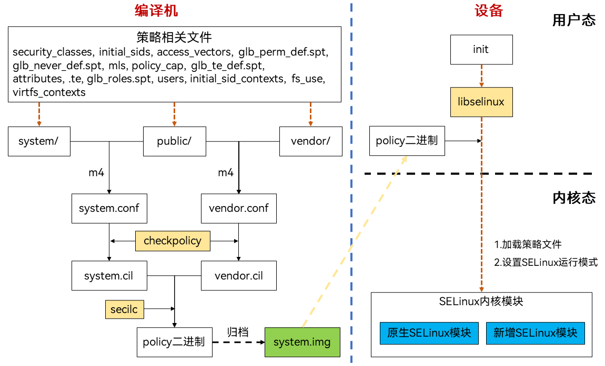
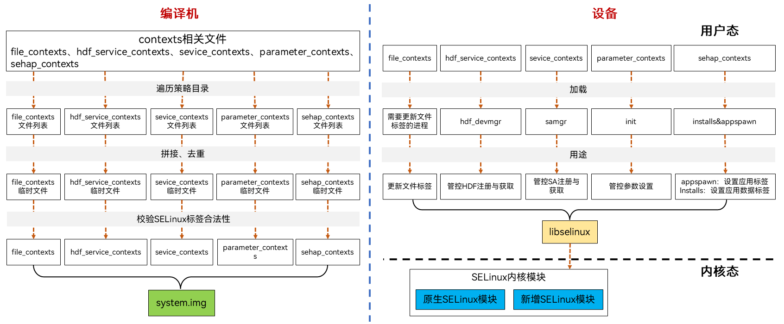

# OpenHarmony SELinux编译与加载

## 策略编译与加载

OpenHarmony SELinux策略编译流程在编译机中进行，加载流程在init进程启动后执行，总体流程如图：

**图1** OpenHarmony SELinux编译和加载流程图

### 策略编译
OpenHarmony SELinux策略编译主要包括以下流程：
1. 按`security_classes, initial_sids, access_vectors, glb_perm_def.spt, glb_never_def.spt, mls, policy_cap, glb_te_def.spt, attributes, .te, glb_roles.spt, users, initial_sid_contexts, fs_use, virtfs_contexts`顺序遍历策略目录`//base/security/selinux_adapter/sepolicy/`，得到父目录为system和public的策略文件列表，使用m4宏处理器将策略文件列表拼接成`system.conf`中间文件，这里会决定是否展开隔离宏。同理，遍历得到父目录为vendor和public的策略文件列表，使用m4宏处理器将策略文件列表拼接成`vendor.conf`中间文件，这里也会决定是否展开隔离宏。
2. 使用开源软件checkpolicy将conf中间文件编译为.cil明文策略文件，得到`system.cil`和`vendor.cil`。
3. 使用开源软件secilc将`system.cil`和`vendor.cil`进行合并，编译为二进制策略文件。编译时会进行neverallow检查，违反neverallow时会编译报错。参考[OpenHarmony SELinux常见问题](subsys-security-selinux-faq.md)。
4. 编译后的二进制策略文件会归档到`system.img`中，位于`/system/etc/selinux/targeted/policy/policy.31`。

### 策略加载
OpenHarmony SELinux策略加载主要经过以下流程：
1. init进程在启动后，通过开源软件libselinux提供的用户态操作内核态的接口将selinux二进制策略文件加载到内核。
2. 然后根据配置文件`/system/etc/selinux/config`中SELINUX字段的值设置运行模式，`SELINUX=enforcing`时，设置为强制模式，`SELINUX=permissive`时，设置为宽容模式。从OpenHarmony 3.2开始，OpenHarmony SELinux默认以强制模式运行。

## contexts编译与加载
OpenHarmony SELinux contexts包括`file_contexts`、`hdf_service_contexts`、`service_contexts`、`parameter_contexts`、`sehap_contexts`。这些文件不随策略编译而编译，需要单独归档。总体流程如图：

**图2** OpenHarmony SELinux contexts编译和加载流程图

### contexts编译
OpenHarmony SELinux contexts编译主要包括以下流程：
1. 分别遍历各类型的contexts文件，得到每个类型contexts的文件列表。
2. 对列表分别拼接去重，生成contexts中间文件。
3. 对contexts中间文件中使用的SELinux标签校验合法性，得到contexts文件。
4. 将contexts归档到`system.img`，位于`/system/etc/selinux/targeted/contexts/`。

### contexts加载
OpenHarmony SELinux contexts加载按类型不同，加载方式不同：
| contexts类型 | 加载方 | 用途 |
| -------- | -------- | -------- |
| file_contexts | 需要更新文件标签的进程 | 更新文件标签。 |
| hdf_service_contexts | hdf_devmgr |管控HDF注册与获取。 |
| service_contexts | samgr | 管控SA注册与获取。 |
| parameter_contexts | init | 管控参数设置。 |
| sehap_contexts | appspawn installs | appspawn：设置应用标签。 installs：设置应用数据标签。 |