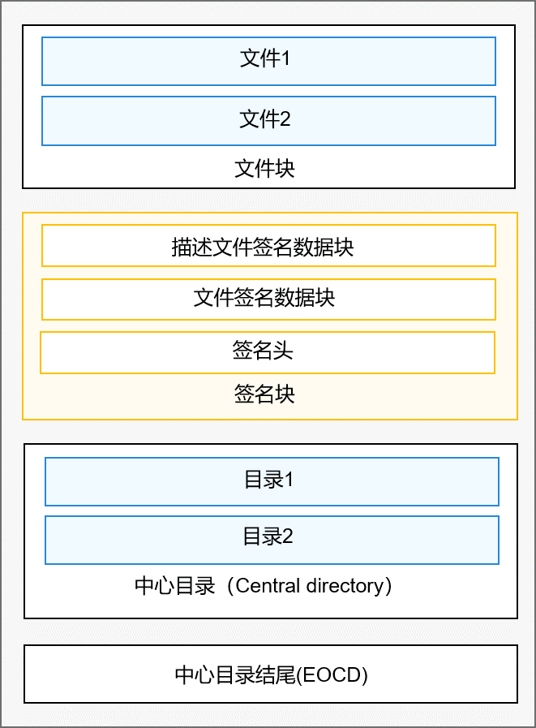

# 应用验签开发指导<a name="ZH-CN_TOPIC_0000001058671627"></a>

-   [场景介绍](#section18502174174019)
-   [验签流程](#section554632717226)
-   [接口说明](#section1633115419401)
-   [开发步骤（场景一）](#section4207112818418)
    -   [验签指导](#section11470123816297)
    -   [生成OpenHarmony自签名应用](#section167151429133312)
    -   [开发示例](#section174318361353)

-   [开发步骤（场景二）](#section81272563427)
    -   [验签指导](#section07028210442)
    -   [开发示例](#section1930711345445)

-   [调测验证](#section427316292411)

## 场景介绍<a name="section18502174174019"></a>

当需要验证调试应用、发布应用，OpenHarmony自签名应用的完整性是否被破坏时，可以调用验签组件的接口进行验证。如有需要还可通过验签接口获取部分描述文件信息，如appid。对于调试应用，还可通过验签接口验证应用和设备的UDID是否匹配，确保应用安装在了正确的设备上。

## 验签流程<a name="section554632717226"></a>

未经签名的Hap包的压缩方式是ZIP格式，简单分为文件块，中心目录（Central directory）块，中心目录结尾（EOCD，End of central directory record）块。

经过签名的Hap包，在文件块，和中心目录块之间，插入了签名块。签名块由文件签名数据块（data sign block）、描述文件签名数据块（profile sign block）和签名头（sign head）组成，如下图所示。

**图 1**  经过签名的Hap包结构<a name="fig699855043"></a>  




整个验签流程，主要分为三部分：整包验签、描述文件签名块验签，以及描述文件内容校验。

**整包验签**

用设备的预置根证书，通过证书链来证明叶子证书本身是可信的，然后用叶子证书的公钥解密出的摘要证明整包是未篡改的。

具体操作步骤如下：

1.  对文件签名数据块中的证书链进行校验，确定其叶子证书是可信的。
2.  用叶子证书中的公钥对文件签名块进行验签，证明其未被篡改。
3.  计算并合并文件块，中心目录块和中心目录结尾块的摘要。然后将计算结果，再与签名块中的描述文件签名块的摘要合并，将最终合并的摘要与文件签名块中包含的摘要对比，如果两者相等，则整包验签通过。

**描述文件签名块验签**

首先判断文件签名的签发单位，如果是应用市场签发的发布应用，则无需对描述文件进行验签，直接信任，否则要对其验签。先取出整个描述文件签名块，然后验证证书链，最后用叶子证书对描述文件数据块验签，证明其未被篡改。

**描述文件内容校验**

取出描述文件，并对其内容进行合法性检查。其中若hap包为调试应用，则会比对本机UDID与描述文件中包含的UDID列表，如果本机UDID在描述文件的UDID列表中包含，则验证通过。比较描述文件中包含的证书（如果是应用市场发布应用或OpenHarmony自签名则无需比较），和整包校验时使用的叶子证书，如果相同，认为整个验签流程完成。

## 接口说明<a name="section1633115419401"></a>

验签组件当前提供innerkits接口，仅供系统应用调用，相关接口及功能描述如下：

**表 1**  验签组件API接口功能介绍

<a name="table1731550155318"></a>
<table><thead align="left"><tr id="row4419501537"><th class="cellrowborder" valign="top" width="37.66%" id="mcps1.2.3.1.1"><p id="p54150165315"><a name="p54150165315"></a><a name="p54150165315"></a>接口名</p>
</th>
<th class="cellrowborder" valign="top" width="62.339999999999996%" id="mcps1.2.3.1.2"><p id="p941150145313"><a name="p941150145313"></a><a name="p941150145313"></a>描述</p>
</th>
</tr>
</thead>
<tbody><tr id="row34145016535"><td class="cellrowborder" valign="top" width="37.66%" headers="mcps1.2.3.1.1 "><p id="p122711391160"><a name="p122711391160"></a><a name="p122711391160"></a>int APPVERI_AppVerify(const char *filePath, VerifyResult *verifyRst)</p>
</td>
<td class="cellrowborder" valign="top" width="62.339999999999996%" headers="mcps1.2.3.1.2 "><p id="p13562171015712"><a name="p13562171015712"></a><a name="p13562171015712"></a>主入口函数，输入文件路径，进行验签，并将从描述文件中获取的数据通过verifyRst返回给调用者</p>
</td>
</tr>
<tr id="row1746172917474"><td class="cellrowborder" valign="top" width="37.66%" headers="mcps1.2.3.1.1 "><p id="p2131144717619"><a name="p2131144717619"></a><a name="p2131144717619"></a>int APPVERI_SetDebugMode(bool mode)</p>
</td>
<td class="cellrowborder" valign="top" width="62.339999999999996%" headers="mcps1.2.3.1.2 "><p id="p1577114614282"><a name="p1577114614282"></a><a name="p1577114614282"></a>设置测试模式，设置mode为true，则支持基于测试根密钥的证书链校验，设置mode为false，则关闭基于测试根密钥的证书链校验。</p>
<p id="p2431455765"><a name="p2431455765"></a><a name="p2431455765"></a>注：当前没有基于现有测试根密钥的证书，开发者可根据自身需要，替换测试根密钥并进行相关验证。</p>
</td>
</tr>
<tr id="row10992232154714"><td class="cellrowborder" valign="top" width="37.66%" headers="mcps1.2.3.1.1 "><p id="p685215538611"><a name="p685215538611"></a><a name="p685215538611"></a>void APPVERI_FreeVerifyRst(VerifyResult *verifyRst)</p>
</td>
<td class="cellrowborder" valign="top" width="62.339999999999996%" headers="mcps1.2.3.1.2 "><p id="p126575774517"><a name="p126575774517"></a><a name="p126575774517"></a>释放verifyRst中申请的内存</p>
</td>
</tr>
</tbody>
</table>

## 开发步骤（场景一）<a name="section4207112818418"></a>

### 验签指导<a name="section11470123816297"></a>

对应用市场发布应用、基于应用市场调试证书签发的调试应用、OpenHarmony自签名应用的校验。

1.  定义出参结构体变量VerifyResult；

    ```
    VerifyResult verifyResult = {0};
    ```

2.  以文件路径及VerifyResult为入参，调用APPVERI\_AppVerify进行文件校验；

    ```
    int32_t ret = APPVERI_AppVerify(hapFilepath.c_str(), &verifyResult);
    ```

3.  判断返回结果，如果校验通过的话，获取VerifyResult中的数据，进行业务处理;

    ```
    signatureInfo.appId = verifyResult.profile.appid;
    signatureInfo.provisionBundleName = verifyResult.profile.bundleInfo.bundleName;
    ```

4.  调用APPVERI\_FreeVerifyRst，释放VerifyResult中申请的内存。

    ```
    APPVERI_FreeVerifyRst(&verifyResult);
    ```


### 生成OpenHarmony自签名应用<a name="section167151429133312"></a>

如果是OpenHarmony自签名应用的校验，开发者可通过以下方式生成OpenHarmony自签名应用。

1.  材料备齐。

    生成自签名应用需要的材料有：签名工具、系统应用hap包、系统应用profile文件\(\*.p7b\)、签名证书\(\*.cer\)、签名公私钥对\(\*.jks\)。

2.  将所有材料放在同一个目录下，打开shell。
3.  根据应用、描述文件的实际名称修改指令，并在shell中输入，完成签名。

    ```
    java -jar hapsigntoolv2.jar sign -mode localjks -privatekey "OpenHarmony Software Signature" -inputFile camera.hap -outputFile signed_camera.hap -signAlg SHA256withECDSA -keystore OpenHarmony.jks -keystorepasswd 123456 -keyaliaspasswd 123456 -profile camera_release.p7b -certpath OpenHarmony.cer -profileSigned 1
    ```

    关键字段说明：

    -jar：签名工具，[hapsigntool](https://repo.huaweicloud.com/harmonyos/develop_tools/hapsigntoolv2.jar)

    -mode：本地签名标记位，固定为localjks

    -privatekey：密钥对别名，签名公私钥对的别名为OpenHarmony Software Signature

    -inputFile：待签名应用，通过编译产生

    -outputFile：签名后应用，最终输出

    -signAlg：签名算法，当前固定为SHA256withECDSA

    -keystore：公私钥对，使用签名公私钥对，位于开源库security\_services\_app\_verify仓中OpenHarmonyCer目录下，[OpenHarmony.jks](https://gitee.com/openharmony/security_appverify/blob/master/interfaces/innerkits/appverify_lite/OpenHarmonyCer/OpenHarmony.jks)。默认密码为123456 ，用户可采用工具\(例如keytool\)更改默认密码

    -keystorepasswd：公私钥对密码，默认签名公私钥对密码为123456

    -keyaliaspasswd：公私钥对别名密码，默认签名公私钥对别名密码为123456

    -profile：描述文件，应用的描述文件位于对应源代码目录中

    -certpath：使用签名证书，位于开源库security\_services\_app\_verify仓中OpenHarmonyCer目录下，[OpenHarmony.cer](https://gitee.com/openharmony/security_appverify/blob/master/interfaces/innerkits/appverify_lite/OpenHarmonyCer/OpenHarmony.cer)

    -profileSigned：签名块中是否包含描述文件\(profile\)。固定为1（包含）


### 开发示例<a name="section174318361353"></a>

以应用管理框架组件在应用安装时进行验签的实际调用为例：

```
uint8_t HapSignVerify::VerifySignature(const std::string &hapFilepath, SignatureInfo &signatureInfo)
{
	bool mode = ManagerService::GetInstance().IsDebugMode();
	HILOG_INFO(HILOG_MODULE_APP, "current mode is %d!", mode);
        // 定义结果结构体
	VerifyResult verifyResult = {0};
        // 输入待验签文件路径进行验签
	int32_t ret = APPVERI_AppVerify(hapFilepath.c_str(), &verifyResult); 
	uint8_t errorCode = SwitchErrorCode(ret);
	if (errorCode != ERR_OK) {
		return errorCode;
	}
        // 从结果结构体中获取appid
	signatureInfo.appId = verifyResult.profile.appid; 
        // 从结果结构体中获取描述文件中书写的应用名
	signatureInfo.provisionBundleName = verifyResult.profile.bundleInfo.bundleName; 
	int32_t restricNum = verifyResult.profile.permission.restricNum;
	for (int32_t i = 0; i < restricNum; i++) {
		signatureInfo.restrictedPermissions.emplace_back((verifyResult.profile.permission.restricPermission)[i]);
	}
        // 释放结果结构体中申请的内存
	APPVERI_FreeVerifyRst(&verifyResult); 
	return ERR_OK;
}
```

## 开发步骤（场景二）<a name="section81272563427"></a>

### 验签指导<a name="section07028210442"></a>

对采用基于测试根密钥证书签名的应用的校验。

1.  调用APPVERI\_SetDebugMode\(true\)开启测试模式；

    ```
    	ManagerService::SetDebugMode(true);
    ...
    uint8_t ManagerService::SetDebugMode(bool enable)
    {
    	int32_t ret = APPVERI_SetDebugMode(enable);
    	if (ret < 0) {
    		HILOG_ERROR(HILOG_MODULE_APP, "set signature debug mode failed");
    		return ERR_APPEXECFWK_SET_DEBUG_MODE_ERROR;
    	}
    	isDebugMode_ = enable;
    	HILOG_INFO(HILOG_MODULE_APP, "current sign debug mode is %d", isDebugMode_);
    	return ERR_OK;
    }
    ```

2.  同场景一中步骤一至四，定义结构体，校验、释放结构体；
3.  调用APPVERI\_SetDebugMode\(false\)关闭测试模式。

    ```
            ManagerService::SetDebugMode(false);
    ```


### 开发示例<a name="section1930711345445"></a>

完整开发示例如下（在场景一代码示例的基础上进行补充）：

```
uint8_t ManagerService::SetDebugMode(bool enable)
{
	int32_t ret = APPVERI_SetDebugMode(enable);
	if (ret < 0) {
		HILOG_ERROR(HILOG_MODULE_APP, "set signature debug mode failed");
		return ERR_APPEXECFWK_SET_DEBUG_MODE_ERROR;
	}
	isDebugMode_ = enable;
	HILOG_INFO(HILOG_MODULE_APP, "current sign debug mode is %d", isDebugMode_);
	return ERR_OK;
}
uint8_t HapSignVerify::VerifySignature(const std::string &hapFilepath, SignatureInfo &signatureInfo)
{
        // 开启支持测试服务器签名应用验证
        ManagerService::SetDebugMode(true); 
	bool mode = ManagerService::GetInstance().IsDebugMode();
	HILOG_INFO(HILOG_MODULE_APP, "current mode is %d!", mode);
        // 定义结果结构体
	VerifyResult verifyResult = {0}; 
        // 输入待验签文件路径进行验签
	int32_t ret = APPVERI_AppVerify(hapFilepath.c_str(), &verifyResult); 
	uint8_t errorCode = SwitchErrorCode(ret);
	if (errorCode != ERR_OK) {
		return errorCode;
	}
        // 从结果结构体中获取appid
	signatureInfo.appId = verifyResult.profile.appid; 
        // 从结果结构体中获取描述文件中书写的应用名
	signatureInfo.provisionBundleName = verifyResult.profile.bundleInfo.bundleName; 
	int32_t restricNum = verifyResult.profile.permission.restricNum;
	for (int32_t i = 0; i < restricNum; i++) {
		signatureInfo.restrictedPermissions.emplace_back((verifyResult.profile.permission.restricPermission)[i]);
	}
        // 释放结果结构体中申请的内存
        APPVERI_FreeVerifyRst(&verifyResult); 
        // 关闭支持测试服务器签名应用验证
        ManagerService::SetDebugMode(false); 
	return ERR_OK;
}
```

## 调测验证<a name="section427316292411"></a>

1.  选取一个在OpenHarmony上能够正常安装的应用A。
2.  根据开发指导开发。
3.  对应用A，采用自开发程序进行验签，验签通过，能获取到appid。即为开发成功。

