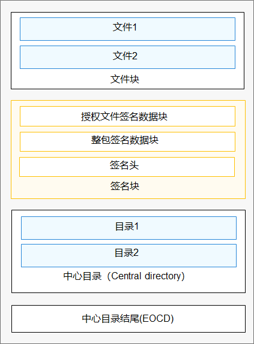

# 应用验签开发指导

## 场景介绍

为了确保应用的完整性和来源可靠，OpenHarmony需要对应用进行签名和验签。

- 应用开发阶段：开发者完成开发并生成安装包后，需要开发者对安装包进行签名，以证明安装包发布到设备的过程中没有被篡改。OpenHarmony的应用完整性校验模块提供了签名工具、签名证书生成规范，以及签名所需的公钥证书等完整的机制，支撑开发者对应用安装包签名。为了方便开源社区开发者，版本中预置了公钥证书和对应的私钥，为开源社区提供离线签名和校验能力；在OpenHarmony商用版本中应替换此公钥证书和对应的私钥。

- 应用安装阶段：OpenHarmony用户程序框架子系统负责应用的安装。在接收到应用安装包之后，应用程序框架子系统需要解析安装包的签名数据，然后使用应用完整性校验模块的API对签名进行验证，只有校验成功之后才允许安装此应用. 应用完整性校验模块在校验安装包签名数据时，会使用系统预置的公钥证书进行验签。

## 验签流程

未经签名的Hap包的压缩方式是ZIP格式，简单分为文件块，中心目录（Central directory）块，中心目录结尾（EOCD，End of central directory record）块。

经过签名的Hap包，在文件块，和中心目录块之间，插入了签名块。签名块由整包签名数据块（data sign block）、授权文件签名数据块（profile sign block）和签名头（sign head）组成，如下图所示。

  **图1** 经过签名的Hap包结构
  

整个验签流程，主要分为三部分：整包验签、授权文件验签，以及授权文件内容校验。

**整包验签**

整包签名数据块是一个PKCS7格式的签名块（signed data），验签过程包括PKSC7签名验证、哈希比较、证书链验证以及证书链与设备预置根证书的匹配校验。

**授权文件验签**

授权文件数据块是一个PKCS7格式的签名块（signed data），其中PKCS7签名块的内容信息(contentinfo)是授权文件的内容。验签过程包括：PKCS7签名验证、哈希比较、证书链验证以及签发授权文件证书的合法性校验。

**授权文件内容校验**

验签模块将对授权文件内容进行合法性检查。如果授权文件是调试类型，则会比对本机UDID是否在授权文件授权调试的UDID列表中，如果本机UDID在授权文件授权调试的UDID列表中，则会进一步比较授权文件中的调试证书和整包签名使用的证书是否相同，如果相同，则验证通过。

## 接口说明

验签组件当前提供innerkits接口，仅供系统应用调用，相关接口及功能描述如下：

  **表1** 轻量级系统验签组件API接口功能介绍

| 接口名 | 描述 | 
| -------- | -------- |
| int&nbsp;APPVERI_AppVerify(const&nbsp;char&nbsp;\*filePath,&nbsp;VerifyResult&nbsp;\*verifyRst) | 主入口函数，输入文件路径，进行验签，并将从描述文件中获取的数据通过verifyRst返回给调用者 | 
| int&nbsp;APPVERI_SetDebugMode(bool&nbsp;mode) | 设置测试模式，设置mode为true，则支持基于测试根密钥的证书链校验，设置mode为false，则关闭基于测试根密钥的证书链校验。 注：当前没有基于现有测试根密钥的证书，开发者可根据自身需要，替换测试根密钥并进行相关验证。 | 
| void&nbsp;APPVERI_FreeVerifyRst(VerifyResult&nbsp;\*verifyRst) | 释放verifyRst中申请的内存 | 

  **表2** 标准系统验签组件API接口功能介绍

| 接口名 | 描述 | 
| -------- | -------- |
| int&nbsp;HapVerify(const&nbsp;std::string&amp;&nbsp;filePath,&nbsp;HapVerifyResult&amp;&nbsp;hapVerifyResult) | 校验应用完整性，识别应用来源。 | 

## 开发步骤

### 生成OpenHarmony签名应用

具体操作请参考：[配置OpenHarmony应用签名信息](https://developer.harmonyos.com/cn/docs/documentation/doc-guides/ohos-auto-configuring-signature-information-0000001271659465)。
