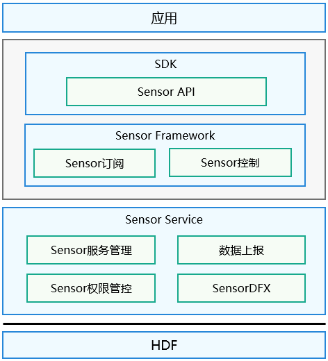

# Sensor服务概述

## 简介

Sensor服务子系统提供了轻量级传感器服务基础框架，您可以使用该框架接口实现传感器列表查询、传感器控制、传感器订阅去订阅等功能。轻量级传感器服务框架如下图所示：

  **图1** Sensor服务框架图

  

- Sensor API：提供传感器的基础API，主要包含查询传感器的列表、订阅/取消传感器数据、执行控制命令等，简化应用开发。

- Sensor Framework：主要实现传感器的订阅管理、数据通道的创建、销毁等，实现与传感器服务层的通信。

- Sensor Service：主要实现HDF层数据接收、解析、分发，对设备传感器的管理，数据上报管理以及传感器权限管控等。

## 接口说明

  **表1** Sensor服务框架API接口功能介绍

| 接口名 | 接口说明 | 参数要求 |
| -------- | -------- | -------- |
| int32_t GetAllSensors(SensorInfo sensorInfo, int32_t *count) | 作用：获取系统中所有传感器的信息。 返回值：0表示成功，其他返回值表示失败。 | sensorInfo(NOT&nbsp;NULL)：输出系统中所有传感器的信息； count(NOT&nbsp;NULL)：输出系统中所有传感器的数量。 |
| int32_t SubscribeSensor(int32_t sensorTypeId, const SensorUser *user) | 作用：订阅传感器数据，系统会将获取到的传感器数据上报给订阅者。 返回值：&nbsp;0为成功，其他返回值表示失败。 | sensorTypeId：唯一标识一个传感器类型； user(NOT&nbsp;NULL)：传感器的用户，用于从传感器获取数据，一般一个用户只属于一个传感器。 |
| int32_t UnsubscribeSensor(int32_t sensorTypeId, const SensorUser *user) | 作用：去订阅传感器数据，系统将取消传感器数据上报给订阅者。 返回值：0为成功，其他返回值表示失败。 | sensorTypeId：唯一标识一个传感器类型； user(NOT&nbsp;NULL)：传感器的用户，用于从传感器获取数据，一般一个用户只属于一个传感器。 |
| int32_t SetBatch(int32_t sensorTypeId, const SensorUser *user, int64_t samplingInterval, int64_t reportInterval) | 作用：设置传感器的数据采样间隔和数据上报间隔。 返回值：0为成功，其他返回值表示失败。 | sensorTypeId：唯一标识一个传感器类型； user(NOT&nbsp;NULL)：传感器的用户，用于从传感器获取数据，一般一个用户只属于一个传感器； samplingInterval：传感器数据采样间隔，单位纳秒； reportInterval：传感器数据上报间隔，单位纳秒。 |
| int32_t ActivateSensor(int32_t sensorTypeId, const SensorUser *user) | 作用：使能一个传感器订阅用户。 返回值：0为成功，其他返回值表示失败。 | sensorTypeId：唯一标识一个传感器类型； user(NOT&nbsp;NULL)：传感器的用户，用于从传感器获取数据，一般一个用户只属于一个传感器。 |
| int32_t DeactivateSensor(int32_t sensorTypeId, const SensorUser *user) | 作用：去使能一个传感器订阅用户 返回值：0为成功，其他返回值表示失败。 | sensorTypeId：唯一标识一个传感器类型； user(NOT&nbsp;NULL)：传感器的用户，用于从传感器获取数据，一般一个用户只属于一个传感器。 |
| int32_t SetMode(int32_t sensorTypeId, const SensorUser *user, int32_t mode) | 作用：设置传感器的工作模式。 返回值：0为成功，其他返回值表示失败。 | sensorTypeId：唯一标识一个传感器类型； user(NOT&nbsp;NULL)：传感器的用户，用于从传感器获取数据，一般一个用户只属于一个传感器； mode：传感器的数据上报模式。 |

