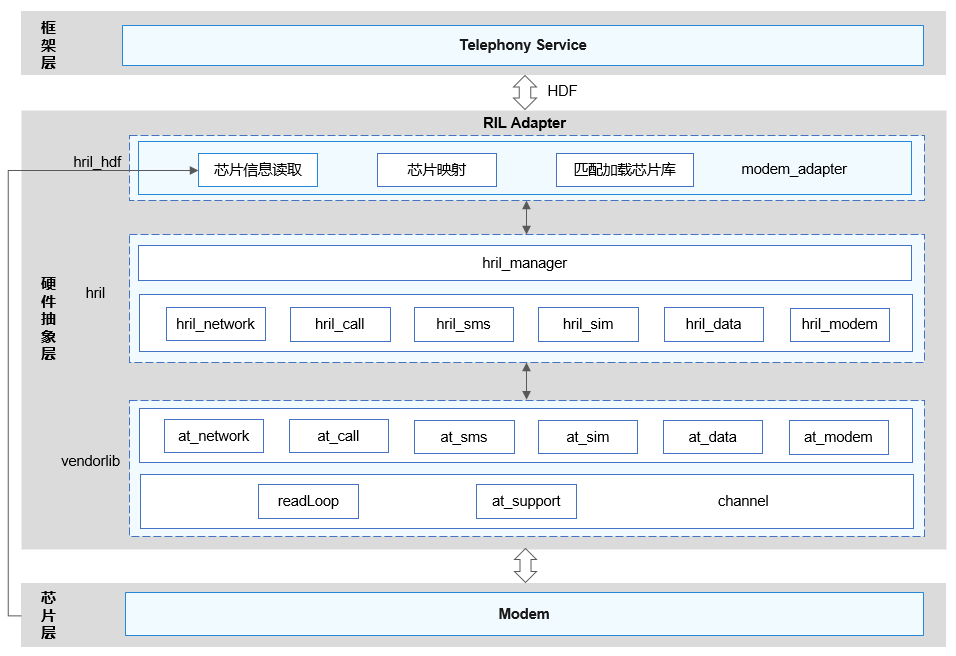

# 电话服务概述

## 概述

本指南简要介绍了Modem厂商库的集成、初始化、业务请求响应和事件上报的方法，并通过通话业务的具体开发实例呈现厂商库的适配开发过程，供不同Modem芯片的开发者参考，从而帮助其高效地实现电话相关业务功能的开发。

## 基本概念

- Telephony Service：电话服务子系统核心服务层。主要功能是初始化RIL管理类、SIM卡和搜网模块；获取RIL Adapter服务，通过注册回调服务，实现与RIL Adapter的通信功能；通过发布订阅，来实现与通话、短信等功能模块之间的通信。

- RIL Adapter：电话服务子系统RIL适配层。该层主要包括厂商库加载，业务接口实现。用于屏蔽不同Modem厂商的硬件差异，为上层提供统一的接口，通过注册HDF服务与上层接口通信。

- HDF：硬件驱动框架（Hardware Driver Foundation）。用于提供统一外设访问能力和驱动开发、管理框架。

- hdc_std：OpenHarmony设备连接器（OpenHarmony Device Connector）。是OpenHarmony为开发人员提供的用于设备连接调试的命令行工具。

## 运作机制

  **图1** RIL Adapter模块架构图

RIL Adapter模块架构如图1所示，内部主要分为hril_hdf、hril和vendorlib三层。

- hril_hdf：RIL Adapter的唯一入口，主要负责Modem厂商库的加载。其中，modem_adapter实现了单一固件对不同Modem的适配。
  其实现机制为：在加载Modem厂商库之前，从kernel获取Modem的设备型号，根据此型号加载对应的Modem厂商库。

- hril：OpenHarmony无线接口层（OpenHarmony Radio Interface Layer）。与Telephony Service交互的接口实现部分，实现了Telephony Service和vendorlib通信的功能，包括SIM卡、搜网、蜂窝数据、蜂窝通话和短彩信等。

- vendorlib：Modem厂商库文件。不同的Modem厂商根据RIL Adapter提供的标准化接口或ID，进行Modem厂商库的开发（vendorlib由Modem厂商提供）。

hril_hdf执行后，将动态加载vendorlib，vendorlib可以从hril_hdf中获取处理响应和上报的函数指针，该过程结束后，hril_hdf才可通过vendorlib与Modem通信。

## 约束与限制

**规格限制：**

需要设备厂商至少支持一个Modem，如果不支持任何Modem，无需实现厂商库接口。
