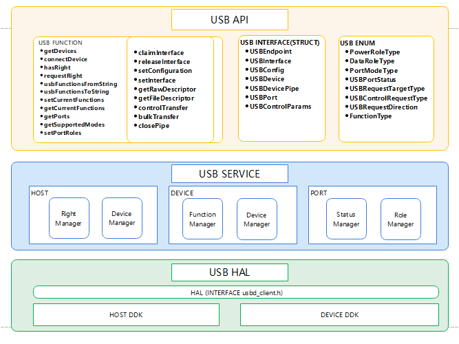

# USB服务

## 概述

### 功能简介

USB设备分为Host设备（主机设备）和Device设备（从设备）。用户可通过Port Service来根据实际业务把运行OpenHarmony的设备切换为Host设备或者Device设备。目前在Host模式下，支持获取USB设备列表，USB设备权限管理，控制传输、批量传输的同异步数据传输等，在Device模式下，支持HDC（调试）、ACM（串口）、ECM（网口）等功能的切换。

### 基本概念

- USB服务

  USB服务是应用访问底层的一种设备抽象概念。开发者根据提供的USB API，可以获取设备列表、控制设备访问权限、以及与连接的设备进行数据传输、控制命令传输等。

- USB API

  基于USB Service服务，使用NAPI技术，向上提供JS接口。提供USB的基础API，主要包含查询USB设备的列表、设备插拔通知、USB HOST/DEVICE 功能切换、批量数据传输、控制命令传输、USB设备打开的权限控制及USB device模式下的function功能切换等。

- USB Service

  使用C++代码实现，包含Host、Device、Port、Right四个模块。基于HDI接口，主要实现USB设备列表管理、Function 管理、Port管理、USB设备权限管理等功能。主要实现HAL层数据接收、解析、分发，前后台的策略管控，对该设备USB的管理，USB权限管控等。

- USB HAL

  使用C代码实现，基于Host DDK(Driver Develop Kit)和Device DDK，封装了对USB设备的基本操作，向上提供C++接口，同时通过HDF框架接收内核上报的信息。

### 运作机制

USB服务系统包含USB API、USB Service、USB HAL。

  **图1** USB服务架构图
  

- USB API：提供USB的基础API，主要包含查询USB设备列表、批量数据传输、控制命令传输、权限控制等。

- USB Service：主要实现HAL层数据的接收、解析、分发，前后台的策略管控以及对设备的管理等。

- USB HAL层：提供给用户态可直接调用的驱动能力接口。

## 使用指导

### 场景介绍

Host模式下，可以获取到已经连接的设备列表，并根据需要打开和关闭设备、控制设备权限、进行数据传输等。

### 接口说明

  **表1** Host部分

| 接口名称                                                     | 功能描述                                                     |
| ------------------------------------------------------------ | ------------------------------------------------------------ |
| int32_t OpenDevice(const UsbDevice &device, USBDevicePipe &pip); | 打开USB设备，建立连接                                        |
| bool HasRight(std::string deviceName);                       | 判断是否有权访问设备                                         |
| int32_t RequestRight(std::string deviceName);                | 请求给定软件包的临时权限以访问设备                           |
| int32_t GetDevices(std::vector &deviceList);                 | 获取USB设备列表                                              |
| int32_t ClaimInterface(USBDevicePipe &pip, const UsbInterface &interface, bool force); | 打开接口，并申明独占接口，必须在数据传输前执行               |
| int32_t ReleaseInterface(USBDevicePipe &pip, const UsbInterface &interface); | 关闭接口，释放接口的占用，在停止数据传输后执行               |
| int32_t BulkTransfer(USBDevicePipe &pip, const USBEndpoint &endpoint, std::vector &vdata, int32_t timeout); | 在给定端点上执行批量数据传输， 返回读取或发送的数据长度，通过端点方向确定读取或发送数据 |
| int32_t ControlTransfer(USBDevicePipe &pip, const UsbCtrlTransfer &ctrl, std::vector &vdata); | 对此设备执行端点零的控制事务，传输方向由请求类型决定         |
| int32_t SetConfiguration(USBDevicePipe &pip, const USBConfig &config); | 设置设备当前使用的配置，通过配置值进行指定                   |
| int32_t SetInterface(USBDevicePipe &pipe, const UsbInterface &interface); | 设置指定接口的备选设置，用于在具有相同ID但不同备用设置的两个接口之间进行选择 |
| int32_t GetRawDescriptors(std::vector &vdata);               | 获取原始的USB描述符                                          |
| int32_t GetFileDescriptor();                                 | 获取文件描述符                                               |
| bool Close(const USBDevicePipe &pip);                        | 关闭设备，释放与设备相关的所有系统资源                       |
| int32_t PipeRequestWait(USBDevicePipe &pip, int64_t timeout, UsbRequest &req); | 获取异步传输结果                                             |
| int32_t RequestInitialize(UsbRequest &request);              | 初始化异步数据传输request                                    |
| int32_t RequestFree(UsbRequest &request);                    | 释放异步数据传输request                                      |
| int32_t RequestAbort(UsbRequest &request);                   | 取消待处理的数据请求                                         |
| int32_t RequestQueue(UsbRequest &request);                   | 将指定的端点进行异步数据发送或者接收请求，数据传输方向由端点方向决定 |
| int32_t RegBulkCallback(USBDevicePipe &pip, const USBEndpoint &endpoint, const sptr<IRemoteObject> &cb); | 注册批量传输异步回调函数                                     |
| int32_t UnRegBulkCallback(USBDevicePipe &pip, const USBEndpoint &endpoint); | 注销批量传输异步回调函                                       |
| int32_t BulkRead(USBDevicePipe &pip, const USBEndpoint &endpoint, sptr<Ashmem> &ashmem); | 批量传输异步读数据                                           |
| int32_t BulkWrite(USBDevicePipe &pip, const USBEndpoint &endpoint, sptr<Ashmem> &ashmem); | 批量传输异步写                                               |
| int32_t BulkCancel(USBDevicePipe &pip, const USBEndpoint &endpoint); | 批量传输异步取消接口，用于取消当前接口的异步批量读写操作     |

  **表2** Device部分

| 接口名称                                           | 功能描述                                               |
| -------------------------------------------------- | ------------------------------------------------------ |
| int32_t GetCurrentFunctions(int32_t &funcs);       | 获取设备模式下的当前USB功能列表的数字组合掩码          |
| int32_t SetCurrentFunctions(int32_t funcs);        | 在设备模式下设置当前的USB功能列表                      |
| int32_t UsbFunctionsFromString(std::string funcs); | 将给定的功能列表描述字符串转换为功能列表的数字组合掩码 |
| std::string UsbFunctionsToString(int32_t funcs);   | 将给定的功能列表的数字组合掩码转换为功能列表描述字符串 |

  **表3** Port部分

| 接口名称                                                     | 功能描述                                                 |
| ------------------------------------------------------------ | -------------------------------------------------------- |
| int32_t GetSupportedModes(int32_t portId, int32_t &supportedModes); | 获取指定的端口支持的模式列表的组合掩码                   |
| int32_t SetPortRole(int32_t portId, int32_t powerRole, int32_t dataRole); | 设置指定的端口支持的角色模式，包含充电角色、数据传输角色 |
| int32_t GetPorts(std::vector &usbPorts);                     | 获取物理USB端口描述信息列表                              | 

### USB服务子系统使用步骤

以bulktransfer为例。

1. 获取usb service实例。

    ```cpp
    static OHOS::USB::UsbSrvClient &g_usbClient = OHOS::USB::UsbSrvClient::GetInstance();
    ```

2. 获取usb设备列表。

    ```cpp
    std::vector<OHOS::USB::UsbDevice> deviceList;
    int32_t ret = g_usbClient.GetDevices(deviceList);
    ```

3. 申请设备权限。

    ```cpp
    int32_t ret = g_usbClient.RequestRight(device.GetName());
    ```

4. 打开设备。

    ```cpp
    USBDevicePipe pip;
    int32_t et = g_usbClient.OpenDevice(device, pip);
    ```

5. 配置设备接口。

    ```cpp
    //interface为deviceList中device的interface。
    ret = g_usbClient.ClaimInterface(pip, interface, true);
    ```

6. 数据传输。

    ```cpp
    // pipe为打开设备后的数据传输通道，endpoint为device中数据传输的端点，vdata是需要传输或读取的二进制数据块，timeout为传输超时时长。
    srvClient.BulkTransfer(pipe, endpoint, vdata, timeout);
    ```

7. 关闭设备。

    ```cpp
    ret = g_usbClient.Close(pip);
    ```

### USB服务子系统使用实例

```cpp
#include <cstdio>
#include <iostream>
#include <map>
#include <mutex>
#include <sstream>
#include <sys/time.h>
#include "if_system_ability_manager.h"
#include "ipc_skeleton.h"
#include "iremote_object.h"
#include "iservice_registry.h"
#include "iusb_srv.h"
#include "string_ex.h"
#include "system_ability_definition.h"
#include "usb_common.h"
#include "usb_device.h"
#include "usb_errors.h"
#include "usb_request.h"
#include "usb_server_proxy.h"
#include "usb_srv_client.h"

const int32_t REQUESTYPE = ((1 << 7) | (0 << 5) | (0 & 0x1f));
const int32_t REQUESTCMD = 6;
const int32_t VALUE = (2 << 8) + 0;
const int32_t TIMEOUT = 5000;
const int32_t ITFCLASS = 10;
const int32_t PRAMATYPE = 2;
const int32_t BUFFERLENGTH = 21;

void GetType(OHOS::USB::USBEndpoint &tep, OHOS::USB::USBEndpoint &outEp, bool &outEpFlg)
{
    if ((tep.GetType() == PRAMATYPE)) {
        if (tep.GetDirection() == 0) {
            outEp = tep;
            outEpFlg = true;
        }
    }
}

bool SelectEndpoint(OHOS::USB::USBConfig config,
                    std::vector<OHOS::USB::UsbInterface> interfaces,
                    OHOS::USB::UsbInterface &interface,
                    OHOS::USB::USBEndpoint &outEp,
                    bool &outEpFlg)
{
    for (int32_t i = 0; i < config.GetInterfaceCount(); ++i) {
        OHOS::USB::UsbInterface tif = interfaces[i];
        std::vector<OHOS::USB::USBEndpoint> mEndpoints = tif.GetEndpoints();
        for (int32_t j = 0; j < tif.GetEndpointCount(); ++j) {
            OHOS::USB::USBEndpoint tep = mEndpoints[j];
            if ((tif.GetClass() == ITFCLASS) && (tif.GetSubClass() == 0) && (tif.GetProtocol() == PRAMATYPE)) {
                GetType(tep, outEp, outEpFlg);
            }
        }
        if (outEpFlg) {
            interface = interfaces[i];
            return true;
        }
        std::cout << std::endl;
    }
    return false;
}

int OpenDeviceTest(OHOS::USB::UsbSrvClient &Instran, OHOS::USB::UsbDevice device, OHOS::USB::USBDevicePipe &pip)
{
    int ret = Instran.RequestRight(device.GetName());
    std::cout << "device RequestRight ret = " << ret << std::endl;
    if (0 != ret) {
        std::cout << "device RequestRight failed = " << ret << std::endl;
    }
    ret = Instran.OpenDevice(device, pip);
    return ret;
}

int CtrTransferTest(OHOS::USB::UsbSrvClient &Instran, OHOS::USB::USBDevicePipe &pip)
{
    std::cout << "usb_device_test : << Control Transfer >> " << std::endl;
    std::vector<uint8_t> vData;
    const OHOS::USB::UsbCtrlTransfer tctrl = {REQUESTYPE, REQUESTCMD, VALUE, 0, TIMEOUT};
    int ret = Instran.ControlTransfer(pip, tctrl, vData);
    if (ret != 0) {
        std::cout << "control message read failed width ret = " << ret << std::endl;
    } else {
    }
        std::cout << "control message read success" << std::endl;

    return ret;
}

int ClaimTest(OHOS::USB::UsbSrvClient &Instran,
              OHOS::USB::USBDevicePipe &pip,
              OHOS::USB::UsbInterface &interface,
              bool interfaceFlg)
{
    if (interfaceFlg) {
        std::cout << "ClaimInterface InterfaceInfo:" << interface.ToString() << std::endl;
        int ret = Instran.ClaimInterface(pip, interface, true);
        if (ret != 0) {
            std::cout << "ClaimInterface failed width ret = " << ret << std::endl;
        } else {
            std::cout << "ClaimInterface success" << std::endl;
        }
    }
    return 0;
}

int BulkTransferTest(OHOS::USB::UsbSrvClient &Instran,
                     OHOS::USB::USBDevicePipe &pip,
                     OHOS::USB::USBEndpoint &outEp,
                     bool interfaceFlg,
                     bool outEpFlg)
{
    if (interfaceFlg) {
        std::cout << "usb_device_test : << Bulk transfer start >> " << std::endl;
        if (outEpFlg) {
            uint8_t buffer[50] = "hello world 123456789";
            std::vector<uint8_t> vData(buffer, buffer + BUFFERLENGTH);
            int ret = Instran.BulkTransfer(pip, outEp, vData, TIMEOUT);
            if (ret != 0) {
                std::cout << "Bulk transfer write failed width ret = " << ret << std::endl;
            } else {
                std::cout << "Bulk transfer write success" << std::endl;
            }
            return ret;
        }
    }
    return 0;
}

int main(int argc, char **argv)
{
    std::cout << "usb_device_test " << std::endl;
    static OHOS::USB::UsbSrvClient &Instran = OHOS::USB::UsbSrvClient::GetInstance();
    // GetDevices
    std::vector<OHOS::USB::UsbDevice> deviceList;
    int32_t ret = Instran.GetDevices(deviceList);
    if (ret != 0) {
        return OHOS::USB::UEC_SERVICE_INVALID_VALUE;
    }
    if (deviceList.empty()) {
        return OHOS::USB::UEC_SERVICE_INVALID_VALUE;
    }

    OHOS::USB::UsbDevice device = deviceList[0];
    std::vector<OHOS::USB::USBConfig> configs = device.GetConfigs();
    OHOS::USB::USBConfig config = configs[0];
    std::vector<OHOS::USB::UsbInterface> interfaces = config.GetInterfaces();
    OHOS::USB::UsbInterface interface;
    OHOS::USB::USBEndpoint outEp;
    bool interfaceFlg = false;
    bool outEpFlg = false;
    interfaceFlg = SelectEndpoint(config, interfaces, interface, outEp, outEpFlg);

    // OpenDevice
    std::cout << "usb_device_test : << OpenDevice >> test begin -> " << std::endl;
    OHOS::USB::USBDevicePipe pip;
    ret = OpenDeviceTest(Instran, device, pip);
    if (ret != 0) {
        return OHOS::USB::UEC_SERVICE_INVALID_VALUE;
    }

    // ControlTransfer
    CtrTransferTest(Instran, pip);

    // ClaimInterface
    ClaimTest(Instran, pip, interface, interfaceFlg);

    // BulkTransferWrite
    BulkTransferTest(Instran, pip, outEp, interfaceFlg, outEpFlg);

    // CloseDevice
    std::cout << "usb_device_test : << Close Device >> " << std::endl;
    ret = Instran.Close(pip);
    if (ret == 0) {
        std::cout << "Close device failed width ret = " << ret << std::endl;
        return OHOS::USB::UEC_SERVICE_INVALID_VALUE;
    } else {
        std::cout << "Close Device success" << std::endl;
    }
    return 0;
}
```

### 参考手册

[驱动子系统](https://gitee.com/openharmony/docs/blob/master/zh-cn/readme/%E9%A9%B1%E5%8A%A8%E5%AD%90%E7%B3%BB%E7%BB%9F.md)

[drivers\_peripheral](https://gitee.com/openharmony/drivers_peripheral/blob/master/README_zh.md)

[drivers\_framework](https://gitee.com/openharmony/drivers_framework/blob/master/README_zh.md)

[drivers\_adapter](https://gitee.com/openharmony/drivers_adapter/blob/master/README_zh.md)

[drivers\_adapter\_khdf\_linux](https://gitee.com/openharmony/drivers_adapter_khdf_linux/blob/master/README_zh.md)