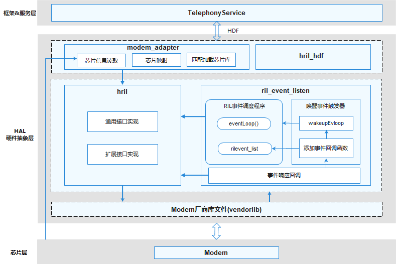

# 概述

-   [基本概念](#section202mcpsimp)
-   [运作机制](#section205mcpsimp)
-   [约束与限制](#section207mcpsimp)

适用于OpenHarmony 电话服务子系统 Modem 厂商库集成、初始化、业务请求响应和事件上报的开发指南。

## 基本概念

电话服务子系统 RIL Adapter模块负责蜂窝通信框架和Modem之间的通信，可支撑不同设备Modem厂商库的开发，提供Modem业务请求和事件上报相关的功能。

## 运作机制

**图 1**  RIL Adapter模块架构图  

RIL Adapter模块架构如图1所示，主要由ril初始化（hril\_hdf&modem\_adapter）、ril接口实现（hril&ril\_event\_listen）和Modem厂商库（vendorlib）三部分组成。

hril\_hdf执行后，将动态加载vendorlib，vendorlib从hril\_hdf获得可以处理的请求和上报函数指针，该过程结束后，hril\_hdf才可通过vendorlib与Modem通信。

-   hril\_hdf：RIL Adapter的入口。主要负责加载Modem厂商库文件、初始化hril库、启动ril\_event\_listen事件调度机制以及加载关联Modem的厂商库文件。
-   modem\_adapter：实现单一固件适配不同Modem的适配器。其实现机制为：在加载Modem厂商库之前，从kernel获取Modem的设备型号，根据此型号加载对应的Modem厂商库。
-   hril：与电话基础服务交互的接口实现。分为通用接口实现和vendor扩展接口实现两种：其中，通用接口实现了电话服务和主流Modem蜂窝通信的常用功能（SIM卡、搜网、蜂窝数据、蜂窝通话、短彩信等）；vendor扩展接口实是为了方便Modem厂商做通用接口以外的定制化能力扩展。
-   ril\_event\_listen：处理Modem上报事件的事件调度器。其实现机制为：当接收到Modem上报事件（例如来电），可以把事件封装为ril\_event并添加到事件调度队列中，通过队列管理机制调用回调函数上报到电话基础服务。
-   vendorlib：Modem厂商库文件。不同的Modem厂商根据RIL Adapter提供的标准化接口或ID，进行Modem厂商库的开发（vendorlib由Modem厂商提供）。

## 约束与限制

**规格限制：**

-   需要设备厂商至少支持一个Modem，如果不支持任何Modem，无需实现厂商库接口。

