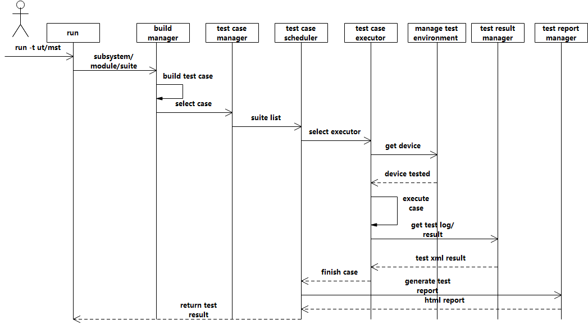

# 测试<a name="ZH-CN_TOPIC_0000001075761006"></a>

-   [概述](#section12403172115920)
    -   [基本概念](#section53632272090)
    -   [运作机制](#section2394431106)

-   [约束与限制](#section2029921310472)
-   [搭建环境](#section175012297491)
    -   [环境要求](#section935055691014)
    -   [安装环境](#section6511193210111)
    -   [检验环境是否搭建成功](#section1899144517117)

-   [开发指导](#section16741101301210)
    -   [场景介绍](#section93782214124)
    -   [接口说明](#section54131732101218)
    -   [开发步骤](#section53541946111218)

-   [开发实例](#section7477121918136)
-   [测试平台使用](#section76401945124810)
-   [包结构说明](#section1875515364133)

## 概述<a name="section12403172115920"></a>

### 基本概念<a name="section53632272090"></a>

测试子系统提供基于python开发的一键式的开发者自测试平台，支持跨平台使用以及三方测试框架拓展，主要包括测试用例编译、测试用例管理、测试用例调度分发、测试用例执行、测试结果收集、测试报告生成、测试用例模板、测试环境管理等模块。

在测试子系统开发前，开发者应先了解以下概念：

-   测试用例编译

    支持将测试用例源代码编译成可在被测设备侧执行的二进制文件。

-   测试用例调度分发

    支持将测试用例通过网口通道或者串口通道分发到不同的被测设备上，并且为每一个测试用例分配特定的测试用例执行器。

-   测试用例执行器

    负责测试用例的预处理，用例执行，结果记录等执行逻辑。

-   测试用例模板

    定义了测试用例以及用例编译配置GN文件的统一格式。

-   测试平台kit

    测试平台运行过程中公共方法，如提供测试用例目录向被测设备挂载文件系统，测试用例推送到被测设备，或者从被测设备获取测试结果等操作。

-   测试报告生成

    定义开发者自测试报告模板，生成web测试报告。

-   测试环境管理

    支持通过USB、串口等方式管理被测设备，功能包括设备发现，设备状态查询等。


### 运作机制<a name="section2394431106"></a>

-   测试平台架构图如下：

**图 1**  测试平台架构<a name="fig418674910399"></a>  


-   测试平台运行时序图如下：

**图 2**  测试平台运行时序<a name="fig107203017407"></a>  


-   测试平台运行原理

测试平台通过shell脚本启动，以命令行方式支持一系列的测试指令执行，通过命令行输出测试结果。

## 约束与限制<a name="section2029921310472"></a>

-   功能使用范围：开发自测试平台仅支持代码级的测试用例开发和验证，如单元测试，模块测试。
-   规格限制：当前测试框架的适用范围仅支持白盒测试。
-   操作限制：一台测试设备上仅支持启动单个测试平台。

## 搭建环境<a name="section175012297491"></a>

### 环境要求<a name="section935055691014"></a>

**表 1** **环境要求**

<a name="table13112443615"></a>
<table><thead align="left"><tr id="row1947247360"><th class="cellrowborder" valign="top" width="13.151315131513153%" id="mcps1.2.4.1.1"><p id="p64172414367"><a name="p64172414367"></a><a name="p64172414367"></a>项目</p>
</th>
<th class="cellrowborder" valign="top" width="53.78537853785378%" id="mcps1.2.4.1.2"><p id="p6452410368"><a name="p6452410368"></a><a name="p6452410368"></a>测试设备</p>
</th>
<th class="cellrowborder" valign="top" width="33.06330633063306%" id="mcps1.2.4.1.3"><p id="p94924103617"><a name="p94924103617"></a><a name="p94924103617"></a>被测设备</p>
</th>
</tr>
</thead>
<tbody><tr id="row10452414368"><td class="cellrowborder" valign="top" width="13.151315131513153%" headers="mcps1.2.4.1.1 "><p id="p1422414368"><a name="p1422414368"></a><a name="p1422414368"></a>硬件</p>
</td>
<td class="cellrowborder" valign="top" width="53.78537853785378%" headers="mcps1.2.4.1.2 "><a name="ul19802171518438"></a><a name="ul19802171518438"></a><ul id="ul19802171518438"><li>内存：8G及以上</li><li>硬盘：100G及以上</li><li>硬件架构：X86或ARM64</li></ul>
</td>
<td class="cellrowborder" valign="top" width="33.06330633063306%" headers="mcps1.2.4.1.3 "><a name="ul56772753313"></a><a name="ul56772753313"></a><ul id="ul56772753313"><li>Hi3516 DV300开发板</li><li>Hi3518 EV300开发板</li></ul>
</td>
</tr>
<tr id="row24182410361"><td class="cellrowborder" valign="top" width="13.151315131513153%" headers="mcps1.2.4.1.1 "><p id="p45102453620"><a name="p45102453620"></a><a name="p45102453620"></a>软件</p>
</td>
<td class="cellrowborder" valign="top" width="53.78537853785378%" headers="mcps1.2.4.1.2 "><a name="ul16677122216594"></a><a name="ul16677122216594"></a><ul id="ul16677122216594"><li>操作系统：Windows 10 64位 或 Ubuntu 18.04<p id="p717443952718"><a name="p717443952718"></a><a name="p717443952718"></a>系统组件（Linux）： libreadline-dev</p>
</li><li>Python：3.7.5及以上</li><li>Python插件：pyserial3.3及以上、paramiko2.7.1及以上、setuptools40.8.0及以上，rsa4.0及以上</li><li>NFS Server：haneWIN NFS Server1.2.50及以上或者 NFSv4及以上</li></ul>
</td>
<td class="cellrowborder" valign="top" width="33.06330633063306%" headers="mcps1.2.4.1.3 "><a name="ul20976824133414"></a><a name="ul20976824133414"></a><ul id="ul20976824133414"><li>系统软件：版本不低于OpenHarmony 1.0</li><li>内核类型：LiteOS-A或者Linux</li></ul>
</td>
</tr>
</tbody>
</table>

### 安装环境<a name="section6511193210111"></a>

1.  如测试环境为Linux，需要安装系统组件readline，命令如下：

    ```
    sudo apt-get install libreadline-dev
    ```

    安装成功提示如下：

    ```
    Reading package lists... Done
    Building dependency tree
    Reading state information... Done
    libreadline-dev is already the newest version (7.0-3).
    0 upgraded, 0 newly installed, 0 to remove and 11 not upgraded.
    ```

2.  安装Python扩展组件setuptools、（rsa、paramiko、以及pyserial，设备仅支持串口时安装），命令如下:

    1、安装setuptools，安装命令如下：

    ```
    pip install setuptools
    ```

    安装成功提示如下：

    ```
    Requirement already satisfied: setuptools in d:\programs\python37\lib\site-packages (41.2.0)
    ```

    2、安装rsa，安装命令如下：

    ```
    pip install rsa
    ```

    安装成功提示如下：

    ```
    Installing collected packages: pyasn1, rsa
    Successfully installed pyasn1-0.4.8 rsa-4.7
    ```

    3、安装Paramiko，安装命令如下：

    ```
    pip install paramiko
    ```

    安装成功提示如下：

    ```
    Installing collected packages: pycparser, cffi, pynacl, bcrypt, cryptography, paramiko
    Successfully installed bcrypt-3.2.0 cffi-1.14.4 cryptography-3.3.1 paramiko-2.7.2 pycparser-2.20 pynacl-1.4.0
    ```

    4、安装pyserial（被测设备仅支持串口时安装），安装命令如下：

    ```
    pip install pyserial
    ```

    安装成功提示如下：

    ```
    Requirement already satisfied: pyserial in d:\programs\python37\lib\site-packages\pyserial-3.4-py3.7.egg (3.4)
    ```

3.  安装NFS server（被测设备仅支持串口时安装）。

    **Windows环境安装**

    下载并安装haneWIN NFS Server1.2.50，地址：https://www.hanewin.net/nfs-e.htm

    **Linux环境下安装**

    ```
    sudo apt install nfs-kernel-server
    ```

    所有环境配置安装完成，即可在IDE中进行测试平台代码开发调试，推荐的IDE为 DevEco Studio。


### 检验环境是否搭建成功<a name="section1899144517117"></a>

**表 2** **检验环境**

<a name="table76761616112218"></a>
<table><thead align="left"><tr id="row6677121616229"><th class="cellrowborder" valign="top" width="33.33333333333333%" id="mcps1.2.4.1.1"><p id="p176771416182216"><a name="p176771416182216"></a><a name="p176771416182216"></a>检查项</p>
</th>
<th class="cellrowborder" valign="top" width="33.33333333333333%" id="mcps1.2.4.1.2"><p id="p18677181612220"><a name="p18677181612220"></a><a name="p18677181612220"></a>操作</p>
</th>
<th class="cellrowborder" valign="top" width="33.33333333333333%" id="mcps1.2.4.1.3"><p id="p5677151642215"><a name="p5677151642215"></a><a name="p5677151642215"></a>满足条件</p>
</th>
</tr>
</thead>
<tbody><tr id="row567731662216"><td class="cellrowborder" valign="top" width="33.33333333333333%" headers="mcps1.2.4.1.1 "><p id="p1667711613224"><a name="p1667711613224"></a><a name="p1667711613224"></a>检查python安装与否，版本是否满足要求。</p>
</td>
<td class="cellrowborder" valign="top" width="33.33333333333333%" headers="mcps1.2.4.1.2 "><p id="p16678101614220"><a name="p16678101614220"></a><a name="p16678101614220"></a>命令行窗口执行命令：python --version。</p>
</td>
<td class="cellrowborder" valign="top" width="33.33333333333333%" headers="mcps1.2.4.1.3 "><p id="p6554216134112"><a name="p6554216134112"></a><a name="p6554216134112"></a>版本不小于3.7.5即可。</p>
</td>
</tr>
<tr id="row559954144717"><td class="cellrowborder" valign="top" width="33.33333333333333%" headers="mcps1.2.4.1.1 "><p id="p1259195419474"><a name="p1259195419474"></a><a name="p1259195419474"></a>检查python扩展插件安装与否。</p>
</td>
<td class="cellrowborder" valign="top" width="33.33333333333333%" headers="mcps1.2.4.1.2 "><p id="p175925424714"><a name="p175925424714"></a><a name="p175925424714"></a>打开test/xdevice目录，执行run.bat或run.sh。</p>
</td>
<td class="cellrowborder" valign="top" width="33.33333333333333%" headers="mcps1.2.4.1.3 "><p id="p1040211281418"><a name="p1040211281418"></a><a name="p1040211281418"></a>可进入提示符“&gt;&gt;&gt;”界面即可。</p>
</td>
</tr>
<tr id="row66781016182213"><td class="cellrowborder" valign="top" width="33.33333333333333%" headers="mcps1.2.4.1.1 "><p id="p8678416132217"><a name="p8678416132217"></a><a name="p8678416132217"></a>检查NFS Server启动状态（被测设备仅支持串口时检测）。</p>
</td>
<td class="cellrowborder" valign="top" width="33.33333333333333%" headers="mcps1.2.4.1.2 "><p id="p56781416142210"><a name="p56781416142210"></a><a name="p56781416142210"></a>通过串口登录开发板，执行mount命令挂载NFS。</p>
</td>
<td class="cellrowborder" valign="top" width="33.33333333333333%" headers="mcps1.2.4.1.3 "><p id="p27475710414"><a name="p27475710414"></a><a name="p27475710414"></a>可正常挂载文件目录即可。</p>
</td>
</tr>
</tbody>
</table>

## 开发指导<a name="section16741101301210"></a>

### 场景介绍<a name="section93782214124"></a>

针对对开发的业务代码进行白盒测试验证。

### 接口说明<a name="section54131732101218"></a>

测试框架集成了开源的单元测试框架，并对测试用例的宏定义做了扩展，具体框架说明详见开源官方文档。

**表 3**  测试框架扩展宏定义说明

<a name="table3247152012146"></a>
<table><thead align="left"><tr id="row824713209143"><th class="cellrowborder" valign="top" width="11.41%" id="mcps1.2.3.1.1"><p id="p52484202141"><a name="p52484202141"></a><a name="p52484202141"></a>宏定义</p>
</th>
<th class="cellrowborder" valign="top" width="88.59%" id="mcps1.2.3.1.2"><p id="p1424812015145"><a name="p1424812015145"></a><a name="p1424812015145"></a>描述</p>
</th>
</tr>
</thead>
<tbody><tr id="row424892018145"><td class="cellrowborder" valign="top" width="11.41%" headers="mcps1.2.3.1.1 "><p id="p5248192016144"><a name="p5248192016144"></a><a name="p5248192016144"></a>HWTEST</p>
</td>
<td class="cellrowborder" valign="top" width="88.59%" headers="mcps1.2.3.1.2 "><p id="p2248120191418"><a name="p2248120191418"></a><a name="p2248120191418"></a>测试用例执行不依赖Setup&amp;Teardown。HWTEST对TEST增加了“用例级别”参数“TestSize.Level1”，例如HWTEST(CalculatorAddTest, TestPoint_001, TestSize.Level1)。</p>
</td>
</tr>
<tr id="row18248220131414"><td class="cellrowborder" valign="top" width="11.41%" headers="mcps1.2.3.1.1 "><p id="p4248132014144"><a name="p4248132014144"></a><a name="p4248132014144"></a>HWTEST_F</p>
</td>
<td class="cellrowborder" valign="top" width="88.59%" headers="mcps1.2.3.1.2 "><p id="p17248132061412"><a name="p17248132061412"></a><a name="p17248132061412"></a>测试用例（不带参数）执行依赖Setup&amp;Teardown。HWTEST_F对TEST_F增加了“用例级别”参数“ TestSize.Level1”，例如HWTEST_F(CalculatorAddTest, TestPoint_001, TestSize.Level1)。</p>
</td>
</tr>
<tr id="row924892011148"><td class="cellrowborder" valign="top" width="11.41%" headers="mcps1.2.3.1.1 "><p id="p5248132031420"><a name="p5248132031420"></a><a name="p5248132031420"></a>HWTEST_P</p>
</td>
<td class="cellrowborder" valign="top" width="88.59%" headers="mcps1.2.3.1.2 "><p id="p1248142031417"><a name="p1248142031417"></a><a name="p1248142031417"></a>测试用例（带参数）执行依赖Setup&amp;Teardown。HWTEST_P对TEST_P增加了“用例级别”参数“ TestSize.Level1”，例如HWTEST_P(CalculatorAddTest, TestPoint_001, TestSize.Level1)。</p>
</td>
</tr>
</tbody>
</table>

### 开发步骤<a name="section53541946111218"></a>

1.  按照开发者测试用例目录规划定义测试套文件，需要继承testing::Test类，命名以被测特性+Test命名，示例代码路径：test/developertest/examples/lite/cxx\_demo/test/unittest/common/calc\_subtraction\_test.cpp

    ```
    /*
     * Copyright (c) 2020 OpenHarmony.
     * Licensed under the Apache License, Version 2.0 (the "License");
     * you may not use this file except in compliance with the License.
     * You may obtain a copy of the License at
     *
     *     http://www.apache.org/licenses/LICENSE-2.0
     *
     * Unless required by applicable law or agreed to in writing, software
     * distributed under the License is distributed on an "AS IS" BASIS,
     * WITHOUT WARRANTIES OR CONDITIONS OF ANY KIND, either express or implied.
     * See the License for the specific language governing permissions and
     * limitations under the License.
     */
    #include <gtest/gtest.h>
    
    using namespace std;
    using namespace testing::ext;
    
    class CalcSubtractionTest : public testing::Test {
    public:
        static void SetUpTestCase(void);
        static void TearDownTestCase(void);
        void SetUp();
        void TearDown();
    };
    ```

    > **说明：** 
    >测试用例规范
    >-   命名规范
    >    测试用例源文件名称和测试套内容保持一致，测试套与用例之间关系1:N，测试套与测试源文件之间关系1:1，每个源文件全局唯一，格式：\[特性\]\_\[功能\]\_\[子功能1\]\_\[子功能1.1\]，子功能支持向下细分。
    >    文件命名采用全小写+下划线方式命名，以test结尾，如demo用例：developertest/examples/lite/cxx\_demo
    >-   测试用例编码规范
    >    开发者测试用例原则上与特性代码编码规范保持一致，另外需要添加必要的用例描述信息，详见[•自测试用例模板](#li2069415903917)。
    >-   测试用例编译配置规范
    >    测试用例采用GN方式编译，配置遵循本开源项目的[编译指导](../quick-start/概述.md)。
    >-   <a name="li2069415903917"></a>测试用例模板
    >    详见测试demo用例：developertest/examples/lite/cxx\_demo/test/unittest/common/calc\_subtraction\_test.cpp

2.  实现测试套执行过程需要的预处理操作和后处理操作，即实现SetUp和TearDown方法。

    ```
    void CalcSubtractionTest::SetUpTestCase(void)
    {
        // step 1: input testsuite setup step
    }
    
    void CalcSubtractionTest::TearDownTestCase(void)
    {
        // step 2: input testsuite teardown step
    }
    
    void CalcSubtractionTest::SetUp(void)
    {
        // step 3: input testcase setup step
    }
    
    void CalcSubtractionTest::TearDown(void)
    {
        // step 4: input testcase teardown step
    }
    ```

3.  针对被测对象的特性编写测试用例，以使用HWTEST\_F为例说明。

    ```
    /**
     * @tc.name: integer_sub_001
     * @tc.desc: Test Calculator
     * @tc.type: FUNC
     * @tc.require: AR00000000 SR00000000
     */
    HWTEST_F(CalcSubtractionTest, integer_sub_001, TestSize.Level1)
    {
        EXPECT_EQ(0, Subtraction(1, 0));
    }
    ```

    > **说明：** 
    >-   @tc.name：用例名称，对测试目的简要描述。
    >-   @tc.desc：描述用例详细描述，包括测试目的、测试步骤、期望结果等。
    >-   @tc.type：测试属性分类（FUNC、PERF、SECU、RELI）。
    >-   @tc.require：需求编号或者issue编号，用来将修改与用例关联。

    <a name="table32731243909"></a>
    <table><thead align="left"><tr id="row16325154317013"><th class="cellrowborder" valign="top" width="7.3999999999999995%" id="mcps1.1.5.1.1"><p id="p7325134310013"><a name="p7325134310013"></a><a name="p7325134310013"></a>序号</p>
    </th>
    <th class="cellrowborder" valign="top" width="38.269999999999996%" id="mcps1.1.5.1.2"><p id="p16325134310015"><a name="p16325134310015"></a><a name="p16325134310015"></a>测试类型名称</p>
    </th>
    <th class="cellrowborder" valign="top" width="8.82%" id="mcps1.1.5.1.3"><p id="p1032516431404"><a name="p1032516431404"></a><a name="p1032516431404"></a>缩写</p>
    </th>
    <th class="cellrowborder" valign="top" width="45.51%" id="mcps1.1.5.1.4"><p id="p1832594320017"><a name="p1832594320017"></a><a name="p1832594320017"></a>测试类型描述</p>
    </th>
    </tr>
    </thead>
    <tbody><tr id="row183251943601"><td class="cellrowborder" valign="top" width="7.3999999999999995%" headers="mcps1.1.5.1.1 "><p id="p33251343305"><a name="p33251343305"></a><a name="p33251343305"></a>1</p>
    </td>
    <td class="cellrowborder" valign="top" width="38.269999999999996%" headers="mcps1.1.5.1.2 "><p id="p032514432018"><a name="p032514432018"></a><a name="p032514432018"></a>功能测试(functionality)</p>
    </td>
    <td class="cellrowborder" valign="top" width="8.82%" headers="mcps1.1.5.1.3 "><p id="p133252437011"><a name="p133252437011"></a><a name="p133252437011"></a>FUNC</p>
    </td>
    <td class="cellrowborder" valign="top" width="45.51%" headers="mcps1.1.5.1.4 "><p id="p1332554310018"><a name="p1332554310018"></a><a name="p1332554310018"></a>验证软件各个功能满足功能设计与规格。</p>
    </td>
    </tr>
    <tr id="row1632584311011"><td class="cellrowborder" valign="top" width="7.3999999999999995%" headers="mcps1.1.5.1.1 "><p id="p19325743609"><a name="p19325743609"></a><a name="p19325743609"></a>2</p>
    </td>
    <td class="cellrowborder" valign="top" width="38.269999999999996%" headers="mcps1.1.5.1.2 "><p id="p73251343404"><a name="p73251343404"></a><a name="p73251343404"></a>性能测试(performance)</p>
    </td>
    <td class="cellrowborder" valign="top" width="8.82%" headers="mcps1.1.5.1.3 "><p id="p23251543503"><a name="p23251543503"></a><a name="p23251543503"></a>PERF</p>
    </td>
    <td class="cellrowborder" valign="top" width="45.51%" headers="mcps1.1.5.1.4 "><p id="p8325114311015"><a name="p8325114311015"></a><a name="p8325114311015"></a>验证软件是否满足性能设计指标。包含<a href="https://baike.baidu.com/item/负载测试/10921210" target="_blank" rel="noopener noreferrer">负载测试</a>，<a href="https://baike.baidu.com/item/容量测试" target="_blank" rel="noopener noreferrer">容量测试</a>，压力测试等。</p>
    </td>
    </tr>
    <tr id="row3325243205"><td class="cellrowborder" valign="top" width="7.3999999999999995%" headers="mcps1.1.5.1.1 "><p id="p19325114310015"><a name="p19325114310015"></a><a name="p19325114310015"></a>3</p>
    </td>
    <td class="cellrowborder" valign="top" width="38.269999999999996%" headers="mcps1.1.5.1.2 "><p id="p183266439019"><a name="p183266439019"></a><a name="p183266439019"></a>安全性测试(security)</p>
    </td>
    <td class="cellrowborder" valign="top" width="8.82%" headers="mcps1.1.5.1.3 "><p id="p632617439016"><a name="p632617439016"></a><a name="p632617439016"></a>SECU</p>
    </td>
    <td class="cellrowborder" valign="top" width="45.51%" headers="mcps1.1.5.1.4 "><p id="p133261343301"><a name="p133261343301"></a><a name="p133261343301"></a>验证软件在生命周期内符合安全需求定义和相关法规。</p>
    </td>
    </tr>
    <tr id="row33261843508"><td class="cellrowborder" valign="top" width="7.3999999999999995%" headers="mcps1.1.5.1.1 "><p id="p123263435018"><a name="p123263435018"></a><a name="p123263435018"></a>4</p>
    </td>
    <td class="cellrowborder" valign="top" width="38.269999999999996%" headers="mcps1.1.5.1.2 "><p id="p78251846615"><a name="p78251846615"></a><a name="p78251846615"></a>可靠性测试（reliability）</p>
    </td>
    <td class="cellrowborder" valign="top" width="8.82%" headers="mcps1.1.5.1.3 "><p id="p1732615435011"><a name="p1732615435011"></a><a name="p1732615435011"></a>RELI</p>
    </td>
    <td class="cellrowborder" valign="top" width="45.51%" headers="mcps1.1.5.1.4 "><p id="p103261243906"><a name="p103261243906"></a><a name="p103261243906"></a>在规定的条件下，在规定的时间内，软件不引起系统失效的概率，这里也包含稳定性。</p>
    </td>
    </tr>
    </tbody>
    </table>

4.  编写用例编译GN文件，其中包括定义用例编译目标，添加编译配置依赖，源文件等，举例说明：

    示例文件路径：test/developertest/examples/lite/cxx\_demo/test/unittest/common/BUILD.gn）。

    ```
    import("//build/lite/config/test.gni")
    
    unittest("CalcSubTest") {
        output_extension = "bin"
        sources = [
            "calc_subtraction_test.cpp"
        ]
        include_dirs = []
        deps = []
    }
    ```

5.  将用例编译目标添加到子系统编译配置中，保证用例随版本一起编译，举例说明：
    1.  支持hdc连接的设备，编译配置示例路径：test/developertest/examples/ohos.build。

        ```
        {
          "subsystem": "subsystem_examples",
          "parts": {
            "subsystem_examples": {
              "module_list": [
                "//test/developertest/examples/detector:detector",
                ... ...
              ],
              "test_list": [
                "//test/developertest/examples/detector/test:unittest",
                ... ...
              ]
            },
            ... ...
        }
        ```

    2.  仅支持串口的设备，编译配置示例路径：test/developertest/examples/lite/BUILD.gn。

        ```
        import("//build/lite/config/test.gni")
        
        subsystem_test("test") {
            test_components = []
            if(ohos_kernel_type == "liteos_riscv") {
                features += [
                ]
            }else if(ohos_kernel_type == "liteos_a") {
                test_components += [
                    "//test/developertest/examples/lite/cxx_demo/test/unittest/common:CalcSubTest"
                ]
            }
        }
        ```


6.  编写测试用例资源配置，当测试用例需要使用静态测试资源文件时使用该配置。
    1.  在部件或者模块的test目录下创建resource目录。
    2.  在resource目录下创建形态目录，如phone。
    3.  在设备形态目录下创建一个以模块名命名的文件夹，如testmodule。
    4.  在模块目录下创建一个ohos\_test.xml文件，文件内容格式如下:

        ```
        <?xml version="1.0" encoding="UTF-8"?>
        <configuration ver="2.0">
            <target name="DetectorFileTest">
                <preparer>
                    <option name="push" value="test.txt -> /data/test/resource" src="res"/>
                </preparer>
            </target>
        </configuration>
        ```

    5.  在测试用例的编译配置文件中定义resource\_config\_file，用来指定对应的资源文件ohos\_test.xml。

        > **说明：** 
        >如上资源文件功能：将resource目录下的test.txt文件通过hdc push命令推送到被测设备的/data/test/resource目录下。


7.  以上步骤完成即完成测试用例编写，即可执行测试用例。

    > **说明：** 
    >-   支持hdc连接的设备，测试用例支持单独编译。
    >-   仅支持串口连接的设备，在代码根路径下执行编译debug版本的命令，即可编译测试用例。
    >    测试用例用例的执行详见[测试平台使用](#section76401945124810)。


## 开发实例<a name="section7477121918136"></a>

测试子系统代码仓提供了完整demo用例，demo用例路径：test/developertest/examples/。以一个减法运算方法编写测试用例举例说明：

-   被测代码如下：

    ```
    static int Subtraction(int a, int b)
    {
        return a - b;
    }
    ```

-   测试用例代码如下：

    ```
    /**
     * @tc.name: integer_sub_002
     * @tc.desc: Verify the Subtraction function.
     * @tc.type: FUNC
     * @tc.require: AR00000000 SR00000000
     */
    HWTEST_F(CalcSubtractionTest, integer_sub_002, TestSize.Level1)
    {
        EXPECT_EQ(1, Subtraction(2, 1));
    }
    ```


## 测试平台使用<a name="section76401945124810"></a>

1.  （可选）安装xdevice组件。安装xdevice后，xdevice组件可以作为python的扩展包使用。

    打开xdevice安装目录：test/xdevice，执行如下命令：

    ```
    python setup.py install
    ```

    安装成功提示如下：

    ```
    ... ...
    Installed d:\programs\python37\lib\site-packages\xdevice-0.0.0-py3.7.egg
    Processing dependencies for xdevice==0.0.0
    Searching for pyserial==3.4
    Best match: pyserial 3.4
    Processing pyserial-3.4-py3.7.egg
    pyserial 3.4 is already the active version in easy-install.pth
    Installing miniterm.py script to D:\Programs\Python37\Scripts
    
    Using d:\programs\python37\lib\site-packages\pyserial-3.4-py3.7.egg
    Finished processing dependencies for xdevice==0.0.0
    ```

2.  修改developertest/config/user\_config.xml 文件配置developertest组件。
    1.  测试框架通用配置。

        \[build\]    \# 配置测试用例的编译参数，例如：

        ```
        <build>
            <example>false</example>
            <version>false</version>
            <testcase>true</testcase>
            ... ...
        </build>
        ```

        > **说明：** 
        >测试用例的编译参数说明如下：
        >example：是否编译测试用例示例，默认false。
        >version：是否编译测试版本，默认false。
        >testcase：是否编译测试用例，默认true。

    2.  支持hdc连接的被测设备。

        \[device\]    \# 配置标签为usb-hdc的环境信息，测试设备的IP地址和hdc映射的端口号，例如：

        ```
        <device type="usb-hdc">
            <ip>192.168.1.1</ip>
            <port>9111</port>
            <sn></sn>
        </device>
        ```

    3.  仅支持串口的被测设备。

        \[board\_info\]    \# 开发板配置信息，例如：

        ```
        <board_info>
            <board_series>hispark</board_series>
            <board_type>taurus</board_type>
            <board_product>ipcamera</board_product>
            <build_command>hb build</build_command>
        </board_info>
        ```

        > **说明：** 
        >开发板配置信息如下：
        >board\_series：开发板系列，默认hispark。
        >board\_type：开发板类型，默认taurus。
        >board\_product：目标产品，默认ipcamera。
        >build\_command：测试版本和用例的编译命令，默认hb build。

        \[device\]    \# 配置标签为ipcamera的串口信息，COM口和波特率，例如：

        ```
        <device type="com" label="ipcamera">
            <serial>
                <com>COM1</com>
                <type>cmd</type>
                <baud_rate>115200</baud_rate>
                <data_bits>8</data_bits>
                <stop_bits>1</stop_bits>
                <timeout>1</timeout>
            </serial>
        </device>
        ```


3.  （可选）修改developertest组件配置。如果测试用例已完成编译，可以直接指定测试用例的编译输出路径，测试平台执行用例时即不会重新编译测试用例。

    配置文件：config/user\_config.xml

    1.  \[test\_cases\]    \# 指定测试用例的输出路径，编译输出目录，例如：

        ```
        <test_cases>
            <dir>/home/opencode/out/release/tests</dir>
        </test_cases>
        ```

    2.  \[NFS\]    \# 被测设备仅支持串口时配置，指定NFS的映射路径，host\_dir为PC侧的NFS目录，board\_dir为板侧创建的目录，例如：

        ```
        <NFS>
            <host_dir>D:\nfs</host_dir>
            <board_dir>user</board_dir>
        </NFS>
        ```


4.  （可选）测试环境准备。当被测设备仅支持串口时，需要检查。
    -   系统镜像与文件系统已烧录进开发板，开发板上系统正常运行，在系统模式下，如使用shell登录时，设备提示符是“OHOS\#”。
    -   开发主机和开发板串口连接正常，网口连接正常。
    -   开发主机IP与开发板IP处在同一小网网段，相互可以ping通。
    -   开发主机侧创建空目录用于开发板通过NFS挂载测试用例，并且NFS服务启动正常。

5.  （必选）启动测试平台，执行测试用例。
    -   启动测试框架，打开test/developertest目录，执行启动脚本。
        1.  Windows环境启动测试框架，执行如下脚本：

            ```
            start.bat
            ```

        2.  Linux环境启动测试框架。

            ```
            ./start.sh
            ```


    -   设备形态选择。

        根据实际的开发板选择，设备形态配置：developertest/config/framework\_config.xml。

    -   执行测试指令。
        1.  查询测试用例支持的子系统，模块，产品形态以及测试类型，使用show命令，示例如下：

            ```
            usage: 
                show productlist      Querying Supported Product Forms
                show typelist         Querying the Supported Test Type
                show subsystemlist    Querying Supported Subsystems
                show modulelist       Querying Supported Modules
            ```

        2.  执行测试指令，其中-t为必选，-ss和-tm为可选字段，示例如下：

            ```
            run -t ut -ss subsystem_examples -tm calculator
            ```

        3.  参数说明：指定参数可以执行特定特性、模块对应的测试套。

            ```
            usage: run [-h] [-p PRODUCTFORM] [-t [TESTTYPE [TESTTYPE ...]]]
                [-ss SUBSYSTEM] [-tm TESTMODULE] [-ts TESTSUIT]
                [-tc TESTCASE] [-tl TESTLEVEL] 
            
            optional arguments:
                -h, --help            show this help message and exit
                -p PRODUCTFORM, --productform PRODUCTFORM    Specified product form
                -t [TESTTYPE [TESTTYPE ...]], --testtype [TESTTYPE [TESTTYPE ...]]
                    Specify test type(UT,MST,ST,PERF,ALL)
                -ss SUBSYSTEM, --subsystem SUBSYSTEM    Specify test subsystem
                -tm TESTMODULE, --testmodule TESTMODULE    Specified test module
                -ts TESTSUIT, --testsuite TESTSUIT    Specify test suite
                -tc TESTCASE, --testcase TESTCASE    Specify test case
                -tl TESTLEVEL, --testlevel TESTLEVEL    Specify test level
            ```


    -   测试框架帮助。

        帮助指令，用于查询测试平台支持哪些测试指令，如下：

        ```
        help
        ```

    -   退出自测试平台。

        退出自测试平台，使用如下命令退出测试平台，如下：

        ```
        quit
        ```


6.  （必选）查看测试结果与日志，通过在测试平台中执行测试指令，即可在developertest/reports目录下生成测试日志和测试报告。
    -   测试用例的结果会直接显示在控制台上，执行一次的测试结果根路径如下：

        ```
        reports/xxxx-xx-xx-xx-xx-xx
        ```

    -   测试用例格式化结果目录如下：

        ```
        result/
        ```

    -   测试用例日志目录如下：

        ```
        log/plan_log_xxxx-xx-xx-xx-xx-xx.log
        ```

    -   测试报告汇总：

        ```
        summary_report.html
        ```

    -   测试报告详情：

        ```
        details_report.html
        ```


    -   测试平台日志目录如下：

        ```
        reports/platform_log_xxxx-xx-xx-xx-xx-xx.log
        ```


## 包结构说明<a name="section1875515364133"></a>

开发者测试平台xdevice组件包结构说明，代码目录test/xdevice，详见下表所示：

**表 4**  xdevice组件包结构说明

<a name="table954494411114"></a>
<table><thead align="left"><tr id="row5545104415118"><th class="cellrowborder" valign="top" width="45.050000000000004%" id="mcps1.2.3.1.1"><p id="p2054554411115"><a name="p2054554411115"></a><a name="p2054554411115"></a>名称</p>
</th>
<th class="cellrowborder" valign="top" width="54.949999999999996%" id="mcps1.2.3.1.2"><p id="p13545124420115"><a name="p13545124420115"></a><a name="p13545124420115"></a>功能描述</p>
</th>
</tr>
</thead>
<tbody><tr id="row185457441816"><td class="cellrowborder" valign="top" width="45.050000000000004%" headers="mcps1.2.3.1.1 "><p id="p754544411116"><a name="p754544411116"></a><a name="p754544411116"></a>xdevice</p>
</td>
<td class="cellrowborder" valign="top" width="54.949999999999996%" headers="mcps1.2.3.1.2 "><p id="p05459441212"><a name="p05459441212"></a><a name="p05459441212"></a>测试平台基础组件。</p>
</td>
</tr>
<tr id="row454511442018"><td class="cellrowborder" valign="top" width="45.050000000000004%" headers="mcps1.2.3.1.1 "><p id="p75451144810"><a name="p75451144810"></a><a name="p75451144810"></a>xdevice/src/xdevice</p>
</td>
<td class="cellrowborder" valign="top" width="54.949999999999996%" headers="mcps1.2.3.1.2 "><p id="p105453448111"><a name="p105453448111"></a><a name="p105453448111"></a>基础测试框架源码。</p>
</td>
</tr>
<tr id="row87541401381"><td class="cellrowborder" valign="top" width="45.050000000000004%" headers="mcps1.2.3.1.1 "><p id="p67551309382"><a name="p67551309382"></a><a name="p67551309382"></a>xdevice/config</p>
</td>
<td class="cellrowborder" valign="top" width="54.949999999999996%" headers="mcps1.2.3.1.2 "><p id="p1575512093811"><a name="p1575512093811"></a><a name="p1575512093811"></a>基础测试框架配置文件定义。</p>
</td>
</tr>
<tr id="row5649112018488"><td class="cellrowborder" valign="top" width="45.050000000000004%" headers="mcps1.2.3.1.1 "><p id="p196491420164819"><a name="p196491420164819"></a><a name="p196491420164819"></a>xdevice/src/xdevice/__main__.py</p>
</td>
<td class="cellrowborder" valign="top" width="54.949999999999996%" headers="mcps1.2.3.1.2 "><p id="p10650320204819"><a name="p10650320204819"></a><a name="p10650320204819"></a>基础测试框架内部入口。</p>
</td>
</tr>
<tr id="row686513384812"><td class="cellrowborder" valign="top" width="45.050000000000004%" headers="mcps1.2.3.1.1 "><p id="p886514334481"><a name="p886514334481"></a><a name="p886514334481"></a>xdevice/src/xdevice/__init__.py</p>
</td>
<td class="cellrowborder" valign="top" width="54.949999999999996%" headers="mcps1.2.3.1.2 "><p id="p1986519338482"><a name="p1986519338482"></a><a name="p1986519338482"></a>包依赖定义，插件依赖。</p>
</td>
</tr>
<tr id="row4833912191119"><td class="cellrowborder" valign="top" width="45.050000000000004%" headers="mcps1.2.3.1.1 "><p id="p1083418127115"><a name="p1083418127115"></a><a name="p1083418127115"></a>xdevice/src/xdevice/variables.py</p>
</td>
<td class="cellrowborder" valign="top" width="54.949999999999996%" headers="mcps1.2.3.1.2 "><p id="p138341712101118"><a name="p138341712101118"></a><a name="p138341712101118"></a>全局变量定义。</p>
</td>
</tr>
<tr id="row1637375614140"><td class="cellrowborder" valign="top" width="45.050000000000004%" headers="mcps1.2.3.1.1 "><p id="p8373105615143"><a name="p8373105615143"></a><a name="p8373105615143"></a>xdevice/src/xdevice/_core/command</p>
</td>
<td class="cellrowborder" valign="top" width="54.949999999999996%" headers="mcps1.2.3.1.2 "><p id="p1937319561140"><a name="p1937319561140"></a><a name="p1937319561140"></a>用例输入的命令行处理。</p>
</td>
</tr>
<tr id="row10415205961418"><td class="cellrowborder" valign="top" width="45.050000000000004%" headers="mcps1.2.3.1.1 "><p id="p184151659131413"><a name="p184151659131413"></a><a name="p184151659131413"></a>xdevice/src/xdevice/_core/config</p>
</td>
<td class="cellrowborder" valign="top" width="54.949999999999996%" headers="mcps1.2.3.1.2 "><p id="p1986220312212"><a name="p1986220312212"></a><a name="p1986220312212"></a>基础测试框架的配置管理。</p>
</td>
</tr>
<tr id="row94787251511"><td class="cellrowborder" valign="top" width="45.050000000000004%" headers="mcps1.2.3.1.1 "><p id="p174781520154"><a name="p174781520154"></a><a name="p174781520154"></a>xdevice/src/xdevice/_core/environment</p>
</td>
<td class="cellrowborder" valign="top" width="54.949999999999996%" headers="mcps1.2.3.1.2 "><p id="p164783210154"><a name="p164783210154"></a><a name="p164783210154"></a>基础测试框架的环境管理，包括设备管理。</p>
</td>
</tr>
<tr id="row61686255266"><td class="cellrowborder" valign="top" width="45.050000000000004%" headers="mcps1.2.3.1.1 "><p id="p81691225162617"><a name="p81691225162617"></a><a name="p81691225162617"></a>xdevice/src/xdevice/_core/executor</p>
</td>
<td class="cellrowborder" valign="top" width="54.949999999999996%" headers="mcps1.2.3.1.2 "><p id="p1316918254269"><a name="p1316918254269"></a><a name="p1316918254269"></a>基础测试框架用例调度和分发。</p>
</td>
</tr>
<tr id="row197501910202715"><td class="cellrowborder" valign="top" width="45.050000000000004%" headers="mcps1.2.3.1.1 "><p id="p1375091013272"><a name="p1375091013272"></a><a name="p1375091013272"></a>xdevice/src/xdevice/_core/driver</p>
</td>
<td class="cellrowborder" valign="top" width="54.949999999999996%" headers="mcps1.2.3.1.2 "><p id="p10750101062710"><a name="p10750101062710"></a><a name="p10750101062710"></a>基础测试框架测试执行器。</p>
</td>
</tr>
<tr id="row176501346185920"><td class="cellrowborder" valign="top" width="45.050000000000004%" headers="mcps1.2.3.1.1 "><p id="p66514461593"><a name="p66514461593"></a><a name="p66514461593"></a>xdevice/src/xdevice/_core/resource</p>
</td>
<td class="cellrowborder" valign="top" width="54.949999999999996%" headers="mcps1.2.3.1.2 "><p id="p15651746155911"><a name="p15651746155911"></a><a name="p15651746155911"></a>基础测试框架资源文件以及测试报告模板。</p>
</td>
</tr>
<tr id="row1484675718210"><td class="cellrowborder" valign="top" width="45.050000000000004%" headers="mcps1.2.3.1.1 "><p id="p20847105792118"><a name="p20847105792118"></a><a name="p20847105792118"></a>xdevice/src/xdevice/_core/testkit</p>
</td>
<td class="cellrowborder" valign="top" width="54.949999999999996%" headers="mcps1.2.3.1.2 "><p id="p784795762120"><a name="p784795762120"></a><a name="p784795762120"></a>基础测试框架公共操作，包括NFS文件系统挂载等。</p>
</td>
</tr>
<tr id="row182104023911"><td class="cellrowborder" valign="top" width="45.050000000000004%" headers="mcps1.2.3.1.1 "><p id="p5211808398"><a name="p5211808398"></a><a name="p5211808398"></a>xdevice/src/xdevice/_core/logger.py</p>
</td>
<td class="cellrowborder" valign="top" width="54.949999999999996%" headers="mcps1.2.3.1.2 "><p id="p92110017395"><a name="p92110017395"></a><a name="p92110017395"></a>基础测试框架日志管理。</p>
</td>
</tr>
<tr id="row164491410124017"><td class="cellrowborder" valign="top" width="45.050000000000004%" headers="mcps1.2.3.1.1 "><p id="p7449171012400"><a name="p7449171012400"></a><a name="p7449171012400"></a>xdevice/src/xdevice/_core/plugin.py</p>
</td>
<td class="cellrowborder" valign="top" width="54.949999999999996%" headers="mcps1.2.3.1.2 "><p id="p1944991024013"><a name="p1944991024013"></a><a name="p1944991024013"></a>基础测试框架插件管理。</p>
</td>
</tr>
<tr id="row14857134011406"><td class="cellrowborder" valign="top" width="45.050000000000004%" headers="mcps1.2.3.1.1 "><p id="p118571440104014"><a name="p118571440104014"></a><a name="p118571440104014"></a>xdevice/src/xdevice/_core/interface.py</p>
</td>
<td class="cellrowborder" valign="top" width="54.949999999999996%" headers="mcps1.2.3.1.2 "><p id="p158571940184016"><a name="p158571940184016"></a><a name="p158571940184016"></a>基础测试框架插件接口定义。</p>
</td>
</tr>
<tr id="row94193383812"><td class="cellrowborder" valign="top" width="45.050000000000004%" headers="mcps1.2.3.1.1 "><p id="p154194363813"><a name="p154194363813"></a><a name="p154194363813"></a>xdevice/setup.py</p>
</td>
<td class="cellrowborder" valign="top" width="54.949999999999996%" headers="mcps1.2.3.1.2 "><p id="p44193353819"><a name="p44193353819"></a><a name="p44193353819"></a>基础测试框架的安装脚本。</p>
</td>
</tr>
<tr id="row537019532284"><td class="cellrowborder" valign="top" width="45.050000000000004%" headers="mcps1.2.3.1.1 "><p id="p63711953202815"><a name="p63711953202815"></a><a name="p63711953202815"></a>xdevice/run.bat</p>
</td>
<td class="cellrowborder" valign="top" width="54.949999999999996%" headers="mcps1.2.3.1.2 "><p id="p4371153172812"><a name="p4371153172812"></a><a name="p4371153172812"></a>基础测试框架启动脚本（Windows）。</p>
</td>
</tr>
<tr id="row554513912325"><td class="cellrowborder" valign="top" width="45.050000000000004%" headers="mcps1.2.3.1.1 "><p id="p165451493324"><a name="p165451493324"></a><a name="p165451493324"></a>xdevice/run.sh</p>
</td>
<td class="cellrowborder" valign="top" width="54.949999999999996%" headers="mcps1.2.3.1.2 "><p id="p165453953218"><a name="p165453953218"></a><a name="p165453953218"></a>基础测试框架启动脚本（Linux）。</p>
</td>
</tr>
</tbody>
</table>

开发者测试平台developertest组件包结构说明，代码目录test/developertest，详见下表所示：

**表 5**  developertest组件包结构说明

<a name="table2977131081412"></a>
<table><thead align="left"><tr id="row7977610131417"><th class="cellrowborder" valign="top" width="33.879999999999995%" id="mcps1.2.3.1.1"><p id="p18792459121314"><a name="p18792459121314"></a><a name="p18792459121314"></a>名称</p>
</th>
<th class="cellrowborder" valign="top" width="66.12%" id="mcps1.2.3.1.2"><p id="p77921459191317"><a name="p77921459191317"></a><a name="p77921459191317"></a>描述</p>
</th>
</tr>
</thead>
<tbody><tr id="row17977171010144"><td class="cellrowborder" valign="top" width="33.879999999999995%" headers="mcps1.2.3.1.1 "><p id="p2793159171311"><a name="p2793159171311"></a><a name="p2793159171311"></a>developertest</p>
</td>
<td class="cellrowborder" valign="top" width="66.12%" headers="mcps1.2.3.1.2 "><p id="p879375920132"><a name="p879375920132"></a><a name="p879375920132"></a>开发测试框架。</p>
</td>
</tr>
<tr id="row259142201312"><td class="cellrowborder" valign="top" width="33.879999999999995%" headers="mcps1.2.3.1.1 "><p id="p640585013134"><a name="p640585013134"></a><a name="p640585013134"></a>developertest/src</p>
</td>
<td class="cellrowborder" valign="top" width="66.12%" headers="mcps1.2.3.1.2 "><p id="p10406450131319"><a name="p10406450131319"></a><a name="p10406450131319"></a>测试框架源码。</p>
</td>
</tr>
<tr id="row1188919458130"><td class="cellrowborder" valign="top" width="33.879999999999995%" headers="mcps1.2.3.1.1 "><p id="p115448132141"><a name="p115448132141"></a><a name="p115448132141"></a>developertest/src/core</p>
</td>
<td class="cellrowborder" valign="top" width="66.12%" headers="mcps1.2.3.1.2 "><p id="p1254413131146"><a name="p1254413131146"></a><a name="p1254413131146"></a>测试执行器。</p>
</td>
</tr>
<tr id="row6978161091412"><td class="cellrowborder" valign="top" width="33.879999999999995%" headers="mcps1.2.3.1.1 "><p id="p37931659101311"><a name="p37931659101311"></a><a name="p37931659101311"></a>developertest/src/core/build</p>
</td>
<td class="cellrowborder" valign="top" width="66.12%" headers="mcps1.2.3.1.2 "><p id="p6793059171318"><a name="p6793059171318"></a><a name="p6793059171318"></a>测试用例编译。</p>
</td>
</tr>
<tr id="row6978201031415"><td class="cellrowborder" valign="top" width="33.879999999999995%" headers="mcps1.2.3.1.1 "><p id="p1738210441049"><a name="p1738210441049"></a><a name="p1738210441049"></a>developertest/src/core/command</p>
</td>
<td class="cellrowborder" valign="top" width="66.12%" headers="mcps1.2.3.1.2 "><p id="p1629020401941"><a name="p1629020401941"></a><a name="p1629020401941"></a>对用户输入的命令行处理。</p>
</td>
</tr>
<tr id="row1596814581415"><td class="cellrowborder" valign="top" width="33.879999999999995%" headers="mcps1.2.3.1.1 "><p id="p158313363613"><a name="p158313363613"></a><a name="p158313363613"></a>developertest/src/core/config</p>
</td>
<td class="cellrowborder" valign="top" width="66.12%" headers="mcps1.2.3.1.2 "><p id="p12969358749"><a name="p12969358749"></a><a name="p12969358749"></a>测试框架配置管理。</p>
</td>
</tr>
<tr id="row175618551244"><td class="cellrowborder" valign="top" width="33.879999999999995%" headers="mcps1.2.3.1.1 "><p id="p73791172718"><a name="p73791172718"></a><a name="p73791172718"></a>developertest/src/core/driver</p>
</td>
<td class="cellrowborder" valign="top" width="66.12%" headers="mcps1.2.3.1.2 "><p id="p107568558416"><a name="p107568558416"></a><a name="p107568558416"></a>测试框架驱动执行器。</p>
</td>
</tr>
<tr id="row114431614115"><td class="cellrowborder" valign="top" width="33.879999999999995%" headers="mcps1.2.3.1.1 "><p id="p1644216201111"><a name="p1644216201111"></a><a name="p1644216201111"></a>developertest/src/core/resource</p>
</td>
<td class="cellrowborder" valign="top" width="66.12%" headers="mcps1.2.3.1.2 "><p id="p15441116171113"><a name="p15441116171113"></a><a name="p15441116171113"></a>测试框架配置文件。</p>
</td>
</tr>
<tr id="row16289143217239"><td class="cellrowborder" valign="top" width="33.879999999999995%" headers="mcps1.2.3.1.1 "><p id="p82908327236"><a name="p82908327236"></a><a name="p82908327236"></a>developertest/src/core/testcase</p>
</td>
<td class="cellrowborder" valign="top" width="66.12%" headers="mcps1.2.3.1.2 "><p id="p129013219235"><a name="p129013219235"></a><a name="p129013219235"></a>测试用例管理。</p>
</td>
</tr>
<tr id="row1403172313113"><td class="cellrowborder" valign="top" width="33.879999999999995%" headers="mcps1.2.3.1.1 "><p id="p5403202371115"><a name="p5403202371115"></a><a name="p5403202371115"></a>developertest/src/core/common.py</p>
</td>
<td class="cellrowborder" valign="top" width="66.12%" headers="mcps1.2.3.1.2 "><p id="p84031423201110"><a name="p84031423201110"></a><a name="p84031423201110"></a>测试框架公共操作。</p>
</td>
</tr>
<tr id="row1688681821114"><td class="cellrowborder" valign="top" width="33.879999999999995%" headers="mcps1.2.3.1.1 "><p id="p4886718121111"><a name="p4886718121111"></a><a name="p4886718121111"></a>developertest/src/core/constants.py</p>
</td>
<td class="cellrowborder" valign="top" width="66.12%" headers="mcps1.2.3.1.2 "><p id="p10886151811115"><a name="p10886151811115"></a><a name="p10886151811115"></a>测试框架全局常量。</p>
</td>
</tr>
<tr id="row13247163492"><td class="cellrowborder" valign="top" width="33.879999999999995%" headers="mcps1.2.3.1.1 "><p id="p710851611910"><a name="p710851611910"></a><a name="p710851611910"></a>developertest/src/core/exception.py</p>
</td>
<td class="cellrowborder" valign="top" width="66.12%" headers="mcps1.2.3.1.2 "><p id="p112471431895"><a name="p112471431895"></a><a name="p112471431895"></a>测试框架异常定义。</p>
</td>
</tr>
<tr id="row1392104161718"><td class="cellrowborder" valign="top" width="33.879999999999995%" headers="mcps1.2.3.1.1 "><p id="p292154131715"><a name="p292154131715"></a><a name="p292154131715"></a>developertest/src/core/utils.py</p>
</td>
<td class="cellrowborder" valign="top" width="66.12%" headers="mcps1.2.3.1.2 "><p id="p139224117173"><a name="p139224117173"></a><a name="p139224117173"></a>测试框架工具方法。</p>
</td>
</tr>
<tr id="row43471438181714"><td class="cellrowborder" valign="top" width="33.879999999999995%" headers="mcps1.2.3.1.1 "><p id="p1134883851719"><a name="p1134883851719"></a><a name="p1134883851719"></a>developertest/src/main</p>
</td>
<td class="cellrowborder" valign="top" width="66.12%" headers="mcps1.2.3.1.2 "><p id="p7348123861711"><a name="p7348123861711"></a><a name="p7348123861711"></a>测试框架平台。</p>
</td>
</tr>
<tr id="row144751036111712"><td class="cellrowborder" valign="top" width="33.879999999999995%" headers="mcps1.2.3.1.1 "><p id="p16475163681716"><a name="p16475163681716"></a><a name="p16475163681716"></a>developertest/src/main/__main__.py</p>
</td>
<td class="cellrowborder" valign="top" width="66.12%" headers="mcps1.2.3.1.2 "><p id="p11475103641712"><a name="p11475103641712"></a><a name="p11475103641712"></a>测试框架内部入口。</p>
</td>
</tr>
<tr id="row11435113411716"><td class="cellrowborder" valign="top" width="33.879999999999995%" headers="mcps1.2.3.1.1 "><p id="p4435153416170"><a name="p4435153416170"></a><a name="p4435153416170"></a>developertest/examples</p>
</td>
<td class="cellrowborder" valign="top" width="66.12%" headers="mcps1.2.3.1.2 "><p id="p643523491711"><a name="p643523491711"></a><a name="p643523491711"></a>测试框架demo用例。</p>
</td>
</tr>
<tr id="row988116194289"><td class="cellrowborder" valign="top" width="33.879999999999995%" headers="mcps1.2.3.1.1 "><p id="p7881161913283"><a name="p7881161913283"></a><a name="p7881161913283"></a>developertest/third_party</p>
</td>
<td class="cellrowborder" valign="top" width="66.12%" headers="mcps1.2.3.1.2 "><p id="p58815196285"><a name="p58815196285"></a><a name="p58815196285"></a>测试框架依赖第三方组件适配。</p>
</td>
</tr>
<tr id="row11235133231718"><td class="cellrowborder" valign="top" width="33.879999999999995%" headers="mcps1.2.3.1.1 "><p id="p19235153291712"><a name="p19235153291712"></a><a name="p19235153291712"></a>developertest/BUILD.gn</p>
</td>
<td class="cellrowborder" valign="top" width="66.12%" headers="mcps1.2.3.1.2 "><p id="p19235143291715"><a name="p19235143291715"></a><a name="p19235143291715"></a>测试子系统编译配置。</p>
</td>
</tr>
<tr id="row153133019174"><td class="cellrowborder" valign="top" width="33.879999999999995%" headers="mcps1.2.3.1.1 "><p id="p163153019174"><a name="p163153019174"></a><a name="p163153019174"></a>developertest/start.bat</p>
</td>
<td class="cellrowborder" valign="top" width="66.12%" headers="mcps1.2.3.1.2 "><p id="p194133051713"><a name="p194133051713"></a><a name="p194133051713"></a>开发者测试入口（Windows）。</p>
</td>
</tr>
<tr id="row6640152712173"><td class="cellrowborder" valign="top" width="33.879999999999995%" headers="mcps1.2.3.1.1 "><p id="p2641202751712"><a name="p2641202751712"></a><a name="p2641202751712"></a>developertest/start.sh</p>
</td>
<td class="cellrowborder" valign="top" width="66.12%" headers="mcps1.2.3.1.2 "><p id="p86419276175"><a name="p86419276175"></a><a name="p86419276175"></a>开发者测试入口（Linux）。</p>
</td>
</tr>
</tbody>
</table>

