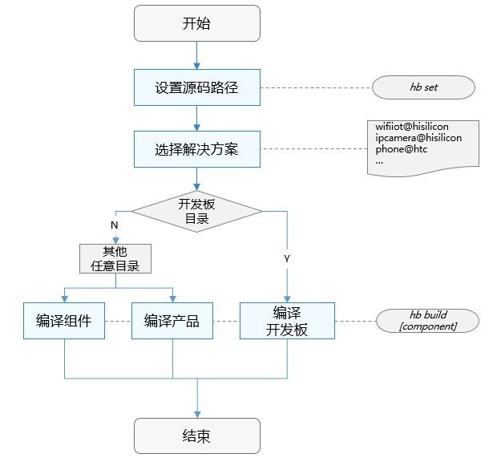

# 编译构建概述<a name="ZH-CN_TOPIC_0000001060646620"></a>

-   [基本概念](#section175012297491)
-   [目录结构](#section3267040205617)
-   [构建流程](#section193961322175011)
-   [组件、芯片解决方案和产品解决方案配置规则](#section1625463413327)

一个基于gn和ninja的构建系统，以支持OpenHarmony组件化开发为目标，提供以下基本功能：

-   支持按组件拼装产品并编译。

-   独立构建芯片解决方案厂商源码。
-   独立构建单个组件。

## 基本概念<a name="section175012297491"></a>

在使用编译构建子系统前，应了解如下基本概念：

-   子系统

    子系统是一个逻辑概念，它由一个或多个具体的组件组成。OpenHarmony整体遵从分层设计，从下向上依次为：内核层、系统服务层、框架层和应用层。系统功能按照“系统 \> 子系统 \> 组件”逐级展开，在多设备部署场景下，支持根据实际需求裁剪某些非必要的子系统或组件。


-   组件

    系统最小的可复用、可配置、可裁剪的功能单元。组件具备目录独立可并行开发、可独立编译、可独立测试的特征。

-   gn

    Generate ninja的缩写，用于产生ninja文件。

-   ninja

    ninja是一个专注于速度的小型构建系统。

-   hb

    OpenHarmony的命令行工具，用来执行编译命令。


## 目录结构<a name="section3267040205617"></a>

```
build/lite
├── components                  # 组件描述文件
├── figures                     # readme中的图片
├── hb                          # hb pip安装包源码
├── make_rootfs                 # 文件系统镜像制作脚本
├── config                      # 编译配置项
│   ├── component               # 组件相关的模板定义
│   ├── kernel                  # 内核相关的编译配置
│   └── subsystem               # 子系统编译配置
├── platform                    # ld脚本
├── testfwk                     # 测试编译框架
└── toolchain                   # 编译工具链配置，包括：编译器路径、编译选项、链接选项等
```

## 构建流程<a name="section193961322175011"></a>

编译构建流程如[图1 ](#fig9744112715161)所示，主要分设置和编译两步：

**图 1**  编译构建流程<a name="fig9744112715161"></a>  


1.  hb set: 设置OpenHarmony源码目录和要编译的产品。
2.  hb build: 编译产品、开发板或者组件。编译主要过程如下：
    -   读取编译配置：根据产品选择的开发板，读取开发板config.gni文件内容，主要包括编译工具链、编译链接命令和选项等。
    -   调用gn：调用gn gen命令，读取产品配置生成产品解决方案out目录和ninja文件。
    -   调用ninja：调用ninja -C out/board/product启动编译。
    -   系统镜像打包：将组件编译产物打包，设置文件属性和权限，制作文件系统镜像。


## 组件、芯片解决方案和产品解决方案配置规则<a name="section1625463413327"></a>

为了实现芯片解决方案、产品解决方案与OpenHarmony是解耦的、可插拔的，组件、芯片解决方案和产品解决方案的路径、目录树和配置需遵循一定的规则，具体如下：

-   **组件**

组件源码路径命名规则为：_\{领域\}/\{子系统\}/\{组件\}_，组件目录树规则如下：

```
component
├── interfaces
│   ├── innerkits  # 系统内接口，组件间使用
│   └── kits       # 应用接口，应用开发者使用
├── frameworks     # framework实现
├── services       # service实现
└── BUILD.gn       # 组件编译脚本
```

组件的名称、源码路径、功能简介、是否必选、编译目标、RAM、ROM、编译输出、已适配的内核、可配置的特性和依赖等属性定义在build/lite/components目录下对应子系统的json文件中，新增组件时需要在对应子系统json文件中添加相应的组件定义。产品所配置的组件必须在某个子系统中被定义过，否则会校验失败。

以泛sensor子系统的sensor服务组件为例，组件属性定义描述文件字段说明如下：

```
{
  "components": [
    {
      "component": "sensor_lite",                # 组件名称
      "description": "Sensor services",          # 组件一句话功能描述
      "optional": "true",                        # 组件是否为最小系统必选
      "dirs": [                                  # 组件源码路径
        "base/sensors/sensor_lite"
      ],
      "targets": [                               # 组件编译入口
        "//base/sensors/sensor_lite/services:sensor_service"
      ],
      "rom": "92KB",                             # 组件ROM值
      "ram": "~200KB",                           # 组件RAM估值
      "output": [ "libsensor_frameworks.so" ],   # 组件编译输出
      "adapted_kernel": [ "liteos_a" ],          # 组件已适配的内核
      "features": [],                            # 组件可配置的特性
      "deps": {                      
        "components": [                          # 组件依赖的其他组件
          "samgr_lite",
          "ipc_lite"

        ],
        "third_party": [                         # 组件依赖的三方开源软件
          "bounds_checking_function"
        ]
      }
    }
  ]
}
```

组件的编译脚本语言为gn，gn的基本用法请见[gn快速入门](https://gn.googlesource.com/gn/+/master/docs/quick_start.md)。组件即为gn定义的编译目标，可以为静态库、动态库、可执行文件或group。组件BUILD.gn的编写建议如下：

1）编译目标名称与组件一致。

2）组件对外可配置的特性变量需声明在该组件BUILD.gn中，特性变量命名规则：ohos\_\{subsystem\}\_\{component\}\_\{feature\}。特性在组件描述中也需要同步定义，在产品配置文件config.json中按需配置。

3）宏定义规则：OHOS\_\{SUBSYSTEM\}\_\{COMPONENT\}\_\{FEATURE\}

以图形的UI组件为例，foundation/graphic/ui/BUILD.gn文件如下：

```
	# 声明组件可配置的特性
	declare_args() {
	  enable_ohos_graphic_ui_animator = false # 动效特性开关
	  ohos_ohos_graphic_ui_font = "vector"    # 可配置的字体类型，vector或者bitmap
	}
	
	# 组件基础功能
	shared_library("base") {
	  sources = [
	    ......
	  ]
	  include_dirs = [
	    ......
	  ]
	}
	
	# 仅在animator开启时编译
	if(enable_ohos_graphic_ui_animator ) { 
	  shared_library("animator") {
	    sources = [
	      ......
	    ]
	    include_dirs = [
              ......
	    ]
	    deps = [ :base ]
	  }
	}
	......
	# target名称建议与组件名称一致, 组件target类型可以是executable(bin文件)，shared_library(动态库.so)，static_library(静态库.a)，group等等
	executable("ui") {
	  deps = [
	    ":base"
	  ]

	  # animator特性由产品配置
	  if(enable_ohos_graphic_ui_animator ) {
	      deps += [
	        "animator"
	      ]
	  }
	}
```

-   **芯片解决方案**

芯片解决方案是指基于某款开发板的完整解决方案，包含驱动、设备侧接口适配、开发板sdk等。芯片解决方案是一个特殊的组件，源码路径规则为：_device/\{芯片解决方案厂商\}/\{开发板\}_。芯片解决方案组件会随产品选择的开发板默认编译。芯片解决方案目录树规则如下：

```
device                                      
└── company                         # 芯片解决方案厂商
    └── board                       # 开发板名称
        ├── BUILD.gn                # 编译脚本
        ├── hals                    # OS南向接口适配
        ├── linux                   # 可选，linux内核版本
        │   └── config.gni          # linux版本编译配置
        └── liteos_a                # 可选，liteos内核版本
            └── config.gni          # liteos_a版本编译配置
```

config.gni为开发板编译相关的配置，编译时会采用该配置文件中的参数编译所有OS组件，编译阶段系统全局可见。关键字段介绍如下：

```
kernel_type:            开发板使用的内核类型，例如：“liteos_a”, “liteos_m”, “linux”。
kernel_version:         开发使用的内核版本，例如：“4.19”。
board_cpu:              开发板CPU类型，例如：“cortex-a7”, “riscv32”。
board_arch:             开发芯片arch, 例如： “armv7-a”, “rv32imac”。
board_toolchain:        开发板自定义的编译工具链名称，例如：“gcc-arm-none-eabi”。若为空，则使用默认为ohos-clang。
board_toolchain_prefix：编译工具链前缀，例如：“gcc-arm-none-eabi”。
board_toolchain_type：  编译工具链类型，目前支持gcc和clang。例如：“gcc” ，“clang”。
board_cflags：          开发板配置的c文件编译选项。
board_cxx_flags：       开发板配置的cpp文件编译选项。
board_ld_flags：        开发板配置的链接选项。
```

-   **产品解决方案**

产品解决方案为基于开发板的完整产品，主要包含产品对OS的适配、组件拼装配置、启动配置和文件系统配置等。源码路径规则为：_vendor/\{产品解决方案厂商\}/\{产品名称\}。_产品解决方案也是一个特殊的组件，目录树规则如下：

```
vendor                              
└── company                         # 产品解决方案厂商
    ├── product                     # 产品名称
    │   ├── init_configs
    │   │     ├── etc               # init进程启动配置（可选，仅linux内核需要）
    │   │     └── init.cfg          # 系统服务启动配置
    │   ├── hals                    # 产品解决方案OS适配
    │   ├── BUILD.gn                # 产品编译脚本
    │   └── config.json             # 产品配置文件
    │   └── fs.yml                  # 文件系统打包配置
    └── ......
```

新增产品须按如上的规则创建目录和文件，编译构建系统将按该规则扫描已配置的产品。关键的目录和文件详细介绍如下：

1.  vendor/company/product/init\_configs/etc

    该文件夹中包含rcS脚本，Sxxx脚本和fstab脚本，init进程在启动系统服务之前执行这些脚本。执行的流程为“rcS-\>fstab-\>S00-xxx“，Sxxx脚本中的内容与开发板和产品需要有关，主要包括设备节点的创建、创建目录、扫描设备节点、修改文件权限等等。这些文件在产品编译的BUILD.gn中按需拷贝到产品out目录中，最终打包到rootfs镜像中。

2.  vendor/company/product/init\_configs/init.cfg

    init进程启动服务的配置文件，当前支持解析的命令有：

    1\) start:  启动某个服务

    2\) mkdir: 创建文件夹

    3）chmod: 修改指定路径/文件的权限

    4\) chown: 修改指定路径/文件的属组

    5\) mount: 挂载命令

    该文件中的各个字段的解释如下：

    ```
    {
        "jobs" : [{                                                     # job数组，一个job对应一个命令集合。job的执行顺序：pre-init -> init -> post-init。
                "name" : "pre-init",
                "cmds" : [
                    "mkdir /storage/data",                              # 创建目录
                    "chmod 0755 /storage/data",                         # 修改权限，权限值的格式为0xxx, 如0755
                    "mkdir /storage/data/log",
                    "chmod 0755 /storage/data/log",
                    "chown 4 4 /storage/data/log",                      # 修改属组，第一个数字为uid, 第二个数字为gid
                    ......
                    "mount vfat /dev/mmcblock0 /sdcard rw,umask=000"    # 挂载，格式为： mount [文件系统类型] [source] [target] [flags] [data]
                                                                        # 其中flags仅支持：nodev、noexec、nosuid和rdonly
                ]
            }, {
                "name" : "init",
                "cmds" : [                                              # 按cmds数组顺序启动启动服务
                    "start shell",                                      # 注意：start与服务名称之间有且只有一个空格
                    ......
                    "start service1"
                ]
            }, {
                "name" : "post-init",                                   # 最后别执行的job, init进程启动完成后的处理（如驱动初始化后再mount设备）
                "cmds" : []
            }
        ],
        "services" : [{                                                 # service数组，一个service对应一个进程
                "name" : "shell",                                       # 服务名称
                "path" : ["/sbin/getty", "-n", "-l", "/bin/sh", "-L", "115200", "ttyS000", "vt100"],    # 可执行文件全路径，path必须为第一个元素
                "uid" : 0,                                              # 进程的uid，须与二进制文件的uid保持一致
                "gid" : 0,                                              # 进程的gid，须与二进制文件的gid保持一致
                "once" : 0,                                             # 是否为一次性进程，1：进程退出后，init不在重新拉起。0：常驻进程，进程若退出，init将重新拉起
                "importance" : 0,                                       # 是否为关键进程，1：是关键进程，若进程退出，init将会重启单板。0：非关键进程，若进程退出，init不会重启单板
                "caps" : [4294967295]
            }, 
            ......
        ]
    }
    ```

3.  vendor/company/product/init\_configs/hals

    解决方案厂商对OS的适配，需要实现的接口请见各个组件的readme说明文档。

4.  vendor/company/product/config.json

    config.json为编译构建的主入口，包含了开发板、OS组件和内核等配置信息。以基于hispark\_taurus开发板的ipcamera产品为例，配置文件如下：

    ```
    {
    	"product_name": "ipcamera",                       # 产品名称
    	"ohos_version": "OpenHarmony 1.0",                # 选择的OS版本
    	"device_company": "hisilicon",                    # 芯片厂商
    	"board": "hispark_taurus",                        # 开发板名称
    	"kernel_type": "liteos_a",                        # 选择的内核类型
    	"kernel_version": "3.0.0",                        # 选择的内核版本
    	"subsystems": [                            
    	  {
    	    "subsystem": "aafwk",                         # 选择的子系统
    	    "components": [
    	      { "component": "ability", "features":[ "enable_ohos_appexecfwk_feature_ability = true" ] }   # 选择的组件和组件特性配置
    	    ]
    	  },
    	  {
    	   ......
    	  }
    	  ......
    	  更多子系统和组件
    	}
    }
    ```

5.  vendor/company/product/fs.yml

    该文件用于配置文件系统镜像制作过程，将编译产物打包成文件系统镜像，比如用户态根文件系统rootfs.img和可读写的userfs.img。它由多个列表组成，每个列表对应一个文件系统。字段说明如下：

    ```
    fs_dir_name： 必填，声明文件系统文件名, 如rootfs、userfs
    fs_dirs：     选填，配置out下文件目录与文件系统文件目录的映射关系，每个文件目录对应一个列表
    source_dir：  选填，out下目标文件目录，若缺失则将根据target_dir在文件系统下创建空目录
    target_dir：  必填，文件系统下对应文件目录
    ignore_files：选填，声明拷贝忽略文件
    dir_mode：    选填，文件目录权限，默认755
    file_mode：   选填，该文件目录下所有文件的权限，默认555
    fs_filemode： 选填，配置需要特殊声明权限的文件，每个文件对应一个列表
    file_dir：    必填，文件系统下具体文件路径
    file_mode：   必填，文件权限声明
    fs_symlink：  选填，配置文件系统软连接
    fs_make_cmd： 必填，配置需要制作文件系统脚本，OS提供的脚本在build/lite/make_rootfs下, 支持linux，liteos内核和ext4、jffs2、vfat格式。也支持芯片解决方案厂商自定义。
    fs_attr：     选填，根据配置项动态调整文件系统
    ```

    其中fs\_symlink、fs\_make\_cmd字段支持以下变量：

    -   $\{root\_path\}

        代码根目录，对应gn的$\{ohos\_root\_path\}

    -   $\{out\_path\}

        产品out目录，对应gn的$\{root\_out\_dir\}

    -   $\{fs\_dir\}

        文件系统目录，由以下变量拼接而成

        -   $\{root\_path\}
        -   $\{fs\_dir\_name\}


    > **说明：** 
    >fs.yml是可选的，对于没有文件系统的设备可不配置。

6.  vendor/company/product/BUILD.gn

    产品编译的入口，主要用于编译解决方案厂商源码和拷贝启动配置文件。如果某个产品被选择为要编译的产品，那么对应产品目录下的BUILD.gn会默认编译。一个典型的产品编译BUILD.gn应该如下：

    ```
    group("product") { # target名称需与product名称即三级目录名称一致
      deps = []
      # 拷贝init配置
      deps += [ "init_configs" ]
      # 其他
      ......
    }
    ```


