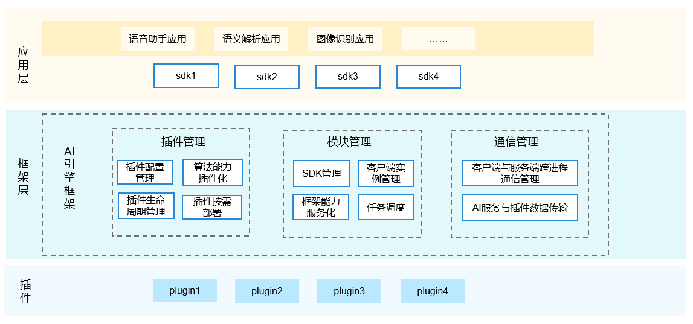

# AI业务子系统<a name="ZH-CN_TOPIC_0000001083278044"></a>

-   [简介](#section187321516154516)
-   [目录](#section571610913453)
-   [约束](#section5748426453)
-   [使用](#section7981135212144)
-   [相关仓](#section10492183517430)
-   [AI引擎开发导航](#section6808423133718)

## 简介<a name="section187321516154516"></a>

AI业务子系统是OpenHarmony提供原生的分布式AI能力的子系统。本次开源范围是提供了统一的AI引擎框架，实现算法能力快速插件化集成。框架中主要包含插件管理、模块管理和通信管理等模块，对AI算法能力进行生命周期管理和按需部署。后续，会逐步定义统一的AI能力接口，便于AI能力的分布式调用。同时，提供适配不同推理框架层级的统一推理接口。

**图 1**  AI引擎框架<a name="fig17296164711526"></a>  


## 目录<a name="section571610913453"></a>

```
/foundation/ai/engine                        # AI子系统主目录
├── interfaces
│  └── kits                                  # AI子系统对外接口
└── services
│  ├── client                                # AI子系统Client模块
│  │  ├── client_executor                    # Client模块执行主体
│  │  └── communication_adapter              # Client模块通信适配层，支持拓展
│  ├── common                                # AI子系统公共工具、协议模块
│  │  ├── platform
│  │  ├── protocol
│  │  └── utils
│  └── server                                # AI子系统服务端模块
│  │  ├── communication_adapter              # Server模块通信适配层，支持拓展
│  │  ├── plugin
│  │     ├── asr
│  │        └── keyword_spotting             # ASR算法插件参考：唤醒词识别
│  │     └── cv
│  │        └── image_classification         # CV算法插件参考：图片分类
│  │  ├── plugin_manager
│  │  └── server_executor                    # Server模块执行主体
```

## 约束<a name="section5748426453"></a>

* **语言限制**：C/C++语言

* **操作系统限制**：OpenHarmony轻量/小型系统

* **AI服务启动的约束与限制**：SAMGR（System Ability Manager）启动且运行正常

## 使用<a name="section7981135212144"></a>

1.  **AI业务子系统编译**

    轻量级AI引擎框架模块，代码所在路径：//foundation/ai/engine/services

    编译指令如下：

    1. **设置编译路径**

    ```
    hb set -root dir(项目代码根目录)
    ```

    2. **设置编译产品**（执行后用方向键和回车进行选择）：

    ```
    hb set -p
    ```

    3. **执行编译**：

    ```
    hb build -f（编译全仓）
    或者 hb build ai_engine（只编译ai_engine组件）
    ```

   >**注意**：hb相关配置请参考编译构建子系统**build\_lite**

2.  **插件开发**（以唤醒词识别为例）

    位置：//foundation/ai/engine/services/server/plugin/asr/keyword\_spotting

    >**注意**：插件需要实现server提供的IPlugin接口和IPluginCallback接口

    ```
    #include "plugin/i_plugin.h
    class KWSPlugin : public IPlugin {       // Keywords Spotting Plugin（KWSPlugin）继承IPlugin算法插件基类public:
        KWSPlugin();
        ~KWSPlugin();
    
        const long long GetVersion() const override;
        const char* GetName() const override;
        const char* GetInferMode() const override;
    
        int32_t Prepare(long long transactionId, const DataInfo &amp;amp;inputInfo, DataInfo &amp;amp;outputInfo) override;
        int32_t SetOption(int optionType, const DataInfo &amp;amp;inputInfo) override;
        int32_t GetOption(int optionType, const DataInfo &amp;amp;inputInfo, DataInfo &amp;amp;outputInfo) override;
        int32_t SyncProcess(IRequest *request, IResponse *&amp;amp;response) override;
        int32_t AsyncProcess(IRequest *request, IPluginCallback*callback) override;
        int32_t Release(bool isFullUnload, long long transactionId, const DataInfo &amp;amp;inputInfo) override;
        .
        .
        .
    };
    ```

    >**注意**：SyncProcess和AsyncProcess接口只需要根据算法实际情况实现一个接口即可，另一个用空方法占位（这里KWS插件为同步算法，故异步接口为空实现）。

    ```
    #include "aie_log.h"
    #include "aie_retcode_inner.h"
    .
    .
    .
    
    const long long KWSPlugin::GetVersion() const
    {
        return ALGOTYPE_VERSION_KWS;
    }
    
    const char *KWSPlugin::GetName() const
    {
        return ALGORITHM_NAME_KWS.c_str();
    }
    
    const char *KWSPlugin::GetInferMode() const
    {
        return DEFAULT_INFER_MODE.c_str();
    }
    .
    .
    .
    int32_t KWSPlugin::AsyncProcess(IRequest *request, IPluginCallback *callback)
    {
        return RETCODE_SUCCESS;
    }
    ```

3.  **插件SDK开发**（以唤醒词识别kws\_sdk为例）

    位置：//foundation/ai/engine/services/client/algorithm\_sdk/asr/keyword\_spotting

    唤醒词识别SDK：

    ```
    class KWSSdk {
    public:
        KWSSdk();
        virtual ~KWSSdk();
    
        /**
         * @brief Create a new session with KWS Plugin
         *
         * @return Returns KWS_RETCODE_SUCCESS(0) if the operation is successful,
         *         returns a non-zero value otherwise.
         */
        int32_t Create();
    
        /**
         * @brief Synchronously execute keyword spotting once
         *
         * @param audioInput pcm data.
         * @return Returns KWS_RETCODE_SUCCESS(0) if the operation is successful,
         *         returns a non-zero value otherwise.
         */
        int32_t SyncExecute(const Array<int16_t> &audioInput);
    
        /**
         * @brief Asynchronously execute keyword spotting once
         *
         * @param audioInput pcm data.
         * @return Returns KWS_RETCODE_SUCCESS(0) if the operation is successful,
         *         returns a non-zero value otherwise.
         */
        int32_t AsyncExecute(const Array<int16_t> &audioInput);
    
        /**
         * @brief Set callback
         *
         * @param callback Callback function that will be called during the process.
         * @return Returns KWS_RETCODE_SUCCESS(0) if the operation is successful,
         *         returns a non-zero value otherwise.
         */
        int32_t SetCallback(const std::shared_ptr<KWSCallback> &callback);
    
        /**
         * @brief Destroy the created session with KWS Plugin
         *
         * @return Returns KWS_RETCODE_SUCCESS(0) if the operation is successful,
         *         returns a non-zero value otherwise.
         */
        int32_t Destroy();
    }
    ```

   >**注意**：SDK调用AI引擎客户端接口顺序应遵循AieClientInit-\>AieClientPrepare-\>AieClientSyncProcess/AieClientAsyncProcess-\>AieClientRelease-\>AieClientDestroy，否则调用接口会返回错误码；同时应保证各个接口都有调用到，要不然会引起内存泄漏。

    
 ```
    int32_t KWSSdk::KWSSdkImpl::Create()
    {
        if (kwsHandle_ != INVALID_KWS_HANDLE) {
            HILOGE("[KWSSdkImpl]The SDK has been created");
            return KWS_RETCODE_FAILURE;
        }
        if (InitComponents() != RETCODE_SUCCESS) {
            HILOGE("[KWSSdkImpl]Fail to init sdk components");
            return KWS_RETCODE_FAILURE;
        }
        int32_t retCode = AieClientInit(configInfo_, clientInfo_, algorithmInfo_, nullptr);
        if (retCode != RETCODE_SUCCESS) {
            HILOGE("[KWSSdkImpl]AieClientInit failed. Error code[%d]", retCode);
            return KWS_RETCODE_FAILURE;
        }
        if (clientInfo_.clientId == INVALID_CLIENT_ID) {
            HILOGE("[KWSSdkImpl]Fail to allocate client id");
            return KWS_RETCODE_FAILURE;
        }
        DataInfo inputInfo = {
            .data = nullptr,
            .length = 0,
        };
        DataInfo outputInfo = {
            .data = nullptr,
            .length = 0,
        };
        retCode = AieClientPrepare(clientInfo_, algorithmInfo_, inputInfo, outputInfo, nullptr);
        if (retCode != RETCODE_SUCCESS) {
            HILOGE("[KWSSdkImpl]AieclientPrepare failed. Error code[%d]", retCode);
            return KWS_RETCODE_FAILURE;
        }
        if (outputInfo.data == nullptr || outputInfo.length <= 0) {
            HILOGE("[KWSSdkImpl]The data or length of output info is invalid");
            return KWS_RETCODE_FAILURE;
        }
        MallocPointerGuard<unsigned char> pointerGuard(outputInfo.data);
        retCode = PluginHelper::UnSerializeHandle(outputInfo, kwsHandle_);
        if (retCode != RETCODE_SUCCESS) {
            HILOGE("[KWSSdkImpl]Get handle from inputInfo failed");
            return KWS_RETCODE_FAILURE;
        }
        return KWS_RETCODE_SUCCESS;
    }
    
    int32_t KWSSdk::KWSSdkImpl::SyncExecute(const Array<uint16_t> &audioInput)
    {
        intptr_t newHandle = 0;
        Array<int32_t> kwsResult = {
            .data = nullptr,
            .size = 0
        };
        DataInfo inputInfo = {
            .data = nullptr,
            .length = 0
        };
        DataInfo outputInfo = {
            .data = nullptr,
            .length = 0
        };
        int32_t retCode = PluginHelper::SerializeInputData(kwsHandle_, audioInput, inputInfo);
        if (retCode != RETCODE_SUCCESS) {
            HILOGE("[KWSSdkImpl]Fail to serialize input data");
            callback_->OnError(KWS_RETCODE_SERIALIZATION_ERROR);
            return RETCODE_FAILURE;
        }
        retCode = AieClientSyncProcess(clientInfo_, algorithmInfo_, inputInfo, outputInfo);
        if (retCode != RETCODE_SUCCESS) {
            HILOGE("[KWSSdkImpl]AieClientSyncProcess failed. Error code[%d]", retCode);
            callback_->OnError(KWS_RETCODE_PLUGIN_EXECUTION_ERROR);
            return RETCODE_FAILURE;
        }
        if (outputInfo.data == nullptr || outputInfo.length <= 0) {
            HILOGE("[KWSSdkImpl] The data or length of outputInfo is invalid. Error code[%d]", retCode);
            callback_->OnError(KWS_RETCODE_NULL_PARAM);
            return RETCODE_FAILURE;
        }
        MallocPointerGuard<unsigned char> pointerGuard(outputInfo.data);
        retCode = PluginHelper::UnSerializeOutputData(outputInfo, newHandle, kwsResult);
        if (retCode != RETCODE_SUCCESS) {
            HILOGE("[KWSSdkImpl]UnSerializeOutputData failed. Error code[%d]", retCode);
            callback_->OnError(KWS_RETCODE_UNSERIALIZATION_ERROR);
            return retCode;
        }
        if (kwsHandle_ != newHandle) {
            HILOGE("[KWSSdkImpl]The handle[%lld] of output data is not equal to the current handle[%lld]",
                (long long)newHandle, (long long)kwsHandle_);
            callback_->OnError(KWS_RETCODE_PLUGIN_SESSION_ERROR);
            return RETCODE_FAILURE;
        }
        callback_->OnResult(kwsResult);
        return RETCODE_SUCCESS;
    }
    
    int32_t KWSSdk::KWSSdkImpl::Destroy()
    {
        if (kwsHandle_ == INVALID_KWS_HANDLE) {
            return KWS_RETCODE_SUCCESS;
        }
        DataInfo inputInfo = {
            .data = nullptr,
            .length = 0
        };
        int32_t retCode = PluginHelper::SerializeHandle(kwsHandle_, inputInfo);
        if (retCode != RETCODE_SUCCESS) {
            HILOGE("[KWSSdkImpl]SerializeHandle failed. Error code[%d]", retCode);
            return KWS_RETCODE_FAILURE;
        }
        retCode = AieClientRelease(clientInfo_, algorithmInfo_, inputInfo);
        if (retCode != RETCODE_SUCCESS) {
            HILOGE("[KWSSdkImpl]AieClientRelease failed. Error code[%d]", retCode);
            return KWS_RETCODE_FAILURE;
        }
        retCode = AieClientDestroy(clientInfo_);
        if (retCode != RETCODE_SUCCESS) {
            HILOGE("[KWSSdkImpl]AieClientDestroy failed. Error code[%d]", retCode);
            return KWS_RETCODE_FAILURE;
        }
        mfccProcessor_ = nullptr;
        pcmIterator_ = nullptr;
        callback_ = nullptr;
        kwsHandle_ = INVALID_KWS_HANDLE;
        return KWS_RETCODE_SUCCESS;
    }
 ```

4.  **sample开发**

    **调用Create**

    ```
    bool KwsManager::PreparedInference()
    {
        if (capturer_ == nullptr) {
            printf("[KwsManager] only load plugin after AudioCapturer ready\n");
            return false;
        }
        if (plugin_ != nullptr) {
            printf("[KwsManager] stop created InferencePlugin at first\n");
            StopInference();
        }
        plugin_ = std::make_shared<KWSSdk>();
        if (plugin_ == nullptr) {
            printf("[KwsManager] fail to create inferencePlugin\n");
            return false;
        }
        if (plugin_->Create() != SUCCESS) {
            printf("[KwsManager] KWSSdk fail to create.\n");
            return false;
        }
        std::shared_ptr<KWSCallback> callback = std::make_shared<MyKwsCallback>();
        if (callback == nullptr) {
            printf("[KwsManager] new Callback failed.\n");
            return false;
        }
        plugin_->SetCallback(callback);
        return true;
    }
    ```

    **调用SyncExecute**

    ```
    void KwsManager::ConsumeSamples()
    {
        uintptr_t sampleAddr = 0;
        size_t sampleSize = 0;
        int32_t retCode = SUCCESS;
        while (status_ == RUNNING) {
            {
                std::lock_guard<std::mutex> lock(mutex_);
                if (cache_ == nullptr) {
                    printf("[KwsManager] cache_ is nullptr.\n");
                    break;
                }
                sampleSize = cache_->GetCapturedBuffer(sampleAddr);
            }
            if (sampleSize == 0 || sampleAddr == 0) {
                continue;
            }
            Array<int16_t> input = {
                .data = (int16_t *)(sampleAddr),
                .size = sampleSize >> 1
            };
            {
                std::lock_guard<std::mutex> lock(mutex_);
                if (plugin_ == nullptr) {
                    printf("[KwsManager] cache_ is nullptr.\n");
                    break;
                }
                if ((retCode = plugin_->SyncExecute(input)) != SUCCESS) {
                    printf("[KwsManager] SyncExecute KWS failed with retCode = [%d]\n", retCode);
                    continue;
                }
            }
        }
    }
    ```

    **调用Destroy**

    ```
    void KwsManager::StopInference()
    {
        printf("[KwsManager] StopInference\n");
        if (plugin_ != nullptr) {
            int ret = plugin_->Destroy();
            if (ret != SUCCESS) {
                printf("[KwsManager] plugin_ destroy failed.\n");
            }
            plugin_ = nullptr;
        }
    }
    ```


## 相关仓<a name="section10492183517430"></a>

[AI子系统](https://gitee.com/openharmony/docs/blob/master/zh-cn/readme/AI%E4%B8%9A%E5%8A%A1%E5%AD%90%E7%B3%BB%E7%BB%9F.md)

[ai_engine](https://gitee.com/openharmony/ai_engine)

## 依赖仓：

[build\_lite](https://gitee.com/openharmony/build_lite/blob/master/README_zh.md)

[systemabilitymgr\_samgr\_lite](https://gitee.com/openharmony/systemabilitymgr_samgr_lite/blob/master/README_zh.md)

[startup\_init\_lite](https://gitee.com/openharmony/startup_init_lite/blob/master/README_zh.md)

## AI引擎开发导航<a name="section6808423133718"></a>

[《AI插件开发指南》](https://gitee.com/openharmony/docs/blob/master/zh-cn/device-dev/subsystems/subsys-ai-aiframework-devguide.md)