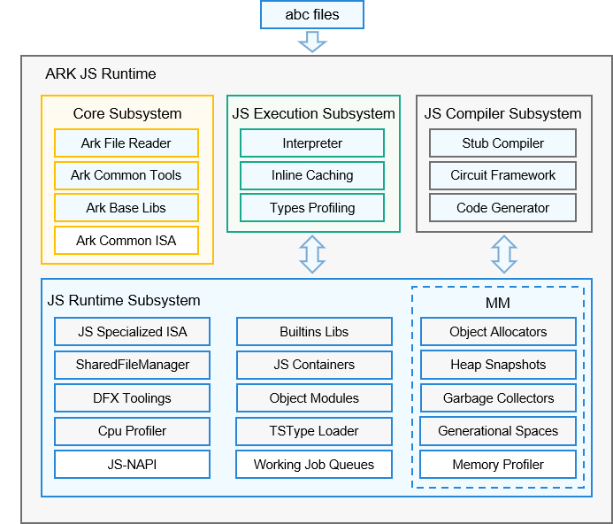

# 方舟运行时子系统<a name="ZH-CN_TOPIC_0000001138852894"></a>

- [方舟运行时子系统<a name="ZH-CN_TOPIC_0000001138852894"></a>](#方舟运行时子系统)
  - [简介<a name="section11660541593"></a>](#简介)
  - [目录<a name="section161941989596"></a>](#目录)
  - [使用指南<a name="section18393638195820"></a>](#使用指南)
  - [相关仓<a name="section1371113476307"></a>](#相关仓)

## 简介<a name="section11660541593"></a>

方舟编译器\(ArkCompiler\)是OpenHarmony内置的组件化、可配置的多语言编译和运行平台，包含编译器、工具链、运行时等核心部件，支持高级编程语言在多种芯片平台上编译与运行，并支撑OpenHarmony标准操作系统及其应用和服务运行在手机、个人电脑、平板、电视、汽车和智能穿戴等多种设备上的需求。开源的ArkCompiler JS Runtime提供的能力是在OpenHarmony操作系统中编译和运行JavaScript语言\(本文后面简称JS\)。

ArkCompiler JS Runtime分成两个部分，分别是JS编译工具链与JS运行时。JS工具链将JS源码编译成方舟字节码\(ArkCompiler Bytecode\)，JS运行时负责执行生成的方舟字节码\(后续如无特殊说明，字节码特指方舟字节码\)。

**图1** JS编译工具链架构：


ArkCompiler JS Runtime的源码编译器接收JS源码的输入，再由ts2abc（将JavaScript文件转换为字节码的工具）生成abc文件。

**图2** JS运行时\(Ark-JS-Runtime\)架构：



ArkCompiler JS Runtime以方舟字节码文件作为输入并直接运行字节码文件，实现对应的JS语义逻辑。

JS Runtime主要由四个子系统组成：

-   Core Subsystem

    Core Subsystem主要由与语言无关的基础运行库组成，包括承载字节码的ArkCompiler File组件、支持Debugger的Tooling组件、负责对应系统调用的ArkCompiler Base库组件等。

-   JS Execution Subsystem

    执行引擎包含执行字节码的解释器、缓存隐藏类和内联缓存、以及剖析记录运行时类型的Profiler。

-   JS Compiler Subsystem

    编译子系统包含Stub编译器、基于Circuit IR的优化编译框架和代码生成器。

-   JS Runtime subsystem

    运行时子系统包含了各种JS运行相关的模块：
    - 内存管理：对象分配器与垃圾回收器\(并发标记和部分内存压缩的CMS-GC和Partial-Compressing-GC\)
    - 分析工具：DFX工具、cpu和heap的profiling工具
    - 并发管理：actor并发模型中的abc文件管理器
    - 标准库：Ecmascript规范定义的标准库、高效的container容器库与对象模型
    - 其他：异步工作队列、TypeScript类型加载、跟C++交互的JSNAPI接口等。

**ArkCompiler-JS的设计特点：**

- ArkCompiler JS Runtime的主要设计目标：

  为OpenHarmony操作系统提供JavaScript/TypeScript应用程序执行引擎，而不是作为浏览器中的JavaScript执行引擎。

- 为了提升应用的执行性能和安全性：

  ArkCompiler JS Runtime选择将JavaScript/TypeScript程序预先静态编译为方舟字节码（带上静态类型信息），从而减少运行时的编译和类型信息收集开销。另外出于安全性和性能的考虑，ArkCompiler JS Runtime选择不支持eval和只支持strict模式的代码。

- 原生支持TypeScript：

  目前业界通用的执行方式是把TS转化为JS，再通过JS运行时来执行。ArkJS规划在ts2abc编译TS源码时，会推导分析TS的类型信息并传递给ArkCompiler JS运行时。运行时直接利用类型信息静态生成内联缓存（inline caching)从而加速字节码执行。另外，ArkJS规划中的TSAOT \(Ahead-of-Time\) Compiler，可以利用ts2abc传递的类型信息，直接编译生成高质量的机器码，使得应用可以直接以机器码形式运行，提升运行性能。

- 轻量级Actor并发模型：

  ECMAScript没有提供并发规范，业界JS引擎的实现中常用Actor并发模型。此模型下执行体之间不共享任何数据，通过消息机制进行通信。业界当前实现的JS Actor模型（web-worker）有启动速度慢、内存占用高这些缺陷。为了利用设备的多核能力获得更好的性能提升，ArkCompiler JS Runtime需要提供启动快、内存占用少的Actor实现。目前ArkCompiler JS运行时已经实现在Actor内存隔离模型的基础上，共享actor实例中的不可变或者不易变的对象（方法和字节码），后续继续共享内建代码块、常量字符串等等，来提升JS Actor的启动性能和节省内存开销，达到实现轻量级Actor并发模型的目标。

- TypeScript/C++的跨语言交互：

  在OpenHarmony操作系统平台API实现中，通常需要面临C/C++代码访问和操作TS对象的场景。对这个业务场景，Ark-JS规划可以根据TS程序中的class声明和运行时约定，静态生成包含TS对象布局描述的C/C++头文件，以及操作这些TS对象的C/C++实现库。在C/C++代码中，通过包含TS对象描述头文件以及链接对应实现库，实现直接操作TS对象的效果。由于TS类型或其内在布局并非总是固定不变的，因此在TS对象操作的代码实现中，会插入类型检查，如果对象类型或布局在运行时发生变化，则回退执行通用的慢速路径。

## 目录<a name="section161941989596"></a>

```
/arkcompiler
├── ets_runtime       # ArkTS运行时组件
├── runtime_core      # 运行时公共组件
├── ets_frontend      # ArkTS语言的前端工具
└── toolchain         # ArkTS工具链
```

## 使用指南<a name="section18393638195820"></a>

[方舟运行时使用指南](https://gitee.com/openharmony/arkcompiler_ets_runtime/blob/master/docs/ARK-Runtime-Usage-Guide-zh.md)

## 相关仓<a name="section1371113476307"></a>

[arkcompiler\_runtime\_core](https://gitee.com/openharmony/arkcompiler_runtime_core)

[arkcompiler\_ets\_runtime](https://gitee.com/openharmony/arkcompiler_ets_runtime)

[arkcompiler\_ets\_frontend](https://gitee.com/openharmony/arkcompiler_ets_frontend)

[arkcompiler\_toolchain](https://gitee.com/openharmony/arkcompiler_toolchain)