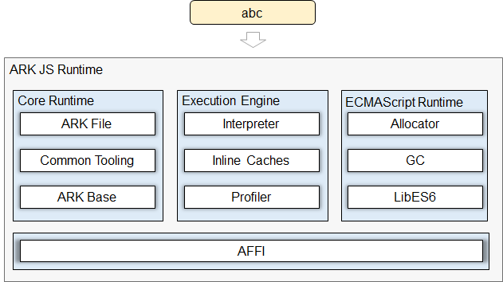

# 方舟运行时子系统<a name="ZH-CN_TOPIC_0000001138852894"></a>

- [方舟运行时子系统<a name="ZH-CN_TOPIC_0000001138852894"></a>](#方舟运行时子系统)
  - [简介<a name="section11660541593"></a>](#简介)
  - [目录<a name="section161941989596"></a>](#目录)
  - [使用指南<a name="section18393638195820"></a>](#使用指南)
  - [相关仓<a name="section1371113476307"></a>](#相关仓)

## 简介<a name="section11660541593"></a>

方舟\(ARK\)是华为自研的统一编程平台，包含编译器、工具链、运行时等关键部件，支持高级语言在多种芯片平台的编译与运行，并支撑OpenHarmony操作系统及其应用和服务运行在手机、个人电脑、平板、电视、汽车和智能穿戴等多种设备上的需求。本次开源的ARK-JS提供的能力是在OpenHarmony标准系统\(standard system\)中编译和运行JavaScript语言\(本文后面简称JS\)。

本次开源的ARK-JS分成两个部分，分别是JS编译工具链与JS运行时。JS工具链将JS源码编译成方舟字节码\(ARK Bytecode\)，JS运行时负责执行生成的方舟字节码\(后续如无特殊说明，字节码特指方舟字节码\)。

JS编译工具链架构：


JS前端编译器，将JavaScript源码解析为AST\( Abstract Syntax Tree\)后，经过AST变换、字节码生成器、寄存器分配后由native emiter产生方舟字节码文件\(abc文件\)

JS运行时（Runtime）架构：



ARK-JS Runtime以方舟字节码文件作为输入并直接运行字节码文件，实现对应的JS语义逻辑。

ARK-JS Runtime主要由四个部分组成：

-   Core Runtime

    Core Runtime主要由语言无关的基础运行库组成，包括承载字节码的ARK File组件、支持Debugger的Tooling组件、负责对应系统调用的ARK Base组件等。

-   Execution Engine

    执行引擎目前包含执行字节码的解释器、缓存隐藏类和内联缓存、以及剖析记录运行时类型的Profiler。

-   ECMAScript Runtime

    ECMAScript Runtime则包含了各种JS对象的分配器、垃圾回收器、以及用以支撑ECMAScript规范的内部运行库。

-   AFFI \(ARK Foreign Function Interface\)

    AFFI是ARK JS运行时的C++语言外部函数接口。


## 目录<a name="section161941989596"></a>

```
/ark
├── js_runtime       # JS运行时组件
├── runtime_core     # 运行时公共组件
└── ts2abc           # JS语言的前端工具
```

## 使用指南<a name="section18393638195820"></a>

[方舟运行时使用指南](https://gitee.com/openharmony/ark_js_runtime/blob/master/docs/ARK-Runtime-Usage-Guide-zh.md)

## 相关仓<a name="section1371113476307"></a>

[ark\_runtime\_core](https://gitee.com/openharmony/ark_runtime_core)

[ark\_js\_runtime](https://gitee.com/openharmony/ark_js_runtime)

[ark\_ts2abc](https://gitee.com/openharmony/ark_ts2abc)
