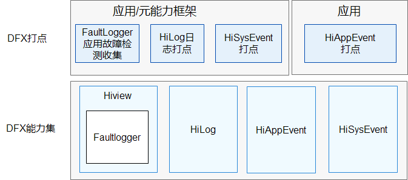

# DFX子系统<a name="ZH-CN_TOPIC_0000001162014185"></a>

-   [简介](#section1347419114210)
-   [系统架构](#section342962219551)
-   [目录](#section62815498425)
-   [相关仓](#section767551120815)

## 简介<a name="section1347419114210"></a>

在OpenHarmony中，DFX\([Design for X](https://en.wikipedia.org/wiki/Design_for_X)\)是为了提升质量属性软件设计，目前包含的内容主要有：DFR（Design for Reliability，可靠性）和DFT（Design for Testability，可测试性）特性。

提供以下功能：

-   HiLog流水日志。

-   HiView插件平台。
-   FaultLoggerd应用故障收集和订阅。
-   HiAppEvent应用事件记录接口及框架。
-   HiSysEvent系统事件记录接口及服务。

## 系统架构<a name="section342962219551"></a>

**图 1**  子系统架构图<a name="fig18347131919423"></a>  




## 目录<a name="section62815498425"></a>

```
base/hiviewdfx     # DFX主仓，用于存放编译相关配置
├── hiview         # hiview部件，包含插件平台和事件分发能力
├── hiview_lite    # hiview_lite部件，包含轻量系统的日志任务能力
├── hilog          # hilog部件，包含标准系统的流水日志能力
├── hilog_lite     # hilog_lite部件，包含轻量和小型系统的流水日志能力
├── hievent_lite   # hievent_lite部件，包含轻量系统的事件日志能力
├── hiappevent     # hiappevent部件，包含应用事件记录接口及框架
├── hisysevent     # hisysevent部件，包含系统事件记录接口及服务
├── faultloggerd   # faultloggerd部件，包含应用故障日志采集服务
```

## 相关仓<a name="section767551120815"></a>

**DFX子系统**

[hiviewdfx\_hiview](https://gitee.com/openharmony/hiviewdfx_hiview/blob/master/README_zh.md)

[hiviewdfx\_hilog](https://gitee.com/openharmony/hiviewdfx_hilog/blob/master/README_zh.md)

[hiviewdfx\_hiappevent](https://gitee.com/openharmony/hiviewdfx_hiappevent/blob/master/README_zh.md)

[hiviewdfx\_hisysevent](https://gitee.com/openharmony/hiviewdfx_hisysevent/blob/master/README_zh.md)

[hiviewdfx\_faultloggerd](https://gitee.com/openharmony/hiviewdfx_faultloggerd/blob/master/README_zh.md)

[hiviewdfx\_hilog\_lite](https://gitee.com/openharmony/hiviewdfx_hilog_lite/blob/master/README_zh.md)

[hiviewdfx\_hievent\_lite](https://gitee.com/openharmony/hiviewdfx_hievent_lite/blob/master/README_zh.md)

[hiviewdfx\_hiview\_lite](https://gitee.com/openharmony/hiviewdfx_hiview_lite/blob/master/README_zh.md)

