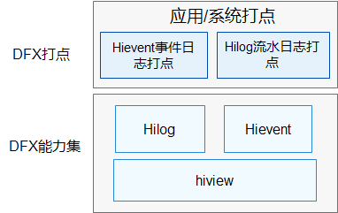

# DFX子系统<a name="ZH-CN_TOPIC_0000001083007544"></a>

-   [简介](#section1347419114210)
-   [系统架构](#section342962219551)
-   [目录](#section62815498425)
-   [相关仓](#section767551120815)

## 简介<a name="section1347419114210"></a>

在OpenHarmony中，DFX\([Design for X](https://en.wikipedia.org/wiki/Design_for_X)\)是为了提升质量属性软件设计，目前包含的内容主要有：DFR（Design for Reliability，可靠性）和DFT（Design for Testability，可测试性）特性。

提供以下功能：

-   Hilog流水日志。
-   Hievent事件日志。

-   Hiview日志服务。

## 系统架构<a name="section342962219551"></a>

**图 1**  子系统架构图<a name="fig18347131919423"></a>  




## 目录<a name="section62815498425"></a>

```
base/hiviewdfx        # DFX主仓，用于存放编译相关配置
├── hiview_lite    # hiview_lite部件，包含轻量系统的日志任务能力
├── hilog_lite     # hilog_lite部件，包含轻量和小型系统的流水日志能力
├── hievent_lite   # hievent_lite部件，包含轻量系统的事件日志能力
```

## 相关仓<a name="section767551120815"></a>

**DFX子系统**

[hiviwdfx\_hilog\_lite](https://gitee.com/openharmony/hiviewdfx_hilog_lite/blob/master/README_zh.md)

[hiviwdfx\_hiview\_lite](https://gitee.com/openharmony/hiviewdfx_hiview_lite/blob/master/README_zh.md)

[hiviwdfx\_hievent\_lite](https://gitee.com/openharmony/hiviewdfx_hievent_lite/blob/master/README_zh.md)
