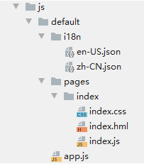

# JS UI框架子系统<a name="ZH-CN_TOPIC_0000001087318673"></a>

-   [简介](#section11660541593)
-   [目录](#section179173014915)
-   [使用](#section1711605017917)
-   [相关仓](#section1599816111011)

## 简介<a name="section11660541593"></a>

JS UI框架是OpenHarmony UI开发框架，提供基础类、容器类、画布类等UI组件和标准CSS动画能力，支持类Web范式编程。

-   **类Web范式编程**

    JS UI框架采用类HTML和CSS Web编程语言作为页面布局和页面样式的开发语言，页面业务逻辑则支持ECMAScript规范的JavaScript语言。JS UI框架提供的类Web编程范式，可以让开发者避免编写UI状态切换的代码，视图配置信息更加直观。


**图 1**  JS UI框架架构<a name="fig15956152211427"></a>  


JS UI框架包括应用层（Application）、前端框架层（Framework）、引擎层（Engine）和平台适配层（Porting Layer）。

-   **Application**

    应用层表示开发者使用JS UI框架开发的FA应用，这里的FA应用特指JS FA应用。

-   **Framework**

    前端框架层主要完成前端页面解析，以及提供MVVM（Model-View-ViewModel）开发模式、页面路由机制和自定义组件等能力。

-   **Engine**

    引擎层主要提供动画解析、DOM（Document Object Model）树构建、布局计算、渲染命令构建与绘制、事件管理等能力。

-   **Porting Layer**

    适配层主要完成对平台层进行抽象，提供抽象接口，可以对接到系统平台。比如：事件对接、渲染管线对接和系统生命周期对接等。


## 目录<a name="section179173014915"></a>

JS UI开发框架源代码在/foundation/ace下，目录结构如下图所示：

```
/foundation/ace
├── ace_engine                       # JS UI框架
├── ace_engine_lite                  # 轻量级JS UI框架
└── napi                             # JS API扩展Native开发模块
```

## 使用<a name="section1711605017917"></a>

-   JS FA开发目录

新建工程的JS目录如下图所示。

**图 2**  JS FA开发目录<a name="fig343917486112"></a>  


在工程目录中：i18n下存放多语言的json文件；pages文件夹下存放多个页面，每个页面由hml、css和js文件组成。

-  **main \> js \> default \> i18n \> en-US.json** ：此文件定义了在英文模式下页面显示的变量内容。同理，zh-CN.json中定义了中文模式下的页面内容。

    ```
    {
      "strings": {
        "hello": "Hello",
        "world": "World"
      }
    }
    ```

-  **main \> js \> default \> pages \> index \> index.hml** ：此文件定义了index页面的布局、index页面中用到的组件，以及这些组件的层级关系。例如：index.hml文件中包含了一个text组件，内容为“Hello World”文本。

    ```
    <div class ="container">
      <text class ="title">
        {{ $t('strings.hello') }} {{title}}
      </text>
    </div>
    ```

- **main \> js \> default \> pages \> index \> index.css** ：此文件定义了index页面的样式。例如：index.css文件定义了“container”和“title”的样式。

    ```
    .container {
      flex-direction: column;
      justify-content: center;
      align-items: center;
    }
    .title {
      font-size: 100px;
    }
    ```

-  **main \> js \> default \> pages \> index \> index.js** ：此文件定义了index页面的业务逻辑，比如数据绑定、事件处理等。例如：变量“title”赋值为字符串“World”。

    ```
    export default {
      data: {
        title: '',
      },
      onInit() {
        this.title = this.$t('strings.world');
      },
    }
    ```


## 相关仓<a name="section1599816111011"></a>

**JS UI框架子系统**

[arkui\_ace\_engine](https://gitee.com/openharmony/arkui_ace_engine)

[arkui\\_ace\_engine\_lite](https://gitee.com/openharmony/arkui_ace_engine_lite)

[ace\_napi](https://gitee.com/openharmony/ace_napi)

