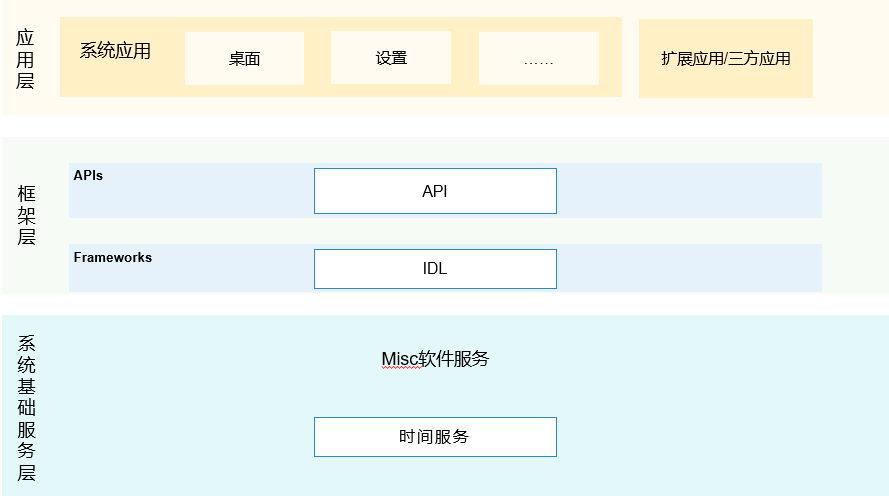

# Misc软件服务子系统<a name="ZH-CN_TOPIC_0000001162033853"></a>

-   [简介](#section11660541593)
-   [目录](#section161941989596)
-   [相关仓](#section1371113476307)

## 简介<a name="section11660541593"></a>

提供了设置系统时间的接口。

**图 1**  子系统架构图<a name="fig664210516252"></a>  


## 目录<a name="section161941989596"></a>

```
/base/miscservices
└── time                     # 时间服务组件
```

## 相关仓<a name="section1371113476307"></a>

**Misc软件服务子系统**

[time_time_service](https://gitee.com/openharmony/time_time_service)

