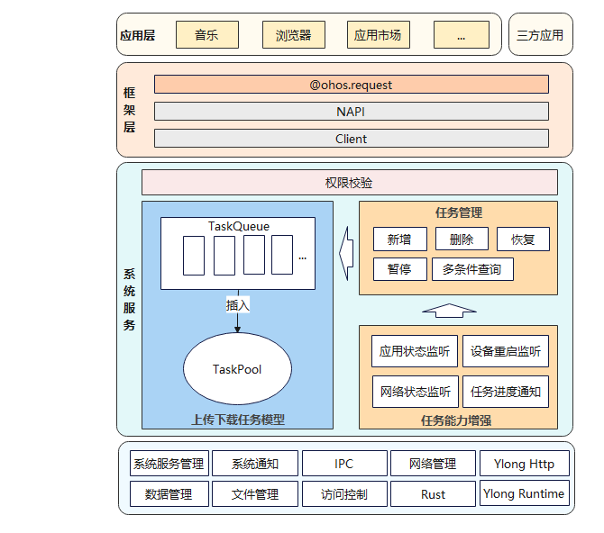

# 上传下载子系统

-   [简介](#简介)
-   [系统架构](#系统架构)
-   [目录](#目录)
-   [相关仓](#相关仓)

## 简介

上传下载服务为应用提供上传/下载能力，包括创建、移除、暂停、启动任务上传/下载，以及订阅任务进度、成功、失败等，支撑开发者方便、高效地使用下载/上传业务的功能。


## 系统架构

**图 1**  上传下载子系统架构图




## 目录

上传下载子系统源代码在/base/request目录下。

目录结构如下所示：

```
/base/request/request
├── common                   # 常量、日志等公共类
├── figures                  # 构架图
├── framework                # 框架层
│   └── js                      # js接口解析成napi
│   └── native                  # 客户端实现，与服务侧交互
├── services                 # 上传下载服务实现
│   └── sa_profile              # 系统服务的配置文件
│   └── etc                     # 进程的配置文件
└── test                     # 测试用例
```

## 相关仓

[request_request](https://gitee.com/openharmony/request_request)

