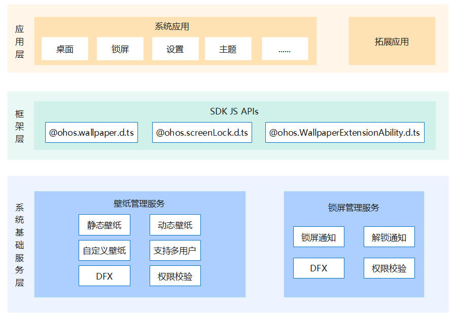

# 主题框架子系统

-   [简介](#section11660541593)
-   [目录](#section161941989596)
-   [组件说明](#section1312121216216)
    -   [壁纸管理服务](#section129654513264)
    -   [锁屏管理服务](#section1961602912224)

-   [相关仓](#section1371113476307)

## 简介<a name="section11660541593"></a>

### 子系统介绍
主题框架子系统包括壁纸管理服务和锁屏管理服务，为系统提供设置壁纸、锁屏、解锁等基础能力。

### 子系统架构图
**图 1** 主题框架子系统架构图  


## 目录<a name="section161941989596"></a>

```
base/theme
├──wallpaper_mgr                      # 壁纸管理服务目录
└──screenlock_mgr                     # 锁屏管理服务目录
```

## 组件说明<a name="section1312121216216"></a>

### 壁纸管理服务<a name="section129654513264"></a>

壁纸管理组件提供壁纸设置能力，支持壁纸切换通知机制。

### 锁屏管理服务<a name="section1961602912224"></a>

锁屏管理组件提供锁屏、解锁能力，支持锁屏、解锁通知，向锁屏应用提供系统事件注册回调能力。

## 相关仓<a name="section1371113476307"></a>

[theme\_wallpaper\_mgr](https://gitee.com/openharmony/theme_wallpaper_mgr)

[theme\_screenlock\_mgr](https://gitee.com/openharmony/theme_screenlock_mgr)