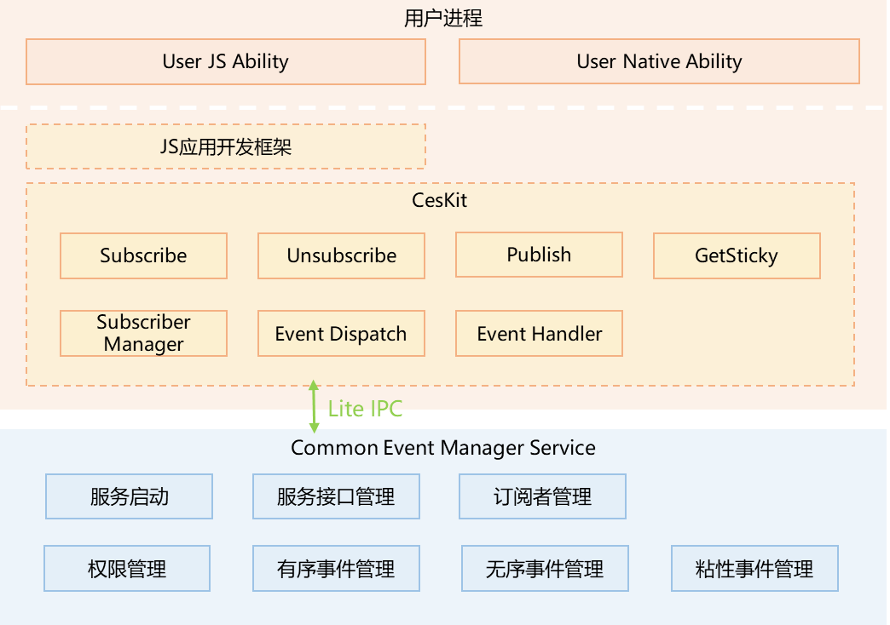

# 事件通知子系统

## 简介

OpenHarmony通过CES（Common Event Service，公共事件服务）为应用程序提供订阅、发布、退订公共事件的能力。

公共事件可分为系统公共事件和自定义公共事件。

- 系统公共事件：系统将收集到的事件信息，根据系统策略发送给订阅该事件的用户程序。 例如：系统关键服务发布的系统事件（例如：hap安装，更新，卸载等）。

- 自定义公共事件：应用自定义一些公共事件用来实现跨应用的事件通信能力。

每个应用都可以按需订阅公共事件，订阅成功且公共事件发布，系统会把其发送给应用。这些公共事件可能来自系统、其他应用和应用自身。

### 架构图



## 目录

```
/base/notification/ces_standard/
│── frameworks      # 组件目录
│   |── common/log  # 日志组件目录
│   |── core        # 组件native接口内部实现
│   ├── native      # 组件native接口实现
│── interface       # 对外接口目录
|   |── innerkits   # 组件native接口定义
|   |── kits/napi   # 组件napi实现
├── sa_profile      # 组件服务配置
├── services        # 组件服务实现
├── tools           # 组件工具实现
│── ohos.build      # 组件编译脚本

```

## 使用说明

* [详细说明请参考: CommonEvent开发指南](../application-dev/application-models/common-event-overview.md)

## 相关仓

事件通知子系统

**notification_ces_standard**

