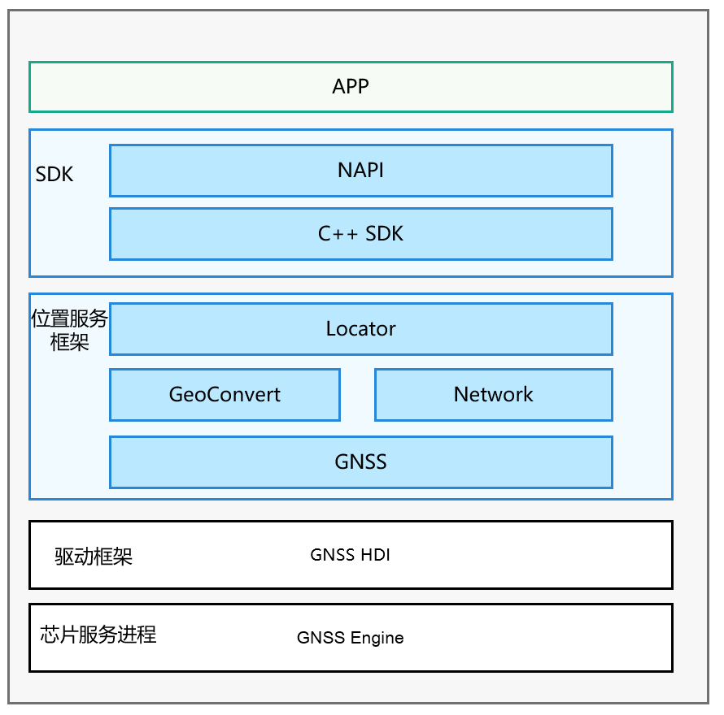

# 位置服务子系统<a name="ZH-CN_TOPIC_0000001115112235"></a>

-   [简介](#section11660541593)
-   [目录](#section161941989596)
-   [约束](#section119744591305)
-   [说明](#section1312121216216)
    -   [接口说明](#section1551164914237)
    -   [使用说明](#section129654513264)

-   [相关仓](#section1371113476307)

## 简介<a name="section11660541593"></a>

移动终端设备已经深入人们日常生活的方方面面，如查看所在城市的天气、新闻轶事、出行打车、旅行导航、运动记录。这些习以为常的活动，都离不开定位用户终端设备的位置。

当用户处于这些丰富的使用场景中时，系统的位置能力可以提供实时准确的位置数据。对于开发者，设计基于位置体验的服务，也可以使应用的使用体验更贴近每个用户。

当应用在实现基于设备位置的功能时，如：驾车导航，记录运动轨迹等，可以调用该模块的API接口，完成位置信息的获取。

**基本概念**

位置能力用于确定用户设备在哪里，系统使用位置坐标标示设备的位置，并用多种定位技术提供服务，如GNSS定位、基站定位、WLAN/蓝牙定位（基站定位、WLAN/蓝牙定位后续统称“网络定位技术”）。通过这些定位技术，无论用户设备在室内或是户外，都可以准确地确定设备位置。

-   **坐标**

    系统以1984年世界大地坐标系统为参考，使用经度、纬度数据描述地球上的一个位置。

-   **GNSS定位**

    基于全球导航卫星系统，包含：GPS、GLONASS、北斗、Galileo等，通过导航卫星，设备芯片提供的定位算法，来确定设备准确位置。定位过程具体使用哪些定位系统，取决于用户设备的硬件能力。

-   **基站定位**

    根据设备当前驻网基站和相邻基站的位置，估算设备当前位置。此定位方式的定位结果精度相对较低，并且需要设备可以访问蜂窝网络。

-   **WLAN、蓝牙定位**

    根据设备可搜索到的周围WLAN、蓝牙设备位置，估算设备当前位置。此定位方式的定位结果精度依赖设备周围可见的固定WLAN、蓝牙设备的分布，密度较高时，精度也相较于基站定位方式更高，同时也需要设备可以访问网络。


**图 1** **子系统架构图**<a name="fig4460722185514"></a>  




## 目录<a name="section161941989596"></a>

```
/base/location            # 源代码目录结构：
├── etc                   # 服务启动配置代码目录
├── interfaces            # 接口相关代码目录
├── profile               # 服务声明代码目录
├── location_common       # 公共代码目录
├── location_locator      # 定位服务管理代码目录
├── location_gnss         # gnss定位服务代码目录
├── location_network      # 网络定位服务代码目录
├── location_passive      # 被动定位服务代码目录
├── location_geocode      # 地理编码服务代码目录
├── test                  # 测试代码目录
├── utils                 # 公共工具代码目录
```

## 约束<a name="section119744591305"></a>

使用设备的位置能力，需要用户进行确认并主动开启位置开关。如果位置开关没有开启，系统不会向任何应用提供位置服务。

设备位置信息属于用户敏感数据，所以即使用户已经开启位置开关，应用在获取设备位置前仍需向用户申请位置访问权限。在用户确认允许后，系统才会向应用提供位置服务。

## 说明<a name="section1312121216216"></a>

### 接口说明<a name="section1551164914237"></a>

1.获取设备的位置信息，所使用的接口说明如下。

**表 1**  获取位置信息API功能介绍
| 接口名 | 功能描述 | 
| -------- | -------- |
| on(type:&nbsp;'locationChange',&nbsp;request:&nbsp;LocationRequest,&nbsp;callback:&nbsp;Callback&lt;Location&gt;)&nbsp;:&nbsp;void | 开启位置变化订阅，并发起定位请求。 | 
| off(type:&nbsp;'locationChange',&nbsp;callback?:&nbsp;Callback&lt;Location&gt;)&nbsp;:&nbsp;void | 关闭位置变化订阅，并删除对应的定位请求。 | 
| on(type:&nbsp;'locationServiceState',&nbsp;callback:&nbsp;Callback&lt;boolean&gt;)&nbsp;:&nbsp;void | 订阅位置服务状态变化。 | 
| off(type:&nbsp;'locationServiceState',&nbsp;callback:&nbsp;Callback&lt;boolean&gt;)&nbsp;:&nbsp;void | 取消订阅位置服务状态变化。 | 
| on(type:&nbsp;'cachedGnssLocationsReporting',&nbsp;<br />request:&nbsp;CachedGnssLocationsRequest,&nbsp;callback:&nbsp;Callback&lt;Array&lt;Location&gt;&gt;)&nbsp;:&nbsp;void; | 订阅缓存GNSS位置上报。 | 
| off(type:&nbsp;'cachedGnssLocationsReporting',&nbsp;callback?:&nbsp;Callback&lt;Array&lt;Location&gt;&gt;)&nbsp;:&nbsp;void; | 取消订阅缓存GNSS位置上报。 | 
| on(type:&nbsp;'gnssStatusChange',&nbsp;callback:&nbsp;Callback&lt;SatelliteStatusInfo&gt;)&nbsp;:&nbsp;void; | 订阅卫星状态信息更新事件。 | 
| off(type:&nbsp;'gnssStatusChange',&nbsp;callback?:&nbsp;Callback&lt;SatelliteStatusInfo&gt;)&nbsp;:&nbsp;void; | 取消订阅卫星状态信息更新事件。 | 
| on(type:&nbsp;'nmeaMessageChange',&nbsp;callback:&nbsp;Callback&lt;string&gt;)&nbsp;:&nbsp;void; | 订阅GNSS&nbsp;NMEA信息上报。 | 
| off(type:&nbsp;'nmeaMessageChange',&nbsp;callback?:&nbsp;Callback&lt;string&gt;)&nbsp;:&nbsp;void; | 取消订阅GNSS&nbsp;NMEA信息上报。 | 
| on(type:&nbsp;'fenceStatusChange',&nbsp;request:&nbsp;GeofenceRequest,&nbsp;want:&nbsp;WantAgent)&nbsp;:&nbsp;void; | 添加围栏，并订阅该围栏事件上报。 | 
| off(type:&nbsp;'fenceStatusChange',&nbsp;request:&nbsp;GeofenceRequest,&nbsp;want:&nbsp;WantAgent)&nbsp;:&nbsp;void; | 删除围栏，并取消订阅该围栏事件。 | 
| getCurrentLocation(request:&nbsp;CurrentLocationRequest,&nbsp;callback:&nbsp;AsyncCallback&lt;Location&gt;)&nbsp;:&nbsp;void | 获取当前位置，使用callback回调异步返回结果。 | 
| getCurrentLocation(request?:&nbsp;CurrentLocationRequest)&nbsp;:&nbsp;Promise&lt;Location&gt; | 获取当前位置，使用Promise方式异步返回结果。 | 
| getLastLocation(callback:&nbsp;AsyncCallback&lt;Location&gt;)&nbsp;:&nbsp;void | 获取上一次位置，使用callback回调异步返回结果。 | 
| getLastLocation()&nbsp;:&nbsp;Promise&lt;Location&gt; | 获取上一次位置，使用Promise方式异步返回结果。 | 
| isLocationEnabled(callback:&nbsp;AsyncCallback&lt;boolean&gt;)&nbsp;:&nbsp;void | 判断位置服务是否已经打开，使用callback回调异步返回结果。 | 
| isLocationEnabled()&nbsp;:&nbsp;Promise&lt;boolean&gt; | 判断位置服务是否已经开启，使用Promise方式异步返回结果。 | 
| requestEnableLocation(callback:&nbsp;AsyncCallback&lt;boolean&gt;)&nbsp;:&nbsp;void | 请求打开位置服务，使用callback回调异步返回结果。 | 
| requestEnableLocation()&nbsp;:&nbsp;Promise&lt;boolean&gt; | 请求打开位置服务，使用Promise方式异步返回结果。 | 
| enableLocation(callback:&nbsp;AsyncCallback&lt;boolean&gt;)&nbsp;:&nbsp;void | 打开位置服务，使用callback回调异步返回结果。 | 
| enableLocation()&nbsp;:&nbsp;Promise&lt;boolean&gt; | 打开位置服务，使用Promise方式异步返回结果。 | 
| disableLocation(callback:&nbsp;AsyncCallback&lt;boolean&gt;)&nbsp;:&nbsp;void | 关闭位置服务，使用callback回调异步返回结果。 | 
| disableLocation()&nbsp;:&nbsp;Promise&lt;boolean&gt; | 关闭位置服务，使用Promise方式异步返回结果。 | 
| getCachedGnssLocationsSize(callback:&nbsp;AsyncCallback&lt;number&gt;)&nbsp;:&nbsp;void; | 获取缓存GNSS位置的个数，使用callback回调异步返回结果。 | 
| getCachedGnssLocationsSize()&nbsp;:&nbsp;Promise&lt;number&gt;; | 获取缓存GNSS位置的个数，使用Promise方式异步返回结果。 | 
| flushCachedGnssLocations(callback:&nbsp;AsyncCallback&lt;boolean&gt;)&nbsp;:&nbsp;void; | 获取所有的GNSS缓存位置，并清空GNSS缓存队列，使用callback回调异步返回结果。 | 
| flushCachedGnssLocations()&nbsp;:&nbsp;Promise&lt;boolean&gt;; | 获取所有的GNSS缓存位置，并清空GNSS缓存队列，使用Promise方式异步返回结果。 | 
| sendCommand(command:&nbsp;LocationCommand,&nbsp;callback:&nbsp;AsyncCallback&lt;boolean&gt;)&nbsp;:&nbsp;void; | 给位置服务子系统发送扩展命令，使用callback回调异步返回结果。 | 
| sendCommand(command:&nbsp;LocationCommand)&nbsp;:&nbsp;Promise&lt;boolean&gt;; | 给位置服务子系统发送扩展命令，使用Promise方式异步返回结果。 | 
| isLocationPrivacyConfirmed(type&nbsp;:&nbsp;LocationPrivacyType,&nbsp;callback:&nbsp;AsyncCallback&lt;boolean&gt;)&nbsp;:&nbsp;void; | 查询用户是否同意定位服务的隐私申明，使用callback回调异步返回结果。 | 
| isLocationPrivacyConfirmed(type&nbsp;:&nbsp;LocationPrivacyType,)&nbsp;:&nbsp;Promise&lt;boolean&gt;; | 查询用户是否同意定位服务的隐私申明，使用Promise方式异步返回结果。 | 
| setLocationPrivacyConfirmStatus(type&nbsp;:&nbsp;LocationPrivacyType,&nbsp;isConfirmed&nbsp;:&nbsp;boolean,&nbsp;<br />callback:&nbsp;AsyncCallback&lt;boolean&gt;)&nbsp;:&nbsp;void; | 设置并记录用户是否同意定位服务的隐私申明，使用callback回调异步返回结果。 | 
| setLocationPrivacyConfirmStatus(type&nbsp;:&nbsp;LocationPrivacyType,&nbsp;isConfirmed&nbsp;:&nbsp;boolean)&nbsp;:&nbsp;Promise&lt;boolean&gt;; | 设置并记录用户是否同意定位服务的隐私申明，使用Promise方式异步返回结果。 | 


### 使用说明<a name="section129654513264"></a>

**获取设备位置信息开发步骤如下：**

1. 应用在使用系统能力前，需要检查是否已经获取用户授权访问设备位置信息。如未获得授权，可以向用户申请需要的位置权限。
     系统提供的定位权限有：
   - ohos.permission.LOCATION
   
   - ohos.permission.LOCATION_IN_BACKGROUND

   访问设备的位置信息，必须申请ohos.permission.LOCATION权限，并且获得用户授权。

   如果应用在后台运行时也需要访问设备位置，除需要将应用声明为允许后台运行外，还必须申请ohos.permission.LOCATION_IN_BACKGROUND权限，这样应用在切入后台之后，系统可以继续上报位置信息。

   开发者可以在应用配置文件中声明所需要的权限，具体可参考[授权申请指导](../application-dev/security/accesstoken-guidelines.md)。

2. 导入geolocation模块，所有与基础定位能力相关的功能API，都是通过该模块提供的。
   
   ```
   import geolocation from '@ohos.geolocation';
   ```

3. 实例化LocationRequest对象，用于告知系统该向应用提供何种类型的位置服务，以及位置结果上报的频率。

   **方式一：**

   为了面向开发者提供贴近其使用场景的API使用方式，系统定义了几种常见的位置能力使用场景，并针对使用场景做了适当的优化处理，应用可以直接匹配使用，简化开发复杂度。系统当前支持场景如下表所示。

   
   ```
       export enum LocationRequestScenario {
            UNSET = 0x300,
            NAVIGATION,
            TRAJECTORY_TRACKING,
            CAR_HAILING,
            DAILY_LIFE_SERVICE,
            NO_POWER,
        }
   ```

   
     **表2** 定位场景类型说明
   
   | 场景名称 | 常量定义 | 说明 | 
   | -------- | -------- | -------- |
   | 导航场景 | NAVIGATION | 适用于在户外定位设备实时位置的场景，如车载、步行导航。在此场景下，为保证系统提供位置结果精度最优，主要使用GNSS定位技术提供定位服务，结合场景特点，在导航启动之初，用户很可能在室内、车库等遮蔽环境，GNSS技术很难提供位置服务。为解决此问题，我们会在GNSS提供稳定位置结果之前，使用系统网络定位技术，向应用提供位置服务，以在导航初始阶段提升用户体验。<br/>此场景默认以最小1秒间隔上报定位结果，使用此场景的应用必须申请ohos.permission.LOCATION权限，同时获得用户授权。 | 
   | 轨迹跟踪场景 | TRAJECTORY_TRACKING | 适用于记录用户位置轨迹的场景，如运动类应用记录轨迹功能。主要使用GNSS定位技术提供定位服务。<br/>此场景默认以最小1秒间隔上报定位结果，并且应用必须申请ohos.permission.LOCATION权限，同时获得用户授权。 | 
   | 出行约车场景 | CAR_HAILING | 适用于用户出行打车时定位当前位置的场景，如网约车类应用。<br/>此场景默认以最小1秒间隔上报定位结果，并且应用必须申请ohos.permission.LOCATION权限，同时获得用户授权。 | 
   | 生活服务场景 | DAILY_LIFE_SERVICE | 生活服务场景，适用于不需要定位用户精确位置的使用场景，如新闻资讯、网购、点餐类应用，做推荐、推送时定位用户大致位置即可。<br/>此场景默认以最小1秒间隔上报定位结果，并且应用至少申请ohos.permission.LOCATION权限，同时获得用户授权。 | 
   | 无功耗场景 | NO_POWER | 无功耗场景，适用于不需要主动启动定位业务。系统在响应其他应用启动定位业务并上报位置结果时，会同时向请求此场景的应用程序上报定位结果，当前的应用程序不产生定位功耗。<br/>此场景默认以最小1秒间隔上报定位结果，并且应用需要申请ohos.permission.LOCATION权限，同时获得用户授权。 | 

     以导航场景为例，实例化方式如下：
   
   ```
   var requestInfo = {'scenario': 0x301, 'timeInterval': 0, 'distanceInterval': 0, 'maxAccuracy': 0};
   ```

   **方式二：**

   如果定义的现有场景类型不能满足所需的开发场景，系统提供了基本的定位优先级策略类型。

   
   ```
       export enum LocationRequestPriority {
            UNSET = 0x200,
            ACCURACY,
            LOW_POWER,
            FIRST_FIX,
        }
   ```

   
     **表3** 定位优先级策略类型说明：
   
   | 策略类型 | 常量定义 | 说明 | 
   | -------- | -------- | -------- |
   | 定位精度优先策略 | ACCURACY | 定位精度优先策略主要以GNSS定位技术为主，在开阔场景下可以提供米级的定位精度，具体性能指标依赖用户设备的定位硬件能力，但在室内等强遮蔽定位场景下，无法提供准确的位置服务。<br/>应用必须申请ohos.permission.LOCATION权限，同时获得用户授权。 | 
   | 快速定位优先策略 | FAST_FIRST_FIX | 快速定位优先策略会同时使用GNSS定位、基站定位和WLAN、蓝牙定位技术，以便室内和户外场景下，通过此策略都可以获得位置结果，当各种定位技术都有提供位置结果时，系统会选择其中精度较好的结果返回给应用。因为对各种定位技术同时使用，对设备的硬件资源消耗较大，功耗也较大。<br/>应用必须申请ohos.permission.LOCATION权限，同时获得用户授权。 | 
   | 低功耗定位优先策略 | LOW_POWER | 低功耗定位优先策略主要使用基站定位和WLAN、蓝牙定位技术，也可以同时提供室内和户外场景下的位置服务，因为其依赖周边基站、可见WLAN、蓝牙设备的分布情况，定位结果的精度波动范围较大，如果对定位结果精度要求不高，或者使用场景多在有基站、可见WLAN、蓝牙设备高密度分布的情况下，推荐使用，可以有效节省设备功耗。<br/>应用至少申请ohos.permission.LOCATION权限，同时获得用户授权。 | 

     以定位精度优先策略为例，实例化方式如下：
   
   ```
   var requestInfo = {'priority': 0x201, 'timeInterval': 0, 'distanceInterval': 0, 'maxAccuracy': 0};
   ```

4. 实例化Callback对象，用于向系统提供位置上报的途径。
     应用需要自行实现系统定义好的回调接口，并将其实例化。系统在定位成功确定设备的实时位置结果时，会通过该接口上报给应用。应用程序可以在接口的实现中完成自己的业务逻辑。
     
   ```
   var locationChange = (location) => {
       console.log('locationChanger: data: ' + JSON.stringify(location));
   };
   ```

5. 启动定位。
   
   ```
   geolocation.on('locationChange', requestInfo, locationChange);
   ```

6. （可选）结束定位。
   
   ```
   geolocation.off('locationChange', locationChange);
   ```

     如果应用使用场景不需要实时的设备位置，可以获取系统缓存的最近一次历史定位结果。
   
   ```
   geolocation.getLastLocation((data) => {
       console.log('getLastLocation: data: ' + JSON.stringify(data));
   });
   ```

   此接口的使用需要应用向用户申请ohos.permission.LOCATION权限。


**进行坐标和地理编码信息的相互转化开发步骤如下：**

> **说明：**
> GeoConvert需要访问后端服务，请确保设备联网，以进行信息获取。

1. 导入geolocation模块，所有与（逆）地理编码转化能力相关的功能API，都是通过该模块提供的。
   
   ```
   import geolocation from '@ohos.geolocation';
   ```

2. 获取转化结果。
   - 调用getAddressesFromLocation，坐标转化地理位置信息。
     
      ```
      var reverseGeocodeRequest = {"latitude": 31.12, "longitude": 121.11, "maxItems": 1};
      geolocation.getAddressesFromLocation(reverseGeocodeRequest, (data) => {
          console.log('getAddressesFromLocation: ' + JSON.stringify(data));
      });
      ```

      参考接口API说明，应用可以获得与此坐标匹配的GeoAddress列表，应用可以根据实际使用需求，读取相应的参数数据。
   - 调用getAddressesFromLocationName位置描述转化坐标。
     
      ```
      var geocodeRequest = {"description": "上海市浦东新区xx路xx号", "maxItems": 1};
      geolocation.getAddressesFromLocationName(geocodeRequest, (data) => {
          console.log('getAddressesFromLocationName: ' + JSON.stringify(data));
      });
      ```

      参考接口API说明，应用可以获得与位置描述相匹配的GeoAddress列表，其中包含对应的坐标数据，请参考API使用。

      如果需要查询的位置描述可能出现多地重名的请求，可以设置GeoCodeRequest，通过设置一个经纬度范围，以高效地获取期望的准确结果。


## 相关仓<a name="section1371113476307"></a>

位置服务子系统

[base_location](https://gitee.com/openharmony/base_location/blob/master/README.md)