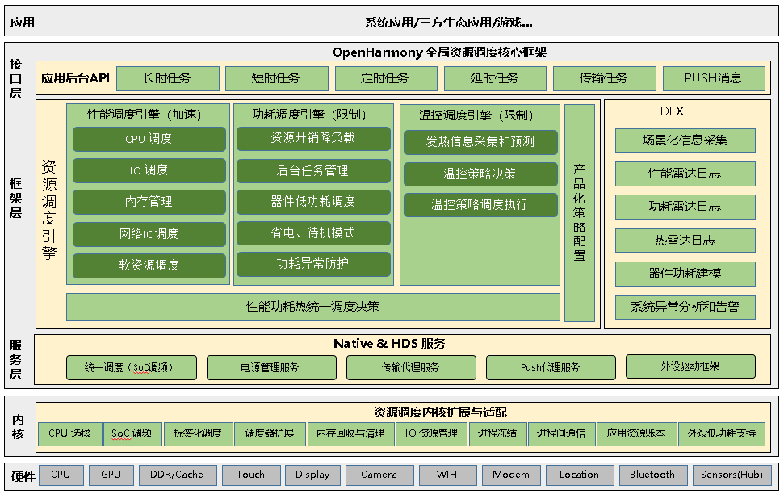

# 全局资源调度子系统


全局资源调度子系统承担系统中CPU、内存、存储资源的调度管理，包括任务的分组，优先级管理，后台任务的管理等。在保障前台操作流畅的基础上，尽力提供后台多任务流畅运行的环境。同时， 全局资源调度子系统也负责性能、功耗、热的均衡调度，即考虑用户操作的及时响应， 也护航系统的长续航能力，并兼顾系统发热控制，避免发热和控制发热的影响在可控范围内。


## 简介

全局资源调度子系统主要适用于标准系统，对于轻量系统，一般进行删减处理。下面的介绍仅针对标准系统。

全局资源调度子系统从整个系统的性能、功耗、热三个维度分别对CPU、内存、IO、网络、软资源进行调度和管控，即三大调度引擎五大资源维度。所述软资源包括前后台任务、消息、队列等可管理的软件实体。全局资源调度子系统的模块划分如下图所示：



全局资源调度子系统主要分接口层、框架层、服务层、内核层。DFX覆盖整个系统的所有层面和领域。

分层说明如下：

接口层： 提供调度API 接口扩展。核心API主要是应用后台API，按应用在后台的行为逻辑分长时任务、短时任务、定时任务、延时任务、传输任务、PUSH消息。

框架层： 提供资源调度的三大核心引擎：

性能调度引擎： 主要保障用户操作的及时响应和长期流畅。 其核心功能围绕CPU、内存、IO、网络、软资源提供资源的及时供给，优先保障前台应用的资源需求；同时保障后台可感知任务的基本需求，避免后台任务的饿死。

功耗调度引擎： 主要是限制资源的过渡使用，对五大资源的使用提供约束手段。并提供后台任务管理、外设器件低功耗调度、省电和待机模式、功耗异常防护等核心功能。

温控调度引擎： 根据系统的发热情况和发热预期提供对高功耗资源的长时间限制策略。温控调度引擎区分发热级别和识别发热源，针对性的采取发热控制。

服务层：提供资源访问的统一接口，对并发访问实现冲突消减措施。包括SoC 调频、电源管理、传输代理、PUSH 消息代理、以及外设驱动框架。

内核层：实现资源调度的内核扩展和适配，为用户态的调度提供扩展能力。

DFX：提供场景化信息采集功能，性能、功耗、热管控事件日志功能，外设器件功耗建模功能，以及系统异常的分析和告警功能。


## 目录

```
foundation/resourceschedule/
├── background_task_mgr						#后台任务管理
├── device_usage_statistics					#设备使用统计
├── frame_aware_sched						#感知调度
├── memmgr									#内存管理
├── resource_schedule_service				#全局资源调度引擎
└── work_scheduler							#后台定时任务调度
```

## 约束

语言版本：C++11及以上


## 编译构建/使用方法

参考各仓README以及test目录


## 相关仓

**资源调度子系统**

[resourceschedule_background_task_mgr](https://gitee.com/openharmony/resourceschedule_background_task_mgr)

[resourceschedule_device_usage_statistics](https://gitee.com/openharmony/resourceschedule_device_usage_statistics)

[resourceschedule_work_scheduler](https://gitee.com/openharmony/resourceschedule_work_scheduler)

[aafwk_standard](https://gitee.com/openharmony/aafwk_standard)

[windowmanager](https://gitee.com/openharmony/windowmanager)

[communication_ipc](https://gitee.com/openharmony/communication_ipc)

[powermgr_battery_manager](https://gitee.com/openharmony/powermgr_battery_manager)

[notification_ces_standard](https://gitee.com/openharmony/notification_ces_standard)

[hiviewdfx_hilog](https://gitee.com/openharmony/hiviewdfx_hilog) 