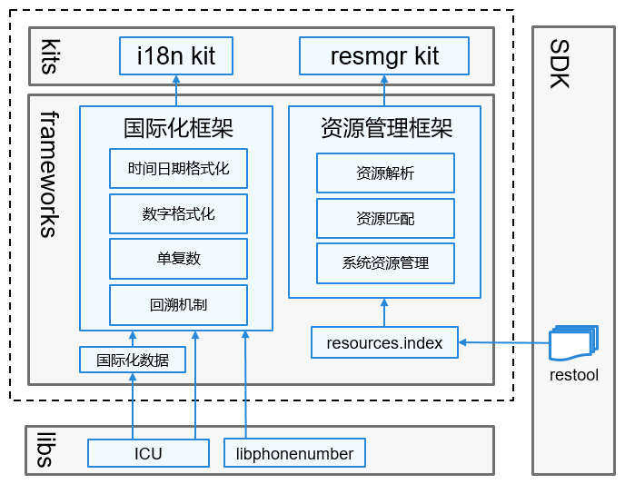

# 全球化子系统<a name="ZH-CN_TOPIC_0000001115837954"></a>

-   [简介](#section11660541593)
-   [系统架构](#section1558604311012)
-   [目录](#section161941989596)
-   [相关仓](#section1371113476307)

## 简介<a name="section11660541593"></a>

当OpenHarmony系统/应用在全球不同区域使用时，系统/应用需要满足不同市场用户关于语言、文化习俗的需求。全球化子系统提供支持多语言、多文化的能力，包括：

-   **资源管理能力**

    根据设备类型、系统配置等信息，对系统资源和应用资源加载、解析和初始化，对外提供获取字符串、媒体等资源的接口。

-   **国际化能力**

    提供底层的资源回溯能力，同时对外提供丰富的国际化接口，包括时间日期格式化、数字格式化、电话号码格式化、单复数等。


## 系统架构<a name="section1558604311012"></a>

**图 1**  全球化子系统架构图<a name="fig87184592416"></a>  




## 目录<a name="section161941989596"></a>

全球化子系统源代码在/base/global目录下。

轻量系统和小型系统的目录结构如下所示：

```
/base/global/
├── i18n_lite               # 国际化框架代码仓
│   ├── frameworks          # 国际化框架核心代码
│   │   ├── i18n            # 国际化模块
│   │   │   ├── include     # 接口文件
│   │   │   ├── src         # 实现代码
│   │   │   └── test        # 测试用例
│   ├── interfaces          # 国际化框架接口
│   │   ├── kits            # 应用接口
│   │   │   ├── i18n        # C/C++国际化能力接口
│   │   │   └── js          # JavaScript接口的C/C++支持
├── resmgr_lite             # 资源管理框架代码仓
│   ├── frameworks          # 资源管理框架核心代码
│   │   ├── resmgr          # 资源解析核心代码
│   │   │   ├── include     # 接口文件
│   │   │   └── src         # 实现代码
│   ├── interfaces          # 资源管理框架接口
│   │   └── innerkits       # 资源管理框架对子系统间接口
```

标准系统的目录结构如下所示：

```
/base/global
├── i18n           # 国际化框架代码仓
│   ├── frameworks          # 国际化框架核心代码
│   ├── interfaces          # 国际化框架接口
│   │   ├── js              # 国际化框架JavaScript接口
│   │   └── native          # 国际化框架native接口
├── resmgr_standard         # 资源管理代码仓
│   ├── frameworks          # 资源管理核心代码
│   │   ├── resmgr          # 资源解析核心代码
│   │   │   ├── include     # 资源管理头文件
│   │   │   ├── src         # 资源管理实现代码
│   │   │   └── test        # 资源管理测试代码
│   ├── interfaces          # 资源管理接口
│   │   ├── innerkits       # 资源管理对子系统间接口
│   │   └── js              # 资源管理JavaScript接口
```

## 相关仓<a name="section1371113476307"></a>

**全球化子系统**

[global\_i18n\_lite](https://gitee.com/openharmony/global_i18n_lite)

[global\_i18n](https://gitee.com/openharmony/global_i18n)

[global\_resmgr\_lite](https://gitee.com/openharmony/global_resmgr_lite)

[global\_resmgr\_standard](https://gitee.com/openharmony/global_resmgr_standard)

