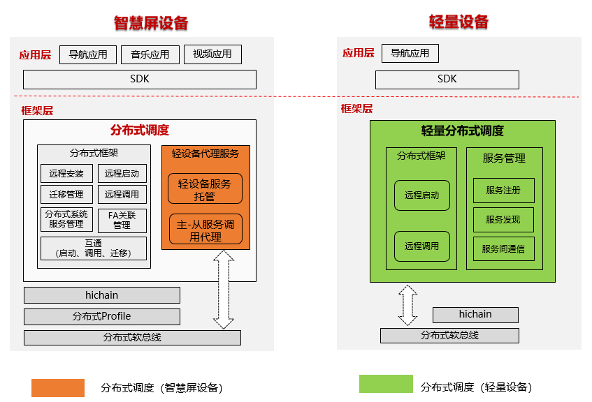

# 分布式任务调度子系统<a name="ZH-CN_TOPIC_0000001051983009"></a>

-   [简介](#section11660541593)
-   [目录](#section1464106163817)
-   [约束](#section1718733212019)
-   [使用](#section10729231131110)
-   [涉及组件](#section176111311166)

## 简介<a name="section11660541593"></a>

分布式任务调度模块负责跨设备组件管理，提供访问和控制远程组件的能力，支持分布式场景下的应用协同。分布式调度模块组成如下图所示：



## 目录<a name="section1464106163817"></a>

分布式任务调度源代码目录结构如下表所示：

**表1 **主要源代码目录结构

<a name="table43531856201716"></a>
<table><thead align="left"><tr id="row20416556201718"><th class="cellrowborder" valign="top" width="50%" id="mcps1.1.3.1.1"><p id="p10416456121716"><a name="p10416456121716"></a><a name="p10416456121716"></a>名称</p>
</th>
<th class="cellrowborder" valign="top" width="50%" id="mcps1.1.3.1.2"><p id="p1841645631717"><a name="p1841645631717"></a><a name="p1841645631717"></a>描述</p>
</th>
</tr>
</thead>
<tbody><tr id="row64161056151718"><td class="cellrowborder" valign="top" width="50%" headers="mcps1.1.3.1.1 "><p id="p9416656181720"><a name="p9416656181720"></a><a name="p9416656181720"></a>dmsfwk_lite</p>
</td>
<td class="cellrowborder" valign="top" width="50%" headers="mcps1.1.3.1.2 "><p id="p541645611177"><a name="p541645611177"></a><a name="p541645611177"></a>分布式任务调度实现</p>
</td>
</tr>
<tr id="row104169564177"><td class="cellrowborder" valign="top" width="50%" headers="mcps1.1.3.1.1 "><p id="p17416125614179"><a name="p17416125614179"></a><a name="p17416125614179"></a>safwk_lite</p>
</td>
<td class="cellrowborder" valign="top" width="50%" headers="mcps1.1.3.1.2 "><p id="p04163569170"><a name="p04163569170"></a><a name="p04163569170"></a>foundation进程实现</p>
</td>
</tr>
<tr id="row65582011104710"><td class="cellrowborder" valign="top" width="50%" headers="mcps1.1.3.1.1 "><p id="p1655851194713"><a name="p1655851194713"></a><a name="p1655851194713"></a>samgr_lite</p>
</td>
<td class="cellrowborder" valign="top" width="50%" headers="mcps1.1.3.1.2 "><p id="p145595112471"><a name="p145595112471"></a><a name="p145595112471"></a>系统服务框架实现</p>
</td>
</tr>
</tbody>
</table>

## 约束<a name="section1718733212019"></a>

**语言限制**：C/C++语言

**组网环境**：必须确保设备在同一个局域网中，主从设备能互相ping通

**操作系统限制**：OpenHarmony操作系统

**远程启动的约束与限制：**

-   支持远程启动FA，不支持远程启动SA
-   远程启动前必须确保主设备与从设备间分布式组网成功，否则无法远程启动

## 使用<a name="section10729231131110"></a>

-   **轻量级分布式调度模块编译**

轻量级分布式调度模块，其代码所在目录如下：

```
foundation/distributedschedule/services/dtbschedmgr_lite
```

在针对不同平台进行编译时，需要在指定目标平台，以下以hi3516dv300为例：

```
python build.py ipcamera -p hi3516dv300_liteos_a
```

-   **主设备程序开发**（以拉起FA为例）

构造意图参数want，设置需要启动的远端设备ID，包名，元能力类名信息，以及分布式标志位Want.FLAG\_ABILITYSLICE\_MULTI\_DEVICE以使能分布式启动

```
import ohos.aafwk.ability.Ability;
import ohos.aafwk.content.Want;
import ohos.bundle.ElementName;

// 构造want参数
Want want = new Want();
ElementName name = new ElementName(remote_device_id, "com.huawei.remote_bundle_name", "remote_ability_name"); 
want.setElement(name); // 将待启动的FA信息添加到Want中
want.setFlags(Want.FLAG_ABILITYSLICE_MULTI_DEVICE); // 设置分布式标记，若不设置将无法使用分布式能力

// 启动远程设备FA
startAbility(want); // 按照Want启动指定FA，want参数命名以实际开发平台API为准
```

-   **预置条件**

从设备侧需安装对应包名的FA

-   **运行**（以拉起FA为例）

执行主设备侧的startAbility即可拉起从设备FA

## 涉及组件<a name="section176111311166"></a>

[dms_fwk_lite](https://gitee.com/openharmony/distributedschedule_dms_fwk_lite/blob/master/README_zh.md)

[samgr_lite](https://gitee.com/openharmony/distributedschedule_samgr_lite/blob/master/README_zh.md)

[safwk_lite](https://gitee.com/openharmony/distributedschedule_safwk_lite/blob/master/README_zh.md)

